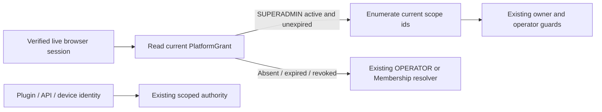

# ADR-082 — Explicit Superadmin authority

**Status:** Accepted by the owner's explicit `approve` on 2026-09-13.
**Complexity / risk:** C-3 / HIGH (cross-tenant administrative authority).

## Context

An OPERATOR grant resolves as DEV with every Business visible but no owned
Business or Tenant. The early return deliberately ignores OWNER Memberships.
Consequently the installation operator cannot administer owner-only screens
such as Users & permissions. Adding Membership rows cannot compose these powers.
The owner approved a distinct Superadmin for all pages and current/future Tenants,
without broadening other operators or ordinary users.

## Decision

1. Store `SUPERADMIN` as a separate capability in the existing PlatformGrant
   table. No schema migration, email allow-list, credential rewrite or automatic
   promotion of OPERATOR. Resolve only ACTIVE, unexpired grants.
2. Only the trusted browser session port supplies the additional grant to the
   viewer resolver, after reading the server store on each request. Plugin/API/
   device identities do not inherit it. Revocation or expiry takes effect on the
   next request, including an already signed-in browser.
3. A Superadmin uses the existing `role: OWNER` compatibility value, with an
   explicit `isSuperadmin: true`, `isPlatform: true`, and `isOperator: true`.
   Resolve all real Tenant, Business and Portfolio ids each request; populate
   ownership/visibility sets and all registered domain permissions. These are
   effective administrative capabilities, not fabricated Membership or employment
   records. Future scopes enter those sets automatically while the grant is live.
4. Existing scoped guards continue checking real ids. Workspace collaboration
   administration also accepts a Superadmin's enumerated Portfolio set, including
   an empty Portfolio. Nonexistent targets, business validation, MFA/step-up,
   financial segregation-of-duties and lifecycle rules still apply. This is no
   authorization for machine-only endpoints, disabled integrations, or other users'
   personal authentication factors.
5. Provide a local administrative CLI to grant/revoke for an existing exact-email
   identity; ambiguous or missing identities fail closed. Verify the named actor
   holds a live installation grant. Require a reason and an expiry at most 90 days
   away (SEC-027). No standing SUPERADMIN exception is introduced. Creation and
   revocation write immutable PERSON audit events atomically with the grant.

## Alternatives and consequences

Promoting every OPERATOR would silently broaden existing users. Adding OWNER
Memberships alone cannot overcome the current early return and cannot cover new
Tenants. A hardcoded email bypass would be unrevocable through the grant store.
The chosen capability extends ADR-017's explicit platform authority while keeping
ordinary operators' read-only business scope and existing wire role vocabulary.

## Verification and release

Tests must exercise a real signed browser session, all-domain/owner/operator
guards, two isolated Tenants, new scopes created after issuance, expiry/revocation,
failed grant attempts and atomic audit, and unchanged ordinary/OPERATOR/plugin
scope. Run governance, full Server tests/build/e2e, and required hosted CI before
release. Preserve deployment environment, LINE overlay and ngrok; retain the old
image. Grant the approved account only after the new image is healthy, then verify
its resolved scope against the current database. Grant withdrawal is independent
of image rollback.

## CHANGELOG

| Version | Date | Status | Summary | Commit Hash | Agent |
|---|---|---|---|---|---|
| 1.0.0 | 2026-09-13 | accepted | Owner-approved separate Superadmin capability and bounded rollout | pending | RWANG |
