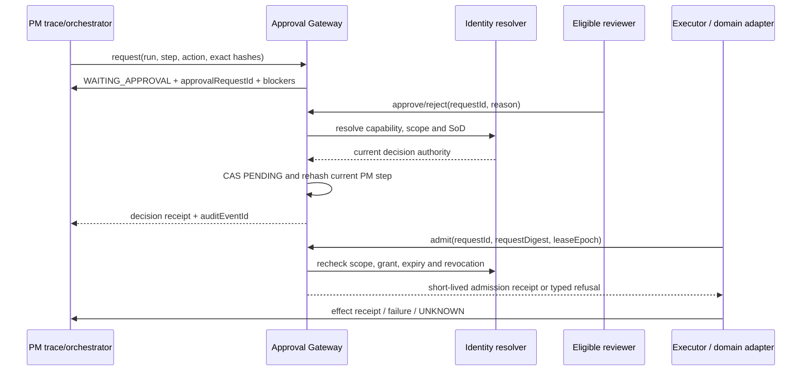

# ADR-103 — Project Manager approval gateway admission

**Status:** Candidate — design only; no model, route, migration or runtime
activation is authorized by this document.

**Risk:** HIGH. The slice crosses Project Manager execution state, Identity
capabilities and executor admission. A later implementation needs a separate
canonical requirement registration, migration review and release gate.

## Context

ADR-102 gives the Project Manager an append-only `ProjectExecutionRun` /
`ProjectExecutionStep` ledger, stable hashes and replay lineage. That answers
what a PM intake did, but it does not yet answer whether a pending effect may
be admitted to an executor or an external side effect.

The existing PM design already defines the missing boundary:

- `04-AGENTS-AND-FLEETS.md` requires an `ApprovalRequest` to carry the action
  class, exact scope/run/step, artifact/manifest/commit hashes, bounded payload
  summary, expected effects, expiry and eligible reviewer capability.
- PMR-013 / PMT-013 require exact-hash approval, expiry and reviewer-conflict
  refusal. PMR-013 is proposal-local and is not a code annotation.
- FR-196 supplies the existing segregation-of-duties rule. It does not by
  itself define the execution request, hash binding or executor receipt.
- ADR-049 keeps plan/bundle import on the existing PM writer and receipt path.

There are already similarly named records with different owners. `Gate` is a
Project business-progress gate, `PipelineGateDecision` belongs to Integration's
pipeline ledger, `AgentTraceEvent` is the Agent execution journal, and
`PlanImportReceipt` is an idempotency/compatibility receipt. None of them is a
safe replacement for a PM execution approval request.

## Decision

### D1 — PM owns admission intent; other owners retain their authority

The Project Manager owns the approval intent for a PM execution run and the
link between that intent and `executionRunId` / `executionStepId`.

| Concern | Owner | Boundary |
|---|---|---|
| Approval request envelope and PM run/step linkage | Project Manager | Exact action, scope and evidence digest; no provider secret or arbitrary payload |
| Reviewer capability, scope grant and revocation | Identity | Resolves current person/capability; role names alone do not authorize |
| Workflow claim, lease and executor fencing | Integration / executor adapter | Rechecks the approval immediately before admission; stale epochs cannot promote |
| External provider/domain effect | Owning domain or provider adapter | Keeps its existing writer, effect key and receipt contract |
| Human review surface | Project Manager with Identity policy | Candidate API/read model first; UI is a later slice |

The v1 boundary applies to non-read-only steps admitted through an Agent/Fleet
execution run. It does not route every existing human CRUD endpoint through a
new generic gate, and it does not weaken an existing domain authorization
check. A replay always needs a new approval request; approval from the source
run is never inherited.

### D2 — Use one PM approval request projection with immutable request content

The candidate storage contract is one PM-owned `ProjectApprovalRequest` record
whose request envelope is immutable. Its lifecycle state is a compare-and-set
projection, and every decision, invalidation and consumption is appended to the
existing `AuditEvent` stream. A second generic approval authority is not
created.

The candidate fields are:

| Field | Rule |
|---|---|
| `approvalRequestId` | Internal UUID; never reused or exposed as a capability |
| `tenantId`, `businessId`, `workspaceId`, `projectId` | Resolved from the PM run; never accepted as authority from the browser/executor |
| `executionRunId`, `executionStepId` | Exact PM trace occurrence; both are required for an effectful request |
| `actionClass` | Allow-listed policy value; no free-form action can create authority |
| `effectKey` | Stable idempotency identity for the concrete domain/external effect |
| `manifestHash`, `inputHash` | Canonical digests of the approved workflow and step input |
| `artifactHashes[]`, `commitSha?` | Bounded source/evidence pins; absent means unavailable, never fabricated |
| `payloadSummary` | Bounded, redacted review summary; never transcript/audio/provider credential/arbitrary imported code |
| `expectedEffects` | Bounded typed summary of the effect and target; no executable command text |
| `eligibleReviewerCapability` | Identity capability required to decide this action in this scope |
| `policyVersion` | Exact policy revision used to classify and admit the request |
| `requestedByPersonId` | Resolved creator identity; required for SoD |
| `requestedAt`, `expiresAt` | Server timestamps; expiry is exclusive and checked against server time |
| `requestDigest` | SHA-256 over the canonical request fields below |
| `state` | `PENDING`, `APPROVED`, `REJECTED`, `EXPIRED`, `REVOKED`, `CONSUMED` or `SUPERSEDED` projection |

The row is not a new business WorkItem, Project Gate or provider execution
record. The audit event carries the decision actor, decision reason,
previous/current state, request digest and redacted references. No secret or
unbounded payload is recoverable from the approval ledger.

### D3 — Approval is bound to one canonical digest

`requestDigest` is calculated over canonical JSON containing exactly:

```text
actionClass
scope: { tenantId, businessId, workspaceId, projectId }
executionRunId
executionStepId
effectKey
manifestHash
inputHash
artifactHashes
commitSha
expectedEffects
eligibleReviewerCapability
policyVersion
expiresAt
```

Display labels, ordering-only positions and request transport metadata are not
authority inputs. A material change to any bound field creates a new request
and makes the previous request `SUPERSEDED`; dispatch with the old digest
returns `INPUT_CHANGED`. A changed source run, step, effect key, manifest,
input, artifact, commit, policy or scope cannot reuse an old approval.

### D4 — Admission is a fail-closed, two-party sequence

The gateway uses this sequence for a step that requires approval:



The creator cannot approve their own protected request. The reviewer must hold
the resolved capability in the same effective scope and must not conflict with
the creator under FR-196. An OWNER-name shortcut is not a general bypass.
Credential, destructive, merge, deploy and other high-risk classes may also
require the existing step-up/AAL policy; that policy is selected by the action
class and is not silently disabled here.

Approval is not execution. The executor rechecks the request immediately before
the effect, binds the short-lived admission receipt to the run, step, digest,
lease epoch and effect key, and then calls only the owning writer. If the
effect result is unknown, the run enters `UNKNOWN` and requires reconciliation;
approval does not permit a blind retry.

### D5 — State transitions are explicit and append-only

```text
PM step READY
  └─ request approval → WAITING_APPROVAL / PENDING
       ├─ approve → APPROVED
       │    └─ executor recheck → ADMITTED → CONSUMED or effect result
       ├─ reject → REJECTED
       ├─ expiry → EXPIRED
       ├─ grant/hash/policy change → SUPERSEDED or REVOKED
       └─ unknown external effect → RECONCILIATION_REQUIRED (no retry)
```

`APPROVED` is not a terminal PM run state. The PM step may move to `RUNNING`
only after the executor admission recheck succeeds. A rejected, expired,
revoked or superseded request never authorizes a later attempt. The same
`effectKey` remains the owning writer's idempotency boundary; a duplicate
receipt must not create a second effect.

### D6 — Candidate action policy is narrow and explicit

The first policy table is a classification contract, not a permission grant:

| Action class | Default admission |
|---|---|
| `READ_ONLY` | No ApprovalRequest; existing read authorization and trace apply |
| `PROJECT_WRITE` | Scoped approval for an Agent/Fleet step that commits PM state |
| `EXTERNAL_MESSAGE` | Scoped human approval of exact target/content digest and expiry |
| `SPEND` | Scoped approval of amount/currency/target; reservation and domain checks still apply |
| `CREDENTIAL_CHANGE` | Scoped approval plus Identity step-up/AAL policy |
| `MERGE` | Explicit approval of repository, base/head and exact commit/manifest |
| `DEPLOY` | Explicit approval of environment, image/SHA, migration and rollback refs |
| `DESTRUCTIVE` | Separate proposal and approval; never inherited from routine run approval |

Adding an action class, widening a capability or changing the digest inputs is
a policy/contract change and requires a new reviewed revision. Imported plans,
model output, MCP descriptions and browser labels cannot create a new class.

### D7 — Candidate service and API boundary

The implementation should add a PM application service behind a repository
port, not make route handlers or executors decide policy independently:

```text
requestApproval(input, viewer)
decideApproval(approvalRequestId, decision, viewer)
admitApprovedStep(approvalRequestId, requestDigest, leaseEpoch, executor)
revokeOrSupersede(approvalRequestId, reason, cause)
```

The eventual human surface needs a scope-authorized pending list and a
decision command. Candidate route shapes are:

```text
GET  /api/projects/:projectId/execution-runs/:executionRunId/approvals
POST /api/projects/:projectId/execution-runs/:executionRunId/approvals/:approvalRequestId/decision
```

Request creation and executor admission remain application-service operations
in this phase; no public route is proposed for an executor to mint its own
approval. A final OpenAPI contract and canonical requirement registration are
implementation entry gates, not implied by this ADR.

### D8 — Explicit non-goals

This decision does not:

- implement code, schema, migration, route, UI, worker or production rollout;
- change the seven PM execution modes or create a second Work/Task graph;
- replace `Gate`, `PipelineGateDecision`, `AgentTraceEvent` or `PlanImportReceipt`;
- make Approval Gateway the owner of Identity grants, provider credentials,
  leases, external effects or foreign MSP/GKS stores;
- infer approval from a successful test, CI check, merged PR, Docker health or
  an owner display name;
- grant a source-run approval to a replay or to a different project/business;
- authorize deployment of the PM trace migration. Production migration,
  deployment and activation remain separate release gates.

## Acceptance intent

The design is ready for canonical registration and implementation planning only
when the following are frozen:

| ID / case | Required behavior |
|---|---|
| PMT-013 | Approve hash H, dispatch H2 → typed `INPUT_CHANGED`; no effect |
| SoD | Requester approving their own protected request → `REVIEWER_CONFLICT`; audit refusal |
| Scope | Foreign tenant/business/workspace/project → typed not-found/denied; no existence leak |
| Expiry/revocation | Expired or revoked request → refusal; no executor claim |
| Replay | Source-run approval is not accepted by a new replay run |
| Idempotency | Same request identity and digest replays the same pending/decision receipt; changed digest creates a new request |
| Unknown effect | Prior external effect is uncertain → `RECONCILIATION_REQUIRED`; no automatic retry |
| Audit/privacy | Decision and refusal are auditable with bounded redacted references; no secret sentinel in row, log or response |
| Concurrency | Two decisions on one pending request resolve through CAS; exactly one wins |

## Alternatives rejected

1. **Reuse `Gate`.** Rejected because a Project Gate is business progress state
   and has no exact executable effect digest, reviewer capability or executor
   receipt contract.
2. **Reuse `PipelineGateDecision`.** Rejected because Integration owns that
   ledger and its publication semantics; PM approval would create a cross-owner
   write path and confuse catalog publication with PM execution admission.
3. **Put approval in `AgentTraceEvent`.** Rejected because the Agent journal
   records observations and playback; it must not become the PM authorization
   authority.
4. **Let the executor approve itself or pass an OWNER flag.** Rejected because
   it defeats SoD, scope isolation and revocation.
5. **Carry approval across replay.** Rejected because a replay has new run/step
   identities and must be reviewed against its current exact input.

## Implementation entry gates

Before code begins, the next phase must:

1. reconcile PMR-013 against the global FR/FEAT registry without reusing
   FR-196's identity-SOD subject;
2. register the canonical requirement/phase and any SDD/SEC subjects through the
   sanctioned ID workflow;
3. freeze the typed request/decision/error contract and the Identity capability
   resolver port;
4. decide whether the candidate two-party reviewer surface is API-only or also
   includes a PM console view;
5. produce the Prisma/SQLite/Postgres/backup impact packet and migration/rollback
   proof plan; and
6. obtain a separate implementation approval before adding source, schema or
   runtime behavior.

## CHANGELOG

| Version | Date | Status | Summary | Commit Hash | Agent |
|---|---|---|---|---|---|
| 0.1.0b | 2026-09-22 | candidate | Candidate PM Approval Gateway admission boundary linked to PMR-013/PMT-013; no implementation authority | uncommitted | RWANG |
