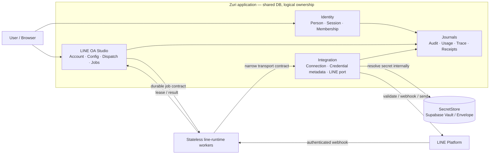

# ADR-105 — LINE OA Studio stateless application tier with stateful domain persistence

**Status:** Approved for local implementation on 2026-09-23. Production
activation, migration application and live LINE canary remain separately gated.

**Risk:** HIGH. The boundary affects credential handling, durable jobs, auditability,
replay/idempotency, deployment topology and horizontal scaling.

## Context

The preceding discussion established four facts that must remain separate:

1. LINE OA Studio is the Business-scoped authority for account configuration,
   design, dispatch and transport-job state. It is not a credential vault and it
   must not duplicate Integration, Identity or CRM authority.
2. Identity, Integration and LINE OA Studio are logical domains in the Zuri
   modular monolith. They currently use one physical Zuri PostgreSQL/Supabase
   database with strict table/model ownership; a domain name does not imply a
   separate database.
3. LINE channel material is owned by Integration's `SecretStorePort`. Production
   uses the Supabase Vault path; self-host/dev may use the envelope store. Prisma,
   Studio responses, logs and audit payloads carry only `secretRef` and redacted
   metadata.
4. ADR-100 makes LINE OA conversation execution server-only. That does not make
   the Studio domain stateless. It makes the application and worker processes
   eligible to be disposable when all authoritative state is durable.

The requested property is therefore **stateless application execution**, not the
removal of domain persistence. A restarted API or worker must be able to continue
from durable state without relying on its previous memory, local queue, local
filesystem or process identity.

## Decision

### D1 — Define statelessness at the process tier

LINE OA Studio SHALL use a stateless application tier:

- Web/UI/API instances are disposable and interchangeable.
- `line-runtime` worker instances are disposable and interchangeable.
- No instance-local memory, timer, queue, cache or filesystem is an authority.
- Caches are permitted only as bounded, disposable optimisations; a cache miss
  SHALL resolve from the authoritative contract and must not change correctness.
- A restart, scale-out, scale-in or deployment replacement SHALL not lose a
  user action, accepted webhook, queued job, audit event or receipt.

The Studio domain itself remains stateful through its durable persistence owner.

### D2 — Keep logical ownership inside the current Zuri database boundary

The current physical storage remains shared Zuri PostgreSQL/Supabase, with logical
ownership as follows:

| Authority | Durable state | Must not own |
|---|---|---|
| Identity | `Person`, `PersonCredential`, `Session`, `Membership`, `RoleBinding`, channel/external identities | LINE channel credentials or Studio records |
| Integration | `IntegrationConnection`, credential lifecycle metadata/version rows, provider metadata, raw external evidence and the LINE transport port | `LineOaAccount` business meaning or user authorization |
| LINE OA Studio | `LineOaAccount`, design/configuration, dispatch, schedules, transport jobs, insight projections | secret material, CRM conversation authority or Identity grants |
| CRM/Agent | conversation/message authority and answer/turn contracts | Studio-owned configuration tables or Integration secrets |
| Shared audit seam | redacted mutation and access evidence | secret/customer payloads |

An eventual service extraction SHALL preserve this ownership. A new service SHALL
not write another domain's tables directly. It shall use a versioned API,
repository boundary or event/outbox contract.

### D3 — Make the runtime recover from durable state

All execution that can outlive an HTTP request SHALL use durable state:

1. LINE ingress is authenticated and admitted into a durable CRM/job transaction
   before the request is considered accepted.
2. Workers claim jobs with a lease, owner id, expiry, retry key and idempotency
   key. Lease expiry makes abandoned work claimable again.
3. Completion and failure are durable state transitions. A repeated completion
   request is idempotent and cannot produce a second external send.
4. Schedules are persisted and fire through the same lease/idempotency discipline;
   an instance-local timer is only a wake-up hint.
5. Deployment shutdown stops new claims, lets bounded work finish or release its
   lease, and leaves unresolved states visible for reconciliation.

The initial implementation may retain the current bounded authenticated worker
route and worker script. Independent service deployment is a later topology step,
not a reason to create a second domain authority.

### D4 — Keep secrets outside the Studio and worker state

The browser may submit a credential only through the Integration write-only path.
The raw value SHALL exist only in the request, the configured secret store and the
short-lived process that resolves it for a single provider call.

The Studio and worker receive a connection reference, validation result, external
identifier, status and receipt. They never receive a reusable channel secret or
access token. The Integration port resolves the secret and calls LINE; it does not
return the material to the caller.

### D5 — Use purpose-specific journals, not one undifferentiated activity log

The system SHALL retain the existing journal roles:

- `Session` — login/session lifecycle and assurance state.
- `UsageEvent` — per-person route/action usage within its retention window.
- `AuditEvent` — redacted security and business mutations, actor, scope, action,
  before/after where available, and request/session correlation where populated.
- `IntegrationCredentialVersion` — credential validation, rotation, revocation and
  purge lifecycle; pointer and metadata only, never secret material.
- `LineConversationJob` / `LineOaRichMenuJob` — durable asynchronous execution,
  lease, retry, acceptance and failure evidence.
- `AgentTraceEvent` — scope-bound agent-turn execution and idempotency evidence.
- `IngestionRun` / `RawExternalRecord` — external-provider acquisition and lineage.

An Activity Timeline, if added, SHALL be a read-only projection over these sources.
It SHALL not become a second authority and SHALL redact secrets, authorization
headers, raw LINE user identifiers and customer content unless a separate approved
retention policy permits the field.

### D6 — Extract only the runtime worker, not the whole Studio domain

The preferred future service boundary is `line-runtime`:

```text
Browser
  -> stateless Studio API replicas
       -> Zuri DB / durable job state
       -> Integration SecretStore and LINE port
       -> stateless line-runtime workers
            -> LINE Messaging API
```

The first milestone is process statelessness inside the existing release boundary.
An independent `line-runtime` service is justified only after a real operational
trigger exists: independent load, availability, security isolation, deployment
cadence or ownership. A separate Studio UI/repository/database is not part of this
decision.

### D7 — Preserve existing decisions and historical evidence

This ADR does not:

- reintroduce EDGE conversation execution retired by ADR-100;
- move MSP or GKS authority into Zuri;
- change LINE's external acceptance semantics into delivery/read proof;
- rewrite historical job, audit or trace rows to match the new topology;
- claim production readiness from local tests, a build or a container restart.

## Data flow and authority map



## Alternatives rejected

### A — Make Studio completely stateless with no durable Studio state

Rejected. It would leave no authority for account configuration, job lifecycle,
audit linkage, schedule state or replay. It would push hidden state into a worker,
browser or external platform and make recovery non-deterministic.

### B — Give every worker direct Prisma access to every domain table

Rejected. Physical database sharing is not logical ownership sharing. It would
duplicate authorization and create cross-domain writes that cannot be audited or
extracted safely.

### C — Split the entire Studio into an independent application immediately

Rejected for now. It would add distributed authentication, Business scope,
credential and transaction boundaries before an operational need has been shown.
The worker/data-plane boundary is the narrower, reversible extraction seam.

## Consequences

### Positive

- API and worker replicas can restart and scale without losing authority.
- Jobs, schedules and receipts survive deployment replacement.
- Secret exposure remains concentrated in Integration.
- Runtime extraction can happen later without moving Studio ownership first.
- Activity and audit evidence remain queryable by purpose and scope.

### Costs and risks

- Zuri DB, Vault and durable job state become hard runtime dependencies.
- Lease, retry, idempotency and outbox correctness must be tested under failure.
- A future independent worker introduces network, authentication and versioning
  failure modes.
- File assets require shared durable storage; a container-local path is not enough.

## Verification and exit criteria

This ADR is not complete until an implementation slice proves, with focused and
full gates:

1. Two or more API/worker instances can process the same workload without lost or
   duplicate domain outcomes.
2. Killing an instance during admission, claim, send or completion leaves a
   recoverable durable state and a truthful receipt.
3. Duplicate webhook/event/job requests are idempotent.
4. No test credential, secret, authorization header or forbidden customer content
   appears in Prisma rows, API responses, logs, audit payloads or backups.
5. Cross-tenant and cross-business claims are rejected at the authoritative
   boundary.
6. The journal projection can link a user action to request/session, mutation,
   job and agent trace without becoming a new source of truth.
7. Governance, tests, build and E2E run non-zero tests; production canary,
   rollback and live LINE evidence are recorded separately.

## CHANGELOG

| Version | Date | Status | Summary | Commit Hash | Agent |
|---|---|---|---|---|---|
| 0.2.0b | 2026-09-23 | approved / in-progress | Owner approved local implementation; durable worker checkpoint added for the transport-health schedule, with production activation still gated | uncommitted | RWANG |
| 0.1.0b | 2026-09-23 | candidate | Initial proposal: stateless Studio application/worker tier over stateful domain persistence, Integration-owned secrets and purpose-specific journals | uncommitted | RWANG |
