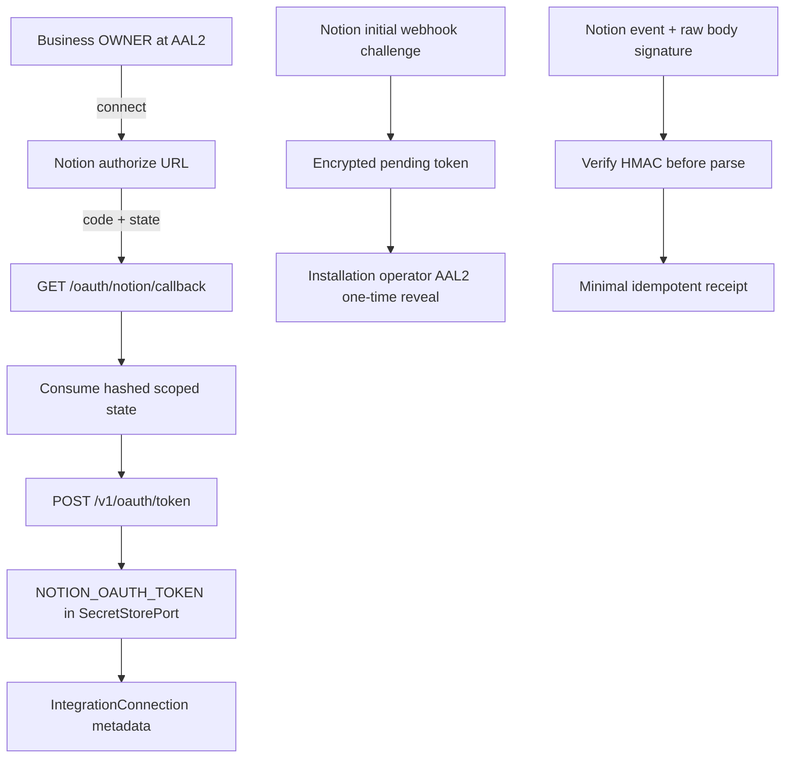

# ADR-109 — Notion OAuth installation and signed webhook boundary

**Status:** Approved for local implementation on 2026-09-26. Provider setup,
production migration and deployment remain operator gates.

## Context

The Integration charter owns external connection metadata, opaque credential
references and inbound records, but Notion has no implemented connector. A
Business needs to authorize a Notion public connection. Notion then sends a
temporary authorization code to the configured callback, which must be exchanged
server-to-server. Notion webhooks also require an initial verification token and
signature checks over the exact request body. Neither credential may cross the
browser or enter ordinary logs.

Notion's initial webhook verification token is app-level: the challenge body has
the token but no workspace identifier. The endpoint therefore cannot safely bind
that first request to an `IntegrationConnection`. Event delivery can be accepted
without importing Notion page content or writing business-domain truth.

## Decision

### D1 — Business-scoped OAuth, one-time state and vault-backed tokens

- `GET /api/integrations/notion/connect?businessId=...` requires an authenticated
  Business OWNER at AAL2 and the existing per-Person/Business write limit. It
  does not debit the LINE-call-only installation limit. It creates a short-lived random state, stores only its
  SHA-256 hash with the trusted Tenant, Business and actor, and redirects to
  Notion's public authorization URL.
- `GET /oauth/notion/callback` requires the same authenticated actor, consumes the
  matching unexpired state once before network I/O, handles provider denial, and
  exchanges `code` at `https://api.notion.com/v1/oauth/token` using Basic client
  authentication, the exact configured redirect URI and `Notion-Version:
  2026-03-11`.
- The validated access/refresh token bundle is stored under the new typed
  `NOTION_OAUTH_TOKEN` SecretStorePort kind. `IntegrationConnection` retains only
  workspace identity metadata. The callback redirects to the Integration page
  and never places a token or authorization code in its response.
- `NOTION_CLIENT_ID`, `NOTION_CLIENT_SECRET` and `NOTION_REDIRECT_URI` are
  deployment configuration. The redirect URI must match the Notion connection
  configuration exactly.

### D2 — Signed webhook ingress with a narrow data boundary

- `POST /api/integrations/notion/webhook` accepts a bounded initial
  `verification_token` challenge only when no token is configured. It stores the
  token as an authenticated AES-256-GCM envelope under the existing
  `ZURI_SECRET_KEK` keyring. Plaintext is never logged or written to a database
  column.
- A one-time reveal endpoint returns the pending token only to an authenticated
  installation operator at AAL2. An identical challenge retry is acknowledged
  idempotently after a lost response; a different token cannot replace the pinned
  token. An AAL2 reset endpoint is required before accepting a replacement
  challenge. These actions are audited; concurrent reveal requests cannot both succeed.
- Subsequent event requests are bounded and checked against the exact raw bytes
  using HMAC-SHA256 and constant-time comparison of `X-Notion-Signature` before
  JSON parsing or persistence. Missing configuration, malformed signatures and
  mismatches fail closed.
- Valid events create an idempotent receipt with only event ID, event type,
  workspace ID, provider event time and receipt time. The raw payload, page IDs,
  comments, titles and other content are discarded; no Notion API follow-up or
  business-domain write is part of this feature.

### D3 — Bound the feature to Integration

The feature adds only OAuth installation, token custody and authenticated webhook
receipt. It does not implement Notion search, page synchronization, content
ingestion, event-driven automation, refresh-token rotation or a user-facing
Notion workspace browser. Production database changes are not applied by this
implementation.

OAuth state is ephemeral and excluded from snapshot export. Webhook receipts are
exported so a restore retains event idempotency. The encrypted webhook verification
token is excluded as credential material; after a restore, the installation must
recreate and verify its Notion webhook subscription before event delivery resumes.

## Alternatives and consequences

- **Return tokens to the browser:** rejected because browser history, extensions,
  proxies and frontend logs would become credential stores.
- **Accept unsigned event requests:** rejected because anyone who learns the URL
  could forge Notion events.
- **Persist complete webhook payloads:** rejected because the requested feature
  defines no content owner or retention policy; receipt metadata is sufficient
  to prove accepted delivery without copying workspace content.
- **Keep webhook verification material only in process memory:** rejected because
  restarts and multi-instance routing would make signature verification
  nondeterministic.

The tradeoff is a small typed-secret and webhook-setup surface in exchange for
using the existing Integration credential lifecycle and preserving a clear
separation between provider evidence and business truth.

## Verification

- FR-273 tests cover trusted Business authorization, state expiry/replay/scope,
  Notion token request shape, token response validation and secret-safe callback
  redirects.
- FR-274 tests cover the initial challenge, AAL2 one-time reveal/reset, raw-body
  signature checks, oversized/malformed requests, idempotent receipts and
  absence of persisted content.
- `npm run govern`, `npm test`, `npm run build` and `npm run test:e2e` are the
  repository gates. Passing local gates do not claim that a Notion developer
  connection is configured or a production migration has been applied.

## CHANGELOG

| Version | Date | Status | Summary | Commit Hash | Agent |
|---|---|---|---|---|---|
| 0.1.0b | 2026-09-26 | approved | Define Business-scoped Notion OAuth, vault token custody and signed receipt-only webhook ingress | uncommitted | Codex GPT-6 |
| 0.1.1b | 2026-09-26 | approved | Clarify operator authority and backup/restore handling for ephemeral state, receipts and webhook secret | uncommitted | Codex GPT-6 |
| 0.1.2b | 2026-09-26 | approved | Align reveal authority, make challenge retries idempotent, and preserve LINE-only rate-limit semantics | uncommitted | Codex GPT-6 |
