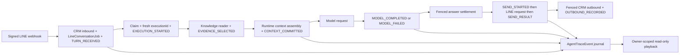

# FR-171-P1 — Native SERVER LINE journal and playback

The approved v0.3 contract now has a native SERVER implementation. This phase
records local source/test evidence; external adapters and live release gates
remain open. Complexity C-3; risk HIGH (persistent context and authorization).

## Responsibility and data flow

Admission and its input snapshot are one database transaction. A worker creates
a new execution id for each claim and records its process-stable `instanceId`.
Zuri runtime creates fresh `ctxId` and `modelCallId` for each actual provider
call and commits the canonical semantic request/hash before issuing the request.
A send intent is committed before calling LINE. Failed journal writes fail closed
before the corresponding effect. Provider callbacks preserve historical usage
under their original execution; they cannot settle or send a newer execution.

## Implemented checklist

- [x] One additive `AgentTraceEvent` model, nullable job `executionId`, SQLite
  migration and matching Postgres migration/schema. No extra authority tables.
- [x] Scoped immutable events, canonical JSON SHA-256, duplicate/conflict checks,
  secret-field guard, 1 MiB event limit and bounded reads (256 events / 8 MiB).
- [x] Native input, retrieval evidence, exact semantic model input, full model
  output, answer, transport-attempt and outbound CRM references are journaled.
- [x] Stable prompt UUID/version/content hash; per-call context and model ids;
  process instance identity; fresh claimed execution/send attempt identities.
- [x] `sessionId: null`, `soul: null`, empty `memory`, `history`, `documents`,
  `tools`, and `privateContextDisposition: EXCLUDED_BY_POLICY` honestly describe
  the current public-only native context. No MSP/GKS authority id is fabricated.
- [x] Provider usage fields are nullable, with `usageSource` and
  `totalTokensSource`. Derived totals are labelled; cached/reasoning subsets are
  not counted twice. UTC wall-clock observations and monotonic call duration
  distinguish ingress, context readiness, model completion, answer readiness,
  send start and observed provider outcome.
- [x] `recipientDeliveredAt` and `recipientReadAt` remain null without receipts;
  provider acceptance is recorded separately from delivery/read confirmation.
- [x] `GET /api/line-oa/jobs/{id}/trace` derives scope from the job, requires
  Business ownership plus `line-oa` visibility, and returns private/no-store
  playback without model/tool/network/send/write effects.
- [x] Playback groups executions and model calls by explicit references;
  timestamps (`occurredAt`, `createdAt`, `id`) sort presentation only. Missing
  context, hash mismatch, failed/missing output, unfinished send and tombstones
  are explicit incomplete states. There is no `turnSequence` guarantee.
- [x] PDPA erasure redacts retained payloads and writes a tombstone while keeping
  journal envelope identity. Late payload writes cannot restore erased content.
  CRM reconciliation rechecks the locked job to prevent copying a stale answer
  after erasure. Payload hashes are removed along with redacted payloads.
- [x] Existing backup snapshot includes the journal in restore order.

## Acceptance evidence

| Contract criteria | Evidence and limit |
|---|---|
| AC-171.1–4 | `server-line-trace.test.js`, `execution-trace.test.js`: existing turn identity, scope, grouped retries, canonical request/hash and one new model. Tool-attempt runtime integration remains external. |
| AC-171.5 | Oversized events are rejected, never truncated. Context write failure prevents the provider call; an execution failure/missing snapshot produces incomplete playback. No automatic retention-expiry scheduler is claimed. |
| AC-171.6–7 | Stable tool/action/version reference design is approved; full typed adapters and their live integration tests remain pending. Native retrieval stores a local BUSINESS_QUERY evidence snapshot, not an invented GKS retrieval receipt. |
| AC-171.8–10 | Provider and server trace tests prove excluded private context, nullable usage, derived-total labels and absent delivery/read proof. |
| AC-171.11–16 | Journal, route and server trace tests cover immutable idempotency, scope refusal, no-effects playback, missing context/hash mismatch, erasure/late-write refusal and stale reconciliation. Existing server job tests retain lease/epoch/send fencing coverage. |
| AC-171.17–18 | External port integration and live Postgres append/redaction concurrency evidence remain release gates. Local SQLite execution and generated schema parity are available. |

## Verification report

Implementation commits: `d88727e7`; integration with main `0a5e07c0` in
`f08c6b7`. Final documentation/evidence refinement follows in this branch.

- Before the main merge: 4,168 server tests passed, 15 intentionally skipped;
  production build passed; 112 E2E passed, 4 skipped, no flaky tests.
- After the final code refinements: 44 targeted tests passed (journal, server
  trace, job fencing, provider telemetry and route behavior).
- Post-merge full `npm run verify`: PASS, 4,208 server tests passed / 15 skipped,
  production build and governance passed, 112 E2E passed / 4 skipped / zero flaky
  (8.0 minutes including 293-module warmup). Test guards verified nonzero execution.
- Root monorepo `npm run govern`: PASS, zero critical/warning findings,
  zero dangling links or duplicate ids; final report regenerated with the graph.

## Remaining handoffs and release gates

- [ ] **MSP:** Soul/session/memory-version/policy receipts through an authenticated
  port; memory writes linked to the producing execution and action. MSP owns
  authority; runtime owns actual context assembly. Existing public-only policy
  remains until the private-memory adapter is implemented and tested.
- [ ] **GKS:** immutable retrieval/corpus/index/document version references and
  provenance through the owning port; no foreign database writes from Zuri.
- [ ] **Tools/actions/documents/artifacts:** stable `toolId` plus schema and
  implementation version, stable `actionId`, fresh `toolInvocationId` and
  `actionAttemptId`, immutable `docId`/`artifactId` versions and provenance
  edges. General event names exist, but typed adapters and runtime emitters are
  not implemented in this phase.
- [ ] **Edge:** authenticated bounded trace callbacks carrying executor/context
  references; installed-device and Tailscale webhook canary evidence.
- [ ] **Retention operations:** scheduled expiry, backup erasure/restore policy
  and large snapshot handling beyond the fail-closed 1 MiB native event limit.
- [ ] **Release:** hosted CI, live Postgres migration/concurrency checks, actual
  provider and LINE canary, and deployed runtime verification. Migrations are
  checked in; no production database or Docker deployment was changed here.

FR-171 remains in progress until those applicable gates have evidence. The
source phase is useful now without asserting that cross-repository trace,
private memory injection or recipient delivery receipts already work.

## Version diff

`1.0.0 → 1.0.1`: approved checklist becomes an evidence-based native SERVER
phase report; identities, semantic hashes, provider usage and external limits
are clarified. PRD `1.167.0b → 1.170.0b` incorporates the merged main revisions
and FR-171; existing requirement subjects remain pinned.

## CHANGELOG

| Version | Date | Status | Summary | Commit Hash | Agent |
|---|---|---|---|---|---|
| 1.0.1 | 2026-09-07 | beta | Native SERVER implementation and local evidence; explicit external and release gates | see branch commits | RWANG |
| 1.0.0 | 2026-09-07 | accepted | Approved native SERVER checklist and external handoffs | d88727e7 | RWANG |
