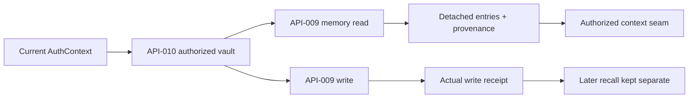

# FR-171-P2 — Preserve authorized MSP memory provenance

The owner approved the v0.3 identity/version handoff and instructed continuation
after P1. This phase implements that approved memory-provenance seam. C-3 / HIGH:
the adapter handles private authorized context. Existing FR-057 policy and vault
resolution remain prerequisites; native SERVER stays public-knowledge-only.

## Problem and scope

Before P2, the adapter stripped MSP entities to `body_json`, discards the write
response, and the context assembler strips all recall metadata. See
[RCA](../../../../.brain/rca/2026-09-07-msp-memory-lineage-discarded.md).

Preserve returned memory identity and source revision when the actual MSP
contract provides them. A local canonical body hash identifies the captured
content; it never impersonates an MSP revision or proves historical lookup.
Missing provenance remains explicit, including an absent MSP source hash. Each capture is detached from subsequent
transport/result mutations and bounded before it becomes context evidence.

## Implementation contract

- Retain existing `entries` for callers and add a versioned evidence envelope
  with the actual returned entity identity, body hash and source availability.
- Read evidence belongs to the requested authorized vault. Explicit conflicting
  vault references are refused; absent source metadata never creates a fake id.
- Session/instance provenance from AuthContext is labelled as caller context,
  not as proof that MSP created or attested a session or Soul passport.
- Preserve actual write response evidence separately from a later recall. A
  write receipt is not reconstructed from a list that may already have changed.
- `assembleAgentContext` carries the adapter envelope when private recall is
  allowed; denied context contains no private evidence or adapter call.
- No foreign database writes, no new table/route, no changed membership grants,
  no new private-memory activation and no invented MSP APIs.

## Verified source contract and emitted shape

Read-only source inspection of Memory-and-Soul-Passport at commit
`8b8667dadf01fd7f421260af8b8b260f6cac267f` on 2026-09-08 found
API-009 entity fields `entity_id`, `vault_id`, `current_version`, `source_hash`
and `recorded_at`. `msp_memory_upsert` returns `{entity, created, changed}`;
`msp_memory_list` returns `{entities, next_page_token}`. Entity history is
append-only and content changes increment `current_version`. The source hash
covers `{bodyJson, epistemicState, confidence}`, not the body alone.

Source files: `docs/API-009-Persistent-Memory-Contract.md`,
`apps/msp-server/src/transport/handlers/memory-handlers.mjs` and
`packages/msp-core/src/domain/entity-store.mjs` in the standalone MSP checkout.
These are inspected prior implementation contracts, not copied runtime code.

Recall adds `evidence` with schema `msp-memory-evidence.v1`, source/vault,
observation time, caller-context provenance and one indexed reference per
captured entry. References contain `memoryId`, `version`, `sourceVaultId`,
category/key, `sourceHash`, local `snapshotHash`, `recordedAt`, and explicit
missing-field reasons. Each captured provider page is bounded to 1 MiB / 256 entries; combined
compatibility results use the same aggregate bound. The native trace journal
independently enforces its final event-size limit.
`selection: RETURNED_PAGE` plus nullable `hasMore` prevents claiming that one
page is the whole memory store. No extra pagination request is introduced.

Writes retain `writeReceipt` independently of the following authorized recall.
If recall fails after the write, a stable error retains the receipt and an
explicit write outcome; it never exposes the downstream provider error text or
silently retries the write. API-009 does not return its journal id, so this is an
observed upsert acknowledgement, not a fabricated durable journal receipt.
Malformed post-write evidence carries `writeOutcome: UNKNOWN`. Returned write
key/category must match the requested upsert target. An explicit foreign vault
is refused even when `body_json` is absent. In compatibility mode, multiple
explicitly authorized vault pages preserve their page-local references and
flattened entry offsets, with the same aggregate size/count bound. Source times
are normalized to UTC only when they include a valid timezone; contradictory
bodies for one entity revision are refused.

MSP currently has no implemented Soul/persona API found by runtime enumeration.
Its context/injection storage does not provide a structured session/turn receipt
suitable for this contract. Caller session/instance refs therefore remain
`NOT_ATTESTED_BY_API_009`. The adapter never invents a Soul or session authority.

## Acceptance and verification

- [x] Read identity/body hash survives adapter and context projection.
- [x] A later entity/body mutation cannot alter the captured evidence.
- [x] Missing id/revision/session authority remains explicit.
- [x] A mismatched vault, malformed or oversized result fails closed.
- [x] Write receipt refers to the write response even if later recall changes.
- [x] Existing vault authorization, principal isolation and public-only native
  context tests continue to pass.
- [x] Record executed tests/build/governance and remaining release evidence.

## Local verification report

- Final source: **4,241 passed / 15 skipped**, 513 test files passed / 5 skipped.
  The zero-test guard confirmed 4,241 executed tests.
- Production build passed, including lint and type validation.
- Full E2E: **112 passed / 4 skipped / 0 flaky**, with the execution guard passed.
- Five new regression cases reproduced the two residual review findings before
  their fix. The final focused five-file suite passed **56 tests**.
- Closed: incomplete-entity scope bypass, wrong write-target acknowledgement,
  missing multi-vault provenance, unreported source hash, contradictory source
  hashes for one revision, and legacy tenant/principal scope substitution.
  Unqualified `recall(key)` is unchanged.
- Root governance passed, including the combined monorepo graph; no critical
  findings, dangling edges or duplicate ids. The new phase document is staged
  before the final check so it participates in tracked-document preflight.
- An initial full run overlapped review edits and is excluded from completion
  evidence. Final unit/integration and production build runs were executed again
  after the last source change; the E2E suite also completed successfully.
- Hosted CI, PR merge and production canaries are separate release evidence.

## Remaining authority gates

MSP already owns memory revisions and history. Soul/session receipts and
structured per-turn source attestation remain authority gaps; this adapter
cannot create those capabilities by renaming a field.
Exact per-call private injection/journal wiring, write-action linkage and live
cross-repository canaries remain later integration steps after source contracts
are verified. P1's native public-only policy is unchanged.

## CHANGELOG

| Version | Date | Status | Summary | Commit Hash | Agent |
|---|---|---|---|---|---|
| 1.0.0 | 2026-09-07 | beta | Execute approved memory provenance handoff; preserve source limitations | pending | RWANG |
