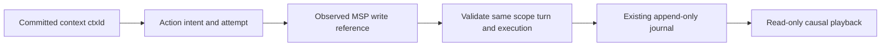

# FR-171-P3 — Validate memory journal causality

## Entry condition and predecessor

Continuation of the approved v0.3 typed adapter contract and P2, authorized by
the owner's instruction to proceed. C-3 / HIGH. This increment enforces the
existing journal boundary; it does not activate private native LINE execution.

Inspection of `turn.js`, `context.js`, `msp-memory-port.js`,
`line-execution-trace.js` and CRM erasure shows two distinct paths: the legacy
assembler recalls authorized memory but does not pass it to the model request;
native LINE commits actual model context and remains public-only. Runtime
enumeration found no production call of `rememberAuthorized`. A constructed
context must not be relabelled as injected. Private producer wiring requires its
own current authorization and subject-erasure integration before activation.

## Input

An explicitly emitted `MEMORY_WRITTEN` event uses `memory-write-trace.v1`, a
local UUID `ctxId`, stable intent UUID `actionId`, fresh UUID `actionAttemptId`,
and a reference-only projection of the actual P2 upsert receipt. The projection
contains status, observation time and nullable entity/version/vault/key/category/
source hash/body snapshot hash. It never carries `entry` or `body_json`.

`sessionAuthority` remains `NOT_ATTESTED_BY_API_009`; no local session id is
presented as MSP authority. An acknowledged upsert is an observation, not a
durable MSP journal receipt. Missing or unknown evidence is recordable only
with an explicit availability state and remains incomplete in playback.

## Output and next handoff

Before append, resolve exactly one matching committed context and action-start
event within the same Tenant, Business, turn and execution. Verify the context
request hash and the action semantic input hash. Reusing identifiers across
executions, conflicting parents, malformed references and missing parents fail
closed. Parent identity comes from the stored rows, never a global lookup.
The action semantic input is the reference-only tuple `operation:
MSP_MEMORY_UPSERT`, `vaultId`, `key`, `category` and `bodyHash`. Any returned
vault/key/category/body hash must match that requested target. This does not
persist the private body or reconstruct one from its hash.
The validator checks provenance consistency; it grants no permission to write
MSP and never calls MSP. Current authorization remains the producer's duty.

Playback repeats validation for old/imported rows, exposes reference-only memory
write evidence, and marks missing parents, incomplete receipts or unattested
MSP session authority as `REPLAY_INCOMPLETE`. It never executes memory writes or
reports a fully replayable external operation on API-009 evidence alone.
Retention tombstones suppress memory references and preserve existing erasure
closure. All existing event/read size bounds remain in force.

## Failure, retry and acceptance

- Reject malformed links before storing a memory event.
- Reject cross-scope, cross-turn and cross-execution parent substitution.
- Preserve revision N after a later receipt or recall reports N+1.
- Preserve explicit unavailable/unknown outcomes without inventing a version.
- Missing/invalid parent or source authority cannot produce complete playback.
- Tombstones suppress references and prevent late append.
- Existing native public-only behavior and owner-only trace routes stay intact.

Focused verification: 24 tests passed across memory linkage, journal and native
LINE trace. The independent review identified occurrence reuse and nested
execution status gaps; both are fixed with regression tests and recorded in
[RCA](../../../../.brain/rca/2026-09-08-memory-trace-causality-review.md).
No new schema, route, model call, memory write producer,
private activation or deployment is included. Next handoff is a producer with
verified per-call injection, current write permission and subject erasure.

## Verification and release report

- Final unit/integration source: **4,254 passed / 15 skipped** across 514 passing
  test files; execution guard passed.
- Production build, lint/type validation and server governance passed.
- Final clean-cache E2E: **112 passed / 4 skipped / 0 flaky**; execution guard
  passed. The FR-091 consent case passed in this local run.
- The first full command was interrupted during E2E and is not claimed as a
  completed verification command. An ensuing run exposed an unreadable webpack
  cache and was stopped. After confirming the test processes had stopped, the
  task-owned cache was preserved outside its active location; the complete E2E
  suite above then ran from a fresh cache. No application source changed.
- Final root/combined graph verification is recorded with the commit.
- Parent PR #290 remains blocked by hosted run 34147822885: a single flaky
  connection reset on GET /api/scope. The underlying cause remains unproven;
  see [CI RCA](../../../../.brain/rca/2026-09-08-fr091-ci-connection-reset.md).
  Local success does not close that hosted failure. No retry/quarantine or
  branch-protection bypass was introduced.
- P3 is a draft stacked on P1/P2 until the parent release gate is resolved.
  Rebase/retarget to main before considering merge. No deployment occurred.

## CHANGELOG

| Version | Date | Status | Summary | Commit Hash | Agent |
|---|---|---|---|---|---|
| 1.0.0 | 2026-09-08 | beta | Execute approved typed memory journal linkage boundary | pending | RWANG |
