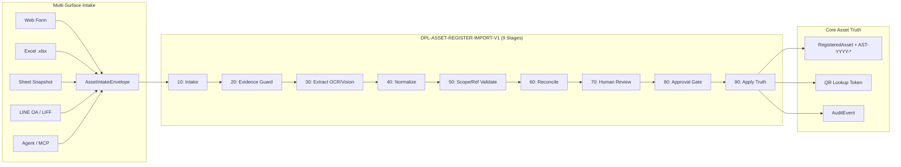
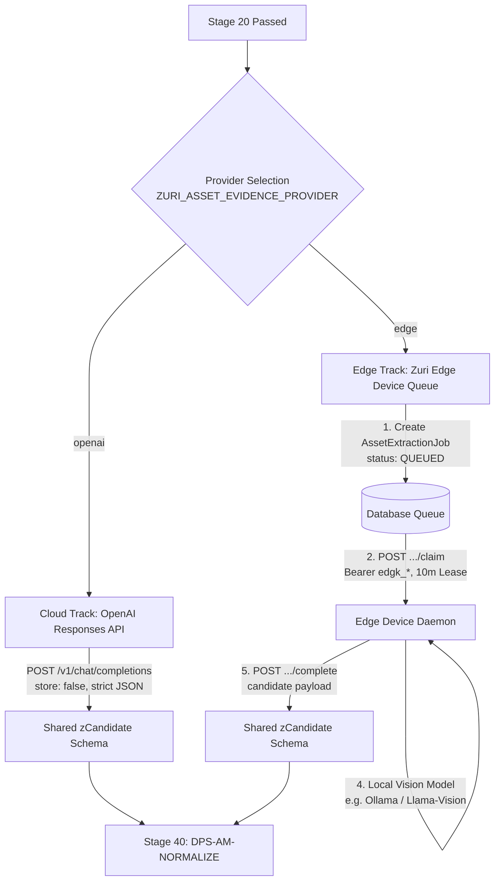

# Asset Register Import Pipeline Specification

**Domain:** Asset Management (`DOM-ASSET-MANAGEMENT`)  
**Pipeline Definition ID:** `DPL-ASSET-REGISTER-IMPORT-V1`  
**Execution Contract ID:** `EXC-ASSET-REGISTER-IMPORT-V1`  
**Ledger Authority:** Shared Integration Pipeline Substrate (FR-071, ADR-030)  
**Status:** Active Foundation & Evidence Intake Beta  
**Related Requirements:** FR-133, FR-134, FR-137, FR-138, FR-139, FR-140, FR-143, NFR-021, BR-023, BR-024, BR-025, SEC-023  

---

## 1. Executive Summary & Intent

The **Asset Register Import Pipeline** (`DPL-ASSET-REGISTER-IMPORT-V1`) is the verifiable, deterministic, and auditable data engine that governs the transformation of multi-surface asset intake drafts into authoritative `RegisteredAsset` records within a Business.

It executes under the execution contract `EXC-ASSET-REGISTER-IMPORT-V1` and leverages the shared, definition-neutral pipeline ledger (`PipelineRun`, `PipelineStage`, `PipelineEvent`, `PipelineGateDecision`, `PipelineReconciliation`) without aliasing or contaminating the knowledge pipelines (`DPL-SUPABASE-BUSINESS-KNOWLEDGE-V1`, `DPL-KNOWLEDGE-INGEST-V1`).



---

## 2. Stage Catalog & Execution Protocol

The pipeline consists of **9 sequential, deterministic stages** registered in `ASSET_REGISTER_IMPORT_STAGE_CATALOG` (`src/platform/integrations/core/pipeline-tracking-contract.js`):

| Sequence | Stage ID | Stage Label | Description & Invariants |
|:---:|---|---|---|
| **10** | `DPS-AM-INTAKE` | Receive immutable Asset intake envelope | Parses and validates the incoming payload against `AssetIntakeEnvelopeSchema`. Assigns `pipelineRunId` and computes `payloadSha256`. |
| **20** | `DPS-AM-EVIDENCE-GUARD` | Inspect evidence type, size and availability | Verifies file magic bytes (JPEG, PNG, WebP, PDF), enforces 20 MiB ceiling, and verifies mandatory `ASSET_PHOTO` and `PAYMENT_PROOF` for procurement intake. |
| **30** | `DPS-AM-EXTRACT-CANDIDATES` | Extract OCR or Vision candidates | Invokes OpenAI Structured Vision (cloud) or creates leased `AssetExtractionJob` for on-premise Edge Device (FR-143). Output is strictly `CANDIDATE`. |
| **40** | `DPS-AM-NORMALIZE` | Normalize candidate fields and references | Normalizes decimal amounts, ISO 8601 dates, uppercase serial codes, and typed procurement/location references. |
| **50** | `DPS-AM-SCOPE-REFERENCE-VALIDATE` | Validate trusted scope and typed references | Verifies all referenced `FileAsset`, `Person`, `Branch`, and `Project` records belong to the trusted `businessId`. Enforces lot/expiry for controlled items. |
| **60** | `DPS-AM-RECONCILE` | Detect duplicate and conflicting evidence | Checks for duplicate slip hashes (`paymentReference` / `sha256`) and duplicate serial numbers across the Business register. |
| **70** | `DPS-AM-HUMAN-CONFIRM` | Capture human confirmation and correction | Gated review seam (BR-025). An authorized `ASSET_REVIEWER` confirms candidates or submits explicit field corrections. AI never self-approves. |
| **80** | `DPS-AM-APPROVAL` | Record approval decision and evidence | Captures the registration authorization signature (`PipelineGateDecision` with `status: APPROVED`) by an authorized `ASSET_MANAGER` or `BUSINESS_OWNER`. |
| **90** | `DPS-AM-APPLY` | Apply Asset truth transactionally | Atomically commits `RegisteredAsset`, issues `AST-YYYY-XXXXX`, initializes `AssetResponsibility` / `AssetLocationHistory`, and marks intake `REGISTERED`. |

---

## 3. Data Ingestion Flow & Contracts

### 3.1 Canonical Intake Envelope (`AssetIntakeEnvelope`)

Every ingress channel transforms its raw representation into the strict schema defined in `src/modules/asset-management/domain/asset-intake.js`:

```json
{
  "schemaVersion": "1.0",
  "businessId": "01918b82-9f3b-7a2e-8e4a-9281a8f90001",
  "sourceChannel": "WEB",
  "sourceCorrelationId": "intake-draft-20260906-001",
  "origin": "PROCUREMENT_PURCHASE",
  "item": {
    "name": "MacBook Pro 16-inch M3 Max",
    "categoryCode": "IT_EQUIPMENT",
    "description": "Space Black, 36GB RAM, 1TB SSD",
    "brand": "Apple",
    "model": "A2991",
    "serialNumber": "C02G1234MD6R",
    "condition": "GOOD",
    "quantity": 1
  },
  "evidence": [
    {
      "fileAssetId": "01918b83-1111-7a2e-8e4a-9281a8f90002",
      "role": "ASSET_PHOTO"
    },
    {
      "fileAssetId": "01918b83-2222-7a2e-8e4a-9281a8f90003",
      "role": "PAYMENT_PROOF"
    }
  ],
  "procurementRefs": [
    { "type": "PR", "system": "ERP", "value": "PR-2026-0891" },
    { "type": "PO", "system": "ERP", "value": "PO-2026-0412", "lineValue": "1" }
  ],
  "responsibility": {
    "accountablePersonId": "01918b84-3333-7a2e-8e4a-9281a8f90004",
    "custodianPersonId": "01918b84-3333-7a2e-8e4a-9281a8f90004",
    "actualUserPersonIds": ["01918b84-4444-7a2e-8e4a-9281a8f90005"]
  },
  "location": {
    "branchId": "01918b85-5555-7a2e-8e4a-9281a8f90006",
    "locationCode": "HQ-B1-L3-302",
    "locationName": "Bangkok HQ, Floor 3, Engineering Pod"
  },
  "financial": {
    "acquisitionAmount": "98900.00",
    "residualValue": "1.00",
    "currency": "THB",
    "usefulLifeMonths": 36,
    "receivedOn": "2026-09-06T10:00:00.000Z"
  }
}
```

---

## 4. Dual-Track Extraction Architecture (Stage 30)

Stage 30 (`DPS-AM-EXTRACT-CANDIDATES`) supports two decoupled extraction execution targets without schema drift:



### Shared Candidate Schema (`zCandidate`)
Both cloud and edge extractors validate against the same Zod contract (`src/modules/asset-management/infrastructure/asset-evidence-candidate-schema.js`):
- `vendor`: Supplier/Merchant name
- `documentNumber`: Receipt/Tax invoice number
- `documentDate`: Extracted date of invoice/receipt
- `totalAmount`: Gross amount with 2 decimal places
- `currency`: ISO 4217 currency code
- `paymentReference`: Bank transfer transaction reference
- `serialNumber`: Extracted device serial
- `model`: Extracted brand/model name
- `prRef` & `poRef`: Extracted procurement numbers
- `confidence`: Provider confidence score (0.00 - 1.00)
- `provenance`: File asset ID, page number, and bounding box coordinates

---

## 5. Replay Safety, Observability & Error Handling

### 5.1 Deterministic Replay (NFR-021)
- Replaying a pipeline run uses the original immutable `FileAsset` storage bytes.
- A replay instantiates a new `PipelineRun` with `parentRunId` referencing the predecessor.
- If input parameters and evidence SHA-256 hashes are identical, validation output is mathematically identical.
- Replaying an already applied (`REGISTERED`) intake produces a conflict warning and does not create duplicate `RegisteredAsset` records.

### 5.2 Diagnostic Error Codes Matrix

| Error Code | Stage | Cause | Resolution Action |
|---|:---:|---|---|
| `ERR_AM_MAGIC_BYTE_MISMATCH` | 20 | File header does not match declared MIME | Upload original uncorrupted binary image/PDF |
| `ERR_AM_MISSING_PAYMENT_PROOF` | 20 | Procurement intake lacks `PAYMENT_PROOF` role | Attach bank slip or paid receipt |
| `ERR_AM_EDGE_LEASE_EXPIRED` | 30 | Edge device failed to complete job within 10 min | Job automatically reverts to `QUEUED` for retry |
| `ERR_AM_SCHEMA_INVALID_CANDIDATE`| 30 | Extractor output violated `zCandidate` | Review extractor model prompt or manually input fields |
| `ERR_AM_SCOPE_VIOLATION` | 50 | Referenced entity belongs to another Business | Request fails closed with 404-shaped refusal |
| `ERR_AM_EXPIRY_LOT_REQUIRED` | 50 | Item is `expiryControlled` but lacks `lotCode` | Provide valid Lot Code and future expiration date |
| `ERR_AM_DUPLICATE_SLIP_HASH` | 60 | Payment proof hash already registered | Verify whether equipment was already registered |
| `ERR_AM_SERIAL_CONFLICT` | 60 | Serial number already active in Business | Reconcile physical unit or inspect existing asset |
| `ERR_AM_UNREVIEWED_CANDIDATE` | 70 | Attempted to approve with pending candidates | Human reviewer must submit `ACCEPT` or `CORRECT` |

---

## 6. Verification & Test Evidence

The pipeline implementation is proven through comprehensive unit and integration suites:

- `tests/unit/asset-management-pipeline-contract.test.js` — Pipeline definition and 9-stage sequence assertion.
- `tests/unit/asset-evidence-extractor-contract.test.js` — OpenAI extraction contract and structured schema enforcement.
- `tests/integration/fr143-asset-extraction-job.test.js` — Edge Device pull, 10-minute lease, byte streaming, and candidate posting.
- `tests/integration/asset-evidence-intake-execution.test.js` — Full intake envelope validation, human review transition, and replay idempotency.
