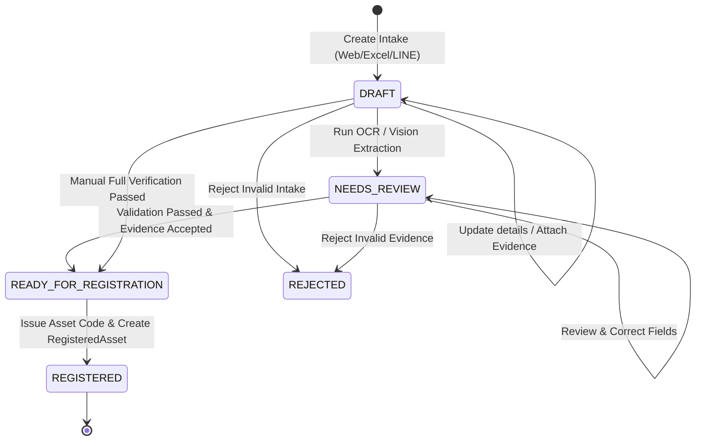
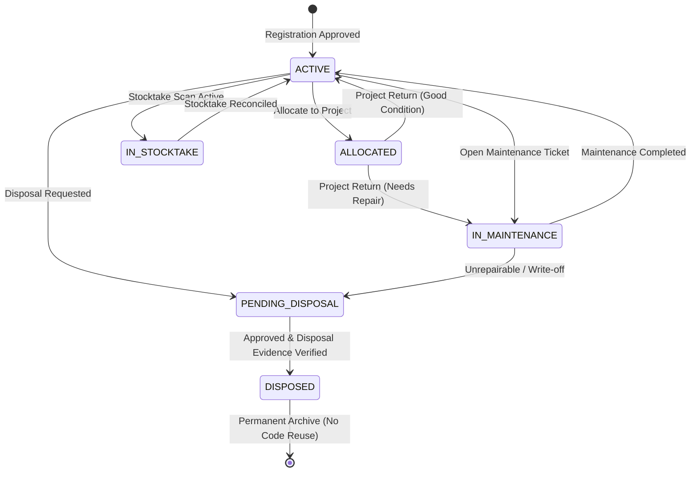

# SRS — Asset Management domain

**System:** Zuri AI (`zuri-ai`)  
**Document type:** Software Requirements Specification  
**Domain:** Asset Management — the Business-scoped authority for physical asset identity, evidence-backed intake, operational lifecycle, custody, location, project allocation, maintenance, stocktake, disposal and reviewable financial fact handoff  
**Stable product-domain ID:** `DOM-ASSET-MANAGEMENT`  
**Technical owner ID:** `TD-ASSET-MANAGEMENT`  
**Status:** Active Foundation & Evidence Intake Beta / Proposed Complete Lifecycle (v0.3)  
**Version:** Draft v0.3.0  

> **Clause-label note.** `AM-RQ-*` labels below are local clause labels for this domain
> specification, in the convention used by `LOS-RQ-*` in LINE OA Studio and `CR-014`
> (`AM-PRD-*`). They are **not** Zuri global `FR-*` / `NFR-*` / `BR-*` / `SEC-*` / `SDD-*`
> ids, they are not pinned in `docs/.id-ledger.json`, and this file is not an id registry.
> Global ids remain defined only in `docs/PRD-SDD-v1.0.md` under the AGENTS.md §18 contract;
> each implementation slice SHALL reserve them before code is annotated or shipped.

---

## 1. Purpose & Business Vision

Asset Management delivers an AI-native, verifiable, and offline-first operational system
for governing company physical assets throughout their entire lifecycle. It eliminates
parallel spreadsheets, disconnected chat threads, and unverifiable paperwork by anchoring
every physical asset in verifiable evidence and immutable historical intervals.

The domain answers eight fundamental operational and compliance questions for any Business:

1. **What physical unit or controlled lot is this?** (Physical Identity, Asset Code, Serial, Lot, Expiry)
2. **Which evidence, procurement references and human decisions prove its intake?** (Photos, Receipts, PR/PO Refs, Extraction Provenance)
3. **Who is currently accountable, who holds custody, and who is actually using it?** (Temporal Responsibility Intervals & Handover Records)
4. **Where is it physically located right now, and where has it been?** (Branch & Location History)
5. **Which Project or Workstream is using it, and under what condition was it returned?** (Project Allocation & Inventory Projection)
6. **What is its maintenance schedule, calibration record, and service history?** (Preventive & Incident Service Logs)
7. **Is it physically present where the records say it is?** (Periodic Stocktake Campaigns & Mobile Scanning Reconciliation)
8. **How was it decommissioned or disposed of, and what depreciation schedule did it follow?** (Disposal Evidence & Finance Candidate Preview)

```text
┌─────────────────────────────────────────────────────────────────────────────────────────┐
│                              ASSET MANAGEMENT DOMAIN MAP                                │
├───────────────────────────────┬───────────────────────────────┬─────────────────────────┤
│ 1. Receiving & Evidence       │ 2. Register & Tagging         │ 3. Custody & Location   │
│ Multi-channel Intake Envelope │ Stable Asset ID (AST-YYYY-*)  │ Accountable Person      │
│ Magic-byte Verified Storage   │ QR / Barcode Lookup Token     │ Custodian & Users       │
│ OCR / Vision (Cloud / Edge)   │ Tag Generation & Label Spec   │ Handover Acknowledgment │
│ PR / PO / Lot Validation      │ Category & Specification Master│ Location History        │
├───────────────────────────────┼───────────────────────────────┼─────────────────────────┤
│ 4. Project Allocation         │ 5. Maintenance & Service      │ 6. Stocktake & Audit    │
│ Exclusive Workstream Booking  │ Preventive Schedules          │ Campaign Sessions       │
│ Project Inventory Projection  │ Incident Repair Tickets       │ Mobile Scan Matching    │
│ Return Inspection & Condition │ Warranty & Supplier Tracking  │ Variance & Audit Trail  │
├───────────────────────────────┴───────────────────────────────┴─────────────────────────┤
│ 7. Decommissioning & Disposal           │ 8. Depreciation Candidate Handoff             │
│ Scrap / Sell / Donate / Loss Workflows  │ Straight-Line Deterministic Schedule Preview  │
│ Multi-party Approval & Evidence Proof   │ Decimal-safe Bounded Accumulation             │
│ Permanent Archive (No ID Recycling)     │ Finance Review State (No Auto-Journal)        │
└─────────────────────────────────────────────────────────────────────────────────────────┘
```

---

## 2. Architectural Constraints & Non-Negotiables

Asset Management conforms to Zuri's domain-driven modular monolith architecture (`docs/ARCHITECTURE-TARGET-MODULAR-MONOLITH.md`, ADR-025, ADR-055). It SHALL:

1. **Modular Monolith Residence:** Live in the `zuri-ai` codebase and release boundary under `src/modules/asset-management` and `docs/domains/asset-management/`.
2. **Business-Scoped Isolation (SEC-001, Rule 3):** Every database row, API route, and state mutation SHALL be scoped to a single `tenantId` and `businessId` derived strictly from the trusted session viewer. Scope SHALL never be derived from client-submitted payload, QR code, OCR result, or LINE event.
3. **Internal UUIDs vs External Codes (Rule 4, BR-002):** All primary relational keys SHALL be internal UUIDs. Asset Code (`assetCode`), Serial Number, Lot Code, PO Number, PR Number, QR Payload, and Invoice Reference are attributes and unique domain codes, NEVER primary keys.
4. **Physical Identity vs File Content Identity:** `RegisteredAsset` is the physical identity aggregate. `FileAsset` belongs to the file-management authority and represents managed binary content. Asset Management SHALL reference `FileAsset.id` and SHALL NOT duplicate file storage or create a second file table.
5. **No AI Self-Approval (BR-025):** OCR, Vision, or LLM extraction output (OpenAI API or Edge Ollama/Vision) is strictly candidate evidence (`CANDIDATE`). It SHALL NEVER review, validate, approve, or register an asset without explicit, accountable human confirmation.
6. **Temporal Intervals for Mutable Relations:** Responsibility (Accountable Person, Custodian, User), Location, and Project Allocation SHALL be stored as effective temporal intervals (`effectiveFrom` .. `effectiveTo`). Updating responsibility or location SHALL close the prior interval and append a new interval; historical intervals SHALL NEVER be overwritten or deleted.
7. **Offline-First & Repository-Mediated (Rule 9, ADR-055 D11):** Operations work against local SQLite/Prisma and repository interfaces so that a PostgreSQL adapter (ADR-018) preserves identical invariants. Every record persists `createdAt`, `updatedAt`, `deletedAt`, and `version`.
8. **Immutable Audit Trail:** All meaningful state transitions (intake submission, extraction, human review, registration, custody handover, location transfer, project checkout/return, maintenance logging, stocktake observation, and disposal) SHALL emit an append-only `AuditEvent`.
9. **Depreciation is Candidate Preview, Not Accounting Authority (ADR-055 D8, FR-136):** Straight-line depreciation calculation produces deterministic preview evidence for Finance review. Asset Management SHALL NOT create capitalization entries, tax books, or accounting journal postings.

---

## 3. Authority and Domain Boundaries

### 3.1 Integration & Storage Authority Boundary
- **AM-RQ-001 — File Management Seam:** Storage bytes, MIME detection, SHA-256 calculation, and private blob storage are owned by File Management. Asset Management references active `FileAsset.id` and assigns domain roles (`ASSET_PHOTO`, `PAYMENT_PROOF`, `WARRANTY`, `DISPOSAL_PROOF`).
- **AM-RQ-002 — Storage URL Privacy (SEC-025, ADR-041 D3):** Asset Management routes SHALL NOT expose raw bucket URLs, signed S3 links, or cloud storage credentials to clients, devices, or logs.

### 3.2 Identity & People Boundary
- **AM-RQ-003 — Person & Membership Reference:** Identity / People owns `Person` and `Membership` entities. Asset Management references `personId` to record who accepted custody or performed review.
- **AM-RQ-004 — Org Unit Typed References:** Department or organizational units are represented as typed external references (`orgUnitSystem`, `orgUnitRef`) until an enterprise Org Unit authority is established; free strings SHALL NOT be promoted to relational master rows.

### 3.3 Procurement & Commerce Boundary
- **AM-RQ-005 — Procurement Decoupling:** Commerce / Procurement owns `Supplier`, `PurchaseRequest` (PR), `PurchaseOrder` (PO), `GoodsReceivedNote` (GRN), and purchasing invoices. Asset Management stores typed references (`AssetProcurementRef`) linking registered assets to their purchasing origins without mutating Procurement records.

### 3.4 Project Manager Boundary
- **AM-RQ-006 — Allocation Ownership & Read Projection:** Asset Management owns the allocation decision and persistence (`AssetProjectAllocation`). Project Manager owns `Project` and `Workstream`. Project Inventory consumes an asynchronous or stable DTO read projection and SHALL NOT mutate Asset Management state.

### 3.5 Finance & Accounting Boundary
- **AM-RQ-007 — Financial Handoff:** Finance owns capitalization policies, fixed-asset ledgers, depreciation schedules, and journal postings. Asset Management produces verified acquisition candidates and deterministic depreciation preview schedules for Finance review.

### 3.6 Edge Device Boundary (ADR-041, ADR-059, FR-143, FR-144)
- **AM-RQ-008 — Pull-based Extraction & Credential Isolation:** On-premise Edge Devices pull queued extraction jobs (`AssetExtractionJob`) via bearer authentication (`EdgeDeviceCredential`). The device executes vision extraction on-premise and posts candidates back to the cloud. Edge devices receive no cloud storage credentials and have no direct database access.

---

## 4. Subdomain Functional Specifications

```text
       ┌────────────────────────────────────────────────────────┐
       │             SUBDOMAIN ARCHITECTURE OVERVIEW            │
       └───────────────────────────┬────────────────────────────┘
                                   │
      ┌────────────────────────────┼────────────────────────────┐
      ▼                            ▼                            ▼
┌──────────────┐            ┌──────────────┐            ┌──────────────┐
│ Subdomain 1  │            │ Subdomain 2  │            │ Subdomain 3  │
│ Receiving &  │──validate─►│ Register &   │──assign───►│ Custody &    │
│ Intake       │            │ Tagging ID   │            │ Location     │
└──────────────┘            └──────┬───────┘            └──────────────┘
                                   │
      ┌────────────────────────────┼────────────────────────────┐
      ▼                            ▼                            ▼
┌──────────────┐            ┌──────────────┐            ┌──────────────┐
│ Subdomain 4  │            │ Subdomain 5  │            │ Subdomain 6  │
│ Project Use  │            │ Maintenance  │            │ Stocktake    │
│ & Allocation │            │ & Warranty   │            │ & Audit      │
└──────────────┘            └──────┬───────┘            └──────────────┘
                                   │
      ┌────────────────────────────┴────────────────────────────┐
      ▼                                                         ▼
┌──────────────┐                                        ┌──────────────┐
│ Subdomain 7  │                                        │ Subdomain 8  │
│ Disposal &   │                                        │ Depreciation │
│ Decommission │                                        │ Candidate    │
└──────────────┘                                        └──────────────┘
```

---

### 4.1 Subdomain 1: Receiving & Evidence Intake

- **AM-RQ-010 — Multi-Surface Envelope Convergence:** Web intake, REST API, Excel (.xlsx), Google Sheet snapshot, Agent/MCP, and LINE OA/LIFF SHALL normalize into a single canonical `AssetIntakeEnvelope` validated with Zod/JSON Schema before persistence.
- **AM-RQ-011 — Mandatory Evidence Guard:** A procurement-origin intake submit (`PROCUREMENT_PURCHASE`) SHALL require at least one verified `ASSET_PHOTO` and one verified `PAYMENT_PROOF` (`FileAsset` reference). An intake missing mandatory evidence SHALL be rejected with field-level diagnostic codes.
- **AM-RQ-012 — Dual-Track Extraction Engine:**
  - Cloud Extraction: Calls configured OpenAI Structured Output model using ephemeral data policies (`store: false`).
  - Edge Extraction (FR-143): Queues an `AssetExtractionJob` claimed by an on-premise Edge Device running local vision models under a 10-minute lease.
- **AM-RQ-013 — Human Review & Correction Seam:** Candidate extraction fields (`vendor`, `date`, `amount`, `serialNumber`, `model`, `prRef`, `poRef`) SHALL be confirmed or corrected by an authorized `ASSET_REVIEWER`. Corrections SHALL append audit evidence rather than overwriting raw provider responses.
- **AM-RQ-014 — Expiry & Lot Control Validation:** Categories marked `expiryControlled` SHALL require `lotCode` and a valid future `expiresOn` date.

---

### 4.2 Subdomain 2: Asset Register, Identity & Tagging

- **AM-RQ-020 — Stable Company Asset Code:** Upon registration approval, the system SHALL issue a unique, sequential, human-readable Asset Code formatted as `AST-YYYY-XXXXX` (e.g. `AST-2026-00042`) scoped to the Business. Asset Codes SHALL NEVER be recycled, even after disposal.
- **AM-RQ-021 — Physical Aggregate Instantiation:** Promoting an `AssetIntake` from `READY_FOR_REGISTRATION` to `RegisteredAsset` SHALL occur in a single ACID transaction that updates intake state, creates the asset aggregate, links all evidence, and appends registration audit events.
- **AM-RQ-022 — QR / Barcode Lookup Tokenization:** Every registered asset SHALL have a generated standard QR Code payload formatted as a secure lookup URI:
  ```text
  zuri://assets/<businessId>/<assetCode>?v=1
  ```
  or web fallback:
  ```text
  https://app.zuri.ai/assets/lookup?b=<businessId>&code=<assetCode>
  ```
  Possession of a QR code payload SHALL NEVER bypass authentication; the server SHALL authenticate the viewer and verify Business visibility before returning asset data.
- **AM-RQ-023 — Standard Label Generation:** The system SHALL provide standard printable asset tag templates (PDF/ZPL/PNG) containing: Company/Business Name, Asset Code, Barcode/QR Code, Asset Name, Model, Category, and Registration Date.

---

### 4.3 Subdomain 3: Custody, Handover & Location Intervals

- **AM-RQ-030 — Tri-Party Responsibility Model:** Asset custody SHALL differentiate between:
  1. `ACCOUNTABLE`: Person legally or administratively accountable for the asset (Department head / Manager). Exactly one active interval allowed per asset.
  2. `CUSTODIAN`: Person physically entrusted with safeguarding the equipment (Office admin / Tool room officer).
  3. `USER`: Person(s) actively operating the asset.
- **AM-RQ-031 — Handover Protocol & Digital Acknowledgment:** Transferring custody from Person A to Person B SHALL create a pending handover record. Custody becomes active when Person B acknowledges receipt (`acknowledgedAt`), closing Person A's interval (`effectiveTo = now`) and opening Person B's interval (`effectiveFrom = now`).
- **AM-RQ-032 — Physical Location Tracking:** Location changes SHALL be recorded in `AssetLocationHistory` carrying `branchId` (Branch reference), `locationCode`, `locationName` (e.g., "Building B, Floor 3, Lab 302"), and effective temporal dates.

---

### 4.4 Subdomain 4: Project & Workstream Allocation

- **AM-RQ-040 — Project Checkout & Allocation:** An asset may be allocated to a `Project` and optional `Workstream` for a designated duration (`effectiveFrom` .. `effectiveTo`).
- **AM-RQ-041 — Exclusive Booking Guard:** Assets marked `exclusive: true` SHALL NOT have overlapping active allocation intervals. The allocation service SHALL reject conflicting schedule requests.
- **AM-RQ-042 — Project Inventory Read-Only DTO:** Project Manager views equipment via a read-only projection DTO (`ProjectAssetProjection`). Project Manager SHALL NOT have direct write access to `RegisteredAsset` or `AssetProjectAllocation`.
- **AM-RQ-043 — Check-in Inspection & Return Condition:** When an asset is returned from a Project, the receiver SHALL record a return inspection:
  - Condition: `GOOD`, `MINOR_WEAR`, `DAMAGED`, `NEEDS_MAINTENANCE`
  - Notes and optional return photo evidence (`FileAsset` reference)
  - Automatic transition to `IN_MAINTENANCE` if condition is `DAMAGED` or `NEEDS_MAINTENANCE`.

---

### 4.5 Subdomain 5: Preventive Maintenance, Warranty & Service

- **AM-RQ-050 — Maintenance Ticket Lifecycle:** The system SHALL track maintenance requests (`AssetMaintenanceTicket`) with states:
  `OPEN` → `IN_PROGRESS` → `COMPLETED` | `UNREPAIRABLE` → `CLOSED`.
- **AM-RQ-051 — Preventive Schedule Rules:** Assets requiring periodic calibration or servicing SHALL support recurring maintenance schedules (e.g., every 90 days, 180 days, or annual). The system SHALL alert asset managers 14 days before due date.
- **AM-RQ-052 — Warranty Expiry Monitoring:** Assets with recorded `warrantyEndsAt` SHALL display warranty status (`ACTIVE`, `EXPIRING_SOON`, `EXPIRED`) and supplier/service center contact references.
- **AM-RQ-053 — Historical Service Cost Ledger:** Maintenance logs SHALL record service provider, invoice reference, parts replaced, total repair cost, and downtime duration for lifecycle cost analysis.

---

### 4.6 Subdomain 6: Stocktake & Physical Inventory Verification

- **AM-RQ-060 — Stocktake Campaign Creation:** An Asset Auditor or Manager SHALL be able to initiate a stocktake campaign (`AssetStocktakeRun`) scoped by Branch, Location, Category, or Department.
- **AM-RQ-061 — Mobile & QR Fast Scanning:** During an active stocktake run, authorized staff SHALL scan physical asset QR codes using mobile browsers, LINE LIFF, or barcode scanners. Each scan records scanner `personId`, timestamp, observed location, and physical condition.
- **AM-RQ-062 — Stocktake Reconciliation Matrix:** The system SHALL compute real-time variance categorizing assets into:
  - `MATCHED`: Asset found in expected location.
  - `MISPLACED`: Asset found in a different location than recorded in `AssetLocationHistory`.
  - `MISSING`: Expected asset not scanned during the campaign.
  - `UNREGISTERED`: Physical tag scanned but not found in active Business register.
- **AM-RQ-063 — Reconciliation Resolution & Audit Sign-Off:** The Stocktake Auditor SHALL review discrepancies, apply bulk location corrections for misplaced assets, flag missing items for investigation, and submit an audited sign-off report.

---

### 4.7 Subdomain 7: Decommissioning & Disposal Lifecycle

- **AM-RQ-070 — Disposal Request Workflow:** Decommissioning an asset SHALL follow a gated workflow:
  `ACTIVE` → `DISPOSAL_REQUESTED` → `APPROVED` → `DISPOSED`.
- **AM-RQ-071 — Disposal Methods & Validation:** Supported disposal methods SHALL include:
  - `SCRAP`: End-of-life destruction / recycling.
  - `SELL`: Sale of used equipment (requires sale price and buyer reference).
  - `DONATE`: Charitable transfer (requires recipient reference).
  - `LOSS_THEFT`: Stolen or lost asset (requires police report or incident evidence).
- **AM-RQ-072 — Disposal Evidence Attachment:** Marking an asset as `DISPOSED` SHALL require at least one verified disposal proof (`FileAsset` reference: photo of destruction, sales invoice, or donation certificate).
- **AM-RQ-073 — Permanent Retirement:** A disposed asset SHALL be locked against future allocation, transfer, or maintenance. Its Asset Code SHALL remain permanently archived.

---

### 4.8 Subdomain 8: Finance & Depreciation Candidate Handoff

- **AM-RQ-080 — Deterministic Straight-Line Schedule:** The system SHALL calculate monthly straight-line depreciation preview schedules based on:
  $$\text{Depreciable Basis} = \text{Acquisition Amount} - \text{Residual Value}$$
  $$\text{Monthly Depreciation} = \frac{\text{Depreciable Basis}}{\text{Useful Life in Months}}$$
- **AM-RQ-081 — Precision & Rounding Safety:** All calculations SHALL use decimal-safe arithmetic (rounding to 2 decimal places). Accumulated depreciation SHALL never exceed depreciable basis, and net book value SHALL never drop below residual value.
- **AM-RQ-082 — Finance Review Candidate Only:** Schedules SHALL be stored in `AssetDepreciationCandidate` with status `PREVIEW` or `REVIEWED`. Asset Management SHALL NEVER post accounting entries or claim authoritative financial ledger status.

---

## 5. Lifecycle State Machines

### 5.1 Asset Intake State Machine



### 5.2 Registered Asset Operational State Machine



---

## 6. Actor & Capability Matrix

| Capability / Action | `BUSINESS_OWNER` | `ASSET_RECEIVER` | `ASSET_REVIEWER` | `ASSET_MANAGER` | `ASSET_AUDITOR` | `TECHNICIAN` |
|---|:---:|:---:|:---:|:---:|:---:|:---:|
| Upload Evidence & Save Draft | ✅ | ✅ | ✅ | ✅ | ❌ | ❌ |
| Trigger Cloud/Edge Extraction | ✅ | ✅ | ✅ | ✅ | ❌ | ❌ |
| Review & Accept Extraction Candidates | ✅ | ❌ | ✅ | ✅ | ❌ | ❌ |
| Approve Registration & Issue Asset Code | ✅ | ❌ | ❌ | ✅ | ❌ | ❌ |
| Assign / Transfer Custody | ✅ | ❌ | ❌ | ✅ | ❌ | ❌ |
| Acknowledge Custody Handover | ✅ (if recipient) | ✅ (if recipient) | ✅ (if recipient) | ✅ | ❌ | ❌ |
| Allocate Asset to Project | ✅ | ❌ | ❌ | ✅ | ❌ | ❌ |
| Open / Update Maintenance Ticket | ✅ | ❌ | ❌ | ✅ | ❌ | ✅ |
| Initiate & Reconcile Stocktake | ✅ | ❌ | ❌ | ✅ | ✅ | ❌ |
| Scan QR during Stocktake | ✅ | ✅ | ✅ | ✅ | ✅ | ✅ |
| Request Asset Disposal | ✅ | ❌ | ❌ | ✅ | ❌ | ❌ |
| Approve Disposal & Finalize Scrap/Sale | ✅ | ❌ | ❌ | ❌ (Owner only) | ❌ | ❌ |
| Export Asset Register (.xlsx) | ✅ | ❌ | ❌ | ✅ | ✅ | ❌ |
| Preview Depreciation Candidate | ✅ | ❌ | ❌ | ✅ | ✅ | ❌ |

---

## 7. Data Model & Aggregate Structure

```text
┌─────────────────────────────────────────────────────────────────────────────────┐
│                                 DATA MODEL GRAPH                                │
├─────────────────────────────────────────────────────────────────────────────────┤
│                                                                                 │
│   ┌────────────────┐         1:N         ┌───────────────────┐                  │
│   │  AssetIntake   ├────────────────────►│   AssetEvidence   │                  │
│   └───────┬────────┘                     └─────────┬─────────┘                  │
│           │ 1:1                                    │ 1:N                        │
│           ▼                                        ▼                            │
│   ┌────────────────┐                     ┌───────────────────┐                  │
│   │RegisteredAsset │                     │AssetExtractionJob │                  │
│   └───┬────┬───┬───┘                     └───────────────────┘                  │
│       │    │   │                                                                │
│       │    │   └───────────────1:N──────────────┐                               │
│       │    │                                    │                               │
│       │    ▼ 1:N                                ▼ 1:N                           │
│       │  ┌───────────────────────┐            ┌──────────────────────┐          │
│       │  │  AssetResponsibility  │            │ AssetLocationHistory │          │
│       │  └───────────────────────┘            └──────────────────────┘          │
│       ▼ 1:N                                                                     │
│   ┌──────────────────────────────┐            ┌──────────────────────┐          │
│   │    AssetProjectAllocation    │            │AssetDepreciationCand.│          │
│   └──────────────────────────────┘            └──────────────────────┘          │
│                                                                                 │
│   [Future Lifecycle Models]                                                     │
│   - AssetMaintenanceTicket (registeredAssetId, ticketCode, status, cost, logs)  │
│   - AssetStocktakeRun (runCode, branchId, status, startedAt, closedAt)          │
│   - AssetStocktakeItem (stocktakeRunId, registeredAssetId, observedLoc, result) │
│   - AssetDisposalRecord (registeredAssetId, method, reason, evidenceId, status) │
└─────────────────────────────────────────────────────────────────────────────────┘
```

### 7.1 Aggregate Invariants
1. **Tenant & Business Scope:** Every table carries indexed `tenantId` and `businessId`.
2. **Deterministic Uniqueness:**
   - `RegisteredAsset`: `@@unique([businessId, assetCode])`
   - `AssetIntake`: `@@unique([businessId, intakeCode])`, `@@unique([businessId, sourceChannel, sourceCorrelationId])`
   - `AssetLot`: `@@unique([businessId, lotCode])`
   - `AssetEvidence`: `@@unique([intakeId, fileAssetId, role])`
3. **Temporal History Invariance:** For any given `registeredAssetId` and `role = 'ACCOUNTABLE'`, there SHALL NOT be more than one record with `effectiveTo IS NULL`.

---

## 8. UI Architecture & Navigation Sitemap

```text
/assets
├── /assets                      (Dashboard: Overview, Metrics, Alerts & Foundation Status)
├── /assets/receiving            (Intake Workspace: Multi-role Evidence Upload, Extraction & Review)
├── /assets/register             (Asset Register: Search, Filter by Category/Dept/Location, Detail Drawer)
│   └── /assets/register/[id]    (Asset Detail: Specs, QR Tag, Timeline History, Maintenance, Financials)
├── /assets/transfers            (Custody & Location Transfers, Pending Handover Acknowledgments)
├── /assets/projects             (Project Allocation Matrix & Check-in / Check-out Inspector)
├── /assets/maintenance          (Preventive Schedules, Calibration Warnings, Repair Tickets)
├── /assets/stocktakes           (Stocktake Campaign Manager & Mobile Scan Reconciliation)
│   └── /assets/stocktakes/[id]  (Active Stocktake Dashboard & Variance Matrix)
├── /assets/disposals            (Decommissioning Requests, Scrappage Approvals, Evidence Archive)
└── /assets/reports              (Asset Value, Custody Roster, Maintenance Costs, Excel/PDF Exports)
```

---

## 9. Non-Functional & Security Requirements

1. **NFR-AM-01 — Strict Magic Bytes File Gate:** File uploads SHALL be verified using binary magic bytes (JPEG `FF D8 FF`, PNG `89 50 4E 47`, WebP `52 49 46 46`, PDF `25 50 44 46`). Renamed executable extensions or malformed blobs SHALL fail closed immediately.
2. **NFR-AM-02 — Constant-Time Edge Authentication:** Edge device API routes (`/api/edge/extraction-jobs/**`) SHALL authenticate using SHA-256 constant-time hash comparison of bearer credentials (`EdgeDeviceCredential`).
3. **NFR-AM-03 — Offline-First SQLite Parity:** All calculations, validators, and queries SHALL execute deterministically on local SQLite in development/test and PostgreSQL in production without platform-specific SQL dialect dependencies.
4. **NFR-AM-04 — Decimal-Safe Math:** Financial amounts (acquisition cost, residual value, accumulated depreciation) SHALL be handled as exact fixed-point strings or decimal abstractions to eliminate floating-point rounding errors.
5. **NFR-AM-05 — Sub-second Search & Scan Resolution:** Asset lookups by Asset Code, Serial Number, or QR token SHALL resolve in under 100 ms on a 50,000 asset register index.

---

## 10. Delivery Roadmap & Slicing

| Phase / Slice | Requirements / Features | Deliverables | Status |
|---|---|---|---|
| **Slice 1 (Foundation)** | `FR-133`..`FR-136` / `FEAT-015` | Core schemas, domain validation, deterministic depreciation, intake envelope, base dashboard | ✅ Completed |
| **Slice 2 (Evidence & Edge Extraction)** | `FR-137`..`FR-140`, `FR-143`, `FR-144` / `FEAT-016`, `FEAT-017` | Managed blob evidence, OpenAI extraction, Edge extraction jobs, Excel/Sheet snapshot import, review UI | ✅ Beta Live |
| **Slice 3 (Register & Tagging)** | `AM-RQ-020`..`AM-RQ-023` | Asset Code issuance (`AST-YYYY-*`), QR generator, print label templates, register table & filter views | 🟡 Next Up |
| **Slice 4 (Custody, Location & Handover)** | `AM-RQ-030`..`AM-RQ-032` | Tri-party responsibility intervals, digital handover protocol, location transfer history | ⏳ Planned |
| **Slice 5 (Project Allocation & Return)** | `AM-RQ-040`..`AM-RQ-043` | Workstream equipment booking, exclusive lock, Project Inventory read projection, return condition inspector | ⏳ Planned |
| **Slice 6 (Maintenance & Warranty)** | `AM-RQ-050`..`AM-RQ-053` | Calibration schedules, maintenance tickets, warranty expiry alerts, repair cost tracking | ⏳ Planned |
| **Slice 7 (Stocktake & Mobile Scan)** | `AM-RQ-060`..`AM-RQ-063` | Stocktake campaigns, mobile QR scan reconciliation, variance detection & sign-off | ⏳ Planned |
| **Slice 8 (Decommissioning & Disposal)** | `AM-RQ-070`..`AM-RQ-073` | Disposal requests, approval gates, destruction evidence, permanent archive | ⏳ Planned |
