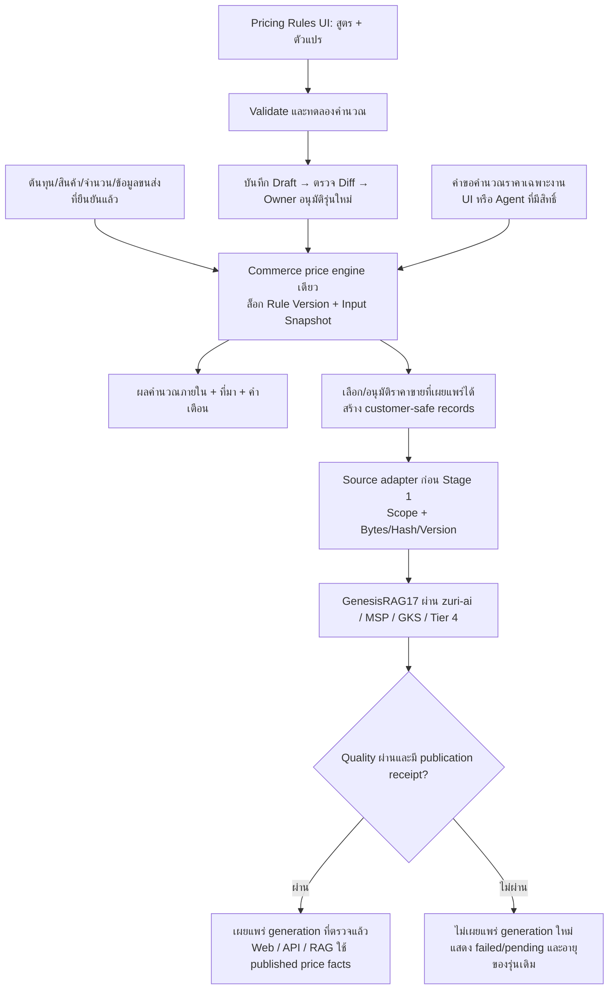

Approved by Boss on 2026-09-17 in the implementation task. ADR-097 and FR-252 carry this contract in the owner repository. Historical proposal wording below records the approved scope.

# Price engine + หน้าจัดการสูตร/ตัวแปร + GenesisRAG17

## 1. สิ่งที่บอสขอและสถานะ

รวม price engine เดิมเข้ากับงานรวม catalog/ราคา และทำหน้าให้ผู้มีสิทธิ์ใส่สูตร
หรือแก้ตัวแปรคำนวณราคาได้ พร้อมทดลองผลก่อนเปิดใช้จริง

เอกสารนี้เป็นรายละเอียดเพิ่มเติมเพื่อทบทวนก่อนเขียนโค้ด ไม่ใช่การประกาศว่า
engine, หน้า UI หรือ production integration เสร็จแล้ว

ใช้แผนเดิมที่อนุมัติวันที่ 2026-09-13 เป็นฐาน:

- `TASK-ZAI-052`: ADR, FR/FEAT และ registry declarations ที่ต้องทำให้ครบก่อน code
- `TASK-ZAI-055`: PricingRuleSet และ `/commerce/pricing-rules`
- `TASK-ZAI-056`: price engine กลางและการเชื่อม FR-181
- `TASK-ZAI-059`: structured sell-side records สำหรับ Knowledge

ไม่สร้างเลข FR/ADR ซ้ำ ไม่เปลี่ยนสถานะ roadmap จาก planned เป็น done
โดยอาศัยเอกสารฉบับนี้ และไม่ขยายเป็นการ implement Quote/LINE/Procurement ทั้งโปรแกรม
ในรอบเดียว Dependencies ของต้นทุนต้องใช้สัญญาที่มีหรือแสดง BLOCKED/MISSING_INPUT

## 2. หลักฐานและข้อขัดแย้งที่ต้องแก้ในเอกสารเจ้าของ

### Parent

1. `C:/Users/pc/workspace/zuri-ai/docs/change-requests/ZAI-PROPOSAL-SMARTGIFT-COST-QUOTE-ENGINE-20260913.md`
   มีสถานะ approved และบันทึกว่า owner ยอมรับเก้าข้อแล้ว แต่ระบุด้วยว่าตัว proposal
   ไม่ได้ประกาศ requirement/decision record แทน output ของ TASK-ZAI-052
2. `C:/Users/pc/workspace/zuri-ai/docs/domains/commerce/CHARTER.md`
   Commerce เป็น Business-scoped domain และครอบครอง route tree `/commerce`
3. `C:/Users/pc/workspace/zuri-ai/docs/decisions/ADR-075-SMARTGIFT-CATALOG-ENTERS-VIA-17-STAGE-SOURCE-ADAPTER.md`
   D2 รับ structured source ก่อน Stage 1; D3 คง source producer; D9 ระบุ pricing
   logic อยู่ SmartGift และ structured adapter ส่ง facts ไม่ใช่ engine
4. `docs/ADR-GKS-GENESISRAG17.md` กำหนด GKS เป็น knowledge/quality authority;
   GKS ไม่เรียก Commerce หรือ Tier 4 ออกไปเอง

### Peer / implementation evidence

- SmartGift `config/pricing_rules_formula.yaml` ปัจจุบัน v2026.09.11-v4
- `src/cascade_engine/pricing_calculator.py`, `price-boss/pricing.html` และ
  `pipeline/export_pricing_config.py` เป็นฐาน engine/ค่าคงที่/การ export config เดิม
- `pipeline/master_orchestrator.py` ไม่เรียก `export_pricelist_master.py`
- SmartGift ADR-002 แยก source projection กับ canonical products ที่ mapping ยังไม่ครบ
- SmartGift ADR-004 บังคับ customer-safe projection แยกจากต้นทุน/ข้อมูลภายใน
- `.agents/price/AGENT.md` กำหนด price taxonomy; ตัวเลขทางธุรกิจต้องยึด approved
  rules/ADR รุ่นปัจจุบัน ไม่ใช้ตัวอย่างใน persona เป็นค่าบังคับ

**ต้อง reconcile ก่อน implementation:** บันทึกข้อยกเว้น/การแทนที่ D9 เฉพาะการย้าย
execution authority ของราคาเข้า Commerce ตามข้อเสนอที่ owner อนุมัติแล้ว ให้ TASK-ZAI-052
อ้างอิงและปรับเอกสารเดิมอย่างชัดเจน ไม่ตีความว่าการอนุมัติ adapter เท่ากับย้าย engine
เข้า GKS และไม่แก้ทะเบียน governance ของอีก repo ผ่านเอกสาร local นี้

### Findings ที่ต้อง reconcile ตอนย้าย engine (static evidence)

- Browser `price-boss/pricing.html:1362` คิด USD/THB จาก `fx * 6.5` ขณะที่ YAML
  `:21-26` กำหนด USD rate แยกต่างหาก จึงต้องทำ parity ด้วย inputs ที่ล็อกเดียวกัน
  ไม่ยืนยันว่าทั้งสอง engine ให้ผลเท่ากันจากการอ่าน config เพียงอย่างเดียว
- YAML มี `profit_floors_by_kind` แต่ exporter และ Python `get_floor_profit`
  อ่าน quantity floors; UI ใหม่ต้องไม่แสดงตัวแปรเป็นใช้งานได้หาก evaluator ยังไม่รองรับ
- Browser ปัจจุบันเป็นเครื่องคำนวณต่อรายการและโหลด generated config; ยังไม่พบ
  rule-write/approval workflow ในหน้าที่ตรวจ จึงต้องเพิ่ม persistence และ lifecycle
  ตาม TASK-ZAI-055 ไม่ใช่เพียงเพิ่ม input ในหน้าเดิม
- Legacy Python อนุญาต config/default fallback; approved runtime ใหม่ต้องแจ้ง
  invalid/missing active policy และหยุด publishable calculation ไม่ fallback เงียบ
- ความต่างของ legacy behavior กับ approved policy ต้องแยก intentional-change fixtures
  จาก parity fixtures และทบทวนก่อนเปิดใช้; ไม่คัดลอก bug เป็นราคาใหม่โดยอ้าง parity

## 3. Architecture decision ที่เสนอ

**หนึ่ง price engine ใน Commerce; หนึ่งเส้นทางเผยแพร่ความรู้ผ่าน GenesisRAG17**

การรวม pipeline หมายถึง dependency และ version lineage ชุดเดียวกัน ไม่ได้หมายถึง
ย้ายทุกขั้นตอนธุรกิจเข้า Stage 1–17 หรือเปลี่ยนความหมาย stage ที่ประกาศแล้ว

| Owner | หน้าที่ |
|---|---|
| Procurement / Inventory | แหล่งต้นทุนที่ยืนยันแล้ว, FX ที่ล็อกกับ cost sheet, quantity breaks และ carton facts ตาม contract เดิม |
| Commerce | สูตร, PricingRuleSet versions, deterministic calculation, preview และอนุมัติใช้งานสูตร |
| zuri-ai Knowledge | รับ sell-side artifact ก่อน Stage 1, scope, freeze bytes/hash/version, orchestrate ingestion และ publication |
| MSP | scope/authentication และ relay ไปยัง GKS |
| GKS | Stage 9–14 decisions และ Stage 17 quality verdict; ไม่เป็น pricing executor |
| Tier 4 worker | graph/embedding/index physical writes และ receipts ตามสัญญาเดิม |

ราคาสินค้าที่รับมาจาก FlowAccount/Catalog เป็น observed source price ต้องคงที่มาและชนิด
ส่วนราคาที่ engine คำนวณเป็น computed price ต้องระบุ rule version/input snapshot
ห้ามเขียนทับประวัติ source price หรือเลื่อน computed price เป็น approved sell price อัตโนมัติ

## 4. Flow ที่เสนอ



การคำนวณเฉพาะงานเป็น Commerce request ไม่ใช่การ re-ingest 17 stages ทุกครั้ง
การเปลี่ยนสูตรไม่บังคับเผยแพร่ RAG ทันที: สร้าง candidate artifact ใหม่สำหรับ catalog
ที่ได้รับผลกระทบ แล้วผ่าน gate เดิม ห้าม RAG ใช้สูตรร่างหรือเดาราคาจากข้อความ

แผน cutover ต้องคง ADR-075 D8: shadow comparison และ fallback window ที่อนุมัติไว้
ไม่ลบ legacy writer/Edge path ทันทีจากการอนุมัติ UI นี้

## 5. หน้า `/commerce/pricing-rules`

### Wireframe สำหรับ review (ยังไม่ใช่หน้าที่ implement แล้ว)

```text
Commerce / สูตรคำนวณราคา                 Business: [ที่เลือกและมีสิทธิ์]
ชุดสูตร [ชื่อ]  รุ่น [vN]  สถานะ [Draft/Approved]  มีผล [วันเวลา]

[สูตร] [ตัวแปร] [ทดลองคำนวณ] [เปรียบเทียบและประวัติ]

สูตร
  ขั้นคำนวณ [Landed cost / Ladder / Profit floor / Final price]
  นิพจน์    [ช่องพิมพ์สูตร + ปุ่มแทรกตัวแปร/ฟังก์ชัน]
  ผลลัพธ์   [หน่วยและชนิดที่คาดหวัง]
  ตรวจสูตร  [ผ่าน / จุดผิดและเหตุผลภาษาไทย]
  ตัวแปรที่อ้างอิง [ชื่อ | ค่า | หน่วย | ที่มา | วันที่มีผล]

ทดลองคำนวณ
  สินค้า [ ]  จำนวน [ ]  Profile [ ]  งานสกรีน [ ]  ขนส่ง [ ]
  รุ่นที่ใช้งานจริง | รุ่นร่าง | ส่วนต่าง
  Cost breakdown → Ladder → Floor → Final price
  ราคาตามจำนวน | ตัวกำหนดราคา | คำเตือน/ข้อมูลที่ขาด

[บันทึกร่าง] [ทดลอง] [ดูความต่าง] [อนุมัติรุ่นและตั้งวันมีผล]
```

ปุ่มอนุมัติแสดงเฉพาะ Business OWNER ตาม TASK-ZAI-055; backend บังคับสิทธิ์ด้วย
การโหลด business จาก context ที่ยืนยันแล้ว ไม่เชื่อ Business ID จาก form อย่างเดียว
ไม่สร้าง role ใหม่โดยเดา การอนุญาต editor role อื่นต้องใช้ policy ที่ตรวจใน implementation
และอนุมัติไว้แล้ว

### กลุ่มตัวแปร

| กลุ่ม | รายการแก้ไข/ตรวจดู |
|---|---|
| FX | ค่า rate ตั้งต้น USD/CNY, ที่มาและวันที่มีผล; cost sheet ที่ล็อกแล้วไม่ถูกแก้ย้อนหลัง |
| ขนส่งเข้า | warehouse/mode/goods type/member tier, CBM/kg rate, density switch, inland basis |
| งานปรับแต่ง | logo method, setup/run rate, positions/colours และ quantity break |
| Ladder | standard/corporate profile, FACTORY/LANDED basis, anchor quantity, markup/factors |
| Profit floor | ตารางตามจำนวน/ชนิด, order costs; แยก floor กับ target ให้ชัด |
| ส่งในประเทศ | รูปแบบส่งและอัตรา พร้อม provenance ตามแผนเดิม |
| Rounding | rounding step และ policy ที่อนุญาต; document VAT ใช้ FR-186 ไม่สร้างสูตร VAT อีกชุด |

ค่าตั้งต้นนำเข้าจาก version ที่อนุมัติแล้ว ไม่พิมพ์ขึ้นใหม่จากความจำ
ค่า `code_only`/`undocumented` หรือ fallback ต้องเห็นสถานะก่อนใช้
แยกค่าที่ตั้งเป็น business policy ออกจากค่าที่ override เฉพาะการทดลอง/ใบเสนอราคา
และแสดง block ที่ยังไม่รองรับเป็น disabled พร้อมเหตุผล ไม่ทำ control ที่กดแล้วไม่มีผล

## 6. การใส่สูตรจริงและข้อจำกัด

รองรับการเปลี่ยนนิพจน์ ไม่ใช่แค่เปลี่ยนค่าตัวแปร แต่จำกัดให้เป็นสูตรคำนวณราคา:

- editor ใช้ variable registry ที่มี type, unit, currency และ precision ชัดเจน
- grammar รองรับ numeric literals, variable references, วงเล็บ, `+ - * /`,
  `min`, `max`, `ceilToStep` และการเลือก quantity band ที่ประกาศไว้
- ใช้ parsed AST ที่ validate ฝั่ง server; ไม่ใช้ JavaScript/Python `eval` หรือ arbitrary code
- ไม่อนุญาต I/O, network, file access, loops, dynamic member access หรือฟังก์ชันจากผู้ใช้
- unknown variable, cycle, currency/unit mismatch, division by zero, non-finite value,
  expression size/depth เกินเพดาน และ negative/zero quantity ต้องถูกปฏิเสธพร้อมเหตุผล
- DAG ของ calculation steps กำหนดลำดับแน่นอน; สูตรส่วนหนึ่งอ้างผลของขั้นก่อนหน้าได้
  แต่ห้ามอ้างข้ามกลับจนเป็นวงจร
- เงินผลลัพธ์เป็น integer satang; FX/ratio ใช้ exact decimal/rational representation
  กับ rounding points ที่ระบุ ห้ามปล่อย floating-point ambiguity กำหนดราคาขาย
- สูตรไม่สามารถข้าม mandatory price floor, authorization, publication หรือ privacy gate
- preview และ runtime ใช้ server evaluator ตัวเดียวกัน; UI ไม่คำนวณ authoritative ราคาเอง

syntax/canonical AST/schema version ต้องตรึงใน contract ของ TASK-ZAI-055/056 ก่อน code
รายละเอียด parser เป็นข้อเสนอเพิ่มจาก baseline parameter editor จึงต้อง review รอบนี้

## 7. Version และผลกระทบการเปลี่ยนสูตร

- Draft แก้ไขได้พร้อม concurrency revision check; stale save ต้องแสดง conflict
- Approved version immutable; เปลี่ยนสูตร/ตัวแปรต้องสร้าง Draft รุ่นใหม่
- ก่อนอนุมัติแสดง expression/variable diff, ผลคำนวณก่อน–หลัง และสินค้า/tiers
  ที่ได้รับผลกระทบ โดยใช้ input snapshot เดียวกันเปรียบเทียบ
- การอนุมัติบันทึก Business, ผู้อนุมัติ, เวลา, effectiveFrom และเหตุผล
- แต่ละผลคำนวณ pin ruleSetId/version, evaluatorVersion, input hash, source cost refs,
  breakdown, price driver, warnings และ calculation time
- Quote/ผลคำนวณเดิมไม่เปลี่ยนย้อนหลังเมื่ออนุมัติสูตรใหม่
- catalog artifact มี lineage ของ rule/input ภายใน; public allowlist ส่งเฉพาะ
  ข้อมูลราคาขายและข้อมูลรุ่นที่อนุญาต ไม่เผย cost, margin, floor หรือ internal provenance
- สูตร active, catalog candidate และ published generation เป็นคนละสถานะ ต้องแสดง
  pending/failed/expired อย่างตรงไปตรงมา ไม่อ้างว่าราคาที่คำนวณใหม่ขึ้น RAG แล้ว
- ถ้ารุ่นเดิมหมดอายุหรือถูกถอนสิทธิ์ ต้องหยุดเสนอราคาเดิม แม้รุ่นใหม่ยัง publish ไม่สำเร็จ
- การย้อนกลับใช้ revision ใหม่อ้างอิงสูตรเดิม; ไม่แก้ immutable history หรือข้าม gate

## 8. ขอบเขต implementation และ dependency

1. **TASK-ZAI-052 / Documentation:** reconcile ownership, declare exact FR/FEAT and
   ledger entries ด้วย governance ของ zuri-ai; GKS/MSP/Tier4 contract review เฉพาะกรณี
   sell-side payload ต้องขยายจริง ไม่เปลี่ยน stage IDs
2. **TASK-ZAI-055 / Rules:** import approved YAML, version storage and authorization,
   editor + variable groups + syntax validation + preview + diff + activation
3. **TASK-ZAI-056 / Engine:** shared deterministic evaluator, legacy parity evidence,
   integrate existing quote tool โดยคง scope/authorization; retire duplicate constants
   เฉพาะ caller ที่ย้ายและผ่าน acceptance แล้ว
4. **TASK-ZAI-059 / Knowledge:** allowlisted sell-side source artifact, lineage,
   admission ก่อน Stage 1, receipt-based publication and visible integration status

UI route และ backend execution เป็น zuri-ai Commerce implementation; source adapter
เป็น Knowledge implementation; SmartGift เป็น source/compatibility package ตาม migration
decision. เอกสารนี้อยู่ใน GKS workspace เพื่อ review เท่านั้น ไม่ย้าย ownership มาที่ GKS

## 9. Acceptance / success / exit criteria

สถานะ ณ วันที่เสนอเอกสาร: **PLANNED / NOT_RUN**. ผล implementation และการตรวจจริงให้ยึด [phase report](../../../../.brain/reports/fr252-pricing-engine.md) ซึ่งแยก local evidence ออกจาก production.

| ID | เกณฑ์ที่ต้องพิสูจน์ |
|---|---|
| AC-01 | import YAML ได้ทุก required block พร้อม provenance; unknown/malformed fields fail closed |
| AC-02 | ผู้ใช้ที่มีสิทธิ์พิมพ์สูตรและแก้ตัวแปรได้; syntax/unit/cycle/divide-by-zero มี error ตรง field |
| AC-03 | สูตรอันตรายหรือ expression เกินเพดานถูกปฏิเสธก่อน evaluation และไม่เกิด side effect |
| AC-04 | preview กับ runtime ให้ผลสตางค์เดียวกัน เมื่อ rule version/input เดียวกัน |
| AC-05 | parity fixtures เทียบ Python/JS เดิมครบ quantity breaks, freight branches, logo และ rounding boundaries; intentional differences มีเอกสารอนุมัติ |
| AC-06 | OWNER activation สร้าง immutable version; cross-Business access และ unauthorized activation ถูกปฏิเสธ |
| AC-07 | concurrent edits ไม่ overwrite เงียบ; quote เดิม pin รุ่นเดิมแม้สูตร active เปลี่ยน |
| AC-08 | floor/rounding/warning ทำงานตาม approved rules; missing inputs ไม่แปลงเป็นศูนย์หรือแต่งราคา |
| AC-09 | sell-side artifact ไม่รั่ว cost/margin/internal evidence และ source-price history ไม่ถูก overwrite |
| AC-10 | run จริงที่ได้รับอนุญาตเข้าก่อน Stage 1 จนครบ Stage 17/publication receipt; retry ไม่สร้างผลซ้ำ; failed generation ไม่ถูกเปิดใช้ |
| AC-11 | UI เห็น applied rule version, preview diff, approval/effective time และสถานะ catalog publication แยกชัด |
| AC-12 | expiry/revocation ห้ามใช้ราคาเก่า; Agent ไม่ใช้ draft formula หรือคำนวณราคา authoritative เอง |
| AC-13 | ทุก field ที่เปิดให้แก้มี test ว่ากระทบ calculation ตาม contract; unsupported blocks ไม่เปิดแก้ และ missing/invalid active rule ไม่ fallback เงียบ |

Success: สูตร/ตัวแปรแก้จากหน้าเดียว, runtime ใช้ engine เดียว, ผลราคาและ published
knowledge trace กลับไปยังสูตรและ input รุ่นที่ใช้ได้โดยไม่เปิดเผยข้อมูลภายใน

Exit: parent/peer documents aligned, governance declarations complete, tests ที่เกี่ยวข้อง
ผ่านพร้อม browser verification ของ editor, cross-repo contract evidence ผ่าน และไม่มี known
regression ใน scope. Local/static evidence ไม่แทน production activation; migration/deploy
เป็น operator step แยกตาม ADR-057/075

## 10. Approval scope

เก้าข้อที่ owner อนุมัติเมื่อ 2026-09-13 คงเดิม ไม่ขออนุมัติซ้ำ
ขอ review เฉพาะรายละเอียดเพิ่ม: safe expression editor, variable/preview UX,
version/activation semantics และการเชื่อม Commerce sell-side output เข้า 17-stage ตามนี้
หลังอนุมัติจึงทำ governing documentation ใน owner repositories และ implementation slices

## 11. Implemented boundary and operator contract

- `/commerce/pricing-rules` is the Business-scoped OWNER console. Draft edits use revision checks; approval freezes a version. Simulation compares the same inputs across all declared quantity tiers using the shared server evaluator.
- Catalog submission uses Inventory receipt costs, not simulation inputs. Receipt costs are already landed costs, including inbound freight. The ledger path defaults additional delivery cost to zero; an explicit legacy delivery override is separately identified and warned. Missing receipt cost fails closed.
- `POST /api/commerce/pricing-rules/catalog` requires Business, product, expected active rule ID/version, quantity breaks, reason and idempotency key. `previewOnly: true` returns exact sell prices and `previewHash` without writes. Confirmation requires that hash; changed ledger or rule returns 409 and requires review again. A frozen idempotent retry preserves the original approved bytes.
- The public projection uses a stable `commerce-sku:<id>` identity for both ProductMaster code and externalId; the Inventory SKU is preserved in the display name. Only public product/sell-price fields enter `SMARTGIFT_CATALOG_V1` before Stage 1. Costs, margin, formula and private calculation lineage remain in Commerce.
- Confirmation returns `ADMITTED` with `publicationStatus: NOT_VERIFIED`; it does not imply Stage 17 publication. Existing Knowledge receipt and query gates verify publication. Current effective policy is rechecked at admission, publication and disclosure so expired/revoked/superseded computed prices cannot remain authoritative.
- Additive SQLite/Postgres migrations and scoped backup/restore support are included. Production migration, policy activation, live source cutover and deployment are separate operator actions and have not run in this task.

## Version diff / CHANGELOG

New document → `0.1.0b`: เพิ่มรายละเอียดสูตร/ตัวแปรและ UI บน TASK-ZAI-055/056 เดิม,
ระบุ TASK-ZAI-059 integration และ ownership reconciliation โดยไม่เปลี่ยน stage meanings

| Version | Date | Status | Summary | Commit Hash | Agent |
|---------|------|--------|---------|-------------|-------|
| 1.0.0b | 2026-09-17 | accepted | Approved implementation, ledger price review/confirmation and local evidence boundary | uncommitted | RWANG |
| 0.1.0b | 2026-09-17 | candidate | Price engine, formula editor and governed Knowledge publication spec | uncommitted | RWANG |
