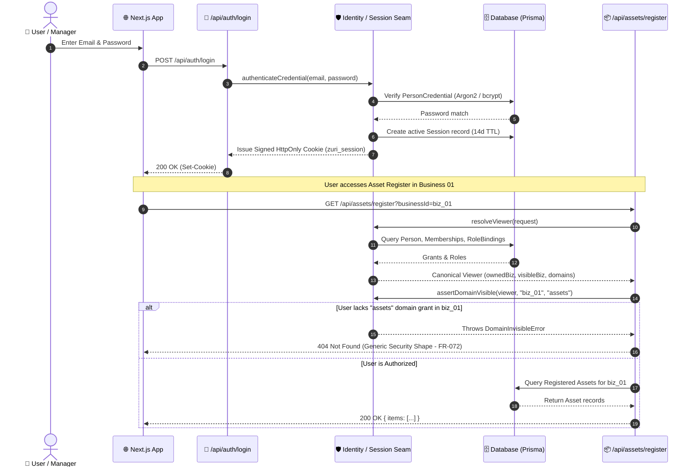
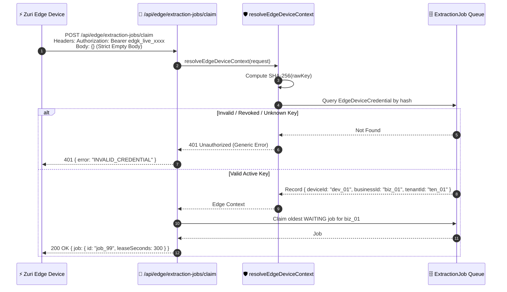
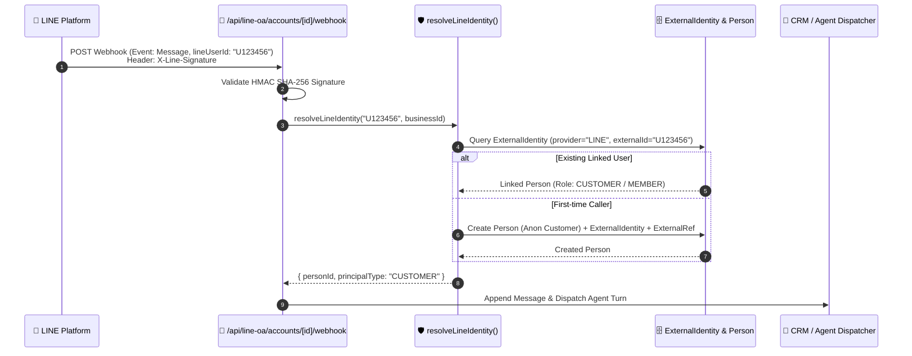

# Identity Domain — System Diagram & Architecture Specification

| Field | Value |
|---|---|
| **Domain** | `identity` (`DOM-IDENTITY`) |
| **Module** | `src/modules/identity` |
| **Authority** | Principal Resolution, Authentication Seams, Multi-Tenant PDP/PEP, Credential Isolation, PDPA Erasure |
| **Key Directives** | BR-001, BR-002, BR-016, SEC-001, SEC-005, SEC-014, SEC-023, SEC-025, ADR-017, ADR-027, ADR-041, ADR-047, ADR-052, ADR-059 |

---

## 1. High-Level System Architecture

```mermaid
flowchart TB
    %% Ingress Clients & Entry Surfaces
    subgraph INGRESS["1. Entry Surfaces & Principal Ingress"]
        direction TB
        C_WEB["🌐 Browser Web Client<br/><i>(Next.js App / Console)</i><br/><code>Cookie: zuri_session</code>"]
        C_LINE["💬 LINE Messaging API / OA<br/><i>(End Users / Customers)</i><br/><code>X-Line-Signature / Webhook</code>"]
        C_API["🏢 Enterprise System<br/><i>(ERP / Third-party)</i><br/><code>Bearer: apik_... (Tenant)</code>"]
        C_SOT["🔄 SoT Data Plane<br/><i>(External Workers)</i><br/><code>Bearer: sdpk_... (Tenant)</code>"]
        C_PLUGIN["🔌 Codex / Claude Plugin<br/><i>(Local Developer Tools)</i><br/><code>Bearer: plgk_... (Person)</code>"]
        C_EDGE["⚡ Zuri Edge Device<br/><i>(On-Premise Machine)</i><br/><code>Bearer: edgk_... (Business)</code>"]
    end

    %% Identity & Authentication Seam
    subgraph AUTH_LAYER["2. Identity Resolution & Authentication Seam"]
        direction TB
        R_SESSION["<b>Session Seam</b><br/><code>resolveSession()</code><br/><i>Cookie → Person + Session</i>"]
        R_LINE["<b>Line Identity Resolver</b><br/><code>resolveLineIdentity()</code><br/><i>lineUserId → ExternalIdentity</i>"]
        R_APIKEY["<b>API Key Resolver</b><br/><code>resolveApiAccessViewer()</code><br/><i>SHA-256 Check → Tenant Scope</i>"]
        R_SOTKEY["<b>SoT Key Resolver</b><br/><code>resolveSotDataPlaneViewer()</code><br/><i>SHA-256 Check → SoT Scope</i>"]
        R_PLUGIN["<b>Plugin Auth Service</b><br/><code>plugin-auth-service.js</code><br/><i>OAuth PKCE + Consent → Viewer</i>"]
        R_EDGE["<b>Edge Device Resolver</b><br/><code>resolveEdgeDeviceContext()</code><br/><i>SHA-256 Check → Business Scope</i>"]
    end

    %% PDP & Authorization Engine
    subgraph PDP_LAYER["3. Policy Decision & Context Engine (PDP/PEP)"]
        direction TB
        VIEWER_GEN["<b>Canonical Viewer Generator</b><br/><code>resolveViewer(personId)</code><br/>• userId, email, global role<br/>• ownedBusinessIds (Write authority)<br/>• visibleBusinessIds (Read visibility)<br/>• platformGrant (DEV/OPERATOR)"]
        
        DOMAIN_PEP["<b>Domain Visibility Gate</b><br/><code>assertDomainVisible(viewer, bizId, domain)</code><br/><i>(CRM, Market, Assets, PM)</i>"]
        
        SCOPE_PEP["<b>Scope Isolation Guard</b><br/><code>authorizeScope(viewer, targetScope)</code><br/><i>404-shaped Generic Refusals (FR-072)</i>"]
    end

    %% Domain Subsystems & Protected Workloads
    subgraph DOMAINS["4. Protected Domain Workloads & Execution"]
        direction TB
        D_PM["📊 Project Manager<br/><code>(Workspaces, Sprints)</code>"]
        D_CRM["👥 CRM & Customers<br/><code>(Conversations, Consent, Erasure)</code>"]
        D_ASSETS["📦 Asset Management<br/><code>(Intake, OCR, Lifecycle, QR)</code>"]
        D_EDGE_JOBS["⚙️ Edge Job Queue<br/><code>(Extraction, Sync, Heartbeat)</code>"]
    end

    %% Persistence & Security Store
    subgraph PERSISTENCE["5. Identity Persistence Models (SQLite / PostgreSQL)"]
        direction TB
        DB_PERSON[("👤 Person & PersonCredential<br/>PasswordResetToken, PlatformGrant")]
        DB_MEMBERSHIP[("🏢 Membership & RoleBinding<br/>(BusinessId, Role, DomainGrants)")]
        DB_WORKSPACE[("📁 AccessInvite & Membership<br/>(Collaboration boundary)")]
        DB_KEYS[("🔑 ApiAccessKey, SotDataPlaneKey,<br/>EdgeDeviceCredential, PluginSession<br/><i>(SHA-256 Digests only)</i>")]
        DB_EXT[("🔗 ExternalIdentity & ExternalRef<br/><i>(External IDs != Primary Keys)</i>")]
        DB_AUDIT[("📜 Immutable AuditEvent Log")]
    end

    %% Connections
    C_WEB --> R_SESSION
    C_LINE --> R_LINE
    C_API --> R_APIKEY
    C_SOT --> R_SOTKEY
    C_PLUGIN --> R_PLUGIN
    C_EDGE --> R_EDGE

    R_SESSION --> VIEWER_GEN
    R_LINE --> DB_EXT
    R_LINE --> VIEWER_GEN
    R_PLUGIN --> VIEWER_GEN
    
    VIEWER_GEN --> DB_PERSON
    VIEWER_GEN --> DB_MEMBERSHIP
    VIEWER_GEN --> DOMAIN_PEP
    VIEWER_GEN --> SCOPE_PEP

    R_APIKEY --> SCOPE_PEP
    R_SOTKEY --> SCOPE_PEP
    R_EDGE --> SCOPE_PEP

    R_APIKEY -.-> DB_KEYS
    R_SOTKEY -.-> DB_KEYS
    R_EDGE -.-> DB_KEYS
    R_SESSION -.-> DB_KEYS

    DOMAIN_PEP --> D_PM
    DOMAIN_PEP --> D_CRM
    DOMAIN_PEP --> D_ASSETS
    SCOPE_PEP --> D_EDGE_JOBS

    PDP_LAYER -.-> DB_AUDIT
```

---

## 2. Multi-Credential Separation Matrix

Per **ADR-047 D2** and **ADR-059 D2**, credentials cannot be reused across mismatched security boundaries. Leaking one credential never satisfies a check for another:

| Credential Type | Token Format / Seam | Bound Scope | Context Produced | Target Routes / Usage |
|---|---|---|---|---|
| **Human Browser Session** | `zuri_session` (Signed HttpOnly Cookie) | **Person** (across visible Businesses) | Full `Viewer` object (`ownedBusinessIds`, `domainGrants`) | Web App Console, Back-office navigation, settings |
| **Enterprise API Key** | `Bearer apik_...` | **Tenant-bound** | `isApiAccessFor(tenantId)` (No Person / DEV grant) | `POST /api/import/*`, `GET /api/resolve`, `GET /api/docs` |
| **SoT Data Plane Key** | `Bearer sdpk_...` | **Tenant-bound** | `isSotDataPlaneFor(tenantId)` (No Person) | `POST /api/platform/sot/decisions` & export |
| **Plugin Session** | `Bearer plgk_...` (15-min TTL) | **Person-Delegated** via PKCE + Consent | `Viewer` without `platformGrant: DEV` | IDE Tools, Codex MCP calls |
| **Edge Device Credential** | `Bearer edgk_...` | **Business-bound** (1 Device / 1 Business) | `{ deviceId, businessId, tenantId, credentialId }` | `/api/edge/*`, Heartbeat & Evidence extraction |

---

## 3. Core Interaction & Authentication Flows

### Flow A: Human Login & Viewer Resolution (`resolveViewer` + `assertDomainVisible`)

---

### Flow B: Zuri Edge Device Authentication (`edgk_...`)

---

### Flow C: External Channel Identity Resolution (LINE Webhook)

---

## 4. Non-Negotiable Invariants

1. **External IDs are Never Primary Keys (BR-002):**
   - External identifiers (`lineUserId`, `taxId`, `dbdNumber`, `deviceId`) are never used as internal primary keys. All entities use internal UUIDs + human-readable codes, mapped via `ExternalRef`.
2. **Generic 404-Shaped Refusal (FR-072 / SEC-001):**
   - When a principal attempts to access an invisible Business, missing domain grant, or nonexistent resource, the system returns `404 Not Found` rather than `403 Forbidden` to prevent resource enumeration attacks.
3. **Digest-Only Token Storage (SEC-025):**
   - All bearer credentials (`apik_`, `sdpk_`, `edgk_`, `plgk_`) and password reset tokens exist in plaintext only in the mint response and are persisted exclusively as SHA-256 hashes.
4. **PDPA One-Way Erasure Boundary (FR-022):**
   - `eraseCustomerPrincipal` (`POST /api/crm/customers/[id]/erasure`) requires explicit `confirmation: 'ERASE'`, executes in a single transaction, tombstoning `Message.body` and `RawExternalRecord` payloads permanently.
