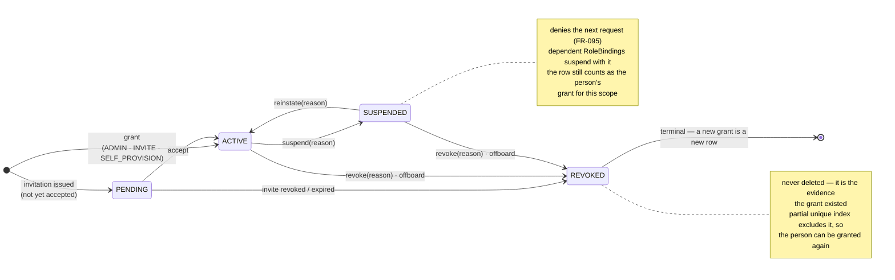
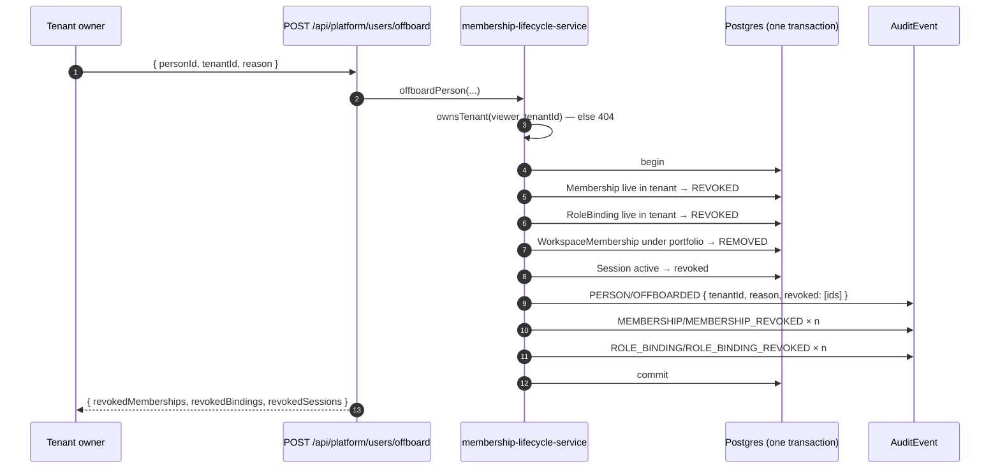
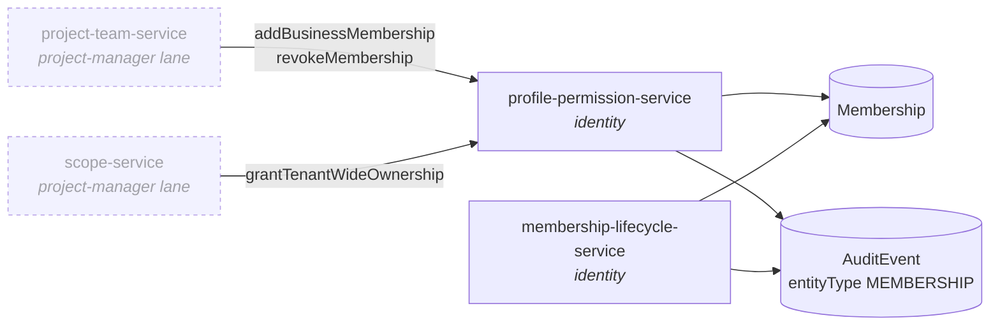

# FR-191 — Access grant lifecycle

| Field | Value |
|---|---|
| **Version** | 1.0.0 |
| **Status** | Declared (2026-09-12) — implemented by [ADR-077](../../../decisions/ADR-077-MEMBERSHIP-IS-A-GRANT-WITH-A-LIFECYCLE.md) D1/D2/D6/D8 |
| **Date** | 2026-09-12 |
| **Relates to** | ADR-077, ADR-045 (D3, D6), ADR-037, ADR-025 (D3), FR-038, FR-074, FR-095, FR-192, BR-016, BR-018, BR-020, BR-033, SEC-003, SEC-026, SDD-092, NFR-019, [RCA 2026-09-12](../../../../.brain/rca/2026-09-12-a-grant-that-cannot-be-withdrawn.md) |

## Intent

A `Membership` may be **withdrawn**, by a named person, for a stated reason,
without destroying the evidence that it existed.

Everything else in this note follows from that sentence. Before it, the product
could grant access and could not take it back: `membership.update` wrote only
`role` and `domainKeysJson`, `MEMBERSHIP_STATUSES` was never declared, and the
sole path that removed access was a hard delete in another domain lane.

## The grant

A row answers four questions, not one.

| Question | Column |
|---|---|
| who has access | `personId`, `scopeType`, `tenantId`, `businessId` |
| who gave it, and why | `grantedByPersonId`, `grantReason`, `grantSource` |
| until when | `expiresAt` |
| when and why it ended | `revokedAt`, `revokedByPersonId`, `revokeReason` |

Provenance lives on the row rather than only in the audit stream because an
access review asks "who gave this" of the *current* state, and because the audit
stream cannot answer it for rows that already exist — production holds twelve
grants and six `MEMBERSHIP_ADDED` events, the rest having been written by
services that audit under `PROJECT` and `BUSINESS` (ADR-077 D1, D8).

`grantSource` distinguishes how a grant came to exist, which is what makes a
null `grantedByPersonId` legible:

| Value | Meaning |
|---|---|
| `ADMIN` | an owner added the person directly (`addBusinessMembership`) |
| `INVITE` | the person accepted an invitation |
| `SELF_PROVISION` | FR-074(c) — the founder of a Business is its first owner |
| `SEED` | development and demo data |
| `MIGRATION` | existed before ADR-077; author unknown and unrecoverable |

## State machine

`resolveViewer` admits a grant only when `status = 'ACTIVE'` **and**
(`expiresAt IS NULL` or `expiresAt > now()`). Both conditions are recomputed per
request, so revocation takes effect on the next request without touching
sessions (NFR-019). `revokeAllSessions` is called as well, as a second measure
rather than the mechanism.

## Operations

All four live in `apps/server/src/modules/identity/membership-lifecycle-service.js`.
Authority is `ownsBusiness(viewer, businessId)` for a `BUSINESS`-scoped grant and
`ownsTenant(viewer, tenantId)` for a `TENANT`-scoped one — the second closes the
gap where the broadest grant in the system was the one no screen could
administer (ADR-077 D3).

| Operation | From → to | Cascade |
|---|---|---|
| `suspendMembership` | ACTIVE → SUSPENDED | dependent `RoleBinding` → SUSPENDED, tagged `cascadeOfMembershipId` |
| `reinstateMembership` | SUSPENDED → ACTIVE | only the bindings this membership suspended; one suspended in its own right stays suspended |
| `revokeMembership` | ACTIVE \| SUSPENDED → REVOKED | dependent `RoleBinding` → REVOKED |
| `offboardPerson` | every live grant in one Tenant → REVOKED | `RoleBinding`, `WorkspaceMembership` → REMOVED, all sessions revoked |

`reason` is mandatory on every one. A lifecycle event without a reason is a row
that an access review cannot act on, and the cost of typing one is the only
thing standing between "we removed their access" and "we removed their access
because they left on 3 September".

### Refusals

Ordered: authority first, then existence, then state. A caller who does not own
the scope cannot tell an existing grant from an absent one (SEC-001).

| Condition | Status | Code |
|---|---|---|
| viewer does not own the scope | 404 | *(shaped as "not found")* |
| membership id does not exist | 404 | *(same body)* |
| would leave the Business with no live OWNER | 409 | `LAST_OWNER` |
| already in the target state | 409 | `ALREADY_<STATE>` |
| reinstating a REVOKED grant | 409 | `REVOKED_IS_TERMINAL` |
| `reason` missing or blank | 400 | `REASON_REQUIRED` |

`LAST_OWNER` is the guard `revokeOperatorGrant` has held for the operator
capability since FR-107, applied to the authority that needed it more. A tenant
owner may override it explicitly; a business owner may not.

### Offboarding

Both shapes of audit event are written on purpose. The `PERSON/OFFBOARDED` row
answers "what happened to this person"; the per-grant rows answer "what happened
to this grant". An auditor asks the first and a debugger asks the second, and
deriving either from the other is work that neither should have to do.

## Erasure is downstream of offboarding, not a substitute for it

`erasePrincipal` refuses with 409 `PRINCIPAL_HAS_LIVE_GRANTS` while the
principal holds any non-revoked `Membership`, `RoleBinding` or `PlatformGrant`
in the tenant being erased (SEC-026, ADR-077 D6).

Before this, erasure *counted* memberships to decide whether to redact the
`Person` row and never ended one — so a staff member could be erased under PDPA
and keep owning four Businesses, still able to authenticate because
`authenticateUser` also matches on `Person.code`.

Having erasure revoke grants itself was rejected: it turns a data-subject
request into an administrative act with no named author, and buries the moment
authority ended inside an operation whose trail is deliberately redacted. Two
acts, two authors, two records.

Where erasure does proceed it now also deletes `PersonCredential` and sets
`Person.accessDisabledAt`, because a redacted person whose password still works
is not erased.

## One writer

`Membership` is written only from `apps/server/src/modules/identity/`. A
preflight ratchet enforces it (ADR-077 D8).

The dashed lanes previously wrote the table directly. `project-team-service`
additionally parsed `role` from the request body through `zMembershipRole`,
which includes `OWNER` — so the project team screen could mint a Business owner
and record it as `PROJECT/TEAM_MEMBER_ADDED`. `assertTeamWritable` gated it on
`ownsBusiness`, so it was never an escalation; it was the identity charter's
stated invariant being false through a second door. `zAddMember` drops the
field, and its `removeProjectTeamMember` hard delete becomes a revocation.

## Acceptance

| id | Statement |
|---|---|
| AC-191.1 | An owner suspends an ACTIVE membership with a reason; the next request from that person is denied, and their dependent role bindings are SUSPENDED |
| AC-191.2 | Reinstating restores the membership and only the bindings that this membership's suspension cascaded to |
| AC-191.3 | Revoking sets REVOKED and never deletes the row; the person can subsequently be granted the same scope again as a new row |
| AC-191.4 | Suspending or revoking the last live OWNER of a Business is refused 409 `LAST_OWNER`; a tenant owner may override, a business owner may not |
| AC-191.5 | Every lifecycle operation without a reason is refused 400 `REASON_REQUIRED` |
| AC-191.6 | A caller who does not own the scope receives the same 404 for an existing membership and a non-existent one |
| AC-191.7 | `offboardPerson` revokes every live grant in the tenant in one transaction and writes both a `PERSON/OFFBOARDED` event and per-grant events |
| AC-191.8 | `erasePrincipal` refuses 409 `PRINCIPAL_HAS_LIVE_GRANTS` while any live grant remains, and deletes the credential when it does proceed |
| AC-191.9 | `membership.create`, `.update` and `.delete` appear only under `src/modules/identity/`; a call elsewhere fails preflight |
| AC-191.10 | A membership past its `expiresAt` is denied by `resolveViewer` without any row being written |

## Not in this requirement

- **Setting `expiresAt` from a surface.** The column is written by the schema,
  read by the resolver, and set by nothing. It exists so that access
  recertification can be added later without a second migration against live
  authority data (ADR-077 Consequences).
- **Maker–checker on promotion to OWNER.** Named in the review as the next gap;
  it needs an approval record, which is its own requirement.
- **Merging `Membership` with `RoleBinding`.** ADR-077 Alternatives explains why
  this is the destination and not the next step.
- **Invitations at Business scope.** Separate requirement; the `PENDING` state
  in the machine above is where it will attach.
