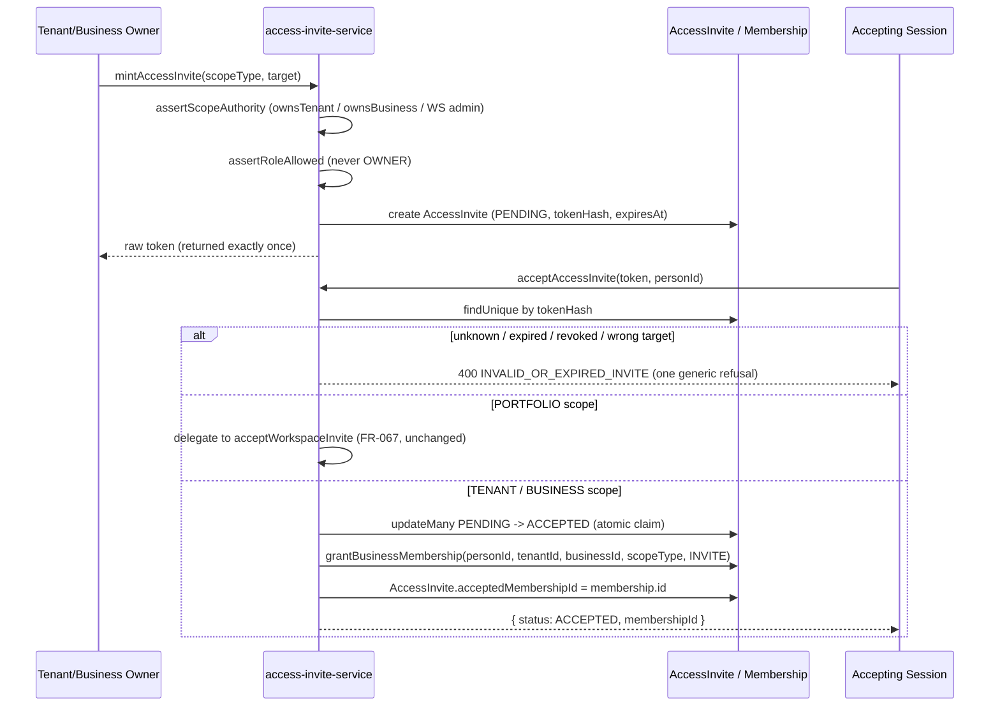

# FR-195 — AccessInvite: a scoped invitation that becomes a grant on acceptance

| Field | Value |
|---|---|
| **Version** | 1.0.0 |
| **Status** | Implemented locally 2026-09-12 — [ADR-079](../../../decisions/ADR-079-ACCESS-INVITE-SOD-AND-OPERATOR-LIFECYCLE.md) D1 |
| **Date** | 2026-09-12 |
| **Relates to** | ADR-079, ADR-077 D8, ADR-027 §D2/D6, FR-067, BR-016, SEC-014, SDD-094 |

## Intent

`WorkspaceInvite` (FR-067) is complete and correct at one authority layer —
Workspace (Portfolio) collaboration — and stops there. There has never been a
Business-level invitation: the only way anyone gains Business access is an
owner typing an exact code or email into `addBusinessMembership`, and the
grant is ACTIVE immediately. No pending state, no expiring token, no way to
invite a person who has no account yet.

`AccessInvite` generalises `WorkspaceInvite`'s table to cover all three
authority layers this installation has, rather than adding a second table
beside it. `WorkspaceInvite` and `WorkspaceMembership` held zero rows in
production on 2026-09-12, which is what makes this a pure DDL change.

## The three scopes

| Scope | Authority to mint | What acceptance creates |
|---|---|---|
| PORTFOLIO | `assertWorkspaceAdminAuthority` (unchanged FR-067) | a `WorkspaceMembership` — collaboration visibility only (BR-016) |
| TENANT | `ownsTenant` | a `Membership` with `scopeType: 'TENANT'`, `businessId: null` |
| BUSINESS | `ownsBusiness` | a `Membership` with `scopeType: 'BUSINESS'` |

Every refusal of authority is the same 404 an absent scope produces — a caller
can never learn a hidden Tenant or Business exists by probing this function.
`role: 'OWNER'` is refused at every scope; TENANT/BUSINESS scope additionally
refuses any role but `MEMBER`, because promotion to OWNER stays the separately
audited act the identity charter already claims it is.

TENANT/BUSINESS scope acceptance creates the `Membership` the one way a
`Membership` may be created — `grantBusinessMembership` (ADR-077 D8) — inside
the same transaction that claims the token, with `grantSource: 'INVITE'`. A
failure anywhere in that transaction (most commonly `MEMBERSHIP_ALREADY_EXISTS`
if the accepting person already holds a live grant at that scope) rolls the
token claim back too: the invite stays PENDING rather than being burned by a
grant that never landed.

## The accepting session, not the invited address

The Membership binds to `personId` — the trusted **session** presenting the
token — never resolved from `invitedEmail` or `invitedLineUserId`. Those two
fields only route the link to a person; they are never read at acceptance to
decide who receives the grant. `Person.email` carries a unique index on this
branch, but that does not make email a safe join key at the moment of
acceptance: whoever currently holds that address is not necessarily whoever is
completing the flow.

## Status vocabulary

`PENDING → ACCEPTED | DECLINED | REVOKED`. `DECLINED` is genuinely new —
`WorkspaceInvite` had no way for a targeted addressee to actively turn an
invite down, only to let it expire or have it revoked. `EXPIRED` remains
unpersisted: expiry is a fail-closed comparison against `expiresAt` at
acceptance/decline time, the same discipline FR-067 already uses.

## Acceptance criteria

| ID | Criterion |
|---|---|
| AC-195.1 | Minting at PORTFOLIO scope requires an ACTIVE OWNER `WorkspaceMembership` or ownership of a Tenant under it; refuses a non-admin with the same 404 an absent Workspace produces. |
| AC-195.2 | Minting at TENANT scope requires `ownsTenant`; at BUSINESS scope requires `ownsBusiness`, with the Tenant derived from the Business row. Both refuse a non-owner with 404. |
| AC-195.3 | `role: 'OWNER'` is refused 400 at every scope; TENANT/BUSINESS scope additionally refuses any role but `MEMBER`. |
| AC-195.4 | Acceptance is bound to the trusted session's `personId`; an invite addressed by `invitedEmail` to one account, accepted by a different session, still binds to the accepting session — never to whichever account holds that email. |
| AC-195.5 | Acceptance at TENANT/BUSINESS scope creates exactly one `Membership` via `grantBusinessMembership`, with `grantSource: 'INVITE'`, and records `acceptedMembershipId` on the invite. |
| AC-195.6 | Every failure mode at acceptance — unknown token, expired, revoked, wrong target, missing person — answers the same generic `INVALID_OR_EXPIRED_INVITE`, so a probe learns nothing about which guess was closer. |
| AC-195.7 | A targeted invite may be declined by its addressee; a declined invite cannot subsequently be accepted. |
| AC-195.8 | Revocation requires the same authority as minting, evaluated against the invite's own stored scope; a non-PENDING invite refuses revocation with 409. |
| AC-195.9 | PORTFOLIO-scope minting and acceptance behave identically to FR-067's `WorkspaceInvite` before this change — no regression to the Workspace collaboration flow. |

## Deliberately out of scope

- No route was wired for TENANT/BUSINESS-scope minting in this change; the
  service is complete and tested at the service layer. Wiring a route is
  routine plumbing that can follow without touching this contract.
- `invitedLineUserId` is stored and validated as an addressee but nothing yet
  resolves a LINE user id to a `Person` at acceptance time — that resolution
  belongs to whichever surface consumes it (a LINE-side accept flow), not to
  this generic service.
