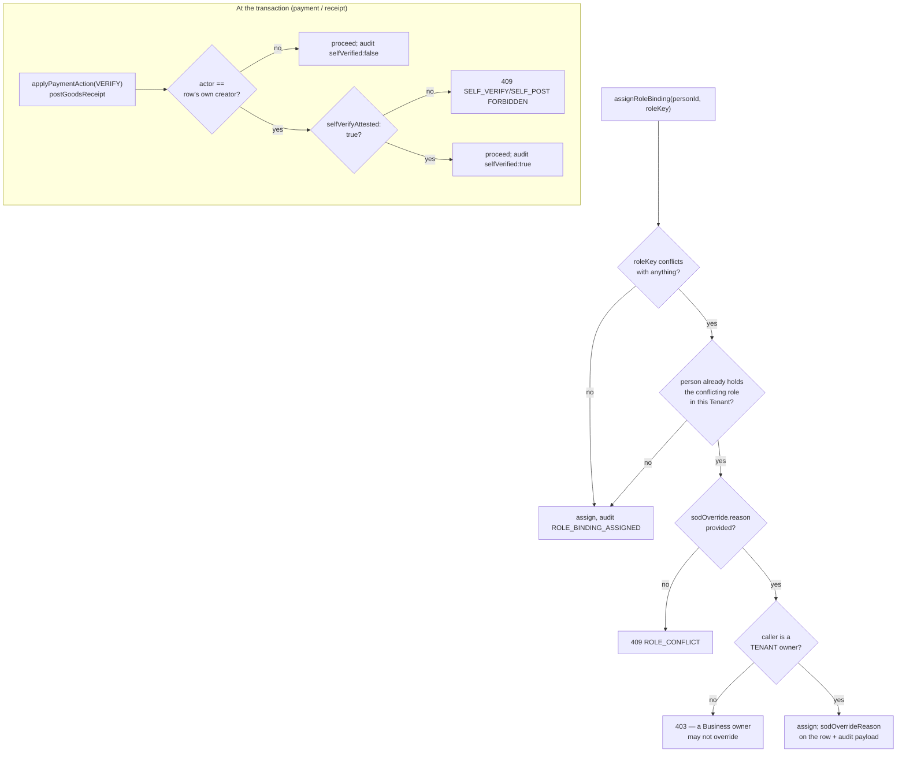

# FR-196 — Segregation of duties: role conflicts, and self-verification refused at the transaction

| Field | Value |
|---|---|
| **Version** | 1.0.0 |
| **Status** | Implemented locally 2026-09-12 — [ADR-079](../../../decisions/ADR-079-ACCESS-INVITE-SOD-AND-OPERATOR-LIFECYCLE.md) D2 |
| **Date** | 2026-09-12 |
| **Relates to** | ADR-079, ADR-065 D4, ADR-066 D4 (amended), BR-035, SEC-027, SDD-094 |

> **Placement note.** This feature spans identity (`rbac.js`'s `ROLE_CONFLICTS`
> and `assignRoleBinding`'s write-time refusal) and two other lanes' transaction
> code (`commerce/application/payment-service.js`,
> `procurement/application/goods-receipt-service.js`). It is filed under
> **identity** rather than commerce because its declaring mechanism —
> `ROLE_CONFLICTS`, the registry every future conflicting pair will be added
> to — is identity's own RBAC registry, and the two transaction-level refusals
> are call sites of the same idea rather than a second mechanism. A reader
> starting from "why can't this role hold both permissions" starts here.

## Intent

Two related gaps, one cause: nothing in this system asked "does granting this
role, to this person, let them complete a cycle alone that the design assumes
needs two people."

`ROLE_PERMISSIONS` was a frozen map with no conflict declarations, and
`assignRoleBinding` never looked at a person's other live bindings —
`PROCUREMENT_BUYER` held both `procurement.po.write` and
`procurement.receipt.post`, so three-way match (order / receive / pay, each by
a different person) was impossible by construction. Separately,
`payment-service.js` set `verifiedByPersonId` to the acting viewer and never
compared it against `createdByPersonId`, though both columns already existed —
so ADR-065's promise that revenue is counted only from VERIFIED payments rested
on an assumption the code never checked.

## Two controls, two different places

**A role-assignment control** (`rbac.js`, `rbac-service.js`): declares which
role *pairs* conflict, and refuses assigning one half to a person who already
holds the other, in the same Tenant.

**A transaction control** (`payment-service.js`, `goods-receipt-service.js`):
refuses one specific *instance* — this payment, this receipt — from being
confirmed by the same person who created it, independent of which roles they
hold. This is the one place a Business OWNER does not bypass every other
check: the rule is about needing two people to complete one cycle, not about
holding a permission, and an OWNER holds every permission by construction.

## Declared conflicts

| Pair | Why | ADR |
|---|---|---|
| `SALES_REP` / `PAYMENT_VERIFIER` | records money vs. confirms money | ADR-065 D4 |
| `PROCUREMENT_BUYER` / `GOODS_RECEIVER` | orders vs. receives | ADR-066 D4, amended by ADR-079 |

`PROCUREMENT_BUYER` no longer holds `procurement.receipt.post` — that
permission moved to the new `GOODS_RECEIVER` role. `PROCUREMENT_BUYER` keeps
`procurement.po.write` only. This is stated as an amendment to ADR-066 D4 in
ADR-079, not a silent edit: ADR-066 D4's Inventory-authority reasoning
(a receipt's ledger half needs Inventory's own write authority on top) is
unchanged and still applies on top of whichever of the two roles a person
holds.

## Acceptance criteria

| ID | Criterion |
|---|---|
| AC-196.1 | `assignRoleBinding` refuses 409 `ROLE_CONFLICT`, naming the conflicting role(s), when the assignee already holds the other half of a declared pair anywhere in the same Tenant. |
| AC-196.2 | The refusal lifts only for a caller who is a TENANT owner AND passes `sodOverride: { reason }`; a Business owner's attempt to pass the same override is refused 403. |
| AC-196.3 | An accepted override records `sodOverrideReason` on the `RoleBinding` row and `{ sodOverride: true, sodOverrideReason, conflictsWith }` in the audit payload. |
| AC-196.4 | `applyPaymentAction(VERIFY)` refuses 409 `PAYMENT_SELF_VERIFY_FORBIDDEN` when the verifier is the payment's `createdByPersonId` — including when the verifier is the Business OWNER. |
| AC-196.5 | `selfVerifyAttested: true` lifts the refusal and the resulting audit event carries `selfVerified: true`; every other successful VERIFY carries `selfVerified: false`. |
| AC-196.6 | `postGoodsReceipt` applies the identical shape (`GOODS_RECEIPT_SELF_POST_FORBIDDEN`, `selfVerifyAttested`, `selfVerified` in the audit payload) against the purchase order's `createdByPersonId`. |
| AC-196.7 | `PROCUREMENT_BUYER` and `GOODS_RECEIVER` are declared conflicting; `ROLE_PERMISSIONS[PROCUREMENT_BUYER]` no longer contains `procurement.receipt.post`. |
