# FR-197 — Operator access is time-boxed, issuable, and its use is recorded

| Field | Value |
|---|---|
| **Version** | 1.0.0 |
| **Status** | Implemented locally 2026-09-12 — [ADR-079](../../../decisions/ADR-079-ACCESS-INVITE-SOD-AND-OPERATOR-LIFECYCLE.md) D3 |
| **Date** | 2026-09-12 |
| **Relates to** | ADR-079, FR-075, FR-107, SEC-008, SEC-027, ADR-017 D6 (extended) |

## Intent

`bootstrapOperator`'s own comment said "every later grant must be issued by a
standing operator." That function did not exist: `platformGrant.create`
appeared in exactly two places, both inside `bootstrapOperator`, which refuses
outright whenever an ACTIVE OPERATOR grant already exists. This installation
could therefore have **one operator, forever** — if their credential was lost,
the only way back was hand-written SQL against production.

Two further gaps sat beside it. There was no `expiresAt` on a `PlatformGrant`
at all, so "operator" was a capability with no natural end. And the *use* of
operator power — reading `/api/audit`, previewing or restoring a
whole-installation backup — was not recorded anywhere, though ADR-017 D6 names
support-class access as something that "must be auditable."

## The lifecycle

```mermaid
stateDiagram-v2
    direction LR
    [*] --> Bootstrap: bootstrapOperator()<br/>(only when zero ACTIVE grants exist)
    Bootstrap --> Standing: standing = true<br/>no expiresAt

    Standing --> Issued: issueOperatorGrant(personId, reason, expiresAt)<br/>caller must already be a standing operator
    Issued --> Issued: renewal = a FRESH row;<br/>the prior ACTIVE grant is<br/>superseded (REVOKED) in the same tx

    Issued --> Expired: expiresAt passes<br/>(status stays ACTIVE — read-time check only)
    Issued --> Revoked: revokeOperatorGrant()<br/>(explicit act, refuses to strand<br/>the last ACTIVE operator)

    note right of Expired
        hasOperatorGrant() denies from here on
        the row itself is untouched — nothing
        flips status on a timer (NFR-019)
    end note
```

## Grant vs. use

Holding the capability and using it are two different facts, and only the
second was ever missing an audit trail. `assertOperatorAndRecordUse` checks
`isInstallationOperator` and, only on success, writes one `OPERATOR_ACTION`
audit event naming what was used — `AUDIT_READ`, `BACKUP_EXPORT`,
`BACKUP_PREVIEW`, `BACKUP_RESTORE`. A denied attempt writes nothing.

**Reading ADR-017 D6 as covering these two reads is a deliberate extension of
it, argued explicitly in ADR-079 D3** — D6 exempts ordinary successful reads
from audit noise but separately names "platform impersonation/support access"
as needing it; this decision reads an operator's installation-wide audit and
backup reads as sitting on that second side of D6's own line, which D6 itself
never enumerated.

## Acceptance criteria

| ID | Criterion |
|---|---|
| AC-197.1 | `issueOperatorGrant` requires the caller to already be `isInstallationOperator`; `reason` and `expiresAt` are both mandatory. |
| AC-197.2 | `expiresAt` must be in the future and no more than `OPERATOR_GRANT_MAX_DAYS` (90) ahead; both bounds are refused 400 with a distinct message. |
| AC-197.3 | `hasOperatorGrant` denies once `expiresAt` has passed, even though the row's `status` remains `ACTIVE` — nothing writes a status transition on a timer. |
| AC-197.4 | Issuing a grant to a Person who already holds an ACTIVE grant for the same capability supersedes (revokes, with its own `OPERATOR_GRANT_REVOKED` audit event, reason `SUPERSEDED_BY_RENEWAL`) the prior row in the same transaction, rather than updating it in place. |
| AC-197.5 | The bootstrap grant is flagged `standing: true` and carries no `expiresAt`; every grant `issueOperatorGrant` issues is `standing: false`. |
| AC-197.6 | `GET /api/audit`, `GET /api/backup/export`, and both entry points of `POST /api/backup/import` (preview and confirmed restore) each record exactly one `OPERATOR_ACTION` audit event per successful call; a denied attempt records none. |
| AC-197.7 | `PlatformGrant`'s uniqueness is scoped to `status = 'ACTIVE'`, not unconditional — a REVOKED or superseded grant does not block a fresh one for the same person and capability. |
