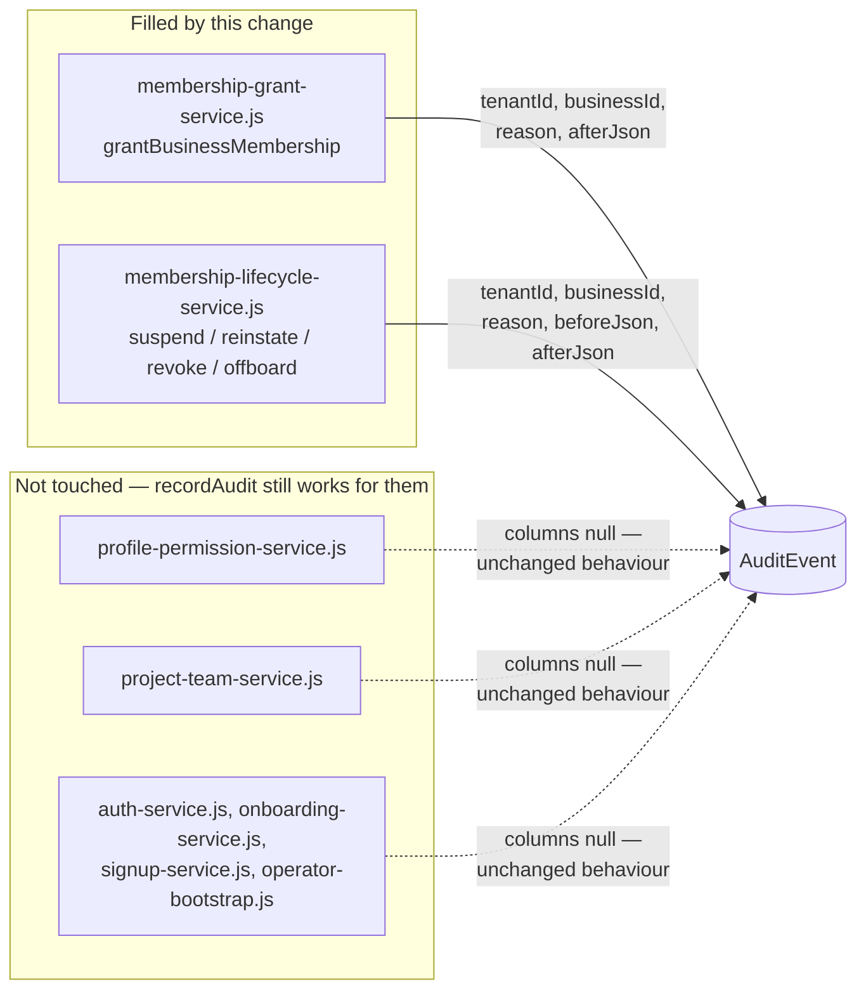

# FR-198 — Audit events carry their own scope and the change they made

| Field | Value |
|---|---|
| **Version** | 1.0.0 |
| **Status** | Declared and implemented (2026-09-12) — [ADR-080](../../../decisions/ADR-080-AUDIT-SCOPE-AND-ACCESS-EVIDENCE.md) D1/D2 |
| **Date** | 2026-09-12 |
| **Relates to** | ADR-080, ADR-077, FR-014, FR-191, FR-192, FR-199, BR-036, SEC-003, SDD-095 |

## Intent

An `AuditEvent` row states where a mutation happened and what it changed, as
columns a query can filter on — not only as free-form fields inside
`payloadJson` for the writers that happened to put them there.

## The defect

`AuditEvent` carries `entityType`, `entityId`, `action`, `payloadJson`,
`actorType`, `actorId`, `occurredAt`. No `tenantId`. No `businessId`. No
`reason`. No before/after as columns. Scope sometimes appears inside
`payloadJson`, and sometimes does not, depending on which writer produced the
row — which means "what happened in this Business last quarter" cannot be
answered by a query. It needs a full-table scan and a JSON parse that only
works for the rows whose writer thought to include scope.

Measured against this database on 2026-09-12 (read-only query, verified before
citing): 12 `Membership` rows against 6 `MEMBERSHIP_ADDED` events, and
`ROLE_BINDING_ASSIGNED` 2 / `ROLE_BINDING_REVOKED` 1 against exactly 1
surviving `RoleBinding` row — one binding disappeared with no event explaining
it.

## The columns

Seven, all nullable:

| Column | Meaning |
|---|---|
| `tenantId` | the Tenant the mutation happened in |
| `businessId` | the Business the mutation happened in, if any |
| `reason` | lifted out of `payloadJson` onto a column an access review can filter and group on |
| `beforeJson` | the state before the change, as a JSON string |
| `afterJson` | the state after the change, as a JSON string |
| `requestId` | correlation with the HTTP request, unused today |
| `sessionId` | correlation with the session, unused today |

Nullable, and every `recordAudit` parameter that fills them is optional — this
is the shape that makes the change safe. Every existing caller of `recordAudit`
across every domain keeps compiling and keeps writing the same row it always
wrote; nothing is required to know these columns exist. `docs/decisions/ADR-080-AUDIT-SCOPE-AND-ACCESS-EVIDENCE.md`
D1 states the argument in full, including why the alternative — a required
column with a migration-time backfill — was rejected: it would mean *writing*
history under SEC-003's append-only rule, not recording it, exactly the
inference ADR-077's own migration refused to make for `domainKeysJson`.

`actorId` stays a UUID; it does not become a name or a code. It is stable
across a rename and across PDPA redaction, neither of which a code or a display
name is. Resolving it to `{ id, code, displayName }` is a read-time join —
FR-199's job, not this column's.

## Who fills them

Two files, on purpose — the "small, contained set" this change's boundary
allows:

Retrofitting the unfilled callers is recorded as follow-up work in ADR-080's
Consequences, not performed here — this change's file boundary is the two
identity lifecycle services ADR-077 built, and going through the whole
repository to fill every caller would be exactly the blast radius three
parallel lanes editing this repository at once are meant to avoid.

## Acceptance

| id | Statement |
|---|---|
| AC-198.1 | `AuditEvent.tenantId`, `.businessId`, `.reason`, `.beforeJson`, `.afterJson`, `.requestId`, `.sessionId` are nullable columns, indexed by `(tenantId, occurredAt)`, `(businessId, occurredAt)`, `(actorId, occurredAt)` |
| AC-198.2 | `recordAudit` accepts all seven as optional parameters; a call that omits every one of them writes the identical row it wrote before this change |
| AC-198.3 | `grantBusinessMembership` writes `tenantId`, `businessId` and `reason` as columns on its `MEMBERSHIP_GRANTED`/`MEMBERSHIP_ADDED` event |
| AC-198.4 | `suspendMembership`, `reinstateMembership`, `revokeMembership` and `offboardPerson` write `tenantId`, `businessId` and `reason` as columns on every event they record, including the cascaded `ROLE_BINDING_*` events |
| AC-198.5 | No existing row is modified by the migration — it is additive-only, seven `ADD COLUMN` statements and three `CREATE INDEX` statements, with no precondition block and no backfill |
| AC-198.6 | `actorId` remains a plain UUID column with no new relation; nothing renders a name from this table directly |
