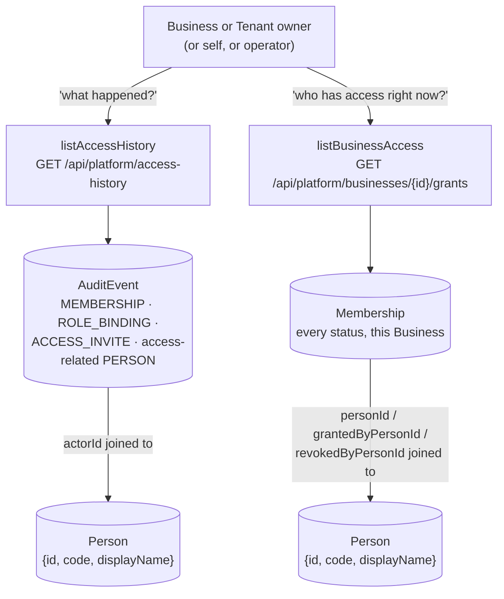
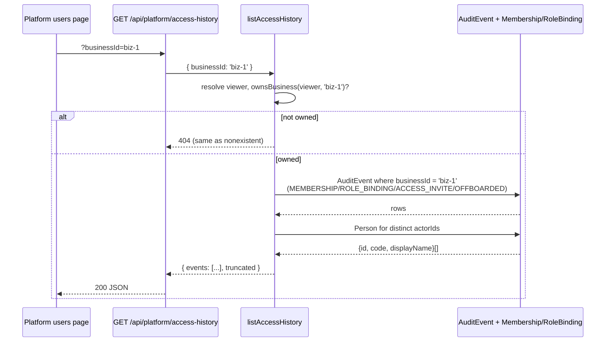

# FR-199 — A Business owner can read the access history of their own scope

| Field | Value |
|---|---|
| **Version** | 1.0.0 |
| **Status** | Declared and implemented (2026-09-12) — [ADR-080](../../../decisions/ADR-080-AUDIT-SCOPE-AND-ACCESS-EVIDENCE.md) D3/D4 |
| **Date** | 2026-09-12 |
| **Relates to** | ADR-080, ADR-077, FR-014, FR-038, FR-191, FR-198, BR-036, SEC-001, SEC-003, SDD-095 |

## Intent

An owner can see who was granted access to their own Business, when, and by
whom — the access review ADR-077's entire lifecycle design assumes is
possible, and which no surface could answer before this change.

## The defect

`GET /api/audit` requires `isInstallationOperator` and `listAudit` filters on
`entityType`/`entityId` alone. A Business OWNER cannot see their own roster's
history at all; the operator, who can read the stream, sees every tenant at
once, which is the wrong shape for "is this Business's roster still what it
should be".

## Two read models, two different questions

`listAccessHistory` is the event stream — what happened, in order, with a
`before`/`after` snapshot on each row where the writer recorded one.
`listBusinessAccess` is current state — the row `Membership` holds right now,
in every status, with its provenance. ADR-080 D4 states why these are not the
same query: reconstructing current state by replaying the whole event stream
would recompute what a column on `Membership` already answers directly.

## Scope and authority

`listAccessHistory` accepts **exactly one** of `businessId`, `tenantId`,
`personId`:

| Scope | Authority | Query strategy |
|---|---|---|
| `businessId` | `ownsBusiness`, or operator | `AuditEvent.businessId` column match |
| `tenantId` | `ownsTenant`, or operator | `AuditEvent.tenantId` column match |
| `personId` | the caller themself, or operator | `Membership`/`RoleBinding` rows for that person, joined to `AuditEvent.entityId` |

The person-scope path does not use a `personId` column on `AuditEvent` — there
isn't one (ADR-080 D3 explains why: a `Membership`'s `entityId` is the grant's
id, not the person's, and `Membership`/`RoleBinding` already carry `personId`,
so a redundant column would only be one more copy to keep in sync). It reads
those two tables' ids for the person first, then matches `AuditEvent.entityId`
against that set — a relational join standing in for a column that would
duplicate what the join already answers.

Refusal is 404-shaped, byte-identical for a scope the caller does not own and
one that does not exist — the same shape `membership-lifecycle-service.js`
already uses for a single grant (SEC-001).

`listBusinessAccess` accepts one `businessId` and needs `ownsBusiness` alone —
which already covers a tenant-wide owner, since `resolveViewer` expands a
TENANT-scoped OWNER grant into every Business's `ownedBusinessIds` (ADR-077).

## Routes

## What the UI shows

The platform users page (FR-038's surface) gains a read-only "Access history"
panel: pick a Business already visible to the viewer, load its current grants
(`listBusinessAccess`) and, per grant or for the Business as a whole, its
history (`listAccessHistory`). No write affordance lives here — this is
evidence, not a dashboard, and every mutation still goes through the FR-191
lifecycle surface.

## Acceptance

| id | Statement |
|---|---|
| AC-199.1 | A Business owner reading `businessId=<their own Business>` receives events; the identical Business id under an owner who does not own it, and a nonexistent Business id, both answer the same 404 |
| AC-199.2 | A caller reading `personId=<their own id>` succeeds; `personId=<someone else's>` from a non-operator, non-owner caller answers 404 |
| AC-199.3 | `listAccessHistory` refuses 400 `EXACTLY_ONE_SCOPE_REQUIRED` when zero or more than one of `businessId`/`tenantId`/`personId` is given |
| AC-199.4 | Every returned event's `actor` is `{ id, code, displayName }` when `actorId` is set, and `null` when it is not — never a raw UUID with no name attached |
| AC-199.5 | `listBusinessAccess` returns every grant in the Business in every status (ACTIVE, PENDING, SUSPENDED, REVOKED), each with `grantedBy`/`revokedBy` joined and `revokeReason` present on a revoked row |
| AC-199.6 | `listBusinessAccess` for a Business the caller does not own answers the same 404 as a nonexistent Business |
| AC-199.7 | The installation operator may call either read model for any scope without owning it |
| AC-199.8 | Both routes are declared in the OpenAPI route inventory and the route-anchor annotation convention (`@req`/`@spec`/`@tested`) |
