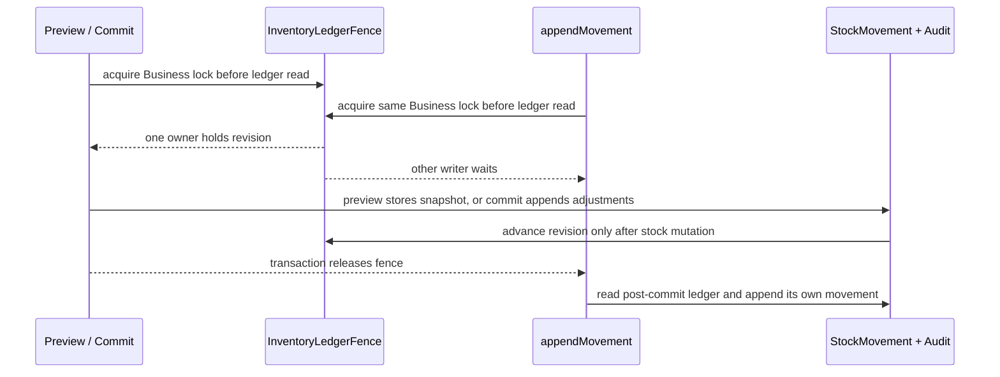

# FR-184 — Inventory physical stocktake

## Intent

FR-184 gives an authorized Inventory operator a safe physical-count desk over
the existing located ledger. It is a reconciliation operation, not a second
stock system and not a new Warehouse console: the operator previews a strict
Business-scoped count, reviews the expected and counted quantities, then commits
all signed adjustments through FR-155's `appendMovement` in one transaction.

The owner approved this contract on 2026-09-11. The implementation may use local
synthetic fixtures for configuration and verification; no production migration,
activation, or live provider action is implied.

## Decisions worth recording

**NONE and LOT are the complete first input vocabulary.** A line names a
tracked `Product`, an explicit `locationId` (or `null` for unlocated stock), a
`lotId` that is required for LOT-tracked products and forbidden for NONE products,
and a non-negative integer `countedQuantity`. Duplicate product/location/lot
keys, missing required LOT identity, unknown or cross-Business UUIDs,
untracked/service products, negative or decimal counts, and SERIAL lines are
refused with stable validation outcomes. Omitting an unlocated line leaves that
bucket incomplete, so preview marks it incomplete and commit refuses it rather
than silently treating the omission as zero. There is no numeric shortcut for
serial observation until that separate contract exists.

**Preview is durable evidence without a stock movement.** The preview normalizes the lines,
acquires the Business's lock-only `InventoryLedgerFence`, computes expected
quantities from the same ledger authority, and stores `snapshotVersion` and
`snapshotHash` with expected, counted and variance values in `InventoryStocktake`.
No stock movement, audit event, or adjustment is written by preview.

**Commit is one fenced adjustment.** Commit reloads the persisted preview and
current viewer scope, takes the same fence before reading on-hand, recomputes the
snapshot and refuses a mismatch as
`INVENTORY_STOCKTAKE_SNAPSHOT_STALE` with HTTP 409. A matching preview appends
all signed `ADJUSTMENT` rows through `appendMovement`; each successful
`appendMovement` advances the shared fence exactly once, while the stocktake
service adds no second increment. It then records one stocktake audit event and
marks the record `COMMITTED`; any validation, shortage, authorization, or later audit failure
rolls back every row. A zero-variance commit is a durable no-op. The
Business-scoped idempotency key returns the saved result for the same payload and
refuses a different payload with `INVENTORY_STOCKTAKE_IDEMPOTENCY_CONFLICT`.

**Concurrent writers share one fence.** Every write-side ledger operation takes
the Business fence before its first on-hand read and holds it through its
transaction. A commit and a concurrent `appendMovement` therefore have one
serial order: the operation that acquires the lock first completes, and the
second operation reads the resulting revision. Only a stock mutation advances
`mutationRevision`; a preview does not. SQLite uses a portable atomic upsert and
row update, while PostgreSQL uses the equivalent row lock; no SQLite-only
`FOR UPDATE` syntax is introduced.

**Recovery preserves the evidence.** The global snapshot format remains 1.0.
`inventoryLedgerFence` follows `stockMovement`, and `inventoryStocktake` follows
the fence before work-order and reservation rows. A declared
`inventoryStocktakeRecovery` manifest v1 must name both tables in that order;
missing arrays, invalid versions or invalid row values fail before destructive
restore. A legacy snapshot with no feature manifest reports the feature as
unavailable rather than claiming stocktake preservation. Exact ids, keys, hashes,
statuses, results, snapshot revisions, and fence revisions survive export/import;
the next mutation continues from the restored revision.

## Acceptance evidence

The implementation closes the approved contract with focused domain/integration
tests for viewer and Business scope, strict NONE/LOT validation, integer and
cross-Business identity joins, snapshot staleness, fence ordering, rollback,
idempotency, SERIAL refusal and concurrent writers. Browser proof covers Business
switching, preview, stale commit refusal, successful refresh and truthful no-op
and variance states. Snapshot export/import tests prove both full feature
manifests and legacy unavailable semantics without running a production
migration.

## Not in this slice

Serial-number observation, bin/putaway, scheduled cycle-count campaigns, a
Warehouse route family, stock valuation or accounting entries, Procurement or
Commerce changes, Excel/LINE intake, and production schema application.
