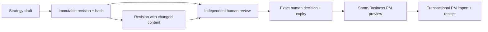

# Marketing Strategy: draft to accountable execution

This implements the approved [domain design](../../../change-requests/CR-018-MARKETING-DOMAIN-DESIGN.md)
and [parallel review](../../../roadmap/marketing/PARALLEL-REVIEW-2026-09-06.md).
Complexity C-3; risk HIGH (new persistence and cross-domain authorization).

## Contract

MarketingPlan holds identity, title, DRAFT/APPROVED/ARCHIVED state, currentRevision
and concurrency version. Each create/revise appends a MarketingPlanVersion; no
version payload can be overwritten. The canonical SHA-256 covers title and the
strict payload: objective, situation, audience, channels, budget, currency,
successMetric and ordered actions with titles. Channel values are META_ADS,
TIKTOK_ADS, INSTAGRAM, GA4 and SEO. Strings, counts and amounts are bounded and
validated on the server. These fields hold planning intent, not provider facts.

Reviews bind planVersionId and payloadHash, carry PASS/CHANGES_REQUIRED and a
rationale, and preserve reviewer identity. The reviewer must differ from the
revision author. All reviewers in this initial slice are authenticated Business
owners with the growth grant; no simulated agent can provide independence.
Decisions are append-only APPROVE/REJECT/REVOKE records with rationale and actor.
APPROVE requires an independent PASS review of the current exact revision/hash
and a finite future expiry. A draft author may be the accountable approver.
A newer decision, revision, expiry or revocation invalidates old approval for
future handoffs. Historical receipts remain historical facts.

Every read checks selected Business visibility and its growth grant. Every write
also requires ownership of that same Business. IDs outside that scope return the
same 404 as missing IDs. The Business supplies tenantId; clients cannot override
it. Every mutation locks through expectedVersion compare-and-swap and appends an
AuditEvent inside its transaction. A stale version returns 409 with no partial
review, decision or revision. Archived plans retain history and reject mutations.

## Console and API

`/growth` summarizes real plans only. `/growth/strategy` uses URL-selected
Situation, Objectives, Plans and Scenarios tabs, with a selected plan addressable
by URL. Situation/Objectives reuse the Business Strategy projection; version
comparisons are labelled as comparisons rather than invented model simulations.
Plan details use sections, avoiding another nested tab layer. Loading, empty,
denied, error and unavailable capability states are explicit. Changing Business
clears the old scope's data and pending drafts before the new response can render.

| Endpoint | Input / result |
|---|---|
| GET `/api/growth/plans?businessId=...` | `{plans, canWrite}` |
| POST `/api/growth/plans` | `{businessId,title,payload}` creates first revision |
| GET `/api/growth/plans/[id]?businessId=...` | Plan, currentVersion, versions, reviews, decisions, handoffs and canWrite |
| PATCH `/api/growth/plans/[id]` | `{businessId,expectedVersion,action,...}`; revise, review, decide or archive |
| POST `/api/growth/plans/[id]/handoff` | `{businessId,workspaceId,expectedVersion,action,previewHash?}`; preview or commit |

Revise supplies title and payload. Review supplies planVersionId, payloadHash,
verdict and rationale. Decide supplies the same binding, reviewId when approving,
verdict, rationale and expiresAt when approving. The server derives actor IDs.

## PM handoff (FR-154)

The target Workspace must belong to the same Business and pass PM's own import
authorization. Marketing deterministically converts the reviewed revision to a
schema 1.2 PlanEnvelope: one stable Project identity, one B2C_CAMPAIGN workstream,
and action WorkItems. The canonical KPI_ATTAINMENT strategy requires numeric PM
metric targets and actual observations before meaningful progress is available;
neither action completion nor the plan's successMetric prose supplies those facts.
The canonical binding is
DOM-MARKETING with TD-PROJECT-MANAGER as execution owner. The version timestamp
and revision/Workspace-scoped idempotency key make retries deterministic.

Preview is read-only and returns the actual PM diff plus a server payload hash.
Commit must name that hash, recheck live scope, approval, expiry and expectedVersion,
then call PM commitPlan with the same transaction client. PM writes, Marketing
receipt association, concurrency change and audit commit together or all roll back.
One MarketingHandoff per revision/Workspace preserves projectId and receipt. A
retry reconciles the existing identical receipt; it cannot duplicate execution or
silently overwrite changed PM work. No caller-provided PlanEnvelope is executed.

## Verification and delivery limits

Acceptance tests cover same/cross-Tenant Business boundaries, visible-only users,
revoked grants, stale writes, immutable versions, independent reviewers, exact hash
decisions, expiry/revocation, PM target scope, preview mismatch, atomic failures and
idempotent retries. Viewer fixtures use the existing factory. Browser checks cover
URL state, Business switching, forms, review controls, keyboard and mobile layout.
Schema migration parity, backup coverage, build and generated governance are gates.

This slice does not complete all 47 implementation tasks: provider readers,
publishing/spend, automated multiagent runs and the other Marketing subdomains
remain tracked separately. Actual import of the development tracking plan still
requires the user's target instance and Workspace; application code is not that
server import.

## CHANGELOG

| Version | Date | Status | Summary | Commit Hash | Agent |
|---|---|---|---|---|---|
| 0.1.0b | 2026-09-06 | beta | Derive the first persistent slice and acceptance gates from approved scope | See git history | RWANG |
