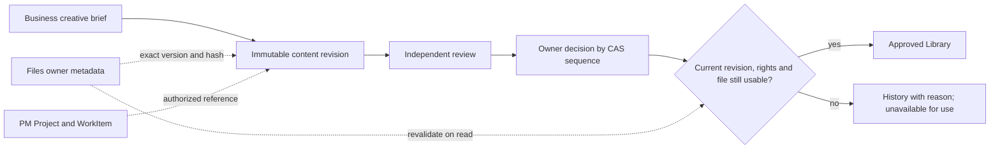

# Content and Creative — immutable briefs and approved file references

Derived from approved [CR-018](../../../change-requests/CR-018-MARKETING-DOMAIN-DESIGN.md)
and its [six Content interfaces](../../../change-requests/marketing/MARKETING-INTERFACE-INVENTORY.md).
Continuation approval covers this existing scope. Complexity C-3; risk HIGH.

## Behavior and ownership

Marketing owns creative intent, revisions, independent human review, revocable
decisions and declared rights. Files owns bytes and file state/version/fingerprint.
PM owns production work/schedule. No duplicate tasks, binary store or publishing.
One brief revision binds at most one output FileAsset in this first slice.
The asset detail key is MarketingContentVersion.id, not FileAsset identity.
Historical versions remain inspectable; Library contains only current usable
approved revisions. Internal acceptance does not authorize external execution.

## Pinned model and transaction contract

Four models: MarketingContentBrief (Business/Tenant UUID, code, title,
OPEN/ARCHIVED, currentRevision, version, creator/timestamps/deletedAt),
MarketingContentVersion (briefId, revision, payloadJson, payloadHash, creator/time),
MarketingContentReview (briefId, contentVersionId, payloadHash, verdict,
rationale, rightsConfirmed, brandConfirmed, reviewer/time),
MarketingContentDecision (briefId, contentVersionId, payloadHash, optional reviewId,
verdict, rationale, actor/time, optional expiresAt). Children are append-only.
Unique Business/code and brief/revision. Injected repository transactions include
parent expectedVersion CAS, new children and immutable AuditEvent atomically.
Review and decision rows carry sequence = expectedVersion + 1, unique per brief
in their table. Latest authority sorts by sequence, never wall-clock timestamps;
equal or backwards clocks cannot resurrect earlier approval.

Title max 200; text fields max 4000, nonempty. Persisted payload fields:
objective, audience, message, claims, shotList, acceptanceCriteria, evidenceReference,
format (IMAGE/VIDEO/COPY/CAROUSEL/OTHER), initiativeId (nullable authorized Campaign), channels
(existing Marketing enum, nonempty unique), asset null or
{fileId,fileVersion,sha256}, rights null or
{holder,license,channels,validFrom,validUntil,proof}, production null or
{projectId,workItemId}. Rights dates are ISO datetime, finite validFrom < validUntil;
rights must exist iff asset exists and cover all intended channels.
Client save asset accepts only {fileId}; server resolves positive fileVersion and
64-hex sha256 from authorized ACTIVE Files metadata before hashing {title,payload}.
Unknown fingerprints cannot support output approval. The author is the authenticated creator shown read-only as Owner; no new assignment
or privilege model is introduced. Optional initiativeId is validated through
getMarketingCampaign in the selected Business. Strict inputs never accept
actor/tenant or client-supplied resolved file version/hash. PM pair must resolve
to the same-Business authorized Project and its WorkItem. Create/revise validate
references inside the transaction; missing refs may be null for an early brief.

Authorization reuses resolveMarketingScope: visible Business + growth for reads,
active Business OWNER for writes. Hidden/missing/deleted targets return 404;
archived/stale writes or changed evidence return 409. Review verdicts PASS or
CHANGES_REQUIRED; revision author cannot supply independent review. PASS with an
output requires rightsConfirmed and brandConfirmed. Decision verdicts APPROVE,
REJECT, REVOKE. APPROVE requires an output, latest matching independent PASS,
active rights window, live matching file and future expiresAt <= rights.validUntil.
Later REJECT/REVOKE, CHANGES_REQUIRED, archive, expiry, new revision or file change
invalidates eligibility. Revalidate on Library reads with injected clock; never
infer approval from stored status, PM progress or a simulated agent. All writes
require rationale where relevant and exact contentVersionId/payloadHash binding.

## Owner reference ports

Files uses listManagedFileAssets with trusted visible Business ids. Sanitize to
id/code/name/mime/size/version/sha256/state/projectId/workItemId; never expose
storageKind, relativePath, externalUrl, blobRef, localCapability or credentials.
Bytes remain behind /api/files/[id]/content and its owner gate. Marketing binds
owner fingerprint metadata; it does not claim independent byte verification.
PM uses getProjectRoadmap(projectId,{db,viewer}); do not use listWorkForViewer,
whose current data call ignores injected db, or change that unrelated service.

listMarketingContentReferences({viewer,businessId,projectId?},{db}) returns
{files,projects,workItems,truncated:{files,projects,workItems}}. Each array is
bounded to 100; Project choices pass PM owner authorization. WorkItems derive
from the selected Project roadmap and carry projectId.
readMarketingContentReferences({viewer,businessId,asset,production},{db}) returns
{asset:{status,reasonCode,file},production:{status,reasonCode,project,workItem}}.
Status READY/UNAVAILABLE, unavailable owner objects null. File rechecks exact
id/version/hash and ACTIVE state. PM rechecks Project/WorkItem and scope.
Missing/deleted/hidden/mismatched references expose no owner locators. Unexpected
infrastructure failures propagate. References are never silently substituted.

Collection service returns {briefs,truncated,canWrite}, max 100. Brief summary
has id/code/title/status/version/currentRevision/currentVersion/phase/approval/
references. Detail adds versions/reviews/decisions/canWrite. Phase is
DRAFT/PRODUCTION/REVIEW/APPROVED/ARCHIVED, in descending precedence ARCHIVED,
usable APPROVED, matching current REVIEW, valid PM binding PRODUCTION, then DRAFT. These describe creative
readiness, not PM task status. approval is {valid,reasonCode,decisionId|null}.
Asset detail returns {brief,assetVersion,references,isCurrent,usable}; top-level
references resolve the requested assetVersion payload, while brief retains its
current revision references. Old versions never inherit current approval or a
newer source file. AssetVersion is an immutable content revision.

## Six interfaces and API

MKT-UI-016/017/018: /growth/content?tab=briefs|production|library, one accessible
URL tab row. Production list/board reads actual PM status/dates, creates no work.
MKT-UI-058: /growth/content/briefs/[briefId], revise/version diff/references/review/
decision/archive sections. MKT-UI-059: /growth/content/assets/[assetId], immutable
version/source/rights/review/current eligibility sections; Files link only when
available. MKT-UI-077: /growth/content/new, native form, preview and save with real
file/Project/WorkItem choices. No nested detail tabs. Human review works; runtime
Team actions stay explicitly unavailable. Business/detail keys reset stale UI;
errors, empty states, Back/reload, keyboard and 390px mobile are required.

GET/POST /api/growth/content; GET/PATCH /api/growth/content/briefs/[id];
GET /api/growth/content/assets/[id]; GET /api/growth/content/references.
Create {businessId,title,payload}; PATCH {businessId,expectedVersion,action,...}
with revise/review/decide/archive. Review/decide include contentVersionId and
payloadHash; decision includes reviewId/expiresAt where applicable.
No network fetch/upload/publish or PM mutation is executed from these bodies.

## Acceptance gates

Real SQLite tests: create/revise/hash/diff, review independence, approve/revoke/
expiry, archive, changed/deleted/quarantined files, rights windows/channels,
same-tenant cross-Business and cross-tenant denial, PM mismatch, stale CAS and
rollback. Use viewer factories. Nonempty backup restore and additive SQLite
migration; generated PostgreSQL schema and private RLS migration, no production
apply. Browser six interfaces, selectors, create→revision→independent review→
decision→Library→asset detail, revoke→Library exclusion, Back/reload and mobile.
Full tests/build/governance/browser regression plus architecture review before
local completion; owner-controlled publishing/runtime remain separate gates.

## CHANGELOG

| Version | Date | Status | Summary | Commit Hash | Agent |
|---|---|---|---|---|---|
| 0.1.0b | 2026-09-06 | beta | Pin six approved Content interfaces and exact rights/file/PM contract | See git history | RWANG |
| 0.1.1b | 2026-09-06 | beta | Bind review/decision order to parent CAS sequence, independent of wall clock | See git history | RWANG |
| 0.1.2b | 2026-09-06 | beta | Clarify selected-version references and phase precedence; local delivery evidence recorded | See git history | RWANG |

Local implementation and validation: [Content phase report](../../../roadmap/marketing/PHASE-CONTENT-2026-09-06.md).
