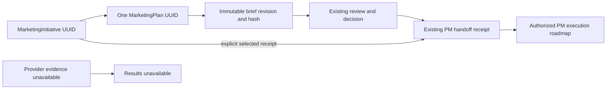

# Campaign initiatives and receipt-bound execution

Derived from the user-approved [CR-018](../../../change-requests/CR-018-MARKETING-DOMAIN-DESIGN.md),
[navigation](../../../change-requests/marketing/MARKETING-NAVIGATION-VIEWS.md) and
[Strategy contract](FR-159-strategy-plans.md). Complexity C-3; risk HIGH.
The historical design-only restriction on adding models preceded implementation
approval. This slice adds one native association model within the approved lane.

## Identity and evidence

MarketingInitiative has its own UUID, Business-local code, tenantId/businessId,
unique planId, optional handoffId, OPEN/CLOSED/CANCELLED status, closureReason,
createdBy, createdAt, updatedAt, deletedAt and optimistic version. One initiative
owns one Strategy plan; initiativeId, planId, PM Project/WorkContainer IDs and
provider adCampaignId are distinct. Never associate records by title or code.
No provider campaign is created in this slice.

POST creates the initiative, Strategy plan and first immutable version plus audit
in one transaction. The ordinary Strategy payload gains optional `campaignBrief`:
`{startDate,endDate,offer,conditions}`. Dates are valid YYYY-MM-DD calendar dates
with endDate >= startDate; offer and conditions are required bounded text.
Campaign creation requires that extension. Existing Strategy payloads keep the
extension absent: no defaults and no rewrite of old content/hashes. A revision
cannot remove an existing campaignBrief. All brief fields, dates and budget are
hashed and reviewed together; revisions reset approval through FR-159. Planned
calendar dates are distinct from PM's actual startAt/targetAt schedule and from a
measurement window. Audience is a textual planning reference, not a CRM identity.

Marketing lifecycle status is separate from Strategy approval and PM status.
The board uses DRAFT/APPROVED/EXECUTING/CLOSED/CANCELLED planning phases: a selected
valid handoff means EXECUTING, a currently valid approval means APPROVED, otherwise
DRAFT; closed/cancelled take precedence. These labels do not assert measured
progress. Missing/deleted/unreadable linked execution is explicitly unavailable.
Closed/cancelled initiatives reject subsequent Campaign mutations; closure does
not cancel PM work, revoke Strategy approval or stop external operations.
Closing or cancelling requires a written debrief/cancellation reason.

## Authority and API

Every operation resolves trusted Business/Tenant scope and growth visibility;
writes require active Business ownership. Missing and hidden identities return
404. Strict inputs reject unknown keys. No caller controls actor or tenant.
Writes use initiative expectedVersion; brief revision/binding also requires
expectedPlanVersion. CAS, plan changes, association and immutable audit share one
transaction. Failure rolls back all writes. Concurrent Strategy edits therefore
cannot silently overwrite a Campaign edit or a handoff selection.

| Endpoint | Contract |
|---|---|
| GET `/api/growth/campaigns?businessId=...` | `{campaigns,canWrite,truncated}`; at most 100 scoped summaries; list/board, search and phase filtering are client views of this bounded set |
| POST `/api/growth/campaigns` | `{businessId,title,payload}`; payload includes campaignBrief; returns the new detail DTO |
| GET `/api/growth/campaigns/[id]?businessId=...` | Detail DTO below, with authorized PM projection |
| PATCH `/api/growth/campaigns/[id]` | `{businessId,expectedVersion,action,...}`; actions revise, bind-handoff, close, cancel |

Revise adds expectedPlanVersion/title/payload and invokes the existing Strategy
revision service. Bind-handoff adds expectedPlanVersion/handoffId. It accepts only
a persisted receipt belonging to this plan, with matching immutable version/hash,
same Business Workspace/Project and PM's own read authorization. It never calls
PM import or accepts a raw projectId. The receipt can refer to an older revision;
the DTO identifies that historical revision and whether it differs from the
current brief. Changing selection requires a fresh explicit action, never silently
switching to the latest receipt. Close/cancel add reason (1–4000 characters).
Archived Strategy plans reject Campaign revision and receipt binding; an owner
may still close/cancel the initiative because that changes only its own lifecycle.

Detail DTO:
`{id,code,businessId,tenantId,planId,handoffId,status,phase,closureReason,version,
createdAt,updatedAt,canWrite,plan,execution,results}`.
`plan` is the FR-159 detail DTO with immutable versions/reviews/decisions/handoffs.
List summaries carry identity, title, status, phase, version, planId, currentRevision,
budget, currency, channels and campaignBrief; no PM titles or metrics are inferred.

`execution` is `{status:'READY',reasonCode:null,handoff:{id,planVersionId,revision,
payloadHash,workspaceId,projectId,isCurrentRevision},roadmap}` or
`{status:'UNAVAILABLE',reasonCode, handoff:null,roadmap:null}`. The adapter verifies
Marketing scope and receipt/plan/version/project/workspace binding before calling
PM's `getProjectRoadmap(projectId,{db,viewer})`. It preserves EXECUTION_ROADMAP
schema 1.0 including explicit unavailable fields and its own PM authorization.
Missing/deleted/cross-scope links expose neither PM identity nor payload. Unexpected
infrastructure failures propagate as errors instead of becoming fake empty data.
The same adapter validates every receipt exposed in `plan.handoffs` and the
selected receipt used to derive collection phase. The roadmap is a live Project
view, not a frozen receipt snapshot: later handoffs may add work to that Project.

`results` is always `{status:'UNAVAILABLE',reasonCode:'NO_APPROVED_SOURCE',
measurementWindow:null,sources:[],metrics:[]}` in this slice. Success-metric prose,
PM item completion and planning budget are not observed marketing measurements.

## Console acceptance

MKT-UI-006 is `/growth/campaigns`: no tab bar; list/board toggle, phase filter,
search, bounded-result notice, New campaign. MKT-UI-076 is `/growth/campaigns/new`:
name, objective, situation, audience reference, channels, offer, conditions, start/
end dates, budget/currency, success-metric intent and actions, with no mock values.

`/growth/campaigns/[initiativeId]?tab=brief|plan|timeline|results|decisions` covers
MKT-UI-007–011 with one accessible, URL-addressable tab bar. Brief displays/revises
the immutable current plan; Plan/Timeline read the selected PM receipt's roadmap
and link to actual PM work; dates and dependency labels preserve unavailable data.
Decisions displays existing Strategy evidence and links to its review/approval/
handoff controls, plus explicit receipt selection and closure controls. Results
explains source unavailability. Team refinement remains a later tracked runtime.

Business/initiative changes clear drafts, selection and previous payload before
rendering the next identity. Read-only users can inspect but cannot mutate. Cover
loading/empty/denied/stale/error/unavailable, keyboard navigation, reload/back and
390px mobile overflow. Do not render illustrative names, metrics or decisions.

## Verification gates

Prove real create/revise/receipt binding/closure persistence, old Strategy hash
compatibility, invalid/reversed dates, immutable review invalidation, stale writes,
hidden scopes, cross-plan receipts, PM authorization and transaction rollback.
Verify non-empty backup restore and SQLite migration; maintain private PostgreSQL
RLS migration parity without claiming production application. Browser tests cover
all seven interfaces and a real accepted handoff projected after reload. Full tests,
build, governance and browser regression are required before local completion.

Local verification and remaining live gates are recorded in the
[Campaign phase report](../../../roadmap/marketing/PHASE-CAMPAIGNS-2026-09-06.md).

## CHANGELOG

| Version | Date | Status | Summary | Commit Hash | Agent |
|---|---|---|---|---|---|
| 0.1.0b | 2026-09-06 | beta | Pin native Campaign identity, versioned brief, PM projection and acceptance from approved design | See git history | RWANG |
| 0.1.1b | 2026-09-06 | beta | Clarify archived plan binding and live PM scope; attach verified phase evidence | See git history | RWANG |
