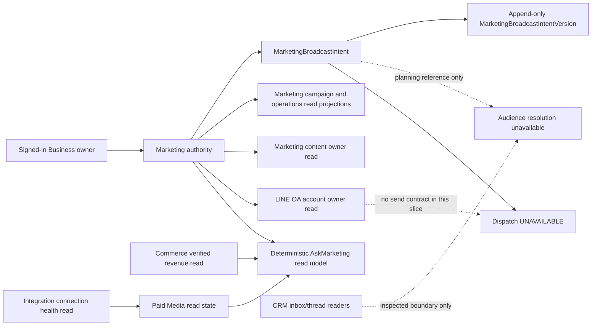

# FR-185 — Business-scoped LINE broadcast planning intent

This is the approved bounded Marketing P5 slice from the [Marketing P5 audit and
implementation contract](../../../../.brain/reports/2026-09-11-marketing-p5-audit.md).
The contract was approved on 2026-09-11 after PR319 merged at `196e4a9a`; this
implementation records that approval and does not reopen the provider-backed
execution proposal. Complexity C-3; risk HIGH because the slice adds durable
identity, immutable revisions, authorization and backup coverage.

## Ownership and architecture



Marketing owns the planning identity, payload references, revisions, lifecycle,
audit and read composition. LINE OA Studio remains the owner of account
configuration and any future delivery contract. Content remains authoritative
for the body and exact version; Marketing stores only the internal content and
hash references. CRM readers are inspected as an ownership boundary but are not
called because no approved audience resolver or consent snapshot exists.
Integration owns provider credentials and paid adapters. Commerce owns verified
revenue. No provider, CRM, Commerce, PM or LINE write is introduced.

## Durable planning contract

`MarketingBroadcastIntent` is a Business-scoped UUID identity with `tenantId`,
`businessId`, Business-local `code`, `status` (`PLANNING` or `ARCHIVED`),
`currentRevision`, optimistic `version`, Business-scoped `idempotencyKey`,
`createdBy`, timestamps and `deletedAt`. Its child
`MarketingBroadcastIntentVersion` has its own UUID, `intentId`, immutable
`revision`, canonical `payloadJson`, `payloadHash`, `createdBy` and `createdAt`.
The child is append-only and is deleted only with its parent during a complete
snapshot restore; application lifecycle operations never update or delete it.

The initial and revised payload is strict and contains no raw content or
recipient data:

```json
{
  "channel": "LINE",
  "account": { "lineOaAccountId": "internal UUID", "accountVersion": 1 },
  "content": {
    "briefId": "internal UUID",
    "contentVersionId": "internal UUID",
    "payloadHash": "64 lowercase hex"
  },
  "audience": {
    "source": "CRM_CONVERSATION_READ_MODEL",
    "sourceVersion": null,
    "audienceSpecVersion": "1.0",
    "filter": { "consentStatus": "GRANTED" },
    "criteriaHash": "64 lowercase hex",
    "resolutionState": "UNAVAILABLE",
    "resolutionRef": null
  },
  "consent": {
    "source": "CRM_CUSTOMER.consentStatus",
    "requiredValue": "GRANTED",
    "policyReference": "FR-103",
    "policyVersion": null,
    "snapshotRef": null,
    "snapshotVersion": null,
    "state": "UNAVAILABLE"
  }
}
```

`audienceSpecVersion` is the proposed planning-payload schema version. It is
distinct from FR-103's policy version, which stays `null` until a canonical
policy version is available. `audience.sourceVersion` also stays `null`. The
account is re-read through `getLineOaAccount` for the selected Business and its
stored internal id/version; a missing account is retained only with an explicit
`accountState: "UNAVAILABLE"` and reason `LINE_ACCOUNT_NOT_SELECTED`. Content
is re-read through `getMarketingContent` for the exact Business, version and
hash. No body, recipient, audience count or provider identifier is fabricated.

Create is idempotent on `(businessId, idempotencyKey)`: an identical canonical
payload and trusted identity returns the existing intent, while a different
payload or identity returns `409 BROADCAST_INTENT_IDEMPOTENCY_CONFLICT`.
Revision requires `expectedVersion`; one transaction appends one child revision,
increments the parent revision/version and writes one Marketing audit event.
Archive is the only lifecycle mutation after creation. Audit fields contain
Business/Tenant/intent/revision/hash/state and actor identifiers, never private
content, recipients, credentials or tokens. Invalid links, scope changes and
deleted sources return `UNAVAILABLE` and never reconstruct erased data.

## Read routes and unavailable execution

| Route | Behavior | Write authority |
|---|---|---|
| `GET /api/growth/broadcast-intents?businessId=...` | Lists authorized non-deleted planning intents and current revision summaries. | Marketing read scope |
| `POST /api/growth/broadcast-intents` | Creates the identity and first revision under strict validation and idempotency. | Active Business owner |
| `GET /api/growth/broadcast-intents/[id]?businessId=...` | Revalidates identity and Business scope before returning detail and revision history. | Marketing read scope |
| `PATCH /api/growth/broadcast-intents/[id]` | `revise` with `expectedVersion` or `archive`; no dispatch action exists. | Active Business owner |

The detail DTO always carries
`dispatch: { state: "UNAVAILABLE", reasonCode: "LINE_BROADCAST_OWNER_CONTRACT_UNAVAILABLE" }`.
The UI may explain that the plan is retained for review, but cannot show a
sent, delivered, failed, recipient-count or success receipt.

## Paid Media and AskMarketing read model

Paid Media is a truthful read projection. It may use existing Marketing,
Integration and Commerce owner read adapters, but provider paid metrics
(`spend`, impressions, clicks, platform revenue, frequency, ad identity and
heatmap) are always `UNAVAILABLE` with reason
`PAID_MEDIA_METRICS_SOURCE_UNAVAILABLE`. Verified Commerce revenue may be shown
with its real window and `byOrigin`, but is never joined to an ad. `READY`,
`EMPTY`, `PARTIAL`, `UNAVAILABLE` and `UNKNOWN` remain distinct; zero is shown
only when an owner source actually measured zero.

`POST /api/growth/ask-marketing` accepts only `{ businessId, question }` and
returns a deterministic read-only `MARKETING_ASK` DTO with `schemaVersion`,
`businessId`, original question, `intentType`, `state`, optional sections and
recommendations, owner/source/version/reference/window/state records,
unavailable reason codes and `generatedAt`. Trimmed, lowercased questions map
to `ANALYZE_ROAS` for `roas`, `revenue`, `รายได้` or `ยอดจริง`; `DETECT_FATIGUE`
for `fatigue`, `frequency`, `ล้า` or `ความถี่`; an empty question maps to
`EXECUTIVE_OVERVIEW`, as does the UI's default `overview` question; all other questions map to `UNSUPPORTED`. ROAS and fatigue
remain unavailable. Overview reads existing Marketing projections and optional
verified Commerce revenue. Unsupported questions return
`QUESTION_UNSUPPORTED`. The route never creates an intent, changes a budget,
calls a model/provider, calls CRM inbox/thread readers, or sends a message.

## UI, backup and verification

The Paid Media page renders owner source cards and unavailable/unknown states
without sample ads, zeros or ROAS. Broadcast renders durable `PLANNING` intents,
revision identity and the disabled dispatch explanation. AskMarketing renders
the deterministic answer, source references and real measurement windows with no
action control. Business switching clears stale identity state; empty, denied,
unavailable and unknown states survive reload/back at 390px width.

Broadcast creation uses authorized Content and LINE OA pickers, with titles,
codes and the current Content revision visible. Internal ids, hashes and account
versions are captured from the owner DTOs; users do not enter them. A draft keeps
one internal create key across an unknown response and retries that exact payload.
Saved plans can be reopened after reload, revised through the existing CAS API,
and archived while preserving their revision history. The interface always
explains that planning is not approval or authorization to send.

The snapshot export includes the parent before the append-only child and a
versioned Marketing broadcast recovery manifest. Import validates parent/child
identity, Business/Tenant scope, unique intent/revision pairs, canonical payload
hashes and current-revision/version consistency before any deletion. A snapshot
without the new manifest is explicitly `UNAVAILABLE`; it cannot erase existing
broadcast rows. All recovery warnings are retained alongside the existing
manifests. SQLite and PostgreSQL schemas carry the same models, constraints and
RLS/grant intent; migration `20260911030000_marketing_broadcast_intents.sql` is
additive and is not a production-application claim.

Verification covers owner and hidden-scope reads, strict payload/reference
validation, account/content version mismatch, idempotent create and conflict,
append-only revisions, CAS/archive/audit, unavailable dispatch, deterministic
AskMarketing, paid no-zero behavior, backup round-trip, malformed-reference
pre-deletion rejection, SQLite/PostgreSQL schema parity, Business switch/reload/
back UI states and build/governance. Future work remains recipient expansion,
audience/consent snapshot resolution, provider metrics, provider receipts,
delivery/reconciliation and workers under their owning domains.

## CHANGELOG

| Version | Date | Status | Summary | Commit Hash | Agent |
|---|---|---|---|---|---|
| 0.1.1b | 2026-09-11 | beta | Owner-backed human pickers, stable unknown-response retry, revision/archive review and browser acceptance | Integration | RWANG |
| 0.1.0b | 2026-09-11 | beta | Approved FR185 bounded planning identity, immutable version/idempotency contract, read-only projections, explicit unavailable dispatch and backup gates | Uncommitted | RWANG |
