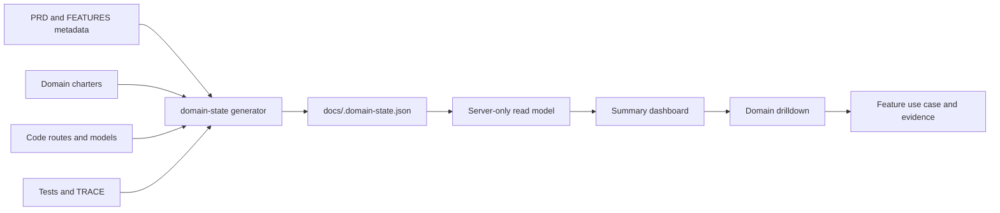

# FR-094 — Domain and Feature Readiness Dashboard

## Outcome

Platform exposes one read-only product-delivery dashboard at
`/platform/product-readiness`, with a stable drilldown at
`/platform/product-readiness/[domain]`. It answers four separate questions
without collapsing them into one green number:

1. how much evidence-backed implementation exists;
2. which requirements are actually verified;
3. whether the complete feature is ready to use;
4. what a Human can use the feature for.

The dashboard is an implementation-readiness projection. It is not Business
execution progress, production telemetry, a substitute for external activation
evidence, or an authority that may promote a feature to live.

## Metric contract

The six summary KPIs are Domains, Projected features, Ready features,
Development progress, Verified requirements and Open gaps. The calculation is
shown beside the numbers and is also carried in the machine-readable snapshot:

```text
requirement progress = declaration evidence 20%
                     + code evidence        40%
                     + test evidence        40%

feature progress = mean(progress of the feature's underlying FRs)
domain progress  = mean(progress of the unique FRs in its primary features)
overall progress = mean(progress of every unique FR)
```

`ready=true` requires every underlying FR to be verified and, for an explicit
FEAT bundle, the FEAT registry status to be `live`. A 100% implementation score
may therefore remain not ready when the feature registry says `building`, an
external gate remains, or the capability is only an internal contract. The UI
always prints both values and the blocking reason.

## Complete feature projection

ADR-025 rev 2 remains intact: FEAT identifies a bundle; an unbundled FR is an
implicit feature of one. The Dashboard projects each explicit FEAT once and
each unbundled FR once. `docs/FEATURES.md` carries presentation metadata keyed
by that projected id:

- exactly one primary implementation domain;
- one non-empty example use case.

Missing, duplicate or unknown metadata aborts graph generation. A partial list
is a wrong answer, so the Dashboard never silently drops an item or assigns it
to an inferred domain.

## Information architecture

```text
Platform / Product Readiness
├── six headline KPIs + methodology
├── domain cards (progress, ready count, blockers)
├── search and readiness filters
└── complete feature list
    └── feature disclosure
        ├── example use case
        ├── underlying requirements
        ├── code/test evidence
        └── blockers

Platform / Product Readiness / [domain]
└── the same contract, scoped to one stable domain key
```

The Platform domain label remains non-clickable and its existing Dashboard is
still the first sidebar item. Product Readiness is an additional Platform
sub-domain, not a replacement Overview and not a new top-level domain.

## Data flow



There is no database model, runtime write path, scheduled poll or GitHub API
dependency. The snapshot is generated by governance and bundled with the app.

## Acceptance criteria

- All projected features appear exactly once and carry one use-case example.
- Summary renders no more than six headline KPIs.
- Every domain card links to a stable domain URL.
- Every progress bar has a numeric value and accessible progress semantics.
- Ready/not-ready is text, never color alone.
- The methodology, generation time and stale-snapshot boundary are visible.
- Search and readiness filters do not change the headline denominator.
- Unknown domain URLs render a non-enumerating not-found response.
- Mobile layout remains readable without a wide KPI table.
- `npm run verify` passes and generated governance artifacts are committed.

## Out of scope

- Editing feature status, requirements, domain ownership or use cases from UI.
- Production uptime, customer adoption or commercial readiness metrics.
- New canonical execution modes, persistence models or external sync.
- Treating local tests as proof of external provider or LINE activation.

## CHANGELOG

| Version | Date | Status | Summary | Commit Hash | Agent |
|---|---|---|---|---|---|
| 1.0.0b | 2026-08-20 | beta | Approved metric contract, complete projection, summary and domain drilldown boundary | working-tree | ATHER |
