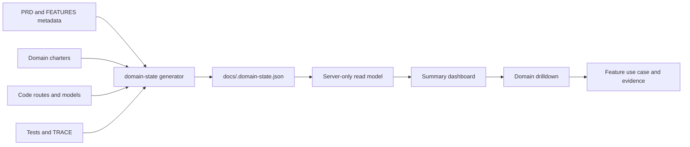

# FR-124 — Product Readiness Dashboard

## Outcome

Platform exposes one read-only product-delivery surface at
`/platform/product-readiness`, with a stable drilldown at
`/platform/product-readiness/[domain]`. It answers four separate questions
without collapsing them into one green number:

1. how much evidence-backed implementation exists;
2. which requirements are actually verified;
3. whether the complete feature is ready to use;
4. what a Human can use the feature for.

The dashboard is an implementation-readiness projection. It is not Business
execution progress, production telemetry, a substitute for external activation
evidence, or an authority that may promote a feature to live.

## Provenance

This is a deliberate re-application of `rescue/domain-dashboard` (`c009a05`, a
2026-08-26 rescue commit that was never reviewed and never opened as a PR),
renumbered from its original **FR-094** — a number main had already spent on
canonical IAM principal identity — to **FR-124**. Ids are keys (AGENTS.md §18),
so nothing was renumbered in place; a second id was allocated for the same
statement, exactly as PR #117 (FR-094 → FR-105) and PR #180 (FR-123) did before
it. The rescued branch's own `.id-ledger.json` entry was deliberately **not**
ported: a sibling branch shipped a rival entry under a colliding date and a
different anchor, and merging both would corrupt the ledger. FR-124 is pinned
fresh from main's ledger with `npm run docs:ids -- --write`.

## Metric contract

The six summary KPIs are Domains, Features, Ready, Progress, Verified FRs and
Open gaps. The calculation is shown beside the numbers and is also carried in
the machine-readable snapshot:

```text
requirement progress = declaration evidence 20%
                     + code evidence        40%
                     + test evidence        40%

feature progress = mean(progress of the feature's underlying FRs)
domain progress  = mean(progress of the unique FRs in its primary features)
overall progress = mean(progress of every unique FR)
```

`ready=true` requires every underlying FR to be verified and, for an explicit
FEAT bundle, the FEAT registry status to be `live`. A 100% implementation score
may therefore remain not ready when the feature registry says `building`, an
external gate remains, or the capability is only an internal contract. The UI
always prints both values and the blocking reason.

Two denominators exist and they are not the same number. `requirementEvidence`
in `scripts/domain-state.mjs` counts only the code a domain's charter owns, and
still drives the per-domain governance checks it always drove.
`globalRequirementEvidence` — new here — counts every file that implements an FR,
including files in another domain's lane, because a feature is a product
statement rather than a lane statement. The global figure is never smaller than
the per-domain one, and that difference is intended.

### OPEN QUESTION FOR THE OWNER — the 20/40/40 weighting

**The three weights are a policy choice, not a derived fact, and they have not
been ratified.** Nothing measures that a declared requirement is worth a fifth of
a delivered one, or that code and tests weigh the same. Somebody picked
20 / 40 / 40 because it reads sensibly, and every percentage this dashboard
prints inherits that pick.

It is therefore held in exactly one place — `PROGRESS_METHODOLOGY` in
`scripts/domain-state.mjs` — with the rationale written beside it, published in
the snapshot under `progressMethodology`, and printed in the UI's methodology
disclosure. Changing a weight there changes every number on the dashboard and
nothing else.

The failure this arrangement exists to avoid is a policy becoming a fact because
nobody could see where it was decided. An owner should either ratify 20/40/40 or
replace it; until then the PRD status cell says so, in those words.

## Complete feature projection

ADR-025 rev 2 remains intact: FEAT identifies a bundle; an unbundled FR is an
implicit feature of one. The Dashboard projects each explicit FEAT once and each
unbundled FR once. `docs/FEATURES.md` carries presentation metadata keyed by
that projected id, in a fenced `readiness-metadata` block:

- exactly one primary implementation domain;
- one non-empty example use case.

Missing, duplicate or unknown metadata aborts graph generation. A partial list is
a wrong answer, so the Dashboard never silently drops an item or assigns it to an
inferred domain.

**This is a new hard gate on the whole governance chain, and it has an ongoing
cost an owner should accept knowingly:** declaring a new FR now also means
writing one sentence of use case in `docs/FEATURES.md`, or `npm run govern`
stops. That is the price of the fourth question — "what can a Human use this
for" — being answerable at all; it is the one field in the projection that no
generator can derive.

The rescued draft had a hole here, closed in this port. It returned an empty
projection for an empty metadata array, so a `readiness-metadata` block
containing `[]` would have disabled the completeness check entirely and reported
success — the check was correct, but its input could not express the failure it
existed to catch. An empty array is now a wrong answer that names every id it is
missing. Only omitting the argument altogether means "not projecting features",
and no real generation path does that: `generateDomainState` always calls
`parseFeaturePresentation`, which throws rather than returning nothing.

## Authorization

The snapshot holds **no** Tenant, Business, Project, Person or Customer data. It
is repository governance metadata: requirement ids, their declared status, and
the source and test paths that evidence them. The read model issues no query and
takes no request, so the same bytes are returned to every viewer and there is no
scope for a caller to widen. Cross-tenant and cross-business leakage is not
possible through this path because no such data enters it.

The authorization question this surface does have is therefore "may you see the
engineering interior at all", and it is answered on the **server**, before the
snapshot renders:

- `resolveProductReadinessDecision` (pure, unit-tested) requires a resolved
  viewer and Platform domain visibility, using FR-060's single `isDomainVisible`
  predicate — the same one the domain bar and the client route guard use.
- `requireProductReadinessViewer` wires it to `resolveRequestViewer`, redirecting
  to `/login` with no viewer and answering `notFound()` without the grant.
- The drilldown authorizes **before** it decides whether a domain key exists, so
  the not-found boundary is not an enumeration oracle.

This is stricter than the rescued draft, on purpose. Every other page under
`src/app/(pm)/**` is a client component that fetches through a viewer-resolving
API, so `BusinessShellGuard` — which is a *client* guard — has never been the
only thing between an unauthenticated browser and real data. These are the first
server-rendered pages in that group that carry their payload inline, and under
the client guard alone the whole snapshot would have shipped in the RSC payload
before anything decided not to display it. FR-105's `/control/roadmap`, the only
comparable static projection on main, already resolves its viewer server-side;
this follows that shape.

## Information architecture

```text
Platform / Product Readiness
├── six headline KPIs + methodology
├── domain cards (progress, ready count, blockers)
├── search and readiness filters
└── complete feature list
    └── feature disclosure
        ├── example use case
        ├── underlying requirements
        ├── code/test evidence
        └── blockers

Platform / Product Readiness / [domain]
└── the same contract, scoped to one stable domain key
```

The Platform domain label remains non-clickable and its existing Dashboard is
still the first sidebar item. Product Readiness is an additional Platform
sub-domain, not a replacement Overview and not a new top-level domain.

## Data flow



There is no database model, runtime write path, scheduled poll or GitHub API
dependency. The snapshot is generated by governance and bundled with the app.

## Acceptance criteria

- All projected features appear exactly once and carry one use-case example.
- Summary renders no more than six headline KPIs.
- Every domain card links to a stable domain URL.
- Every progress bar has a numeric value and accessible progress semantics.
- Ready/not-ready is text, never color alone.
- The methodology, generation time and stale-snapshot boundary are visible.
- Search and readiness filters do not change the headline denominator.
- Unknown domain URLs render a non-enumerating not-found response, and do so
  only after the viewer has been resolved.
- A viewer without Platform visibility receives the same not-found response.
- A domain that owns no projected feature reports `—`, not `0.0%`: "nothing is
  claimed here" is a different statement from "nothing has been built".
- Mobile layout remains readable without a wide KPI table.
- `npm run verify` passes and generated governance artifacts are committed.

## Out of scope

- Editing feature status, requirements, domain ownership or use cases from UI.
- Production uptime, customer adoption or commercial readiness metrics.
- New canonical execution modes, persistence models or external sync.
- Treating local tests as proof of external provider or LINE activation.

## CHANGELOG

| Version | Date | Status | Summary | Commit Hash | Agent |
|---|---|---|---|---|---|
| 1.0.0b | 2026-08-30 | beta | Re-applied from `rescue/domain-dashboard` as FR-124: metric contract with the weighting hoisted into one named constant and raised as an open question, complete projection with the empty-array bypass closed, and server-side viewer resolution added | pending | Claude Opus 5 |
