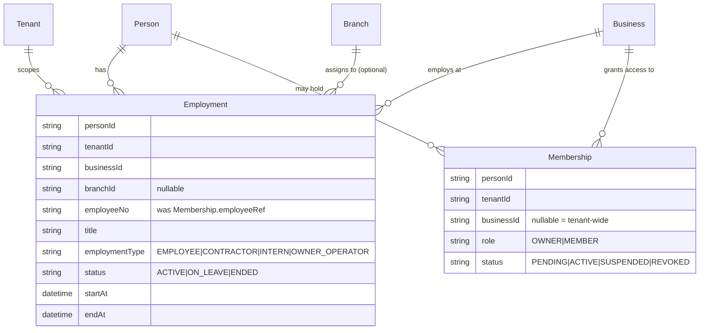
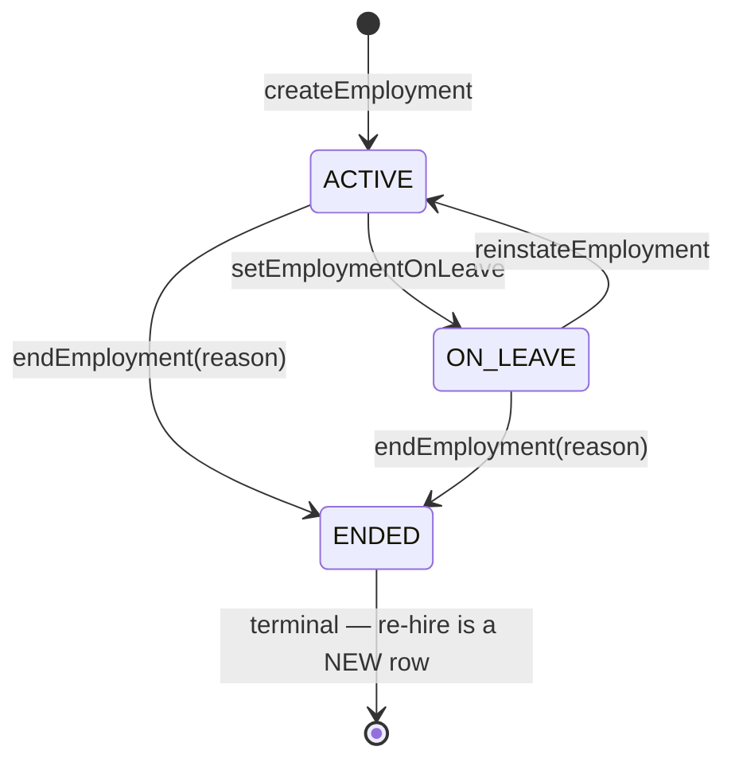

# FR-193 — Employment: an HR record separate from the access grant

| Field | Value |
|---|---|
| **Version** | 1.0.0 |
| **Status** | Implemented |
| **Date** | 2026-09-12 |
| **Relates to** | ADR-078 D1, ADR-037 D1, BR-034, FR-042 |

## The defect

`people-service.js` built the HR People Directory by reading `Membership`
directly. "Who works here" and "who can log in here" were the same question
by construction:

- A shareholder holding a tenant-wide OWNER `Membership` (FR-074(c)) appeared
  as an employee.
- Suspending a `Membership` (ADR-077) made the person **vanish** from the
  roster instead of showing as staff whose access is suspended.
- A consultant with access but no employment could not be told apart from
  staff.
- A LINE-originated `Person` (FR-023) with no `Membership` at all could
  never appear in the roster.

Standard practice keeps these apart: SAP's `SU01` (user master) is separate
from `PA`'s personnel number, linked by infotype 0105; Oracle separates
`FND_USER` from `PER_ALL_ASSIGNMENTS_F`. `Employment` is the assignment;
`Membership` is the grant.

## Model

`Employment` and `Membership` are deliberately unconnected by any foreign
key. Reading one never requires reading the other; the only place they meet
is `people-service.js`'s `listPeople`, which reads Employment for the roster
and joins Membership status in as one derived column.

## Lifecycle

One open Employment per person per Business at a time
(`Employment_person_business_open_key`, `WHERE endAt IS NULL`). Ending is
terminal; a later re-hire creates a new row rather than reopening the old
one — the same shape ADR-077 D2 chose for a revoked `Membership`.

## The one-way rule (BR-018's discipline, applied to Employment)

`resolveViewer` and every file under `src/modules/identity/` never read
`Employment`. No route guard, no domain gate, no viewer field is derived
from it. `tests/unit/fr193-employment-not-authorization.test.js` scans the
identity module's source text (the same detector shape
`fr089-br018-team-grants-nothing.test.js` uses for `Team`) and fails if any
file there names the model. Ending someone's Employment does **not** revoke
their Membership; revoking a Membership does **not** end their Employment.
An owner who wants both performs both acts, separately, each producing its
own audit row.

## Backfill

Production holds exactly one `Membership` row with `employeeRef` set, and it
is **tenant-wide** (`businessId IS NULL`) — `PER-BOSS`. Standard HR has no
"group-level employment," so the migration does not guess a Business for it:
it migrates only rows where `businessId IS NOT NULL`, and `RAISE NOTICE`s the
name of any row it skips so an operator places it deliberately. `Membership.
employeeRef` and `Membership.branchId` are dropped in the same migration,
after the backfill runs.

## Acceptance

| ID | Criterion |
|---|---|
| AC-193.1 | `people-service.js`'s roster (`GET /api/people`) is built from `Employment`, not `Membership` |
| AC-193.2 | A `SUSPENDED` or absent `Membership` never removes an Employment row from the roster; it only flips the `hasSystemAccess` column |
| AC-193.3 | An OWNER `Membership` with no `Employment` row does not appear in the People Directory as staff |
| AC-193.4 | `resolveViewer` and every file under `src/modules/identity/` reference no `Employment` model, column or relation (enforced by source-text scan) |
| AC-193.5 | Ending an `Employment` writes no change to any `Membership` row, and vice versa |
| AC-193.6 | Only one OPEN (`endAt IS NULL`) `Employment` may exist per `(personId, businessId)` at a time; a second attempt refuses `409 EMPLOYMENT_ALREADY_OPEN` |
| AC-193.7 | `assertTenantMember` (renamed from `assertEmployee` in `rbac-service.js`) checks `Membership`, and its name says so |
