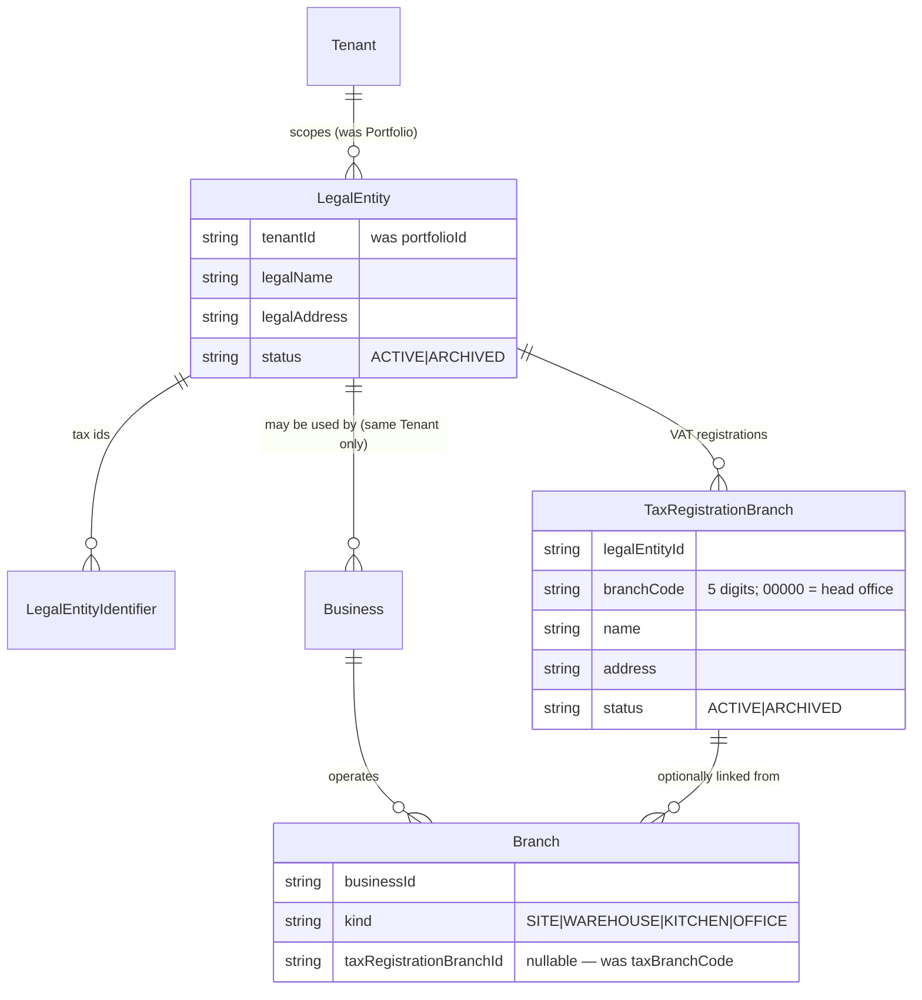
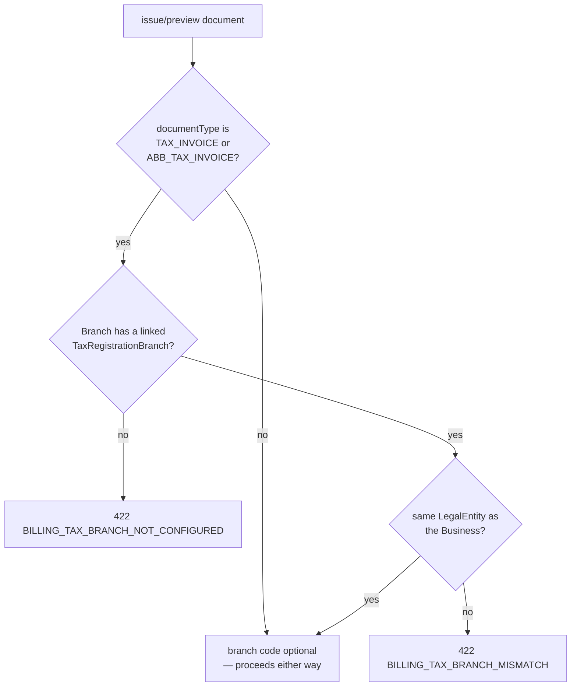

# FR-194 — LegalEntity under Tenant, and TaxRegistrationBranch split from Branch

| Field | Value |
|---|---|
| **Version** | 1.0.0 |
| **Status** | Implemented |
| **Date** | 2026-09-12 |
| **Relates to** | ADR-078 D2, D3, ADR-018 D4, BR-034 |

## Defect A — LegalEntity sat above the isolation boundary

`LegalEntity.portfolioId` was `NOT NULL` with **no `tenantId` column at
all**. BR-001 makes Tenant the isolation boundary; a table with no `tenantId`
is a table a Postgres RLS policy cannot scope, and two Businesses in
**different Tenants** could reference the same `LegalEntity` row.
`billing-invoice-service.js` compensated in application code with a portfolio
comparison and a `409 BILLING_SHARED_LEGAL_ENTITY` refusal — the first of
those two is retired by this change; the composite FK now makes the ancestry
question a database invariant instead of an application guess.

## Defect B — a Branch is not a tax registration

Under Thai law (ประมวลรัษฎากร มาตรา 86, แบบ ภ.พ.20) a 5-digit VAT branch
code belongs to a **legal entity's tax registration**, not to an operating
site. `Branch.taxBranchCode` let any Branch carry one — a warehouse
included — and two Businesses sharing one `LegalEntity` could each stamp a
`'00000'` (head office) onto their own Branch with nothing to stop it, making
ภ.พ.30 reconciliation by `(tax id, branch code)` untrustworthy against this
system's data.

Both tables carried zero rows in production at the time this ADR was
authored (unable to be independently re-confirmed live from this session —
see ADR-078's Consequences), so this is DDL-only: no data reshaping, only a
re-asserted precondition that aborts the migration if it no longer holds.

## Model

`Business(id, tenantId)` already carries the `UNIQUE` ADR-077 D4 added;
`Business.legalEntityId` now has a composite FK to `LegalEntity(id,
tenantId)`, so a Business can only reference a LegalEntity in its own Tenant.
SQLite (dev/test) has no compound-FK equivalent for `prisma db push` to
enforce, so `createBusiness` — the one place `Business.legalEntityId` is
written — carries the same check in application code.

## Billing refusal table (`billing-invoice-service.js`)

The `409 BILLING_SHARED_LEGAL_ENTITY` refusal (two Businesses editing one
shared `LegalEntity`'s address) is unchanged — it was never about the
isolation defect this ADR repairs.

## Explicitly unchanged

`pos-cashier-service.js` reads `Branch` as an operating site for the POS
terminal catalogue and needed no tax-registration logic; its Branch select
drops the now-removed `taxBranchCode` column and adds `kind`.

## Acceptance

| ID | Criterion |
|---|---|
| AC-194.1 | `LegalEntity` carries `tenantId`, not `portfolioId`; `Portfolio.legalEntities` no longer exists |
| AC-194.2 | `createBusiness` refuses `422 LEGAL_ENTITY_TENANT_MISMATCH` when `legalEntityId` names a LegalEntity outside the caller's own Tenant |
| AC-194.3 | A `Branch` with `kind: WAREHOUSE` and no `taxRegistrationBranchId` is a valid seller for `INVOICE`/`RECEIPT` |
| AC-194.4 | The same Branch refuses `422 BILLING_TAX_BRANCH_NOT_CONFIGURED` for `TAX_INVOICE`/`ABB_TAX_INVOICE` |
| AC-194.5 | A Branch linked to a `TaxRegistrationBranch` belonging to a **different** `LegalEntity` than its own Business refuses `422 BILLING_TAX_BRANCH_MISMATCH` |
| AC-194.6 | Two `TaxRegistrationBranch` rows under the same `LegalEntity` cannot share a `branchCode` (`@@unique([legalEntityId, branchCode])`) |
| AC-194.7 | `Branch.taxBranchCode` no longer exists as a column |
