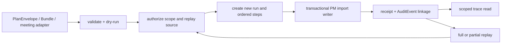

# FR-069-P1 — Project Manager execution trace and append-only replay

## Entry condition and predecessor

The owner-approved ADR-102 design is the entry condition. Existing
PlanEnvelope, ExecutionPlanBundle and PlanImportReceipt contracts remain
available. This phase owns the PM trace slice only; Approval Gateway and
FUNG/Lalin producer work remain separate successors.

## Input

An authorized PM intake after validation/dry-run, with the resolved tenant,
business, workspace and Project scope; the canonical execution contract and
stable plan/work/container/work-item references; correlation and idempotency
keys; and, for replay, an authorized source run plus `full` or `partial`
selection.

## Output and next handoff

The phase adds the PM-owned `ProjectExecutionRun` and
`ProjectExecutionStep` ledger, links the existing `PlanImportReceipt` to the
terminal trace identity, exposes scoped read/replay routes, and keeps the
existing import writer as the only business mutation path. The next handoff is
Approval Gateway admission and later meeting/action producer integration.

The execution flow is:

## Failure, retry and acceptance

| Acceptance | Required proof |
|---|---|
| Stable trace | Every committed run has an execution contract, run, step, attempt and audit linkage; IDs are not business-work IDs. |
| Failure localization | A failed step exposes `failureCode`, bounded `errorRef`, `retryable`, audit linkage and downstream `SKIPPED`/`NOT_STARTED` states. |
| Idempotency | Same scoped key and payload hash return the original receipt; a conflicting hash fails without a second Project mutation. |
| Replay safety | Full and partial replay create new IDs, preserve source lineage, revalidate scope/input hashes and never mutate the source run. |
| Bounded evidence | Snapshot and hash limits reject oversized/non-canonical data and never persist transcript/audio/provider secrets. |
| Scope safety | Cross-business/workspace/project reads and replays return the existing typed authorization refusal shape. |
| Compatibility | Existing plan-import, bundle, audit, route and Docker health tests remain green. |

Retries are represented by new step attempt identities and linked source-step
references; they do not overwrite a terminal step. A transaction failure rolls
back business writes, then records the failed run with no partial Project
graph. A replay conflict or expired authorization stops before mutation.

## Exit criteria

The phase can be promoted from candidate only after the schema/migration twin,
focused trace/replay tests, full relevant Server tests, governance/build and
Docker compose health/API smoke evidence are recorded. Production migration,
external producer activation and Approval Gateway policy are explicitly not
implied by a local or Docker pass.

## CHANGELOG

| Version | Date | Status | Summary | Commit Hash | Agent |
|---|---|---|---|---|---|
| 0.1.0b | 2026-09-22 | candidate | Register the approved PM execution trace and replay implementation slice | uncommitted | RWANG |
