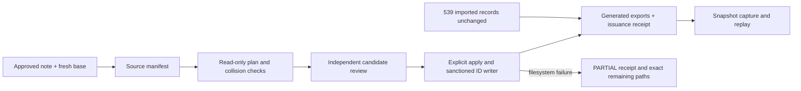

# Canonical document record format

**Status:** Approved migration implementation contract, lane deliverable v0.1.0.  
**Source revision:** zuri-ai `a34ceaf79c112e02b1bcfdbf0a84122d835b002e`.  
**Identity rule:** existing zuri-ai keys remain `ZAI` namespace identities. This format does not import zuri-next declarations or mint IDs.

## Canonical locations

- One FEAT record: `docs/features/FEAT-nnn/feature.md`.
- One FR record with an explicit existing FEAT membership from a FEAT registry row: `docs/features/FEAT-nnn/requirements/FR-nnn.md`.
- An FR with no explicit FEAT membership and all NFR, BR, SEC and SDD records: `docs/requirements/<ID>.md`. No membership or owner is inferred from a folder, related prose, or code.

The contents in this first migration are exact projections of the existing rows. This adds independent locators without rewriting statement, status or approval meaning. Feature directories do not imply a domain owner.

## Canonical Markdown record

Each record has only explicit identity/provenance metadata and one fenced copy of its original registry row. Example:

```markdown
---
id: FR-091
namespace: ZAI
family: FR
version: 1
status: source-preserved
source_revision: a34ceaf79c112e02b1bcfdbf0a84122d835b002e
source_path: docs/PRD-SDD-v1.0.md
source_row_eol: LF
source_row_sha256: <sha256 of the exact original row bytes, including LF>
statement_cell: 2
requirement_cells: []
feature_id: FEAT-009
---
# ZAI:FR-091

<!-- canonical-row:start -->
```text
| FR-091 | original requirement statement | original status |
```
<!-- canonical-row:end -->
```

The metadata values are plain scalars except `requirement_cells`, a JSON-style integer array. `feature_id` is present only for an FR directly listed in a single existing FEAT row. If a FEAT row lists the same FR more than once, or two FEAT rows list it, bootstrap fails for review; it never picks one. `subject_anchor` is copied from the existing ID ledger when present and is informational: the ledger remains unchanged and authoritative. H1 is ID-only, so it cannot accidentally replace the published subject.

The row payload in `parseCanonicalRecord().row` includes its exact source line ending. The body line ending used to store Markdown may be normalized by Git; `source_row_eol` lets the parser reconstruct and hash the original source bytes. The legacy export renderer uses the destination template's line ending so its full-file bytes match the current checkout's original export. `source_row_sha256` therefore remains stable across checkout EOL settings while still detecting a changed source row. Every canonical record carries `version: 1` and `status: source-preserved`; the status describes the imported record only and does not replace the row status.

`statement_cell` and `requirement_cells` are zero-based offsets into `cells`; cells retain the table's leading/trailing empty positions and their content is trimmed for consumers. The source row itself is never normalized. Current table positions are `2` for statement in FR/NFR/BR/SEC/SDD rows, `2` for FEAT's description, and `3` for FEAT's FR membership. Only FEAT uses `requirement_cells: [3]`. The raw row remains available for exact export and evidence.

## Generated index

`registry/document-registry/index.json` is generated by `tools/document-registry.mjs`; do not edit it by hand. Version 1 has this shape:

```json
{
  "version": 1,
  "sourceRevision": "a34ceaf79c112e02b1bcfdbf0a84122d835b002e",
  "records": [
    {
      "id": "FR-091",
      "namespace": "ZAI",
      "family": "FR",
      "recordVersion": 1,
      "status": "source-preserved",
      "path": "docs/features/FEAT-009/requirements/FR-091.md",
      "sourcePath": "docs/PRD-SDD-v1.0.md",
      "sourceRowSha256": "<sha256>",
      "recordSha256": "<sha256 of canonical file bytes normalized to Git's LF blob bytes>",
      "statementCell": 2,
      "requirementCells": [],
      "featureId": "FEAT-009",
      "exportDocument": "docs/PRD-SDD-v1.0.md",
      "exportOrder": 91
    }
  ]
}
```

`exportOrder` is zero-based row order within `exportDocument`, counting only selected declarations. The source row's location is kept by an ID placeholder in the template, so separated FR tables remain separated and are reconstructed byte-for-byte. `recordSha256` hashes the canonical Markdown in LF form matching a committed Git text blob, independent of Windows checkout EOL conversion. `parseCanonicalIndex(text)` requires version 1, a full source revision, valid `ZAI` records and unique namespace+ID and path; it tolerates extra top-level and record fields for additive manifest metadata. In this active index the namespace is strictly `ZAI`; the approved `ZNEXT` import remains in a separate provenance manifest.

## Legacy exports and templates

The current `docs/PRD-SDD-v1.0.md` and `docs/FEATURES.md` remain compatibility projections. Each original row is replaced in the template at its current location by exactly one `{{CANONICAL_ROW:<ID>}}` placeholder with no extra line ending. The templates preserve all non-row bytes and the original order, including version histories and code fences. The generator substitutes the exact stored row and verifies that every extracted declaration matches its ledger family/source, with one-to-one placeholders and records. It does not add a banner or rewrite any other source text. The first generated output must be byte-identical to the pre-migration files.

The templates in `registry/document-registry/` are projection scaffolding, not alternate sources for record content. A later record addition or retirement must update the canonical record and its projection slot through the document-registry workflow; generated exports and index stay machine-owned.

## Shared parser API

`apps/server/scripts/document-registry-format.mjs` is a pure Node built-in-only parser shared by the CLI, application verifier and tests:

- `splitRow(row)` → cells retaining leading/trailing empties; matches the legacy registry splitter: escaped pipes are unescaped and backticks have no special role.
- `parseCanonicalRecord(text)` → `{id, namespace, family, recordVersion, status, row, cells, statement, requirementKeys, sourceRevision, sourcePath, sourceRowEol, sourceRowSha256, statementCell, requirementCells, subjectAnchor?, featureId?}`. It accepts one record only, verifies the explicit row fence and exact source-row SHA-256, and uses declared cell indexes rather than a family/ID guess.
- `parseCanonicalIndex(text)` → `{version, sourceRevision, records}` with normalized required record fields and tolerated unknown fields; refuses an unsupported version, non-ZAI active record, duplicate `(namespace,id)`, or duplicate path.

The module reads no files, consults no environment, and mutates no state. `tools/document-registry.mjs` owns filesystem access and the `--write` / `--check` workflows. Its public `readCanonicalRegistry()` API returns the parsed records to graph/runtime integrations.

The initial source row and provenance are preserved. Authors may add explanatory
links outside that row. `--write` recomputes the derived record-file digest from
the actual canonical file, then regenerates the index and exports. `--check`
refuses stale digests. Neither mode repairs a changed source-row hash or a changed
identity; such a change requires its own reviewed record migration. The exported
`writeCanonicalProjections(root, {check})` applies the same rules to an explicit
checkout, without editing a source record.

`--adopt` is an initial migration operation: it reads the pinned source Git blobs
and refuses a checkout whose compatibility registries differ from that pin. It
cannot label newly authored rows as if they existed in the historical revision.

Version diff 0.1.0 → 0.1.1: separates a derived file digest from immutable source-row
provenance, allowing canonical explanatory edits without making the index a manual
second source. Initial row content and compatibility export bytes remain unchanged.

## Additive authored records — approved writer scope (2026-10-05)

The owner approved [the authored-record tooling](../../change-requests/marketing/ZURI-GO-RECORD-AUTHORING.md) v0.2.0. Version-1 imported rows/provenance remain unchanged. Version-2 canonical records are active, genuinely authored standalone FR/SDD statements; their delivery cell is `planned`, not implemented. This first writer is add-only, up to four records, with no feature-membership changes.

The v2 wrapper declares `superseded_by: null`, `provenance: authored`, `authored_base_revision`, `approval_revision/path/version/sha256`, `migration_id`, `manifest_path/sha256`, `row_sha256`, `statement_sha256` and `subject_anchor`. Its bounded row has ID, exact statement and `planned`, with a declared LF digest. It cannot carry historical `source_revision/path/row_sha256` fields. The v2 generated index holds both v1 and v2 records; `sourceRevision` still identifies the original import, while each authored entry carries its own explicit provenance. Original template placeholders and row order remain intact; authored rows are appended in a separate generated section.

The source manifest is `docs/migrations/document-reintegration/record-migrations/<name>.manifest.json`. It carries version 1, migrationId, base commit/index/ledger digests, the pinned approved note's locator/version/revision/digest and candidate records (ID, family, exact statement/digest/anchor). The integrator checks fresh main for collisions before choosing candidates. Approval and record issuance remain separate from application delivery.



Use `node tools/document-record-migration.mjs --plan <manifest-path>` first, then explicit `--apply` after candidate review. Apply rechecks base/approval preconditions, refuses existing/burnt/reserved IDs, inherited subjects, namespace/family/path escapes and unsupported membership changes before writing. It invokes the existing add-only `id-ledger.mjs --write`; neither a generator nor a gate hand-patches the ledger. The frozen `<name>.approval.md` is exact evidence of the approved note revision, not a second authoring source. The note may later evolve without rewriting that evidence. Both it and the source manifest are digest-checked by record readers.

`<name>.receipt.json` records APPLIED, source manifest digest, original base digests, issued IDs and before/after output digests. Identical reapplication verifies the existing output and is a no-op; changed input/drift or a PARTIAL receipt fails. No atomic-filesystem claim is made. A failed apply emits a recovery receipt with exact changed source paths and the receipt locator; inspect those paths and restore/reconcile them explicitly before another reviewed attempt. Do not use a broad clean/reset or delete historical IDs to hide the failure.

Snapshot schema versions remain separate from record/index versions. Existing snapshot v1 manifests and proofs stay unchanged. The canonical snapshot v2 reader validates each record's provenance, reads the sealed approval/manifest as digest-bound evidence, and verifies authored base/approval commits and the original approved note in the bound Git history before issuing/replaying a proof. This extends canonical reading without rewriting stored snapshots or promoting a planned receiver into delivered behavior.

Version diff 0.1.1 → 0.2.0: adds the owner-approved authored record/index format, sanctioned manifest writer and per-record snapshot provenance checks. The initial import contract and version-1 reader remain unchanged.

## Acceptance

The bullets below describe the initial import. Authored-record acceptance additionally follows the approved tooling proposal's preservation, failure and snapshot checks.

- Initial adoption extracts exactly every selected declaration in the two source registries, with no generated zuri-next content and no unclassified selected row.
- FEAT/FR/NFR/BR/SEC/SDD IDs and current subject anchors match the source registry and existing `.id-ledger.json`; no ID ledger or history is rewritten.
- `--write` makes both compatibility exports byte-identical to their pre-migration bytes and writes a deterministic index; `--check` passes against those outputs.
- Duplicate/missing IDs, duplicate/missing placeholders, ambiguous FEAT membership, malformed row fences, invalid family/path/namespace, altered source row hashes and stale output fail closed.
- Focused `node --test tools/tests/document-registry.test.mjs` passes.

This format document is the documentation-first contract for this lane. It does not describe zuri-next as active authority and does not approve a product behavior change.
