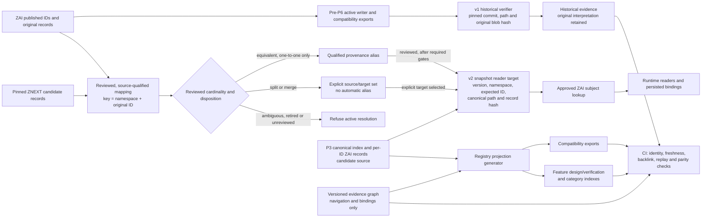
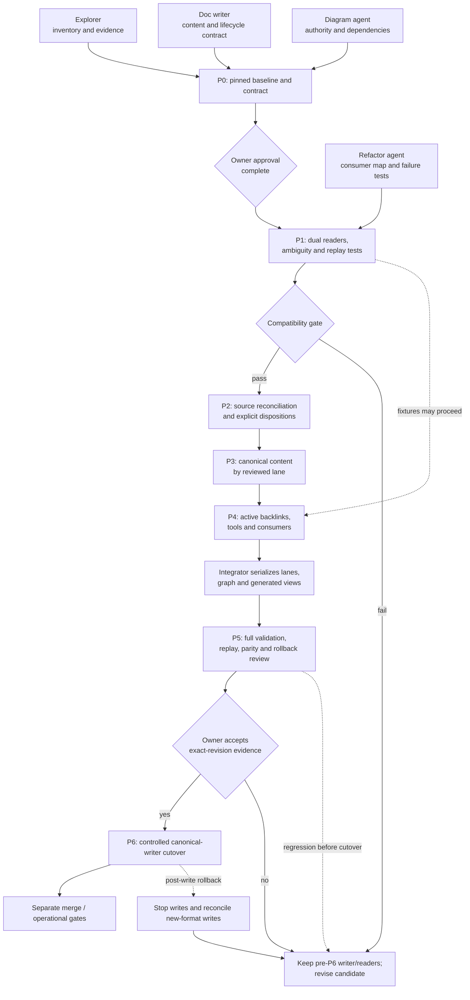

# Reintegration diagrams

**Version:** 0.2.0
**Status:** Target design under the owner-approved migration; not all readers or gates are implemented.

## Identity, historical reads and generated views

The v1 verifier is bound to its historical source snapshot and never follows a
crosswalk. The v2 reader is a separate versioned target, not yet an active cutover;
provenance alone cannot bind runtime behavior. Generated views display canonical
statements and graph bindings; they do not declare requirements, approve a mapping,
or prove a test passed.

## Migration gates and roles

P0 contract approval is complete. P1 compatibility work and P3 canonical-view work
are in progress; the remaining reconciliation, consumer, integration and cutover
gates are not complete. Before P6, the existing writer remains selected. After any
new-format writes, rollback requires stopping and reconciling them before restoring
the prior selection. Merge and production remain separate decisions.

The four specialist roles are Explorer, Refactor agent, Doc writer and Diagram
agent. The integrator owns serialized shared outputs; the human owner approves
authority decisions and the exact-revision acceptance gate.

## Evidence and version diff

The design follows the owner-approved [proposal](PROPOSAL.md),
[integration contract](INTEGRATION.md), and
[governance profile](GOVERNANCE-PROFILE.md). The current canonical-input evidence
is the 539-record ZAI index at source revision
`a34ceaf79c112e02b1bcfdbf0a84122d835b002e`; the frozen graph is version 2.0.0.
Those inputs do not prove P2 reconciliation, P5 acceptance or P6 cutover.

0.1.0 → 0.2.0: distinguish pre-cutover writer authority, v1 historical verification,
the v2 candidate reader, generated projections, current phase gates and owner review.
No historical blob, ID, or runtime binding is rewritten by this diagram.
