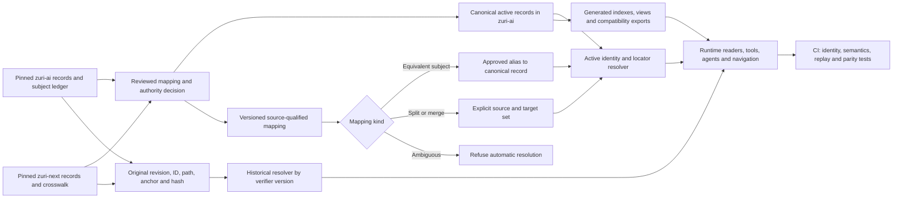
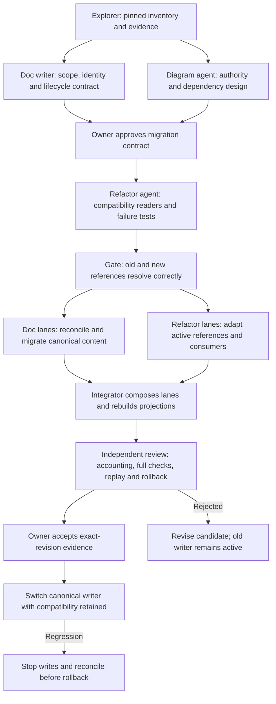

# Proposed documentation migration architecture

**Version:** 0.1.0

**Status:** Proposed, not implemented. Read with [the migration contract](PROPOSAL.md).

## Authority and reference resolution

The proposed `ZAI` and `ZNEXT` namespaces preserve source identity; a matching suffix
does not establish equivalent meaning. A split mapping does not let a reader choose
an arbitrary child. Each reader must request an explicit target or the original
aggregate contract. Historical proof uses the original source bytes and verifier,
not the latest generated compatibility export.

Bare CR intake remains proposal material; pinned project change records retain
their governed identity. Neither imported status nor generated navigation grants
approval or proves delivery.

## Migration dependencies and roles

The four specialist roles use Luna at max reasoning. Each implementation writing
lane owns its own branch/worktree; the integrator serializes shared ledger and
generated-file changes. Review decisions are per approved scope and recorded
disposition, not an automatic approval prompt for every file operation.

Before cutover the old writer remains active. After new-format writes begin,
rollback must account for those writes before changing the authority selection.
No step rewrites Git history or historical snapshot hashes.

## Provenance and version diff

Derived from the diagram agent's assessment and reviewed against the proposal's
P0–P6 phases, current zuri-ai AGENTS.md section 18 and ADR-039, and the source
zuri-next identity/graph standards at the revisions pinned in the proposal.

0.0 → 0.1.0: proposed authority/resolution flow and migration dependency diagram.
No resolver, schema or runtime implementation is introduced by these diagrams.
