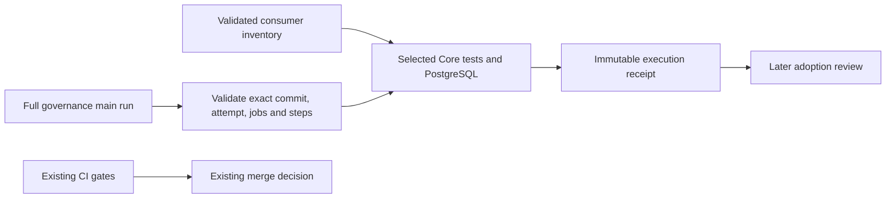
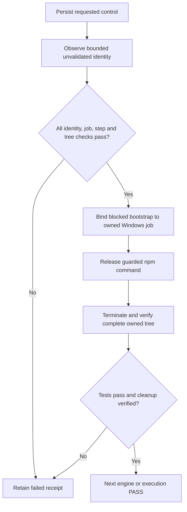

# Q1: Runtime consumer qualification

The owner approved Q1 on 2026-10-07 after reviewing the source inventory and
comparison proposal. Baseline main is a787834ea422363f3eaf7fbdf472c53eb6c7d2be,
tree 8c84e5066e7528f3f58d00fb940705ad7be5417f. Q1 adds execution evidence to the
shadow pilot; ordinary CI selection and required contexts are unchanged.
The [policy](../../architecture/VERIFICATION-POLICY.md) owns the contract and
[Runtime testing](../../services/conversation-runtime/TESTING.md) owns consumer rationale.

## Delivery and authority

Metadata/report v2 retains discovered Core tests and adds three explicit Core-only
semantic checks. The baseline union is 18 files. Contract changes are ineligible
for narrow shadow planning. HTTP dependencies and persisted invariants are part
of the consumer review; the count is not a completeness certificate.

The [manual workflow](../../../.github/workflows/scoped-verification-qualification.yml)
uses the [qualification helper](../../../scripts/verification-qualify.mjs).
It runs the selected Core profile and the existing PostgreSQL package command
against disposable test databases. Main's successful governance run supplies
the full control at the same commit/tree.

No edge connects this receipt to the merge decision. Core authority, schemas,
production routing, package manager, service extraction and test-result caching
are outside this change.

## Execution and evidence

1. Run `node --test tools/tests/verification-plan.test.mjs tools/tests/verification-qualify.test.mjs`
   and the existing Server selector regression. Run Runtime package test/build.
2. Generate required documentation state, run the validated Core union through
   the existing guarded Server test command, and run `npm run test:postgres`
   from apps/server. Keep every report and its engine identity.
3. Run governance and independently review the composed patch. Ordinary main CI
   must pass after integration, including full Server tests/build and Runtime
   image/drain. Do not substitute a related-test PR for the full main control.
4. Once the manual workflow exists on main, dispatch it on main with the matching
   governance `control_run_id`. If main moved, select a completed full run for
   that main revision; do not change the receipt's head to make it fit.
5. Retain the artifact `runtime-qualification-<run_id>-<attempt>` and reconcile
   this record with actual results. One initial manual run is in scope. Diagnose
   a failure before any rerun and retain its original receipt.

The workflow checks out github.sha with read-only contents/Actions permissions
and no persisted checkout credentials. It uses Node 24 for Edge installation,
then Node 22 for Server tests, Windows runners and the existing dependency keys.
It restores but does not save dependency caches. Checkout/setup/install/graph
durations remain available in GitHub job steps; the helper records command/engine
durations, actual current toolchain/cache facts and control job/step intervals.

The helper invokes Node's npm CLI through argv and supplies selected paths via
the existing ZURI_RELATED_TESTS_FILE interface. The existing assert-tests-ran
wrapper creates a report. Every selected file must contain passing executed
assertions; missing/zero/failed reports or command failure invalidate qualification.
PostgreSQL retains both WorkToolPort and memory-erasure due-query tests from the
existing config. The helper does not pass GITHUB_TOKEN or DATABASE_URL to tests.

The owner approved the two helper review repairs on 2026-10-07. The Windows
adapter owns a non-breakaway Job Object and releases a blocked bootstrap only
after binding it. Every completion path terminates and verifies its owned tree;
wrapper exit alone does not prove cleanup. A passing engine requires zero active
members and VERIFIED cleanup. The [policy](../../architecture/VERIFICATION-POLICY.md)
defines the command, startup, cleanup and watchdog bounds. The original 600-second
command and 20-minute job budgets are unchanged.

Requested control identity exists before fetching. Allowlisted observations remain
UNVALIDATED even on failure; HTTP failures keep status and endpoint role, and an
attempt change keeps both identities. receipt.control is assigned only after tree
validation too. No observed record can select an engine or enable omissions.

Run the focused Windows acceptance command separately:
`node --test --test-timeout=120000 tools/tests/verification-process-win.test.mjs`.
Each synthetic case is limited to 15 seconds, with a 120-second outer runner bound.
Fixtures cover normal exit, a detached grandchild outliving its parent, wrapper and
descendant timeout, native containment rejection, cancellation and bootstrap spawn
failure. An unrelated live sentinel must survive every case. The rejection fixture
injects an invalid native handle only into a temporary adapter copy; production has
no containment bypass. These fixtures launch no Core/database profile.

A receipt records source commit/tree; workflow, planner, metadata, lockfile and
test-file hashes; control/run identities and attempts; engine results/counts;
command exits; durations and failures. It always has omissionsAllowed=false and
scopeAdoptionQualified=false. Output directories cannot overwrite an existing
receipt. Each engine report is preserved before the next command overwrites the
guard's internal report. Missing/cancelled artifacts are not PASS.

GitHub API job metadata does not establish a control cache hit or actual Node
version. These facts remain UNVERIFIED unless separately evidenced. The helper
therefore classifies its initial timing comparison as INCONCLUSIVE. A profile
duration is not end-to-end CI speedup. A profile executed on a control-plane
commit does not close a real Runtime-only change qualification case.

The workflow requires a default-branch definition before manual dispatch:
[GitHub manual workflow documentation](https://docs.github.com/en/actions/how-tos/manage-workflow-runs/manually-run-a-workflow).
Control jobs use the attempt-specific paginated
[GitHub jobs API](https://docs.github.com/en/rest/actions/workflow-jobs#list-jobs-for-a-workflow-run-attempt).

## Acceptance cases

| Case | Required outcome |
|---|---|
| Runtime code/test only, with optional declared SERVICE/TESTING doc | Shadow eligible; discovered plus explicit consumers |
| Allowed documentation only | Ineligible: no Runtime implementation input |
| Wire contract / Core authority / canonical document / shared config / new service | Conservative existing selection; no narrow candidate |
| Delete / rename / opposing staged and working edits | Preserve changed/deleted evidence; no hidden Core input |
| Missing base or empty diff | Planning error, no omission authority |
| Empty discovery with nonempty declarations | Not an eligible candidate; execution refused |
| Invalid metadata, missing file, duplicate or escaped declaration | Validation error |
| Mismatched main SHA/tree, wrong workflow/event, wrong attempt | Control rejected; requested/observed provenance retained |
| Incomplete pagination or missing/failed/cancelled/skipped required job | Control rejected; pagination/job observations retained |
| Skipped full test, PG, Runtime image or drain step | Control rejected |
| Zero tests, missing selected file, failed command or failed PG after SQLite passes | Qualification fails and preserves engine evidence |
| Successful selected profile | Execution PASS only; activation remains false |
| Timeout, cancelled command or unverifiable descendant cleanup | FAIL; preserve lifecycle/logs/report, next engine NOT_RUN |
| Containment cannot be established | FAIL before test payload launch |

## Verification record

Local implementation checks on 2026-10-07 (Asia/Bangkok), based on a787834:

| Check | Observed result |
|---|---|
| Planner and qualification regressions | PASS, 81/81 |
| Runtime package tests and boundary build | PASS, 73/73; build passed |
| Documentation migration/readers | PASS, 78/78 |
| Original composed governance | PASS, 0 critical and 4 warnings; initial pass had 5 before reconciliation |
| First selected SQLite run, 18 files | FAIL: helper timeout after 600,013 ms; no completed JSON report |
| PostgreSQL at the first SQLite failure | NOT_RUN at that checkpoint: stopped after SQLite failure |
| Isolated existing-case diagnostic | FAIL: 0 passed, 1 failed, 28 skipped; 245,134 ms; existing 30-second test limit |
| First independent implementation review | CHANGES_REQUIRED: two P2 helper failure-path findings |
| Helper repair control regressions | PASS, 92/92 at the local repair checkpoint |
| Helper repair native lifecycle regressions | PASS, 8/8 (seven cases plus parent), 10,765 ms total |
| Helper repair composed governance and independent follow-up | PASS, 0 critical/4 warnings; both P2 findings closed at the helper repair snapshot |
| Current storage-controlled memory/group file | PASS, 29/29, zero failed/skipped; 88,470 ms including startup |
| Current selected SQLite profile, 18 files | PASS, 394/394, zero failed/skipped; 270,069 ms including startup |
| Temporary fixture restoration | PASS; original physical directory and failed DB/journal hashes restored |
| Current PostgreSQL qualification | PASS, 27/27 across both existing files, zero failed/skipped; 37,747 ms |
| Hosted qualification, initial attempt | PROFILE_EXECUTION_PASS on cd1a8694: SQLite 394/394, PostgreSQL 27/27; both cleanup VERIFIED |

The local toolchain was Node 24.16.0, not the manual workflow's Server Node 22.
The retained SQLite log reports schema setup at 86.72 s, the memory/group/GKS
file at 310.131 s (29 tests, one 30-second test timeout), WorkToolPort at 86.315 s
(23 tests passed), and memory at 66.145 s (28 tests passed). These partial log
observations are not a completed 18-file execution receipt or aggregate PASS.
The failed case is the erasure-scanner bound with accumulated FAILED records.
The deeper cause was unconfirmed at that checkpoint. The separately approved
one-case diagnostic reproduced the timeout without the full-profile sequence:
schema setup 103.14 s, the case 37,869.1019 ms, and SQLite query timeouts in
afterEach/afterAll. Its complete JSON report is retained. That failure remains
FAIL; the subsequent controlled execution below is a separate result.

After the owner requested the remaining SQLite fix, current source inspection
reconciled the existing [local storage RCA](../../../.brain/rca/2026-10-06-local-verification-sqlite-latency.md).
The target test, schema, setup/configuration, trace writer and erasure source
matched that earlier controlled experiment. A fresh C:/O:/C: probe measured
20 independent insert transactions at 72 / 1,240 / 98 ms respectively, with
the same synchronous=2 and journal_mode=delete settings. The Q1 fixture directory
was physical on O:; inherited TEMP/TMP already pointed to C:.

Redirecting only the disposable SQLite fixture directory to a private C:
directory produced the 29/29 targeted pass and then the complete 394/394,
18-file profile pass. Schema setup took 3.39 s and 3.56 s; the previously failing
case took 1,739.0529 ms in the targeted file. Assertions, existing 30-second
test/hook limits and the 600-second profile bound were unchanged. Both commands
used the standard zero-work guard and repaired Job Object supervisor; cleanup
was VERIFIED with zero active members. The 14-file helper snapshot and all 18
selected-test hashes matched before and after both executions.

This verifies a storage-dependent local timeout and environment remedy. It does
not identify physical device/driver cause or a hosted speedup. The 29 targeted
tests are part of the 394 and are not additional unique coverage. The temporary
junction was removed, and the original directory plus failed database/journal
were restored byte-identically; separate immutable evidence copies also remain.
There is no permanent fixture-path configuration change. Future local validation
must explicitly prepare its private fast fixture directory again.

Local evidence is retained in the task workspace at
architecture/scoped-verification-adoption-v0.1.0/implementation-evidence/
local-sqlite-repair-20261007-01. Its selected-core/receipt.json SHA-256 is
8cc4873dfdea44150197a8c93f9a55ff0fcb68c3f8ce7b1d16be5bf0159b1fc2;
selected-core/report.json SHA-256 is
66fa9330ce49aee3d45463e107dae137d4851b25b727ce331d729291a85ee9f0.
These local artifacts are not portable hosted qualification evidence.

The owner's subsequent continuation completed the existing PostgreSQL package
command once. Both WorkToolPort and memory-erasure due-query files passed:
27 assertions, zero failed/skipped, in 37,747 ms. Actual embedded engine was
PostgreSQL 17.10; local Node remained 24.16.0. The existing 30-second test,
120-second PG hook and 600-second command limits were unchanged. Global setup
created its own private loopback cluster beneath a per-command C: TEMP/TMP
directory. Inherited connection variables were removed from that child.

Owned-process cleanup was VERIFIED with zero remaining members, and no cluster
directory remained after teardown. All 14 staged source files and the separately
captured PG test/setup/schema inputs matched their pre-run hashes. No application,
fixture or helper implementation changed. The local evidence directory is
implementation-evidence/local-postgres-20261007-01 under the same task workspace;
receipt.json SHA-256 is
7c71b449eb952a54d357136e8a19fb0444fe467143cb41f8c7cc41632994f3d7 and
report.json SHA-256 is
2f26390f7de47b0da193a97707115f7b3ff4a7795a5db6bc9433df198568d77d.
SQLite and PG are separate engine executions; these results are not one hosted
manual qualification or a Node 22 parity claim.

The first synthetic helper run exposed a blocking Console.In.ReadLineAsync call;
the corrected supervisor uses a worker task. A second run exposed an ineffective
early-parent fixture, whose Node parent killed its ordinary direct children itself.
Detached synthetic descendants now exercise the enclosing job's containment. Both
failed attempts and the subsequent passing run are retained. See the
[helper RCA](../../../.brain/rca/2026-10-07-q1-helper-failure-evidence.md).

The helper repair's composed governance and same-reviewer follow-up completed
against its immutable snapshot; both findings were closed. Previous Runtime
(73 tests/build) and reader (78 tests) evidence
is historical and was not rerun for these isolated helper changes.

The preceding local checks describe the uncommitted implementation checkpoint. The first local
receipt and raw log are retained in the task workspace under
architecture/scoped-verification-adoption-v0.1.0/implementation-evidence/
local-core-20261007-first. Its source inventory is preserved and does not claim
a committed Q1 revision. Local SQLite and PostgreSQL passed before integration;
IMPLEMENTED_QUALIFICATION_NOT_RUN was the status at that checkpoint. The hosted
result below is separate evidence. Original failures remain preserved, and a
successful local profile cannot bypass required PR/main checks.

## Hosted execution checkpoint

[PR #639](https://github.com/Freshair129/zuri.ai/pull/639) integrated the reviewed
implementation after all required checks passed. The normal merge produced
cd1a869456bf49492bd1824a2cee4c8fcf5552b3 with tree
8c163bcfd52b6c08751013690752356ae8d3844d, identical to the reviewed source tree.
The successful full main-push [control run 37596758576](https://github.com/Freshair129/zuri.ai/actions/runs/37596758576),
attempt 1, contains all four full Server shards, PostgreSQL, governance, build,
all three services, Runtime image/drain and the aggregate verify job.

The one initial manual [qualification run 37597880065](https://github.com/Freshair129/zuri.ai/actions/runs/37597880065),
attempt 1, passed on the same commit/tree. Its receipt reports
PROFILE_EXECUTION_PASS. Windows hosted control regressions, native lifecycle
regressions and graph generation passed before engine execution.

| Engine | Executed result | Command duration | Owned-process cleanup |
|---|---|---|---|
| SQLite selected Core profile | 394 passed, 0 failed/skipped, 18 files | 160,633 ms | VERIFIED, zero remaining members |
| PostgreSQL existing package command | 27 passed, 0 failed/skipped, 2 files | 35,402 ms | VERIFIED, zero remaining members |

These are separate engine results, not 421 unique tests. The qualification runner
reported Server Node v22.23.3, Edge Node v24.21.0, Windows X64 image
win25-vs2026 / 20260925.250.1, and hits for both existing dependency caches.
Control cache class and actual Node version remain UNVERIFIED in the receipt;
timingComparison remains INCONCLUSIVE. Command durations do not establish
end-to-end CI speedup.

Artifact runtime-qualification-37597880065-1 was downloaded and retained under
the task evidence directory implementation-evidence/hosted-q1-20261007-01/artifact.
The artifact API reports archive digest
sha256:a4f3428dbb8abce96c08328c53981cbe654a28180d9916dbbda8d62e12c83541;
the extracted receipt.json SHA-256 independently computed locally is
50bfbe274b897ec49e73dd486cfc86b39a5f512fe1ccf270c09dcdac1cbbcce4.
The SQLite report SHA-256 is
3642a7836c9a3c582e63cac722cd5198c06dafe70794331cd52e29d7ed766cdb;
the PostgreSQL report SHA-256 is
8359cfd088dc25f069a9d83a3ce4f0d691aa3c8111a7f55c7e55a44fd76d874a.
Exact file membership, fresh passing reports, process/adapter cleanup, and 31
receipt input hashes were checked against the qualified Git commit. PowerShell
checkout hashes use the CRLF form explicitly required by .gitattributes.

This closes the initial Q1 profile execution at the named revision. It does not
qualify later commits automatically. omissionsAllowed and scopeAdoptionQualified
remain false; the control-plane change is not a Runtime-only adoption case.
Ordinary CI selection and required checks remain unchanged, and Q2 is inactive.

The historical [pilot record](PILOT.md) remains unchanged; its receipts are not
Q1 implementation evidence. The [consumer-discovery RCA](../../../.brain/rca/2026-10-06-runtime-consumer-discovery-gap.md)
documents why literal discovery alone was insufficient.

## Rollback and later activation

Rollback disables the manual workflow and reverts metadata v2, its loader and
report tests together. Keep historical receipts. Active merge conditions do not
consume Q1 output, so a failed benchmark cannot authorize an omission.

Q2 requires actual Runtime-only and Runtime-plus-doc pairs, the complete fallback
matrix, review of non-import consumers and a trusted-plan aggregate gate. It must
explicitly decide how the expanded consumer set reaches active CI. Main/release
full checks and existing E2E/engine/scanner safeguards remain required.

Version diff 0.2.0 -> 0.3.0: reconciles completed helper review, the current local
SQLite storage diagnosis, the 394-test selected-profile pass and restoration.
PostgreSQL, hosted qualification and Q2 activation remain unverified.
Version diff 0.3.0 -> 0.4.0: records the bounded 27-test PostgreSQL pass, verified
cluster teardown and unchanged source. Local engine verification is complete;
integration and hosted qualification remain pending, with Q2 still inactive.
Version diff 0.4.0 -> 0.5.0: records PR #639 integration and the first successful
exact-main hosted profile, engine reports, cleanup and artifact provenance.
Historical failures and timing/adoption limits remain explicit; no gate changes.

Version diff 0.0 → 0.1.0: records approved Q1 scope, implementation contract,
qualification execution and explicit limits. No new requirement ID is issued.
0.1.0 → 0.2.0: records the approved helper repair, native acceptance coverage,
isolated diagnostic failure and review findings without claiming Core qualification.
