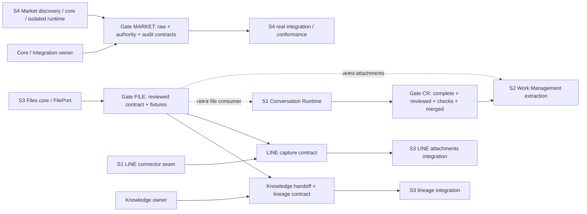

# Zuri Refactor Status — อะไรทำอยู่ อะไรยังไม่เริ่ม และรออะไร

**เวอร์ชัน snapshot:** 0.1 — 24 กันยายน 2026 (Asia/Bangkok)  
**Repository:** `Freshair129/zuri.ai`  
**Main ที่อ่านได้รอบนี้:** `fad8ec6252941ca3de01afdb3116484f86b366c3`  
**สถานะเอกสาร:** snapshot ที่จัดทำจาก GitHub + handoff/prompt ในบทสนทนา ยังไม่ได้ commit ลง repo และไม่ได้ sync อัตโนมัติ

> ตารางนี้พูดถึง “งานแยกบริการในรอบ refactor นี้” ไม่ใช่บอกว่าฟังก์ชันเดิมของ domain ไม่มีอยู่แล้ว การมี prompt หมายถึงมีแผน ไม่ใช่เริ่มเขียนโค้ด และ CI ผ่านหมายถึงชุดตรวจที่รันผ่าน ไม่ใช่ extraction เสร็จ

**แหล่งข้อมูลที่มองไม่เห็น:** worktree ที่ยังไม่ push, process/ความคืบหน้าใน Codex session อื่น และสถานะ production ไม่มีการตรวจในรอบนี้ ห้ามเปลี่ยน UNKNOWN เป็น NOT_STARTED จากการหา PR ไม่เจอ

## 1. ภาพรวมที่อ่านก่อน

| งาน / เจ้าของตามแผน | สิ่งที่ยืนยันได้ตอนนี้ | งานที่ยังไม่เสร็จหรือยังไม่ยืนยัน | เริ่มอะไรได้ / รออะไร |
|---|---|---|---|
| **Conversation Runtime — Session 1** | **PARTIAL / DRAFT PR #542**; มี scaffold, ports, lifecycle และ durable admission marker; Hosted governance + edge-ci ผ่านที่ head `189c607…` | PR ยังระบุว่า core façade ไม่มี, ยังไม่เชื่อม queue, Next เป็น executor; runtime integration/contract/recovery/image-start ยังไม่ครบ [E1–E4] | ทำต่อ Session 1; ยังไม่ปลดล็อก WM |
| **Work Management — Session 2** | **BLOCKED_FOR_EXTRACTION ตามแผน**; prompt มีแล้ว; การทำ read-only preparation จริงยัง UNKNOWN | ไม่มี handoff/commit ของ implementation ที่ยืนยันในรอบนี้; ไม่ถือว่ามี process ใหม่แล้ว | วิเคราะห์ได้ทันที; ย้าย writer เมื่อ Gate CR ผ่าน; จุดแนบไฟล์รอ FilePort gate แยก |
| **File Management — Session 3** | **PLANNED / IMPLEMENTATION_UNKNOWN**; ผู้ใช้ขอและมี Master Prompt ครอบคลุม hotfix, extraction, attachments, lineage และ SOT [E5] | ยังไม่มี code/checkpoint ที่ตรวจยืนยันในรอบนี้; ไม่บอกว่ารันอยู่หรือไม่เริ่มโดยเดา | hotfix และ service-local work ทำขนานได้; integration รอเฉพาะ FilePort/authority/shared patch |
| **Market Intelligence — Session 4** | **PROMPT_READY / EXECUTION_NOT_OBSERVED**; มี prompt ในชุดนี้; existing module มี translation/persistence/feed [E6–E9] | service extraction ยังไม่มี proof ในรอบนี้; provider contracts ใหม่ยังเป็น proposal | เปิด Session 4 ทำ M0/M1 และ local M2 ได้; M3 รอ Market contract gate ไม่ต้องรอ CR/Files เสร็จทั้งชุด |

สถานะ “ทำอยู่” ในตารางคือแผนงาน/หลักฐาน checkpoint ไม่ใช่การยืนยันว่ามี agent process กำลังรันเวลานี้

### สิ่งที่ปลดล็อกได้โดยไม่ต้องรอกันทั้งโครงการ

- Market Intelligence ไม่ต้องรอ Conversation Runtime merge เพื่อแยก pure core และทำ service-local tests
- Files hotfix ไม่ต้องรอ Files extraction, SOT editor หรือ CR เสร็จ
- Work Management ตามแผนที่ตกลงไว้ยังรอ CR extraction ที่ครบเกณฑ์และ merge; นี่เป็น **execution sequencing gate ของรอบนี้** ไม่ใช่กฎว่าทางเทคนิคห้ามทำ WM ขนานตลอดไป
- การใช้ Files/Identity/Integration ผ่าน legacy-compatible contract ได้ ไม่ต้องรอเจ้าของทั้งหมดเป็น microservice ก่อน
- ไม่มีกิจกรรมใดในแผนนี้ได้รับอนุญาตให้ production cutover เอง

## 2. เลเจนด์สถานะ

| ค่า | ความหมาย |
|---|---|
| PLANNED / PROMPT_READY | ตกลงขอบเขตหรือมี prompt แล้ว ยังไม่พิสูจน์การเริ่ม implementation |
| IN_PROGRESS | owner มี checkpoint ระบุงานเริ่มและ commit/diff/evidence; ไม่ใช่เดาจากแชตเปิดอยู่ |
| PARTIAL | ทำแล้วบางส่วน; ต้องระบุส่วนที่ยังไม่ทำและ acceptance ที่ขาด |
| BLOCKED_FOR_EXTRACTION | ห้ามเริ่มย้าย implementation ที่ gated; งานเตรียมบางส่วนยังทำได้ |
| WAITING_CONTRACT | รอเฉพาะรอยต่อ/phase ที่ใช้ contract; ไม่หยุดงานอื่นทั้ง service |
| UNKNOWN | ไม่มีหลักฐานพอ อาจมีงานใน local ที่ยังไม่ส่งมา |
| DEFERRED | ยังไม่เลือกทำ extraction ในรอบปัจจุบัน ไม่ได้แปลว่าฟังก์ชัน domain ยังไม่มี |
| VERIFIED / MERGED / DEPLOYED | คนละสถานะ ต้องมี test/review/merge/deployment receipts ของแต่ละขั้น |

ผลตรวจแต่ละแกนใช้ `PASS / FAIL / PARTIAL / NOT_RUN / UNKNOWN / NOT_APPLICABLE` โดยต้องมี evidence และ SHA; ไม่มีเปอร์เซ็นต์ completion จากจำนวนไฟล์/จำนวน test

## 3. งานค้างแยกตาม session

### Session 1 — Conversation Runtime [E1–E4]

**Branch:** `codex/conversation-runtime-service`  
**PR:** [#542](https://github.com/Freshair129/zuri.ai/pull/542) — OPEN / DRAFT / NOT_MERGED  
**Head:** `189c60766323655149b84928e5db4c16c5e6afb8`

| รายการ | สถานะที่ทราบ | หลักฐาน/เงื่อนไข |
|---|---|---|
| Service scaffold / bounded ports / health/readiness / shutdown | IMPLEMENTED_PARTIAL | PR และ handoff; ไม่มี proof ว่า production execution ย้ายแล้ว |
| Durable admission marker ก่อน ACK | IMPLEMENTED / TESTS_REPORTED | PR/handoff ระบุการแก้และผลทดสอบ; ผู้จัดทำ board ไม่ได้รันซ้ำ |
| Authenticated core façade | NOT_IMPLEMENTED_AT_REPORTED_HEAD | PR/handoff ระบุว่ายังไม่มี |
| เชื่อม durable queue ให้ CR รัน context/model จริง | NOT_IMPLEMENTED_AT_REPORTED_HEAD | Next ยังเป็น executor ตาม PR |
| WorkToolPort provider conformance | UNPROVEN | มี port contract แต่ยังไม่ใช่ end-to-end evidence |
| Delivery orchestration + completion/UNKNOWN recovery | INCOMPLETE | ต้องพิสูจน์ single consumer, lease, receipt, crash/restart |
| Hosted governance workflow | PASS | run 35925824145, head เดียวกัน, completed/success |
| Hosted edge-ci workflow | PASS | run 35925824047, head เดียวกัน, completed/success |
| Hosted image build | PASS ตาม job evidence ที่ตรวจในบทสนทนาก่อนหน้า | อย่าสับสนกับ image-start smoke; refresh artifact/steps ก่อน release |
| Local verify / regression | PASS_REPORTED | รายงาน owner: service 13/13; server 6,710 passed/32 skipped; Playwright 223 passed/4 skipped; ไม่ใช่ผลรันใหม่ของ board |
| Image-start + real service/core workflow | NOT_RUN / UNPROVEN ตาม handoff | build image ไม่พิสูจน์ process startup/workflow |
| Review/merge readiness | NOT_READY | PR ยังเป็น draft; CI เขียวไม่เติม implementation ที่ขาด |
| Production cutover | NOT_RUN_REPORTED | ไม่มีการอนุมัติจากชุดเอกสารนี้ |

**Next action:** ทำ core façade + single-executor gate + first real queue→separate-process→fake-provider→receipt slice ตาม handoff แล้วเพิ่ม conformance/recovery/image-start proof

**รายการที่ review ก่อนหน้าให้ตรวจซ้ำ:** Compose build-context path; `complete()`/Work mutation response loss ที่อาจถูกจัด FAILED ทั้งที่ commit แล้ว ไม่ใช้เป็นข้อยืนยันว่ารัน production แล้วเกิดข้อมูลซ้ำ

**ความคลาดเคลื่อนเอกสาร:** PR body/handoff ยังมีข้อความ CI pending/NOT_RUN แต่ hosted workflow ปัจจุบันผ่านแล้ว; owner ต้องปรับ evidence แยก CI จาก extraction ไม่เปลี่ยน extraction เป็น COMPLETE

### Session 2 — Work Management

| ส่วน | สถานะตามแผน | รออะไร |
|---|---|---|
| Dependency/model/route/transaction inventory | ALLOWED_READ_ONLY; actual progress UNKNOWN | ไม่ต้องรอ |
| Pure migration/test plan | ALLOWED_READ_ONLY; actual progress UNKNOWN | ไม่ต้องรอ |
| ย้าย canonical Project/Work writers | BLOCKED_FOR_EXTRACTION | Gate CR |
| เปลี่ยน provider หลัง WorkToolPort | BLOCKED_FOR_EXTRACTION | Gate CR + reviewed WorkToolPort revision |
| File/Project attachment integration | WAITING_CONTRACT เมื่อถึง phase นี้ | Gate FILE; ไม่ต้องรอ SOT/LINE attachment ทั้ง feature |
| PlanEnvelope/ExecutionPlanBundle transaction changes | NOT_AUTHORIZED_AS_SEMANTIC_CHANGE | ตรวจ invariants กับ owner; ห้าม silently partial commit |

**Next action:** ทำ/ส่ง read-only inventory; หลัง Gate CR ผ่าน ให้อัปเดต base จาก merge จริง อ่าน handoff และทบทวนแผนก่อน implementation

### Session 3 — Files (scope จาก Master Prompt; actual execution UNKNOWN) [E5]

| Tranche | งาน | สถานะหลักฐาน | Dependency เฉพาะส่วน |
|---|---|---|---|
| F0 | Reproduce A/B upload + hotfix/regression | PLANNED; code UNKNOWN | test accounts/config ที่อนุญาต; shared hotfix patch review ถ้าจำเป็น |
| F1 | FilePort + generic upload/exact version + independent Files runtime | PLANNED; code UNKNOWN | Gate FILE สำหรับ integration; own work เริ่มได้ |
| F2 | LINE media capture / attachment receiver | PLANNED; code UNKNOWN | F1 contract + LINE connector seam กับ Session 1; ไม่ต้องรอ model turn เสร็จเพื่อรับ media |
| F3 | Knowledge handoff / document-run-stage lineage | PLANNED; code UNKNOWN | FileVersion contract + existing Knowledge owner/read contracts |
| F3K | Multi-business Knowledge routing proof | PLANNED_CROSS_OWNER; code UNKNOWN | Knowledge runtime/principal/native store route ที่ยืนยันได้; ไม่ใช่แค่เก็บไฟล์ B ได้ |
| F4 | SOT history/diff/edit/review/restore สำหรับ manager | PLANNED; code UNKNOWN | Files/source binding/version/approval ports; Git write เฉพาะ authorized binding |
| F5 | Consumer integration + cutover/rollback rehearsal | PLANNED; code UNKNOWN | เฉพาะ accepted in-scope consumers/contracts; production คนละ gate |

**Next action:** เจ้าของ Session 3 ส่ง `FILE-MANAGEMENT-HANDOFF.md` ที่มี actual branch/head, current tranche, bug reproduction และผลตรวจ ก่อนเลื่อนค่า UNKNOWN

### Session 4 — Market Intelligence

| Tranche | งาน | สถานะเริ่มต้น | เริ่มได้เมื่อ |
|---|---|---|---|
| M0 | สำรวจ actual implementation/ownership + baseline | PROMPT_READY | เปิด Session 4 ใน isolated worktree แล้วอ่าน repo/status |
| M1 | Pure core/repository ports + isolated tests | NOT_OBSERVED | หลัง M0 และ repo approval ที่บังคับจริง |
| M2 | Service-local runtime + owned persistence + test providers | NOT_OBSERVED | M1; ไม่ต้องรอ service อื่นครบ |
| M3 | Core façades/BFF/consumer conformance | WAITING_CONTRACT ก่อน integration | Gate MARKET + shared patch sequencing |
| M4 | Recovery/concurrency/source revocation/migration rehearsal | NOT_OBSERVED | slice ที่เกี่ยวข้องจาก M2/M3 |
| M5 | Final acceptance/CI/image-start/handoff | NOT_OBSERVED | accepted scope มี evidence ครบ |

**Next action:** ใช้ `SESSION-4-MARKET-INTELLIGENCE-CODEX-PROMPT.md`; ขอบเขตคือ capabilities ที่มีจริง ไม่เพิ่ม crawler/watchlist/alert pipeline ใหม่

## 4. Dependency register — รออะไร ใครต้องส่งอะไร

ประเภท dependency: **HARD_START** = รอก่อนเริ่ม phase, **CONTRACT** = รอก่อนเชื่อม, **RUNTIME** = ต้องใช้บริการตอนรัน, **INTEGRATION_ORDER** = จัดลำดับ shared changes, **OPTIONAL** = ทำงานบางโหมดได้โดยไม่มี

| ID ภายใน board | ผู้รอ / phase | ผู้ส่งมอบ | ประเภท | เงื่อนไขปลดล็อก | สถานะตอนนี้ / งานที่ทำต่อได้ |
|---|---|---|---|---|---|
| Gate CR | Session 2 / extraction | Session 1 + reviewer/integrator | HARD_START | CR acceptance ครบ, WorkToolPort ทดสอบจริง, review+required checks ผ่าน, merge เข้า base และ handoff ตรง SHA | **ไม่ผ่าน**: draft/partial; WM ทำ read-only ได้ |
| Gate FILE | S1 file consumer / S2 attachments / S3 consumer integration | Session 3 + relevant consumers | CONTRACT | FilePort + exact-version/ref ownership + authority/deletion/idempotency rules + fixtures ที่ review แล้ว | **UNKNOWN**; ไม่บล็อก Market core หรือ WM ส่วนที่ยังไม่เรียก Files |
| Gate LINE-FILES | Session 3 F2 / shared LINE path | S1 transport owner + S3 Files | CONTRACT | media-capture handoff, channel scope, idempotency/unsend, exact path ownership | **UNKNOWN**; Files provider/storage tests ทำได้ก่อน |
| Gate KNOWLEDGE-FILES | Session 3 F3 | Files + Knowledge/Integration owner | CONTRACT | exact FileVersion→source/run/evidence mapping และ auth/retention | **UNKNOWN**; generic upload/read ไม่ต้องรอ |
| Gate KNOWLEDGE-AB | Session 3 F3K / A+B end-to-end ingestion | Knowledge runtime owner (ยังไม่ยืนยัน assignee) | CONTRACT + RUNTIME | submit/worker/query/citation/publication เลือก scope/store ถูกทั้ง A/B พร้อม tests | **UNVERIFIED**; Files B ใช้ได้โดยไม่อ้าง Knowledge B พร้อม |
| Gate MARKET | Session 4 M3 | S4 + Core/Integration/Identity/Audit owner; S1 ประสาน shared files | CONTRACT | RawEvidenceReadPort, ScopeAuthorityPort, Audit boundary และ Market API มี reviewed revision + provider/consumer proof | **PROPOSED / NOT_FROZEN**; M0/M1/local M2 ทำได้ |
| Gate MARKET-KNOWLEDGE | Market identity-resolution mode | Knowledge read owner + S4 | OPTIONAL + CONTRACT | registered query contract, scope + result/error semantics ผ่าน | existing in-process port มี [E9]; network conformance ใหม่ยังไม่พิสูจน์; unconfigured resolver ใช้ UNRESOLVED ตาม behavior เดิม |
| Gate COMMON | ทุก lane / shared-file integration | integrator ที่ระบุปัจจุบัน | INTEGRATION_ORDER | reconcile sources/IDs/migrations/contracts ทีละชุด แล้ว regenerate/run impacted checks | ต้องนัดแต่ละ patch; ไม่ใช่รอ CR ทั้งโครงการ |
| Gate PRODUCTION | ทุก service / live cutover | ผู้ใช้/operator + reviewer ตาม workflow | HARD_START | authorization เฉพาะ + backup/restore/rollback + deployment proof | **NOT_AUTHORIZED_BY_THIS_PACK**; dev/test ไม่ต้อง production |

Gate aliases เป็นรหัสประสานงานของ board ไม่ใช่ ADR/FR/SDD IDs ใหม่และไม่แทน repo registry

### แผนผังลำดับงาน (ลูกศรแปลว่า prerequisite → dependent)

ลูกศรไม่หมายความว่าต้องเพิ่ม microservice ตามทุกกล่อง และเส้น S3→S1 เป็น contract เฉพาะ Files ไม่ใช่ hard-start dependency จึงไม่เกิดวงจรที่บังคับให้ทุกงานรอกันจนเริ่มไม่ได้

### Runtime dependencies (คนละภาพกับลำดับ refactor)

| Runtime/consumer | Dependency ที่ต้องใช้ | วิธีอยู่ระหว่าง transition |
|---|---|---|
| CR | Core queue/identity/business authority; model/memory; Files เมื่อใช้ attachment | authenticated owner façades; Files-compatible adapter; ห้าม duplicate executor |
| WM | Scope/Identity, Files refs เมื่อใช้ไฟล์, audit | existing authority adapters; own Work use cases; ไม่ย้าย Files ตาม |
| Files | own metadata + storage + current access authority | MinIO เดิม; local/supabase adapters ที่ approved; Knowledge ไม่ใช่ prerequisite ของ upload |
| Market | Raw evidence + scope/identity + owned observation persistence/audit | narrow core read façades; ไม่อ่าน foreign DB ตรงหลัง extract |
| Market resolution | existing Knowledge reader | optional ตาม semantics เดิม; canonical lookup ไม่พร้อมต้องไม่ fabricate result |

## 5. Domain ที่ยังไม่เลือก extraction ในรอบนี้

| Domain/กลุ่ม | แผนปัจจุบัน | สิ่งที่ต้องชัดก่อนเพิ่ม lane |
|---|---|---|
| MSP Service | DEFERRED / ไม่มี session implementation ที่ยืนยันในแผนนี้ | standalone lifecycle, governed call direction, storage/principal contracts |
| GKS Service | DEFERRED / ไม่มี session implementation ที่ยืนยันในแผนนี้ | MSP/GKS/native boundaries, scope routing, single store owner |
| CRM | DEFERRED | CR/Files authority และ conversation/attachment/retention ownership |
| Marketing | CANDIDATE_LATER | planning/review core แยกได้ แต่ PM handoff/File refs/LINE broadcast ต้อง contract |
| Asset Management | CANDIDATE_LATER | Files evidence, People/Project references, Edge jobs/authority |
| Commerce + Inventory + Procurement | DEFERRED_AS_GROUP | ธุรกรรม POS/order/payment/stock และ receipt/PO ต้องรักษา; ไม่แตกทีละ entity |
| Identity & Tenancy | KEEP_IN_CORE_FOR_NOW | central authority ใช้ผ่าน explicit boundary; ไม่ย้ายพร้อม consumers ทุกฝั่ง |
| People / Business Strategy / Platform Control | KEEP_IN_CORE_FOR_NOW | separate modules/testing; future extraction ตามหลักฐานไม่ใช่จำนวนโฟลเดอร์ |
| Integration / Audit / Pipeline ledger ทั้งก้อน | KEEP_OWNER; narrow ports only | เป็น dependency ร่วมหลาย lane; ไม่สร้าง parallel truth owner |

DEFERRED ไม่ใช่การยืนยันว่า repo ภายนอกไม่ได้พัฒนาอยู่: เป็นสถานะการจัดลำดับ **extraction ของ Zuri ในแผนนี้** เท่านั้น

## 6. จุดชนของไฟล์และการรวมงาน

| พื้นที่ | เจ้าของหลัก | กติกา |
|---|---|---|
| CR service + LINE turn execution | Session 1 | S3 media connector changes ผ่าน explicit seam/handoff |
| Files service + FilePort + Files/SOT UI | Session 3 | WM/CR เป็น consumers ไม่ copy implementation |
| Market service + Market translation/read contracts/tests | Session 4 | ไม่ claim Integration raw/credentials เป็นของตัวเอง |
| WM canonical use cases | Session 2 เมื่อ Gate CR ผ่าน | ขอบเขต Files/Identity/Business Strategy ต้องไม่ย้ายเหมารวม |
| PRD/FEATURES/ROADMAP/ID ledger/schema/migration order/shared auth/audit/root CI/Compose/scanners | integrator ตาม handoff (ค่าเริ่มต้น Session 1) | patch ownership + sequential reconcile; ไม่เอาทุกงานลง PR #542 |
| `REFACTOR-STATUS.md` กลาง | integrator คนเดียว | แต่ละ lane ส่ง status delta/handoff; update จาก latest base ไม่ overwrite ตารางของคนอื่น |
| Handoff ของแต่ละ service | session เจ้าของนั้น | อัปเดตทุก checkpoint พร้อม SHA/ผลตรวจ/blockers |

**ทุก lane:** แยก worktree, dependencies, generated clients, ports, test DB/volumes และ temporary artifacts; ห้ามใช้ MinIO/DB ของผู้ใช้เป็นสนามทดสอบ

## 7. วิธีอัปเดตให้ไฟล์นี้ไม่กลายเป็นข้อมูลเก่า

ทำตาม `REFACTOR-STATUS-UPDATE-PROTOCOL.md` ในชุดเดียวกัน:

1. Session เจ้าของงานเขียน service handoff และ status delta เมื่อเริ่ม/จบ tranche, เปลี่ยน blocker/contract, push/review/merge หรือส่งต่อ
2. Integrator อ่าน latest main/PR/checks และ handoffs ที่ exact commits ก่อนเปลี่ยนตารางกลาง
3. ระบุ code/test/integration/CI/merge/deploy แยกกัน; source ที่ล้าสมัยติดป้าย STALE พร้อมค่า observedAt ไม่ลบหลักฐานเดิม
4. หลักฐาน head เปลี่ยนต้องทำให้ previous verification ไม่ครอบคลุมโดยปริยาย; review contract revision ที่ผู้รับใช้อยู่จริง
5. ถ้าไม่รู้สถานะ local ของ lane อื่นให้ UNKNOWN ไม่เดาว่าเขาหยุดหรือเสร็จ
6. status file อยู่ใน Git จึงไม่ sync ข้ามแชตเอง แต่ละ session ต้องอ่านเมื่อได้รับ checkpoint ใหม่

**ที่วางเสนอ:** `docs/migrations/service-extraction/REFACTOR-STATUS.md` — ก่อนนำเข้า repo ต้อง enumerate หา board/tracker เดิมและทำตาม metadata/template/governance ของ repo หากมี canonical tracker แล้วให้อัปเดตตัวนั้นแทนสร้างแหล่งสถานะซ้ำ

## 8. Evidence register และความน่าเชื่อถือ

| Ref | แหล่ง | สิ่งที่รองรับ |
|---|---|---|
| E1 | [PR #542](https://github.com/Freshair129/zuri.ai/pull/542) | OPEN/DRAFT/NOT_MERGED, head/base, partial implementation ตาม PR body ณ 24 ก.ย. 2026 |
| E2 | [CR handoff ที่ head ที่ตรวจ](https://github.com/Freshair129/zuri.ai/blob/189c60766323655149b84928e5db4c16c5e6afb8/docs/migrations/service-extraction/CONVERSATION-RUNTIME-HANDOFF.md) | รายงาน owner ไม่ใช่ผลรันซ้ำของผู้จัดทำ board; CI text บางส่วนเก่ากว่า E3 |
| E3 | [Governance run 1494](https://github.com/Freshair129/zuri.ai/actions/runs/35925824145) | GitHub API ยืนยัน completed/success ที่ head `189c607…`; updated 2026-09-24 05:17:20 +07:00 |
| E4 | [Edge CI run 821](https://github.com/Freshair129/zuri.ai/actions/runs/35925824047) | GitHub workflow listing รอบนี้ยืนยัน completed/success ที่ head เดียวกัน |
| E5 | `FILE-MANAGEMENT-MASTER-CODEX-PROMPT.md` ในบทสนทนา | Scope/ลำดับ T0–T5 ของ Session 3 และข้อตกลง ownership; ไม่ใช่ implementation proof |
| E6 | [Market charter](https://github.com/Freshair129/zuri.ai/blob/fad8ec6252941ca3de01afdb3116484f86b366c3/docs/domains/market-intelligence/CHARTER.md) | existing domain ownership และ target concepts ที่ยังต้องแยกจาก implemented state |
| E7 | [Market observation service](https://github.com/Freshair129/zuri.ai/blob/fad8ec6252941ca3de01afdb3116484f86b366c3/apps/server/src/modules/market-intelligence/application/market-observation-service.js) | existing translation/feed seam, auth/audit dependencies |
| E8 | [Translation core](https://github.com/Freshair129/zuri.ai/blob/fad8ec6252941ca3de01afdb3116484f86b366c3/apps/server/src/modules/market-intelligence/application/translate-raw-record.js) | trusted source lineage, schema-based key, optional resolver |
| E9 | [Market identity resolver](https://github.com/Freshair129/zuri.ai/blob/fad8ec6252941ca3de01afdb3116484f86b366c3/apps/server/src/modules/market-intelligence/infrastructure/gks-market-identity-resolver.js) | registered product_search read contract, unresolved behavior |
| E10 | Prompt Session 2 และข้อตกลงในบทสนทนา | WM sequencing และ read-only exception; ไม่ใช่หลักฐานว่า Session 2 ทำ inventory แล้ว |
| E11 | [Main ref](https://api.github.com/repos/Freshair129/zuri.ai/git/ref/heads/main) | SHA ที่อ่านได้รอบนี้; mutable URL ต้องบันทึก observed SHA ใน snapshot |

แหล่ง repo ที่ pinned ใช้อธิบายโครงปัจจุบันใน snapshot ไม่ใช้ยืนยัน remote runtime หรือ feature ที่ยังไม่ทดสอบ ส่วนคำตัดสินการทำขนาน/ลำดับ merge เป็นข้อเสนอและข้อตกลงงาน ไม่ใช่ข้อเท็จจริงที่โค้ดพิสูจน์เอง

## 9. Change log

| เวอร์ชัน | วันที่ | เปลี่ยนอะไร | ขอบเขตหลักฐาน |
|---|---|---|---|
| 0.1 | 24 ก.ย. 2026 | เริ่ม board รวม S1–S4, gates, backlog และ owner matrix; อัปเดต CI ของ PR542 เป็นผ่าน แต่คง extraction partial | อ่าน GitHub/ไฟล์ที่ให้มา; ไม่ได้รัน tests หรือแก้ repo |
