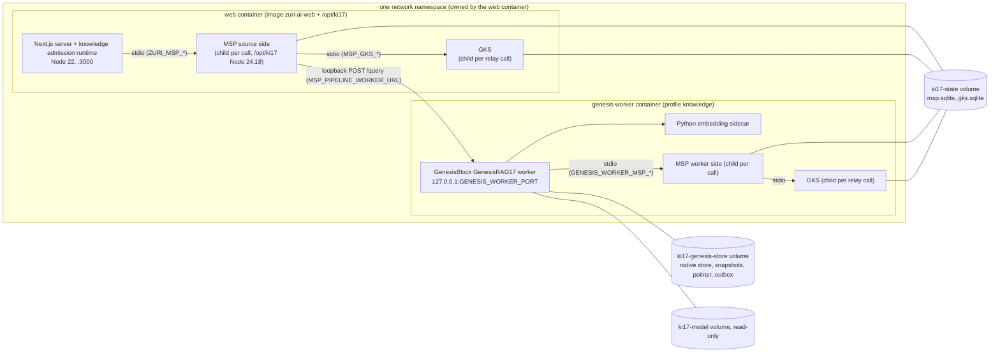

# GenesisRAG17 on the edge device: Phase 3 deployment design

> **Status (updated 2026-09-24): superseded by §9.2 — see there for current production
> state.** This section is left as written through the 2026-09-16 revision (0.2.0) as a
> historical record of the design-time assumption: "None of it has been deployed," no
> `docker compose` command run, no credential generated, no migration applied, the one
> thing executed being gate **G-3** (§9.1) against throwaway test images. That assumption
> no longer holds — §9.2 records a 2026-09-24 read-only production probe that found the
> runtime this design describes already running. Do not read this blockquote as the
> current state; read §9.2. The owner approved
> [ADR-075](../decisions/ADR-075-SMARTGIFT-CATALOG-ENTERS-VIA-17-STAGE-SOURCE-ADAPTER.md)
> Phase 3 on 2026-09-11. [ADR-073](../decisions/ADR-073-GENESISRAG17-ISOLATED-EXECUTION-AND-PUBLICATION.md)'s
> 2026-09-11 Amendment lifts "no production deployment" for this profile only.

## 1. Scope

| In scope | Out of scope |
|---|---|
| The SmartGift structured-record profile: the FR-187 adapter, plus the FR-188 parser profile and `ontology_v2` once ADR-075 Phase 2 is accepted | Any other source, profile or Business; multiple runtime bindings |
| The edge device `DESKTOP-VETATMQ` (confirmed with `hostname` on 2026-09-11). It is also the host of the production Compose project `zuri-ai` (Docker Desktop on WSL2) and of the `zuri-edge-device` runtime | A server host, or a network transport between the tiers |
| MSP (Tier 2), GKS (Tier 3) and the GenesisBlock GenesisRAG17 worker (Tier 4), beside zuri-ai (Tier 1) | Moving edge query traffic to the new chain, which is FR-189 / ADR-075 Phase 4 (§13) |
| The build, Compose and configuration changes, each described here and each landing in its own PR | Applying migrations (ADR-057 operator step); editing FR rows (the integrator's job) |

## 2. Constraints read from the code

| # | Constraint | Where |
|---|---|---|
| C1 | zuri-ai reaches MSP only by **spawning** it, one child process per call, over NDJSON JSON-RPC on stdio. It is configured by `ZURI_MSP_COMMAND` (the executable), `ZURI_MSP_ARGS` (a JSON array), `ZURI_MSP_CWD` and `ZURI_MSP_TIMEOUT_MS`. With the command unset the transport is `null`, and callers fail closed with 503 | `apps/server/src/modules/agent/msp-stdio-transport.js` |
| C2 | The MSP child inherits the **whole** server environment, because `env` defaults to `process.env` and `createMspTransportFromEnvironment` passes it through. Inside the web container that includes the database, LINE and model credentials. MSP in turn copies its own environment into every GKS child (`pipelineEnv = { ...env }`) | same file; MSP `apps/msp-server/src/providers/gks-stdio-provider.mjs` |
| C3 | The knowledge admission runtime runs **inside the Next.js server process**. `instrumentation.js` starts it when `ZURI_KNOWLEDGE_ENABLED=1`. `ZURI_KNOWLEDGE_BINDINGS` must hold exactly one entry. The source credential is the single `role: "source"` entry in `MSP_PIPELINE_PRINCIPALS` whose scope matches exactly | `src/instrumentation.js`, `src/modules/knowledge/knowledge-runtime.js`, `src/platform/integrations/core/genesisrag17-executor.js` (`resolveRuntimeCredential`) |
| C4 | MSP spawns GKS once per relay call, using `MSP_GKS_COMMAND`, `MSP_GKS_ARGS` and `MSP_GKS_CWD`. GKS is never a daemon | `gks-stdio-provider.mjs` |
| C5 | MSP relays `msp_pipeline_query` to the worker's `POST /query` at `MSP_PIPELINE_WORKER_URL`. That URL must be an explicit loopback origin (`127.0.0.1` or `::1`), and redirects are rejected | MSP `docs/ADR-MSP-GENESISRAG17-RELAY.md`, `docs/GENESISRAG17-RELAY.md` |
| C6 | The worker binds `127.0.0.1` only (any other host raises `WORKER_HOST_MUST_BE_LOOPBACK`) and refuses non-loopback remote addresses. It serves only `POST /query`, with a bearer token. The port is `GENESIS_WORKER_PORT`, where `0` means an ephemeral port | GenesisBlock `genesisrag17-worker/src/cli.mjs`, `src/worker.mjs` |
| C7 | The worker reaches GKS only through **its own** MSP child (`GENESIS_WORKER_MSP_COMMAND`, `GENESIS_WORKER_MSP_ARGS`, `GENESIS_WORKER_MSP_CWD`, `GENESIS_WORKER_MSP_TIMEOUT_MS`). It is the one process that holds the native store at `GENESIS_WORKER_DB_PATH` | `cli.mjs`, worker `README.md` |
| C8 | MSP and GKS persist in SQLite through `better-sqlite3`, at `MSP_DB_PATH` and `GKS_DB_PATH`. Two MSP instances run at once: the source side, spawned by zuri-ai, and the worker side, spawned by the worker. Every GKS child spawned from either side opens the same GKS file. So all of them must share **one filesystem with working file locks** | MSP `packages/msp-storage`, GKS `packages/gks-persistence`; the MSP runbook sets both paths for both sides |
| C9 | The worker needs several things at run time: Node `24.18.x` (`engines: >=24.18`); Python 3.12 with the `numpy`, `onnxruntime` and `tokenizers` versions pinned in `requirements.txt` (`GENESISRAG17_PYTHON`); and `intfloat/multilingual-e5-small` at the pinned revision (about 490 MB, SHA-256-verified at start, `GENESIS_WORKER_MODEL_DIR`). It also needs a benchmark fixture (`GENESIS_WORKER_BENCHMARK_FIXTURE`), a scope, a credential and a query token | `cli.mjs`, worker `README.md`, `requirements.txt` |
| C10 | The acceptance runs used Node `24.18.x` for MSP and GKS (see the MSP runbook), although both packages advertise `>=20`. The web image runs Node 22 (`ARG NODE_VERSION=22`, held there for Prisma 5.22) | MSP `docs/RUNBOOK-GENESISRAG17-LOCAL.md`, `apps/server/Dockerfile` |
| C11 | Every acceptance up to 2026-09-16 ran on **Windows x64**: the only committed native addon was `index.win32-x64-msvc.node`. **Discharged** — P-2 added `index.linux-x64-gnu.node` at the pin, and the acceptance now has a Linux pass on it (§9.1) | GenesisBlock `package.json` (`napi.targets`), §9.1 |
| C12 | Tier 1 runs in the `web` container of the Compose project `zuri-ai`. The project name is pinned, so `docker compose` targets the **live** stack whichever directory it runs from. The container runs as the non-root `node` user on bookworm-slim, serves Next.js standalone output on port 3000 bound to host loopback, and sits on `zuri-network`. The runner image copies named files only | `apps/server/docker-compose.yml`, `apps/server/Dockerfile` |
| C13 | Credential model: `MSP_PIPELINE_PRINCIPALS` holds the source grant and the worker grant, each on the exact six-field scope. `MSP_GKS_PIPELINE_CREDENTIAL` must equal `GKS_PIPELINE_RELAY_CREDENTIAL`, and `MSP_PIPELINE_WORKER_TOKEN` must equal `GENESIS_WORKER_QUERY_TOKEN` | [`GENESISRAG17-CONTRACT.md`](GENESISRAG17-CONTRACT.md) |

## 3. The hard problem

The query hop runs web container → MSP child (still inside the web container) →
**loopback** → worker. Inside a container, `127.0.0.1` is that container's own network
namespace, not the host's. So the worker has to share a network namespace with whatever
spawns the source-side MSP, and that is the web container (C1, C5, C6).

Separately, the two MSP sides and every GKS child have to open the same SQLite files (C8).
A process on the Windows host and a process in a Linux container cannot safely share a
SQLite file: a Docker Desktop bind mount of a Windows path goes through a file-sharing
layer, and SQLite's own guidance is not to rely on locking across such filesystems.

## 4. Options

| Option | Loopback hop (C5, C6) | Shared SQLite (C8) | New cross-repo code | Effect on the live stack | Verdict |
|---|---|---|---|---|---|
| **(a)** Linux sidecar in the web container's network namespace (`network_mode: "service:web"`), with MSP and GKS baked into the web image and one shared named volume | Works: same namespace | Works: named volume on the one Linux kernel inside Docker's WSL2 VM | None to any tier's contract. zuri-ai gains build and Compose work; GenesisBlock needs a Linux build of the worker addon | Files added to the web image; one new service behind an optional profile. The web service's ports, networks and healthcheck are unchanged | **Recommended** |
| **(b)** MSP, GKS and the worker as Windows host processes | Breaks: container-to-host is not loopback. Fixing it needs MSP to accept a non-loopback worker URL, or zuri-ai to reach MSP over a network (MSP is stdio-only). Either is a new transport, new authentication and a four-repo contract change | Breaks: the source-side MSP would still run in the container while the worker side runs on the host, against the same files | Large | Small for web | Rejected for now. Reopen only with an ADR for a network transport |
| **(c1)** Everything inside the web container | Works | Works | None | Python, onnxruntime, a 490 MB model and a native addon inside the web image. No supervisor, so the worker lives and dies with the Next.js process, and every web deploy kills it | Rejected |
| **(c2)** Move Tier 1 out of Docker onto the Windows host | Works, on the platform acceptance ran on | Works | None | Reverses the ADR-058 Compose deployment of production web, including ngrok, health and restart | Rejected: too large a change to production for one profile |
| **(c3)** Variant of (a): a dedicated holder container owns the namespace, and both web and the worker join it | Works | Works | None | Web has to give up its `ports` and `networks` to the holder, which changes the live web service and ngrok's route | Fallback if R-2 proves a real problem |

## 5. Recommended topology: (a)



The shape is as follows:

- **The web image gains `/opt/ki17`.** It holds a Node `24.18.x` linux-x64 runtime used only
  for the MSP and GKS children (Next.js stays on Node 22), plus MSP and GKS at the Phase 2
  pinned commits, with `npm ci` run inside the Linux build so `better-sqlite3` is built for
  Linux. Nothing else is added.
- **A new `genesis-worker` service** sits behind the `knowledge` Compose profile, so it is
  off by default. Its image is built from the same `/opt/ki17` layer, plus the GenesisBlock
  worker at its pin, the `linux-x64-gnu` native addon built from that pin, and a Python 3.12
  venv installed from `requirements.txt`. It uses `network_mode: "service:web"`, declares no
  `ports` and no `networks`, and runs as `node` (uid 1000, the same as web).
- **Three named volumes, never Windows bind mounts (C8).** `ki17-state` is mounted in both
  containers. `ki17-genesis-store` is mounted in the worker only, which enforces "one
  process holds the native store". `ki17-model` is mounted read-only in the worker only.

Why (a):

1. **Every contract stays as written.** The worker stays loopback-only, MSP stays stdio,
   and GKS stays passive. No repository changes its wire format, so the four-repo contract
   is untouched.
2. **The SQLite files sit on one kernel's ext4 filesystem** inside Docker's WSL2 VM, which
   gives SQLite the locking it depends on.
3. **It follows a pattern already in this compose file.** `line-worker` is already an
   optional-profile sidecar there.
4. **The web service definition is otherwise unchanged,** and rollback is one flag plus
   one profile (§11).

What it costs. The worker has never run on Linux (C11), so the Phase 2 acceptance must be
re-run inside these images (gate G-3). The worker also restarts every time web is
recreated (R-2, R-3), and the web image grows by MSP, GKS and a second Node runtime.

## 6. Processes, ports and data

| Process | Container | Started by | Lifetime | Listens on |
|---|---|---|---|---|
| Next.js server with the knowledge admission runtime (Tier 1) | web | Docker (`node server.js`) | long-running | container `:3000`, host `127.0.0.1:${WEB_PORT}` (unchanged) |
| MSP, source side | web | the Next.js server, per call | one call | stdio only |
| GKS, spawned by the source-side MSP | web | MSP, per relay call | one call | stdio only |
| GenesisBlock GenesisRAG17 worker | genesis-worker, in web's namespace | Docker (`/opt/ki17` Node running `src/cli.mjs`) | long-running, resumes durable state | `127.0.0.1:<GENESIS_WORKER_PORT>` inside the shared namespace |
| Python embedding sidecar | genesis-worker | the worker | while the worker runs | stdio only |
| MSP, worker side | genesis-worker | the worker, per call | one call | stdio only |
| GKS, spawned by the worker-side MSP | genesis-worker | MSP, per relay call | one call | stdio only |

**Ports.** There is exactly one new listener: the worker on `127.0.0.1:<GENESIS_WORKER_PORT>`.
It must be a fixed port, not `0`, because `MSP_PIPELINE_WORKER_URL` names it. It must also
not be 3000, since it shares a namespace with web. The MSP runbook's `19417` is the
proposed value. Nothing is published: the port is unreachable from the host, from
`zuri-network` and from ngrok.

**Data paths.**

| Path inside the container | Volume | Mounted in | Holds | Named by |
|---|---|---|---|---|
| `/var/lib/zuri-ki17/state/msp.sqlite` | `ki17-state` | web, genesis-worker | MSP pipeline grants, journal and relay state | `MSP_DB_PATH` |
| `/var/lib/zuri-ki17/state/gks.sqlite` | `ki17-state` | web, genesis-worker | GKS decisions, receipts, verdicts and stage evidence | `GKS_DB_PATH` |
| `/var/lib/zuri-ki17/genesis/` | `ki17-genesis-store` | genesis-worker only | native store, candidate and published snapshots, publication pointer, durable outbox and transaction intents | `GENESIS_WORKER_DB_PATH` |
| `/opt/ki17/model/<revision>/` | `ki17-model` (read-only) | genesis-worker only | the five pinned model files | `GENESIS_WORKER_MODEL_DIR` |
| `/opt/ki17/fixtures/` | baked into the image | genesis-worker | the Phase 2 SmartGift benchmark fixture, derived from the test corpus. It is the default `apps/server/.env.knowledge.example` ships (pinned by `tests/unit/ki17-build-stage.test.js`). Its gold texts are test records'. **Checked against the 22 real records: 20 have no applicable query and would fail Stage 16 with `BENCHMARK_NO_APPLICABLE_QUERIES`; `PM-BOTTLE-LED` and `PM-TMB` would be scored on one shared category claim only. Never use it for real records** | `GENESIS_WORKER_BENCHMARK_FIXTURE`, example default only |
| `/var/lib/zuri-ki17/state/smartgift-real-benchmark-v1.json` | `ki17-state` | genesis-worker | the production benchmark fixture: one entry per real catalog record, cumulative, installed by the §10.1 step and read once when the worker starts. Production's `.env.knowledge` overrides the example to this path, and has since 2026-09-21 ([record](../../.brain/reports/2026-09-24-genesisrag17-b2-fixture-rehearsal.md)). An `.env.knowledge` rebuilt from the example must keep that override. The `v1` in the name is historical; the version that counts is the `fixtureVersion` inside | `GENESIS_WORKER_BENCHMARK_FIXTURE` in production's `.env.knowledge` |
| `/opt/ki17/{node,msp,gks}` | baked into the image | web and genesis-worker | the runtime and pinned sources | `ZURI_MSP_COMMAND`, `ZURI_MSP_ARGS`, `ZURI_MSP_CWD`, `MSP_GKS_COMMAND`, `MSP_GKS_ARGS`, `MSP_GKS_CWD`, `GENESIS_WORKER_MSP_*` |
| `/opt/ki17/{genesisblock,venv}` | baked into the image | genesis-worker | the worker package, native addon and Python | `GENESISRAG17_PYTHON` |

Named volumes survive `docker compose down`. **`down -v` destroys the published generations
and must never be part of this procedure.** The 2026-09-06 RCA on deleting resources that
were still in use applies here too: these volumes live on Docker's WSL2 data disk.

## 7. Configuration (names only)

The knowledge settings go in a new, gitignored `apps/server/.env.knowledge` (the existing
`.env*` rule covers it). `genesis-worker` loads it as its **only** env file, marked
`required`, so the worker never receives web's `.env` secrets. Web loads it as an extra
optional env file, next to the existing optional `.env.docker`. The shared values then
live in one file and cannot drift between two copies. Values are generated by the operator
at deploy time and are never committed, pasted into a PR or report, or logged.

| Variable | web | genesis-worker | Meaning |
|---|:-:|:-:|---|
| `ZURI_KNOWLEDGE_ENABLED` | ✓ | | `1` starts the admission runtime. **Flipped last** (§10 step 5) |
| `ZURI_KNOWLEDGE_BINDINGS` | ✓ | | exactly one entry: the SmartGift scope plus the policy `{allowEmbedding, allowPublication}` |
| `ZURI_KNOWLEDGE_TIMEOUT_MS` | ✓ | | runtime call timeout |
| `ZURI_MSP_COMMAND`, `ZURI_MSP_ARGS`, `ZURI_MSP_CWD`, `ZURI_MSP_TIMEOUT_MS` | ✓ | | the `/opt/ki17` Node running MSP's `apps/msp-server/bin/msp-server.mjs` |
| `MSP_DB_PATH`, `GKS_DB_PATH` | ✓ | ✓ | the same two files on `ki17-state` |
| `MSP_GKS_COMMAND`, `MSP_GKS_ARGS`, `MSP_GKS_CWD` | ✓ | ✓ | the `/opt/ki17` Node running GKS's `apps/gks-server/bin/gks-server.mjs` |
| `MSP_PIPELINE_PRINCIPALS` | ✓ | ✓ | one source grant and one worker grant on the same six-field scope |
| `MSP_GKS_PIPELINE_CREDENTIAL`, `GKS_PIPELINE_RELAY_CREDENTIAL` | ✓ | ✓ | the MSP-to-GKS relay credential; the two must be equal |
| `MSP_PIPELINE_WORKER_URL` | ✓ | ✓ | `http://127.0.0.1:<GENESIS_WORKER_PORT>` |
| `MSP_PIPELINE_WORKER_TOKEN` | ✓ | ✓ | must equal `GENESIS_WORKER_QUERY_TOKEN` |
| `GENESIS_WORKER_DB_PATH`, `GENESIS_WORKER_SCOPE`, `GENESIS_WORKER_CREDENTIAL`, `GENESIS_WORKER_QUERY_TOKEN`, `GENESIS_WORKER_MODEL_DIR`, `GENESIS_WORKER_BENCHMARK_FIXTURE`, `GENESIS_WORKER_PORT`, `GENESIS_WORKER_POLL_MS` | | ✓ | worker identity, store and model. The credential is the worker grant's credential, and the scope is the same scope object |
| `GENESIS_WORKER_MSP_COMMAND`, `GENESIS_WORKER_MSP_ARGS`, `GENESIS_WORKER_MSP_CWD`, `GENESIS_WORKER_MSP_TIMEOUT_MS` | | ✓ | the worker's own MSP child |
| `GENESISRAG17_PYTHON` | | ✓ | `/opt/ki17/venv/bin/python` |

**Keep unset:** `ZURI_MSP_THREAD_MEMORY_ENABLED` and `ZURI_MSP_THREAD_SERVICE_KEY` (see R-5).
GKS also reads `GKS_DEFAULT_PORTFOLIO_ID`. The pipeline path carries an explicit scope on
every request, so this design leaves it unset; G-3 confirms that holds.

## 8. Prerequisite work (each in its own PR, none done here)

| # | Work | Owner |
|---|---|---|
| P-1 | **Give the MSP child an allowlisted environment (C2).** `createMspTransportFromEnvironment` should pass a constructed environment (`MSP_*`, `GKS_*`, `PATH`, `HOME`, `NODE_ENV`) instead of `process.env`. That mirrors what the acceptance harness already does when it deletes `DATABASE_URL` and `POSTGRES_*` before spawning. Without it, every MSP child, and every GKS child MSP spawns, holds production database, LINE and model credentials it never uses. It needs a declared requirement, tests, and a check of what the thread-memory callers need | zuri-ai |
| P-2 | **Build the worker for Linux at the pin.** A `napi build` for `x86_64-unknown-linux-gnu` from the pinned GenesisBlock commit, run inside the image build. GenesisBlock owns the recipe | GenesisBlock |
| P-3 | **A `ki17` build stage** (in `apps/server/Dockerfile`, or in a separate Dockerfile under `apps/server/deploy/ki17/`). It verifies the Node `24.18.x` linux-x64 tarball's SHA-256 against the official `SHASUMS256.txt`. MSP, GKS and GenesisBlock sources come in as BuildKit additional build contexts from checkouts at the pinned commits. `npm ci` runs inside Linux, never copying Windows `node_modules`, so `better-sqlite3` gets a Linux binding. A pin manifest (for example `apps/server/deploy/ki17/pins.json`) names the four commits, and a pre-build step checks each context's `HEAD` against it. The runner copies `/opt/ki17/{node,msp,gks}`, and a `genesis-worker` target adds the worker, addon and venv. The build asserts (`test -f`) that every entrypoint the configuration names exists. This is the runtime-image lesson from `server-line-worker.mjs`: a missing file passes build and CI, then crashes at start-up | zuri-ai |
| P-4 | **Compose changes.** Add the `genesis-worker` service (profile `knowledge`, `network_mode: "service:web"`, `restart: unless-stopped`, `stop_grace_period: 60s`, json-file logging, TCP healthcheck), the three volumes, `ki17-state` on web, and the `.env.knowledge` env-file entries | zuri-ai |
| P-5 | **A read-only operator smoke script,** run in the web container. First, `msp_pipeline_evidence` for a run id that does not exist, as the source role: an empty page proves MSP → GKS works. Second, `msp_pipeline_query`: either a published generation or a typed `pipeline_worker_*` or no-published-generation result proves MSP → worker over loopback. It prints outcome codes only, never payloads or credentials | zuri-ai |
| P-6 | **The SmartGift benchmark fixture** that the Phase 2 acceptance uses, baked into the worker image | zuri-ai + GenesisBlock (Phase 2) |

## 9. Pre-deploy gate (every item must pass before the operator step)

| # | Gate |
|---|---|
| G-1 | Phase 2 acceptance notes merged in zuri-ai, MSP, GKS and GenesisBlock (ADR-075 D8) |
| G-2 | The Phase 2 **four-process acceptance** passes: raw entrypoint, no skips, SmartGift fixture, and the ADR-073 thresholds unchanged (Recall@5 ≥ .80, MRR ≥ .65, citation correctness 1.00, cross-tenant leakage 0). The four commits are recorded |
| G-3 | **The same acceptance also passes inside the images this design ships:** Linux, Node `24.18.x` for MSP, GKS and the worker, the Linux native addon, and the venv. It includes the contract's crash and replay cases (the physical-recovery section of contract 1.3.0b). Every earlier run was on Windows (C11), so a Windows pass alone does not satisfy G-3. **MET 2026-09-16** — see §9.1 |
| G-4 | P-1 to P-6 merged, and the pin manifest matches the commits recorded in G-2 |
| G-5 | The zuri-ai tables that GenesisRAG17 and knowledge admission use exist on production and their migrations are recorded. That is an ADR-057 operator step, separate from this deployment. The 2026-09-11 gap map found knowledge tables on production with migrations unrecorded |
| G-6 | A production database backup taken per existing practice before the first enable. Before any later redeploy, stop the worker and copy `ki17-state` and `ki17-genesis-store` |
| G-7 | The files in `ki17-model` match the five SHA-256 values the worker verifies (it re-checks them at start) |
| G-8 | Coordination. The primary checkout and the live stack are shared, so announce the deploy to the other sessions and **wait for an acknowledgement** (CLAUDE.md). Then the owner triggers the step |

### 9.1 G-3 result — the Linux run, 2026-09-16

The `ki17-acceptance` build target (`apps/server/Dockerfile`, test-only, a leaf of the
stage graph) is the shipped `genesis-worker` sidecar plus this app's own Node 22 test
runner, devDependencies, source and `tests/` tree. `npm run test:genesisrag17` ran
inside it against the pinned Linux binaries, with the embedding model bind-mounted
read-only from the host's Hugging Face cache at the pinned revision. Nothing was
pushed, no Compose command was run and every throwaway image, container and volume was
removed afterwards.

| | |
|---|---|
| Image | `--target ki17-acceptance`, contexts `msp`/`gks`/`genesisblock` at the `pins.json` commits (`49fe7de7`, `ecf1e4de`, `7c9261c4`), attested via `.ki17-pin` (`git archive` exports carry no `.git`) |
| Platform | `Linux 6.18.33.2-microsoft-standard-WSL2 x86_64`, Debian bookworm |
| Runtimes | test runner / Tier 1 `v22.23.2`; MSP, GKS and the worker `v24.18.0` at `/opt/ki17/node/bin/node`; venv `Python 3.12.14` with `numpy 2.5.2`, `onnxruntime 1.29.0`, `tokenizers 0.23.1` |
| Native addon | `index.linux-x64-gnu.node`, 9 987 776 bytes, stripped ELF x86-64 — the P-2 build, loaded for the first time by a real acceptance run |
| Result | **35 passed, 0 failed, 0 skipped** across both suites — `genesisrag17-e2e.test.js` 25, `genesisrag17-smartgift.test.js` 10. Duration 125.83 s |
| Crash / replay | All five `recovers an actual process crash at …` cases, both `resends the identical … receipt after an actual accepted reply is lost` cases, the FR-071 replay, both `resumes the actual source process after Stage N` cases and the duplicate-evidence / wrong-scope cases passed |
| Prose corpus benchmark | Recall@5 1.00, MRR 1.00, citation correctness 1.00, cross-tenant leaks 0 (5 queries) |
| SmartGift benchmark | `PM-TMB` 1.00 / 1.00 / 1.00 / 0 · `PM-BOTTLE-LED` 1.00 / 1.00 / 1.00 / 0 · `PM-TMB@qty100` 1.00 / 0.75 / 1.00 / 0 · `PKG-NY-2027-REACH-OPS` 1.00 / 1.00 / 1.00 / 0 (Recall@5 / MRR / citation correctness / cross-tenant leaks; thresholds .80 / .65 / 1 / 0). Every record `ontology_v2`, Stage 17 PASS |

**One harness change was needed, and it is the finding.** `tests/acceptance/harness.js`
spawned MSP, GKS and the worker with `process.execPath`, which is correct only while
the runner and its children share one runtime. In these images they deliberately do
not (C9/C10): Tier 1 is Node 22, the children are the pinned 24.18.x. The harness now
resolves them through `KI17_NODE` — unset it is `process.execPath` and a native run is
unchanged; set to a path that does not exist it throws rather than falling back,
because a silent fallback would report a G-3 pass for a runtime the deployment does
not ship. A negative-control run with a bad `KI17_NODE` fails both suites at
`beforeAll` with that message, which is what proves the pass above used 24.18.0.

C11 is therefore discharged for the worker: a Linux run of the pinned commit is now on
record. G-7 is not — this run verified the model against the worker's own five SHA-256
values from a host cache, not from the `ki17-model` volume the deploy will populate.

### 9.2 Current state (2026-09-24)

A read-only 2026-09-24 production check (part of the GenesisRAG17 remediation-board
review), recorded in
[`.brain/reports/2026-09-24-genesisrag17-production-probe.md`](../../.brain/reports/2026-09-24-genesisrag17-production-probe.md),
found the runtime this section describes **already running**, not merely gated: the
web container runs `zuri-ai-web-ki17:release-fad8ec62-ki17-overlay` with
`ZURI_KNOWLEDGE_ENABLED=1` and `ZURI_KNOWLEDGE_STORAGE_ENABLED=1` set, `genesis-worker`
is healthy, and one `KnowledgeCorpus` (SmartGift Business, generation 22) has 22
published ingestions (probe report, "Containers and images" and "Knowledge pipeline
row counts" tables). The knowledge/MSP/GKS/worker variables named in §7 and §10 live
in `apps/server/.env.knowledge`, a second `env_file` beside `apps/server/.env` (probe
report, "Web container configuration" table); a web recreate that keeps
`.env.knowledge` but skips recreating `genesis-worker` leaves the worker in a dead
namespace (CLAUDE.md, "The primary checkout is not a working lane";
[RCA](../../.brain/rca/2026-09-22-ki17-worker-namespace-recreate.md)). `scripts/ki17-smoke.mjs`
is step 4 of §10 and the post-recreate check §10's health-check table calls for "after
every web recreate."

The probe also found 16 Stage 17 `FAIL` verdicts (of 38 total) dated 2026-09-18, one
Stage 16 benchmark failure on 2026-09-21, and one `PipelineRun` still `RUNNING` since
2026-09-21T06:04:20Z behind a superseded ingestion revision (probe report, "Stage
evidence" and "Stuck run" tables) — the deployed runtime is not shown to be free of
open failures. The one `LineOaAccount` is grounded on `BUSINESS_KNOWLEDGE`, but per the
same probe the published corpus is not yet served to LINE.

What is **not yet true**: no record of the operator activation step itself (who ran
§10, when, against which image digest and pin manifest, per §10 step 7) exists in
`.brain/reports/`, and [`docs/roadmap/ROADMAP.md`](../roadmap/ROADMAP.md)'s
`TASK-ZAI-050` row still reads `planned / UNKNOWN / NOT_STARTED`. The 2026-09-24 probe
proves the ki17 stack is deployed and has published 22 catalog-record generations; it
does not prove that the knowledge migrations behind those tables were recorded in a
migration ledger, that an operator activation record exists, production answer
quality, or that LINE serves the corpus (probe report, "What this does and does not
prove"). This document's own status blockquote above (updated to point here) and
`apps/server/deploy/ki17/README.md` ("Nothing here has been deployed") named the same
gap before this probe existed: the runtime is live, the paper trail for when and how it
went live is not written yet. Writing that activation record is tracked as separate
follow-up work, not done in this note.

## 10. Start order (operator procedure, not executed)

Rollout is accept-before-produce (ADR-075 D6, revision 2): the worker accepts
`{ontology_v1, ontology_v2}` first, GKS then produces v2, and zuri-ai sends parser-2
batches last. In this topology GKS is not a daemon, so "GKS produces v2" means the GKS
code baked into both images. zuri-ai sending anything is gated by `ZURI_KNOWLEDGE_ENABLED`.
The order is therefore **worker → GKS relay verified → zuri-ai enabled**:

0. **Gate.** §9 passes in full and the owner triggers the step. Run from the primary
   checkout at the merged `main` commit, following the existing deploy practice
   (`apps/server`, the pinned project name).
1. **Build** both images from the pinned contexts (P-3). Build only; nothing is recreated.
2. **Deploy web with the new image and knowledge still off** (`ZURI_KNOWLEDGE_ENABLED`
   unset). `ZURI_MSP_*` may be set at this point, but see R-5 first. Admission keeps
   returning 503 and the runtime does not start. Check `GET /api/health` returns 200, and
   read `docker logs` for the web container.
3. **Start `genesis-worker`** (profile `knowledge`). It verifies the model hashes, opens the
   native store, prints its endpoint JSON line, listens on
   `127.0.0.1:<GENESIS_WORKER_PORT>` and resumes. Check that the container is healthy and
   that its logs show the endpoint line with no verification error. In the worker
   container, a worker-role `msp_pipeline_claim` returns zero decisions.
4. **Verify the relay hops without producing anything.** Run P-5 in the web container. It
   should return an empty evidence page (MSP → GKS) and a typed no-published-generation
   result (MSP → worker over loopback).
5. **Enable zuri-ai.** Set `ZURI_KNOWLEDGE_ENABLED=1` and the single `ZURI_KNOWLEDGE_BINDINGS`
   entry, then recreate web. The worker lives in web's namespace, so repeat steps 3 and 4
   afterwards (R-2).
6. **First run.** Admit one SmartGift catalog projection as a `FileAsset` through the
   FR-187/FR-173 admission path. Follow the stage terminals through the evidence pull; the
   run finishes only with all 17 successes and the matching publication receipt. Then query
   through `POST /api/knowledge/queries` and check the citation.
7. **Record** in `.brain/reports/`: image digests, the four commits, the Node and Python
   versions, the model revision, the run id, stage outcomes and the publication receipt
   hash. Never record credentials or payloads.

**Health checks**

| Check | What it proves | How | When |
|---|---|---|---|
| `GET /api/health` | web and its database | existing healthcheck, unchanged | continuously |
| Worker liveness | the worker is listening in the namespace | Compose healthcheck: a Node TCP connect to `127.0.0.1:<GENESIS_WORKER_PORT>`. No token, no query | continuously |
| Relay readiness | MSP → GKS and MSP → worker work end to end | the P-5 smoke | every deploy, and after every web recreate |
| Pipeline outcome | a run truly published | 17 SUCCEEDED terminals plus the publication receipt; FAILED terminals show in the FR-071 execution ledger | every run |
| Logs | start-up crashes the health endpoint cannot see | `docker logs` for both containers | every deploy |

### 10.1 Adding or changing a catalog record: the per-record benchmark step

[ADR-073's 2026-09-24 amendment](../decisions/ADR-073-GENESISRAG17-ISOLATED-EXECUTION-AND-PUBLICATION.md#amendment-2026-09-24--the-stage-1617-retrieval-benchmark-stays-a-per-record-publish-condition)
keeps the retrieval benchmark as a per-record publish condition. A catalog record
publishes only when the fixture the worker booted with holds gold texts equal to the
chunks production renders for it. A candidate generation holds only the record being
published, so a record the fixture does not know fails Stage 16 with
`BENCHMARK_NO_APPLICABLE_QUERIES`. A record whose rendered text changed fails the same
way until its entry is refreshed. This step runs **before** the upload, for every new
record and every changed one. An unchanged re-upload needs nothing.

It changes one file on the `ki17-state` volume and restarts one container. No image is
rebuilt, `.env.knowledge` is not edited and web is not touched. The worker reads the
fixture once, in its constructor, so the restart is what makes a new file take effect.
The file is **cumulative**: the worker boots with exactly one file, so a record dropped
from it can never be re-published. `--base` is what keeps it cumulative.

Run from `apps/server` in a tree at the merged `main` commit (the primary checkout,
refreshed as in §10 step 0). `<work>` is a scratch directory outside the repository.
`<catalog.json>` is the file the SmartGift data pipeline exported and that will be
uploaded, byte for byte (`data-pipeline/05_genesisrag17/` in the SmartGift repository;
its exporters take `--out`). Pass only the new or changed files. The records already in
the base stay as they are.

1. **Gate.** The owner triggers the step, as for §10.
2. **Copy the deployed fixture out** and keep it: it is both the base and the rollback.

   ```bash
   docker cp zuri-ai-genesis-worker-1:/var/lib/zuri-ki17/state/smartgift-real-benchmark-v1.json <work>/deployed.json
   ```

3. **Check first.** If every record is already covered, stop here and just upload.

   ```bash
   npx vite-node --config vitest.config.js deploy/ki17/build-smartgift-real-corpus.mjs -- --check <work>/deployed.json <catalog.json>
   ```

   Exit 0 with `OK  every record is covered` means there is nothing to install. Exit 2
   lists each record as `missing` (none of its sections) or `partial` (some of them).
   The check reads the file on the volume, and the worker reads it only when it starts.
   So trust an exit 0 only if the worker started after the file was last written: the
   first time below must be later than the second. If it is not, do step 6 before
   uploading.

   ```bash
   docker inspect -f '{{.State.StartedAt}}' zuri-ai-genesis-worker-1
   MSYS_NO_PATHCONV=1 docker exec zuri-ai-genesis-worker-1 stat -c %y /var/lib/zuri-ki17/state/smartgift-real-benchmark-v1.json
   ```

   In Git Bash the `MSYS_NO_PATHCONV=1` is not optional: without it the bare `/var/...`
   argument is rewritten to `C:/Program Files/Git/var/...` and `stat` finds nothing.
4. **Merge** onto the deployed file under a **new** `--fixture-version`. The builder
   refuses to add or replace a record under the deployed version, because Stage 16's
   metrics record the per-record version and two gold texts under one version string
   would make a verdict unattributable. Unchanged records keep their original version.

   ```bash
   npx vite-node --config vitest.config.js deploy/ki17/build-smartgift-real-corpus.mjs -- --fixture-version smartgift-real-catalog-v<N+1> --base <work>/deployed.json --out <work>/corpus.json <catalog.json>
   node deploy/ki17/build-smartgift-benchmark.mjs --corpus <work>/corpus.json --out <work>/benchmark.json
   ```

   The merge prints `added`, `replaced` and `unchanged` with the record ids. Read them.
   An id in `replaced` that you did not mean to change is a catalog change you did not
   know about. Re-run step 3 against `<work>/benchmark.json`; it must now exit 0.
5. **Install** as the worker's own user, with the old file kept beside the new one and
   an atomic rename, so the worker never sees a half-written file.

   ```bash
   docker exec -i zuri-ai-genesis-worker-1 sh -c 'd=/var/lib/zuri-ki17/state; cat > "$d/.benchmark.new" && cp -p "$d/smartgift-real-benchmark-v1.json" "$d/smartgift-real-benchmark-v1.json.bak-$(date +%Y%m%d%H%M%S)" && chmod 444 "$d/.benchmark.new" && mv -f "$d/.benchmark.new" "$d/smartgift-real-benchmark-v1.json" && sha256sum "$d/smartgift-real-benchmark-v1.json"' < <work>/benchmark.json
   ```

   The printed hash must equal `sha256sum <work>/benchmark.json`.
6. **Restart the worker** and prove the relay. Web is unchanged, so the worker's network
   namespace is still valid; the recreate only makes it read the new file.

   ```bash
   docker inspect -f '{{.Config.Image}}' zuri-ai-genesis-worker-1
   docker compose --profile knowledge up -d --no-build --no-deps --force-recreate --wait genesis-worker
   docker inspect -f '{{.Config.Image}}' zuri-ai-genesis-worker-1
   MSYS_NO_PATHCONV=1 docker compose exec -T web node --disable-warning=MODULE_TYPELESS_PACKAGE_JSON scripts/ki17-smoke.mjs
   ```

   `--wait` returns only once the worker's healthcheck passes, which can take up to its
   180-second start period while it verifies the model; a smoke run before that fails
   for no reason. The two image lines must print the same tag: `ZURI_GENESIS_WORKER_IMAGE`
   comes from `.env`, and this step changes the fixture, not the worker. The log must show
   the endpoint line with no `BENCHMARK_FIXTURE_*` error; a malformed file fails the
   worker at start, not later.
7. **Upload** `<catalog.json>` through the console's catalog import (FR-187/FR-173). Each
   record is its own source and its own run. Follow each run to all 17 successes and its
   publication receipt, as in §10 step 6.
8. **Record** in `.brain/reports/`: the fixture versions before and after, the sha256 of
   both files, the `added`/`replaced` ids, the catalog file's sha256, and for each record
   its run id, Stage 16 metrics and publication receipt hash. Never record payloads.

**Rollback.** Install `<work>/deployed.json`, the copy from step 2, with step 5's command
(reading it instead of `<work>/benchmark.json`), and repeat step 6. The `.bak-*` file
step 5 left on the volume is the same bytes, kept in case `<work>` is gone.
Publications already made are unaffected: the fixture is read only when a candidate is
benchmarked, and nothing that was published refers back to it.

## 11. Rollback

| Level | Action | Effect |
|---|---|---|
| R1: stop producing | Unset `ZURI_KNOWLEDGE_ENABLED` and recreate web | Admission fails closed with 503 and the queue stops. Admitted jobs are durable and resume when re-enabled |
| R2: stop the worker | Stop the `knowledge` profile's service | Queries fail with a typed `pipeline_worker_unavailable`. Nothing customer-facing depends on the worker during Phase 3 |
| R3: previous web image | Set `ZURI_WEB_IMAGE` to the previous tag and recreate web | The only difference in the new image is `/opt/ki17` |

**Volumes are never deleted during a rollback.** Published snapshots are immutable, and
the pointer moves only through atomic publication. A bad generation is superseded by a
correction run, never by editing files. A full reset of MSP and GKS state happens only on
the owner's instruction: stop both services, then move the volumes aside rather than
deleting them. **Customers are not affected, by construction.** Phase 3 routes no LINE
answer through this chain, and edge v4 keeps answering on `:8888` until the Phase 4
cutover.

## 12. Risks

| # | Risk | Mitigation |
|---|---|---|
| R-1 | On Linux, the native addon or the pointer's fsync-and-rename atomicity on ext4 behaves differently from the Windows-proven build | G-3 |
| R-2 | `network_mode: "service:web"` ties the worker to the web container's namespace. If web is recreated and Compose does not recreate the worker too, the worker is left listening in a dead namespace and queries fail with `pipeline_worker_unavailable` | After every web deploy, check worker health and run P-5. If Compose does not recreate the worker by itself, the procedure adds an explicit worker recreate. If that proves fragile, move to option (c3) |
| R-3 | Every production web deploy restarts the worker in the middle of work | Acceptable only because the contract requires crash-safe intents and a durable outbox. G-3 must include the crash tests. The worker gets a 60 s stop grace period |
| R-4 | MSP and GKS children inherit web's secrets (C2) | P-1 |
| R-5 | Setting `ZURI_MSP_COMMAND` turns MSP on for **every** caller of `createMspTransportFromEnvironment`, not only knowledge. Those callers are the knowledge runtime and executor, the source worker, the evidence pull route (`POST /api/pipelines/knowledge/evidence/pull`), Phase 1 thread memory (gated by `ZURI_MSP_THREAD_MEMORY_ENABLED`) and the server LINE thread-memory scanner. The scanner is gated **only** by `ZURI_MSP_THREAD_SERVICE_KEY`, with no enable flag (`server-line-runtime.js`) | Keep both thread-memory variables unset, and check they are absent before step 2. Thread memory is outside ADR-075's approval |
| R-6 | SQLite contention between the two MSP sides and the GKS children | They share one ext4 filesystem; watch the logs for `SQLITE_BUSY` during step 6 |
| R-7 | The pinned Compose project name means a command run from a worktree recreates the live stack | The operator runs only from the primary checkout at merged `main` (G-8) |
| R-8 | Disk: the 490 MB model plus store growth on Docker's WSL2 data disk | Check free space before step 3; that disk also holds every other volume |
| R-9 | A second Business needs a routing contract, because the runtime accepts exactly one binding (`knowledge-runtime.js`) | Out of scope; it needs its own decision |

## 13. What Phase 4 inherits

- **Edge v4 cannot join this chain directly.** It runs on the Windows host
  (`zuri-edge-device`), outside Docker, so it cannot reach the worker's namespace-local
  loopback. It must not spawn its own MSP against the container's SQLite either (C8). So
  FR-189's edge queries enter through zuri-ai's authenticated `POST /api/knowledge/queries`
  (FR-173, ADR-072, with an explicit knowledge API grant). That route relays through the
  source-side MSP to the worker. It is ADR-075 D7's query path, with Tier 1 as the source
  caller, and it needs no new transport.
- **Shadow evidence has to exist before Christmas.** Shadow comparison records both answers
  and the generation id for each query. Before the Christmas 2026 window opens, the
  definition of a "mismatch" and both campaign windows' dates must be written down, or the
  Phase 5 condition cannot be evaluated (ADR-075 D8).

## CHANGELOG

| Version | Date | Status | Summary | Commit Hash | Agent |
|---|---|---|---|---|---|
| 0.1.0 | 2026-09-11 | proposed | Phase 3 design after the owner approved ADR-075 Phases 3–5. Constraints read from code; options (a), (b), (c1)–(c3); recommends a Linux sidecar in web's network namespace with shared named volumes; env names, processes, ports, paths, start order, health checks, rollback and the pre-deploy gate. Not executed | — | Claude Opus 5 |
| 0.2.0 | 2026-09-16 | proposed | Records the G-3 result (new §9.1): the Phase 2 acceptance ran inside the images this design ships and passed 35/35 on Linux, with MSP/GKS/worker on Node 24.18.0, the P-2 Linux addon and the pinned venv, crash and replay cases included. Adds the test-only `ki17-acceptance` build target and the `KI17_NODE` seam the run needed. Still not deployed | — | Claude Sonnet 5 |
| 0.3.0 | 2026-09-24 | proposed | Backs every §9.2 production claim with a citation to the new committed probe record, `.brain/reports/2026-09-24-genesisrag17-production-probe.md`. Amends the top status blockquote to point at §9.2 instead of standing beside it, resolving the "None of it has been deployed" contradiction the round-3 gate named. No new production claim added beyond what the cited report proves | — | Claude Fable 5.1 |
| 0.4.0 | 2026-09-24 | proposed | New §10.1, the per-record benchmark step ADR-073's 2026-09-24 amendment requires: check, merge onto the deployed fixture with `--base`, install atomically as the worker's user, recreate only the worker, upload, record. §6 now names the production fixture on the `ki17-state` volume, which the worker has read since 2026-09-21 (evidence: `.brain/reports/2026-09-24-genesisrag17-b2-fixture-rehearsal.md`), and warns that the image-baked Phase 2 fixture, the `.env.knowledge.example` default, is unusable for real records (20 of 22 fail Stage 16, 2 are scored on one test query). No image rebuild is part of the step | — | Claude Opus 5.5 |
