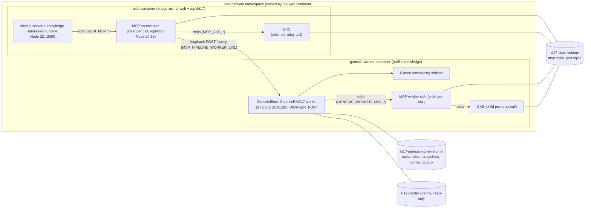
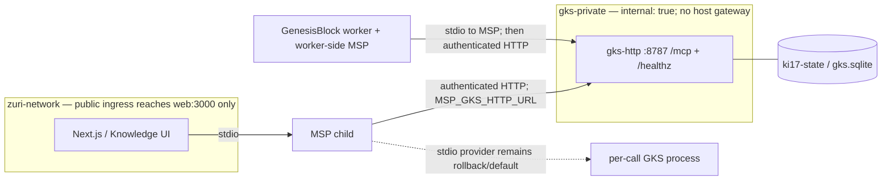

# GenesisRAG17 on the edge device: Phase 3 deployment design

> **Status: this is a design awaiting the operator step. Neither the GKS HTTP canary nor a production cutover has run.**
> A render-only `docker compose config --quiet` merge check was run on 2026-09-23 using
> example env and secret-file paths. It does not build/start services or validate real
> credentials. No canary credential has been generated and no migration applied. The
> earlier release evidence is gate **G-3** (§9.1): throwaway test
> images were built from the pinned commits and the Phase 2 acceptance ran inside them,
> on Linux. Nothing from that run was tagged for deployment, pushed or left behind. The
> owner approved
> [ADR-075](../decisions/ADR-075-SMARTGIFT-CATALOG-ENTERS-VIA-17-STAGE-SOURCE-ADAPTER.md)
> Phase 3 on 2026-09-11. [ADR-073](../decisions/ADR-073-GENESISRAG17-ISOLATED-EXECUTION-AND-PUBLICATION.md)'s
> 2026-09-11 Amendment lifts "no production deployment" for this profile only. The
> deployment is a separate operator step that the owner triggers, and only after every
> item in the pre-deploy gate (§9) passes.

## 1. Scope

| In scope | Out of scope |
|---|---|
| The SmartGift structured-record profile: the FR-187 adapter, plus the FR-188 parser profile and `ontology_v2` once ADR-075 Phase 2 is accepted | Any other source, profile or Business; multiple runtime bindings |
| The edge device `DESKTOP-VETATMQ` (confirmed with `hostname` on 2026-09-11); the HTTP canary must use a separate Compose project and fresh volumes | A production server-host topology, a live `zuri-ai` Compose reconfiguration, or customer traffic |
| MSP (Tier 2), GKS (Tier 3) and the GenesisBlock GenesisRAG17 worker (Tier 4), beside zuri-ai (Tier 1) | Moving edge query traffic to the new chain, which is FR-189 / ADR-075 Phase 4 (§13) |
| The build, Compose and configuration changes, each described here and each landing in its own PR | Applying migrations (ADR-057 operator step); editing FR rows (the integrator's job) |

## 2. Constraints read from the code

| # | Constraint | Where |
|---|---|---|
| C1 | zuri-ai reaches MSP only by **spawning** it, one child process per call, over NDJSON JSON-RPC on stdio. It is configured by `ZURI_MSP_COMMAND` (the executable), `ZURI_MSP_ARGS` (a JSON array), `ZURI_MSP_CWD` and `ZURI_MSP_TIMEOUT_MS`. With the command unset the transport is `null`, and callers fail closed with 503 | `apps/server/src/modules/agent/msp-stdio-transport.js` |
| C2 | Both MSP callers use the shared exact environment allowlist. The web transport and worker launcher read HTTP secret files in their trusted parent and pass the bearer plus required pipeline caller credential to MSP under its aliases. HTTP mode withholds GKS stdio-only settings and the `GKS_PIPELINE_RELAY_CREDENTIAL` verifier alias. The worker launcher is necessary because GenesisBlock's own spawn inherits `process.env`; parent containers remain trusted principals, not process-isolation boundaries | `apps/server/src/modules/agent/msp-child-environment.mjs`; `msp-stdio-transport.js`; `scripts/ki17-worker-msp-launcher.mjs`; Compose overlay; pinned GenesisBlock `msp-stdio.mjs` |
| C3 | The knowledge admission runtime runs **inside the Next.js server process**. `instrumentation.js` starts it when `ZURI_KNOWLEDGE_ENABLED=1`. `ZURI_KNOWLEDGE_BINDINGS` must hold exactly one entry. The source credential is the single `role: "source"` entry in `MSP_PIPELINE_PRINCIPALS` whose scope matches exactly | `src/instrumentation.js`, `src/modules/knowledge/knowledge-runtime.js`, `src/platform/integrations/core/genesisrag17-executor.js` (`resolveRuntimeCredential`) |
| C4 | MSP selects GKS transport explicitly. Unset/`stdio` preserves the per-call child provider (`MSP_GKS_COMMAND`, `MSP_GKS_ARGS`, `MSP_GKS_CWD`); the canary overlay selects authenticated HTTP at `http://gks-http:8787`. MSP remains the only application caller of GKS | pinned MSP `apps/msp-server/src/providers/gks-provider.mjs`; `docker-compose.ki17-gks-http.yml` |
| C5 | MSP relays `msp_pipeline_query` to the worker's `POST /query` at `MSP_PIPELINE_WORKER_URL`. That URL must be an explicit loopback origin (`127.0.0.1` or `::1`), and redirects are rejected | MSP `docs/ADR-MSP-GENESISRAG17-RELAY.md`, `docs/GENESISRAG17-RELAY.md` |
| C6 | The worker binds `127.0.0.1` only (any other host raises `WORKER_HOST_MUST_BE_LOOPBACK`) and refuses non-loopback remote addresses. It serves only `POST /query`, with a bearer token. The port is `GENESIS_WORKER_PORT`, where `0` means an ephemeral port | GenesisBlock `genesisrag17-worker/src/cli.mjs`, `src/worker.mjs` |
| C7 | The worker reaches GKS only through **its own** MSP child (`GENESIS_WORKER_MSP_COMMAND`, `GENESIS_WORKER_MSP_ARGS`, `GENESIS_WORKER_MSP_CWD`, `GENESIS_WORKER_MSP_TIMEOUT_MS`); the canary points that child at the filtering launcher. The worker alone holds the native store at `GENESIS_WORKER_DB_PATH` | `cli.mjs`, `msp-stdio.mjs`, worker `README.md` |
| C8 | MSP and GKS persist in SQLite through `better-sqlite3`, at `MSP_DB_PATH` and `GKS_DB_PATH`. In HTTP mode the source-side and worker-side MSP children reach one long-lived GKS service; only that service opens `gks.sqlite`. The MSP databases remain on the shared named volume. Stdio rollback must not run concurrently with the HTTP GKS service against the same file | MSP `packages/msp-storage`, GKS `packages/gks-persistence`; `apps/server/docker-compose.ki17-gks-http.yml` |
| C9 | The worker needs several things at run time: Node `24.18.x` (`engines: >=24.18`); Python 3.12 with the `numpy`, `onnxruntime` and `tokenizers` versions pinned in `requirements.txt` (`GENESISRAG17_PYTHON`); and `intfloat/multilingual-e5-small` at the pinned revision (about 490 MB, SHA-256-verified at start, `GENESIS_WORKER_MODEL_DIR`). It also needs a benchmark fixture (`GENESIS_WORKER_BENCHMARK_FIXTURE`), a scope, a credential and a query token | `cli.mjs`, worker `README.md`, `requirements.txt` |
| C10 | The acceptance runs used Node `24.18.x` for MSP and GKS (see the MSP runbook), although both packages advertise `>=20`. The web image runs Node 22 (`ARG NODE_VERSION=22`, held there for Prisma 5.22) | MSP `docs/RUNBOOK-GENESISRAG17-LOCAL.md`, `apps/server/Dockerfile` |
| C11 | Every acceptance up to 2026-09-16 ran on **Windows x64**: the only committed native addon was `index.win32-x64-msvc.node`. **Discharged** — P-2 added `index.linux-x64-gnu.node` at the pin, and the acceptance now has a Linux pass on it (§9.1) | GenesisBlock `package.json` (`napi.targets`), §9.1 |
| C12 | Tier 1 runs in the `web` container of the Compose project `zuri-ai`. The project name is pinned, so `docker compose` targets the **live** stack whichever directory it runs from. The container runs as the non-root `node` user on bookworm-slim, serves Next.js standalone output on port 3000 bound to host loopback, and sits on `zuri-network`. The runner image copies named files only | `apps/server/docker-compose.yml`, `apps/server/Dockerfile` |
| C13 | Credential model: `MSP_PIPELINE_PRINCIPALS` holds the source grant and the worker grant, each on the exact six-field scope. `MSP_GKS_PIPELINE_CREDENTIAL` must equal `GKS_PIPELINE_RELAY_CREDENTIAL`, and `MSP_PIPELINE_WORKER_TOKEN` must equal `GENESIS_WORKER_QUERY_TOKEN` | [`GENESISRAG17-CONTRACT.md`](GENESISRAG17-CONTRACT.md) |

## 3. The hard problem

The worker query hop remains web container → MSP child (still inside the web container) →
**loopback** → worker. Inside a container, `127.0.0.1` is that container's own network
namespace, not the host's. So the worker has to share a network namespace with whatever
spawns the source-side MSP, and that is the web container (C1, C5, C6). The HTTP canary
changes only the MSP → GKS hop: service-name DNS on a separate internal network.

The legacy stdio topology opens GKS once per relay call. The canary instead gives the
HTTP service sole ownership of `gks.sqlite`; MSP caller processes never open that file.
All persistent state remains on Docker's named `ki17-state` volume, never on a Windows
bind mount.

## 4. Options

| Option | Loopback hop (C5, C6) | Shared SQLite (C8) | New cross-repo code | Effect on the live stack | Verdict |
|---|---|---|---|---|---|
| **(a)** Linux sidecar in the web container's network namespace (`network_mode: "service:web"`), with MSP and GKS baked into the web image and one shared named volume | Works: same namespace | Works: named volume on the one Linux kernel inside Docker's WSL2 VM | None to any tier's contract. zuri-ai gains build and Compose work; GenesisBlock needs a Linux build of the worker addon | Files added to the web image; one new service behind an optional profile. The web service's ports, networks and healthcheck are unchanged | **Recommended** |
| **(b)** MSP, GKS and the worker as Windows host processes | Breaks: container-to-host is not loopback. Fixing it needs MSP to accept a non-loopback worker URL, or zuri-ai to reach MSP over a network (MSP is stdio-only). Either is a new transport, new authentication and a four-repo contract change | Breaks: the source-side MSP would still run in the container while the worker side runs on the host, against the same files | Large | Small for web | Rejected for now. Reopen only with an ADR for a network transport |
| **(c1)** Everything inside the web container | Works | Works | None | Python, onnxruntime, a 490 MB model and a native addon inside the web image. No supervisor, so the worker lives and dies with the Next.js process, and every web deploy kills it | Rejected |
| **(c2)** Move Tier 1 out of Docker onto the Windows host | Works, on the platform acceptance ran on | Works | None | Reverses the ADR-058 Compose deployment of production web, including ngrok, health and restart | Rejected: too large a change to production for one profile |
| **(c3)** Variant of (a): a dedicated holder container owns the namespace, and both web and the worker join it | Works | Works | None | Web has to give up its `ports` and `networks` to the holder, which changes the live web service and ngrok's route | Fallback if R-2 proves a real problem |
| **(d)** Opt-in GKS HTTP sidecar for a separate canary: MSP still runs as a stdio child; GKS is a long-lived service on an `internal: true` network shared only by web (and its worker namespace) | Works through Compose DNS (`gks-http:8787`) | Works: GKS alone opens the named-volume database in HTTP mode | Uses the already merged MSP HTTP provider and GKS HTTP server; no Tier 1→GKS client | An optional transport overlay plus a canary-only overlay; no GKS host port, ngrok disabled for canary, and default stack/stdio rollback unchanged | **Approved for isolated canary only by ADR-075 D10; not production authorization** |

## 5. Stdio topology (a): retained as default and rollback

The following diagram records the original stdio topology. It remains the default when the
new HTTP overlay is absent and is the rollback target; the canary topology is in §5.1.

The shape is as follows:

- **The web image gains `/opt/ki17`.** It holds a Node `24.18.x` linux-x64 runtime used only
  for the MSP and GKS children (Next.js stays on Node 22), plus MSP and GKS at the Phase 2
  pinned commits, with `npm ci` run inside the Linux build so `better-sqlite3` is built for
  Linux. Nothing else is added.
- **A new `genesis-worker` service** sits behind the `knowledge` Compose profile, so it is
  off by default. Its image is built from the same `/opt/ki17` layer, plus the GenesisBlock
  worker at its pin, the `linux-x64-gnu` native addon built from that pin, and a Python 3.12
  venv installed from `requirements.txt`. It uses `network_mode: "service:web"`, declares no
  `ports` and no `networks`, and runs as `node` (uid 1000, the same as web).
- **Three named volumes, never Windows bind mounts (C8).** `ki17-state` is mounted in both
  containers. `ki17-genesis-store` is mounted in the worker only, which enforces "one
  process holds the native store". `ki17-model` is mounted read-only in the worker only.

Why the stdio topology remains available:

1. **The Zuri-to-MSP contract is unchanged.** The worker stays loopback-only and GKS
   remains passive. The HTTP canary uses the already merged MSP/GKS HTTP wire contract.
2. **The SQLite files sit on one kernel's ext4 filesystem** inside Docker's WSL2 VM, which
   gives SQLite the locking it depends on.
3. **It follows a pattern already in this compose file.** `line-worker` is already an
   optional-profile sidecar there.
4. **The default Compose stack is unchanged.** The separate HTTP overlay is opt-in and
   stdio remains available for rollback (§11).

What it costs. The worker has never run on Linux (C11), so the Phase 2 acceptance must be
re-run inside these images (gate G-3). The worker also restarts every time web is
recreated (R-2, R-3), and the web image grows by MSP, GKS and a second Node runtime.

### 5.1 Private HTTP canary topology (ADR-075 D10)

- [`docker-compose.ki17-gks-http.yml`](../../apps/server/docker-compose.ki17-gks-http.yml)
  is a separate opt-in overlay. Including it switches both MSP callers to HTTP and adds
  `gks-http`; the default Compose stack and its stdio settings remain unchanged without it.
- `web` joins `gks-private` in addition to `zuri-network`; `gks-http` joins only
  `gks-private`, which is `internal: true`. GKS has no host-published port and ngrok
  continues to target only `web:3000`. Compose mounts both the MSP bearer and pipeline
  credential files into `web`, `genesis-worker` and `gks-http`. The trusted parents read
  them and pass the bearer under `GKS_MSP_RELAY_CREDENTIAL` and required pipeline caller
  value under `MSP_GKS_PIPELINE_CREDENTIAL`; the equal `GKS_PIPELINE_RELAY_CREDENTIAL`
  verifier alias stays in `gks-http`. GenesisBlock's worker spawn inherits its full
  environment, so the canary overrides that child with a launcher using the same
  allowlist. The parents remain trusted principals; this is not process isolation. No
  credential is baked into an image or Compose value.
- The canary uses `--project-name` plus its own `--env-file` and env-file selectors
  (`ZURI_WEB_ENV_FILE`, `ZURI_WEB_DOCKER_ENV_FILE`, `ZURI_KNOWLEDGE_ENV_FILE`) so none of
  the default production runtime files are loaded. The canary-only Compose overlay puts
  `ngrok` behind an inactive profile; the default production service remains unchanged.
- `gks-http` mounts `ki17-state` and owns `gks.sqlite` in HTTP mode. MSP's allowlist passes
  the HTTP origin, bearer and required pipeline caller value, but withholds the GKS
  verifier alias and stdio-only database/command settings. The web and worker remain
  trusted principals for the mounted credentials.
- A canary must use a unique Compose project name, fresh volumes and non-production
  credentials/data. Do not include the production `.env`/`.env.knowledge`, start project
  `zuri-ai`, or expose GKS through ngrok. A passing canary is not production readiness or
  authorization to switch customer traffic.

## 6. Processes, ports and data

| Process | Container | Started by | Lifetime | Listens on |
|---|---|---|---|---|
| Next.js server with the knowledge admission runtime (Tier 1) | web | Docker (`node server.js`) | long-running | container `:3000`, host `127.0.0.1:${WEB_PORT}` (unchanged) |
| MSP, source side | web | the Next.js server, per call | one call | stdio only |
| GKS, spawned by the source-side MSP | web | MSP, per relay call | one call | stdio only (default/rollback) |
| GenesisBlock GenesisRAG17 worker | genesis-worker, in web's namespace | Docker (`/opt/ki17` Node running `src/cli.mjs`) | long-running, resumes durable state | `127.0.0.1:<GENESIS_WORKER_PORT>` inside the shared namespace |
| Python embedding sidecar | genesis-worker | the worker | while the worker runs | stdio only |
| MSP, worker side | genesis-worker | the worker, through `ki17-worker-msp-launcher.mjs`, per call | one call | stdio only |
| GKS, spawned by the worker-side MSP | genesis-worker | MSP, per relay call | one call | stdio only (default/rollback) |
| GKS HTTP service | gks-http | Docker Compose | long-running | `gks-private:8787`; no host-published port |

**Ports.** The worker listens on `127.0.0.1:<GENESIS_WORKER_PORT>` (`19417` in the
current template). In HTTP-canary mode, GKS listens on `0.0.0.0:8787` inside its own
container and is reachable only over `gks-private`; Compose has no `ports` mapping for it.
The internal network has no host gateway and is not attached to ngrok.

**Data paths.**

| Path inside the container | Volume | Mounted in | Holds | Named by |
|---|---|---|---|---|
| `/var/lib/zuri-ki17/state/msp.sqlite` | `ki17-state` | web, genesis-worker | MSP pipeline grants, journal and relay state | `MSP_DB_PATH` |
| `/var/lib/zuri-ki17/state/gks.sqlite` | `ki17-state` | web, genesis-worker, gks-http | GKS decisions, receipts, verdicts and stage evidence; opened by gks-http alone in HTTP mode | `GKS_DB_PATH` |
| `/var/lib/zuri-ki17/genesis/` | `ki17-genesis-store` | genesis-worker only | native store, candidate and published snapshots, publication pointer, durable outbox and transaction intents | `GENESIS_WORKER_DB_PATH` |
| `/opt/ki17/model/<revision>/` | `ki17-model` (read-only) | genesis-worker only | the five pinned model files | `GENESIS_WORKER_MODEL_DIR` |
| `/opt/ki17/fixtures/` | baked into the image | genesis-worker | the Phase 2 SmartGift benchmark fixture | `GENESIS_WORKER_BENCHMARK_FIXTURE` |
| `/opt/ki17/{node,msp,gks}` | baked into the image | web, genesis-worker and gks-http (only node/GKS copied to gks-http) | the runtime and pinned sources | `ZURI_MSP_COMMAND`, `ZURI_MSP_ARGS`, `ZURI_MSP_CWD`, `MSP_GKS_COMMAND`, `MSP_GKS_ARGS`, `MSP_GKS_CWD`, `GENESIS_WORKER_MSP_*` |
| `/opt/ki17/{genesisblock,venv}` | baked into the image | genesis-worker | the worker package, native addon and Python | `GENESISRAG17_PYTHON` |

Named volumes survive `docker compose down`. **`down -v` destroys the published generations
and must never be part of this procedure.** The 2026-09-06 RCA on deleting resources that
were still in use applies here too: these volumes live on Docker's WSL2 data disk.

## 7. Configuration (names only)

The knowledge settings go in a new, gitignored `apps/server/.env.knowledge` (the existing
`.env*` rule covers it). `genesis-worker` loads it as its **only** env file, marked
`required`, so the worker never receives web's `.env` secrets. Web loads it as an extra
optional env file, next to the existing optional `.env.docker`. The shared values then
live in one file and cannot drift between two copies. Values are generated by the operator
at deploy time and are never committed, pasted into a PR or report, or logged.

| Variable | web | genesis-worker | Meaning |
|---|:-:|:-:|---|
| `ZURI_KNOWLEDGE_ENABLED` | ✓ | | `1` starts the admission runtime. **Flipped last** (§10 step 5) |
| `ZURI_KNOWLEDGE_BINDINGS` | ✓ | | exactly one entry: the SmartGift scope plus the policy `{allowEmbedding, allowPublication}` |
| `ZURI_KNOWLEDGE_TIMEOUT_MS` | ✓ | | runtime call timeout |
| `ZURI_MSP_COMMAND`, `ZURI_MSP_ARGS`, `ZURI_MSP_CWD`, `ZURI_MSP_TIMEOUT_MS` | ✓ | | the `/opt/ki17` Node running MSP's `apps/msp-server/bin/msp-server.mjs` |
| `MSP_DB_PATH`, `GKS_DB_PATH` | ✓ | ✓ | MSP state and the shared GKS path; in HTTP mode only `gks-http` opens `GKS_DB_PATH` |
| `MSP_GKS_COMMAND`, `MSP_GKS_ARGS`, `MSP_GKS_CWD` | ✓ | ✓ | stdio default/rollback only; HTTP mode withholds them from MSP |
| `MSP_GKS_TRANSPORT`, `MSP_GKS_HTTP_URL` | ✓ | ✓ | set to `http` and `http://gks-http:8787` only by the opt-in overlay |
| `GKS_MSP_RELAY_CREDENTIAL` | ✓ | ✓ | Stdio-mode MSP credential; for the HTTP canary leave the value unset and use the mounted file below |
| `GKS_MSP_RELAY_CREDENTIAL_FILE`, `MSP_GKS_PIPELINE_CREDENTIAL_FILE` | ✓ | ✓ | HTTP overlay secret-file paths; shared builder/worker launcher read them and pass values to MSP under the two caller aliases |
| `MSP_PIPELINE_PRINCIPALS` | ✓ | ✓ | one source grant and one worker grant on the same six-field scope |
| `MSP_GKS_PIPELINE_CREDENTIAL`, `GKS_PIPELINE_RELAY_CREDENTIAL` | ✓ | ✓ | equal per C13; HTTP passes the caller alias to MSP, while the server verifier alias stays in `gks-http` |
| `MSP_PIPELINE_WORKER_URL` | ✓ | ✓ | `http://127.0.0.1:<GENESIS_WORKER_PORT>` |
| `MSP_PIPELINE_WORKER_TOKEN` | ✓ | ✓ | must equal `GENESIS_WORKER_QUERY_TOKEN` |
| `GENESIS_WORKER_DB_PATH`, `GENESIS_WORKER_SCOPE`, `GENESIS_WORKER_CREDENTIAL`, `GENESIS_WORKER_QUERY_TOKEN`, `GENESIS_WORKER_MODEL_DIR`, `GENESIS_WORKER_BENCHMARK_FIXTURE`, `GENESIS_WORKER_PORT`, `GENESIS_WORKER_POLL_MS` | | ✓ | worker identity, store and model. The credential is the worker grant's credential, and the scope is the same scope object |
| `GENESIS_WORKER_MSP_COMMAND`, `GENESIS_WORKER_MSP_ARGS`, `GENESIS_WORKER_MSP_CWD`, `GENESIS_WORKER_MSP_TIMEOUT_MS` | | ✓ | the worker's own MSP child |
| `GENESISRAG17_PYTHON` | | ✓ | `/opt/ki17/venv/bin/python` |

**Keep unset:** `ZURI_MSP_THREAD_MEMORY_ENABLED` and `ZURI_MSP_THREAD_SERVICE_KEY` (see R-5).
GKS also reads `GKS_DEFAULT_PORTFOLIO_ID`. The pipeline path carries an explicit scope on
every request, so this design leaves it unset; G-3 confirms that holds.

The Compose overlay reads only secret **file paths** from the host `.env`:
`ZURI_GKS_MSP_RELAY_CREDENTIAL_FILE_HOST` and
`ZURI_GKS_PIPELINE_RELAY_CREDENTIAL_FILE_HOST`. In a canary, use fresh non-production
values; the pipeline caller file must match the server verifier file under C13. Both
files are mounted into `web`, `genesis-worker` and `gks-http`; the web transport and
worker launcher load the files and pass the required caller values to MSP. The server
verifier alias itself is not forwarded. Never put secret bytes in the Compose
interpolation file or canary `.env.knowledge`. Web, worker and MSP remain trusted
principals for these credentials.

## 8. Prerequisite work (each in its own PR, none done here)

| # | Work | Owner |
|---|---|---|
| P-1 | **Apply the shared MSP child environment allowlist to both callers (C2),** then narrow by transport: web/worker parents read the mounted HTTP bearer and pipeline caller files; pass the two required MSP aliases; withhold GKS stdio-only settings and the server verifier alias. Wrap the GenesisBlock worker spawn, which otherwise inherits the full parent env | zuri-ai — implemented; 50 focused unit tests pass; image/canary check NOT_RUN |
| P-2 | **Build the worker for Linux at the pin.** A `napi build` for `x86_64-unknown-linux-gnu` from the pinned GenesisBlock commit, run inside the image build. GenesisBlock owns the recipe | GenesisBlock |
| P-3 | **Pinned Linux build stages** for `runner-ki17`, `genesis-worker` and the separate `gks-http` service image, with pin and entrypoint assertions; ordinary `runner` remains independent of KI17 contexts | zuri-ai — `gks-http` target added in this change; verification pending |
| P-4 | **Compose changes.** Preserve existing defaults, worker and volumes; add the opt-in HTTP overlay, internal-only network, secret-file mounts, health dependency, explicit MSP HTTP selection, and a canary-only env-file selector/ngrok-suppression overlay | zuri-ai — YAML parse, static tests and render-only config pass with example paths; actual canary NOT_RUN because dedicated canary env and secret files are absent |
| P-5 | **A read-only operator smoke script,** run in the web container. First, `msp_pipeline_evidence` for a run id that does not exist, as the source role: an empty page proves MSP → GKS works. Second, `msp_pipeline_query`: either a published generation or a typed `pipeline_worker_*` or no-published-generation result proves MSP → worker over loopback. It prints outcome codes only, never payloads or credentials | zuri-ai |
| P-6 | **The SmartGift benchmark fixture** that the Phase 2 acceptance uses, baked into the worker image | zuri-ai + GenesisBlock (Phase 2) |

## 9. Pre-deploy gate (every item must pass before the operator step)

| # | Gate |
|---|---|
| G-1 | Phase 2 acceptance notes merged in zuri-ai, MSP, GKS and GenesisBlock (ADR-075 D8) |
| G-2 | The Phase 2 **four-process acceptance** passes: raw entrypoint, no skips, SmartGift fixture, and the ADR-073 thresholds unchanged (Recall@5 ≥ .80, MRR ≥ .65, citation correctness 1.00, cross-tenant leakage 0). The four commits are recorded |
| G-3 | **The same acceptance also passes inside the images this design ships:** Linux, Node `24.18.x` for MSP, GKS and the worker, the Linux native addon, and the venv. It includes the contract's crash and replay cases (the physical-recovery section of contract 1.3.0b). Every earlier run was on Windows (C11), so a Windows pass alone does not satisfy G-3. **MET 2026-09-16** — see §9.1 |
| G-4 | P-1 to P-6 and the HTTP overlay/build work are merged, and the pin manifest matches the exact MSP, GKS and GenesisBlock commits used for acceptance |
| G-5 | The zuri-ai tables that GenesisRAG17 and knowledge admission use exist on production and their migrations are recorded. That is an ADR-057 operator step, separate from this deployment. The 2026-09-11 gap map found knowledge tables on production with migrations unrecorded |
| G-6 | A production database backup taken per existing practice before the first enable. Before any later redeploy, stop the worker and copy `ki17-state` and `ki17-genesis-store` |
| G-7 | The files in `ki17-model` match the five SHA-256 values the worker verifies (it re-checks them at start) |
| G-8 | Coordination. The primary checkout and the live stack are shared, so announce the deploy to the other sessions and **wait for an acknowledgement** (CLAUDE.md). Then the owner triggers the step |
| G-9 | Before any production consideration, an isolated canary with a different Compose project, dedicated runtime env files and fresh volumes passes image/pin checks; GKS health; missing/wrong-bearer 401; MSP-authenticated evidence call; wrong-scope denial; restart persistence; canary backup/restore; and inspection proves no GKS host port, public URL or running ngrok route. Use the canary-only overlay and never use production `.env`, `.env.knowledge` or the `zuri-ai` project for this gate |

### 9.1 G-3 result — the Linux run, 2026-09-16

The `ki17-acceptance` build target (`apps/server/Dockerfile`, test-only, a leaf of the
stage graph) is the shipped `genesis-worker` sidecar plus this app's own Node 22 test
runner, devDependencies, source and `tests/` tree. `npm run test:genesisrag17` ran
inside it against the pinned Linux binaries, with the embedding model bind-mounted
read-only from the host's Hugging Face cache at the pinned revision. Nothing was
pushed, no Compose command was run and every throwaway image, container and volume was
removed afterwards.

| | |
|---|---|
| Image | `--target ki17-acceptance`, contexts `msp`/`gks`/`genesisblock` at the `pins.json` commits (`49fe7de7`, `ecf1e4de`, `7c9261c4`), attested via `.ki17-pin` (`git archive` exports carry no `.git`) |
| Platform | `Linux 6.18.33.2-microsoft-standard-WSL2 x86_64`, Debian bookworm |
| Runtimes | test runner / Tier 1 `v22.23.2`; MSP, GKS and the worker `v24.18.0` at `/opt/ki17/node/bin/node`; venv `Python 3.12.14` with `numpy 2.5.2`, `onnxruntime 1.29.0`, `tokenizers 0.23.1` |
| Native addon | `index.linux-x64-gnu.node`, 9 987 776 bytes, stripped ELF x86-64 — the P-2 build, loaded for the first time by a real acceptance run |
| Result | **35 passed, 0 failed, 0 skipped** across both suites — `genesisrag17-e2e.test.js` 25, `genesisrag17-smartgift.test.js` 10. Duration 125.83 s |
| Crash / replay | All five `recovers an actual process crash at …` cases, both `resends the identical … receipt after an actual accepted reply is lost` cases, the FR-071 replay, both `resumes the actual source process after Stage N` cases and the duplicate-evidence / wrong-scope cases passed |
| Prose corpus benchmark | Recall@5 1.00, MRR 1.00, citation correctness 1.00, cross-tenant leaks 0 (5 queries) |
| SmartGift benchmark | `PM-TMB` 1.00 / 1.00 / 1.00 / 0 · `PM-BOTTLE-LED` 1.00 / 1.00 / 1.00 / 0 · `PM-TMB@qty100` 1.00 / 0.75 / 1.00 / 0 · `PKG-NY-2027-REACH-OPS` 1.00 / 1.00 / 1.00 / 0 (Recall@5 / MRR / citation correctness / cross-tenant leaks; thresholds .80 / .65 / 1 / 0). Every record `ontology_v2`, Stage 17 PASS |

**One harness change was needed, and it is the finding.** `tests/acceptance/harness.js`
spawned MSP, GKS and the worker with `process.execPath`, which is correct only while
the runner and its children share one runtime. In these images they deliberately do
not (C9/C10): Tier 1 is Node 22, the children are the pinned 24.18.x. The harness now
resolves them through `KI17_NODE` — unset it is `process.execPath` and a native run is
unchanged; set to a path that does not exist it throws rather than falling back,
because a silent fallback would report a G-3 pass for a runtime the deployment does
not ship. A negative-control run with a bad `KI17_NODE` fails both suites at
`beforeAll` with that message, which is what proves the pass above used 24.18.0.

C11 is therefore discharged for the worker: a Linux run of the pinned commit is now on
record. G-7 is not — this run verified the model against the worker's own five SHA-256
values from a host cache, not from the `ki17-model` volume the deploy will populate.

## 10. Start order (operator procedure, not executed)

Rollout is accept-before-produce (ADR-075 D6, revision 2): the worker accepts
`{ontology_v1, ontology_v2}` first, GKS then produces v2, and zuri-ai sends parser-2
batches last. Without the HTTP overlay GKS is not a daemon; with the canary overlay it is
the private `gks-http` service. Zuri sending anything is gated by `ZURI_KNOWLEDGE_ENABLED`.
The production order remains **worker → GKS relay verified → zuri-ai enabled**:

0. **Gate.** §9 passes in full and the owner triggers the step. Run from the primary
   checkout at the merged `main` commit, following the existing deploy practice
   (`apps/server`, the pinned project name).
1. **Build** both images from the pinned contexts (P-3). Build only; nothing is recreated.
2. **Deploy web with the new image and knowledge still off** (`ZURI_KNOWLEDGE_ENABLED`
   unset). `ZURI_MSP_*` may be set at this point, but see R-5 first. Admission keeps
   returning 503 and the runtime does not start. Check `GET /api/health` returns 200, and
   read `docker logs` for the web container.
3. **Start `genesis-worker`** (profile `knowledge`). It verifies the model hashes, opens the
   native store, prints its endpoint JSON line, listens on
   `127.0.0.1:<GENESIS_WORKER_PORT>` and resumes. Check that the container is healthy and
   that its logs show the endpoint line with no verification error. In the worker
   container, a worker-role `msp_pipeline_claim` returns zero decisions.
4. **Verify the relay hops without producing anything.** Run P-5 in the web container. It
   should return an empty evidence page (MSP → GKS) and a typed no-published-generation
   result (MSP → worker over loopback).
5. **Enable zuri-ai.** Set `ZURI_KNOWLEDGE_ENABLED=1` and the single `ZURI_KNOWLEDGE_BINDINGS`
   entry, then recreate web. The worker lives in web's namespace, so repeat steps 3 and 4
   afterwards (R-2).
6. **First run.** Admit one SmartGift catalog projection as a `FileAsset` through the
   FR-187/FR-173 admission path. Follow the stage terminals through the evidence pull; the
   run finishes only with all 17 successes and the matching publication receipt. Then query
   through `POST /api/knowledge/queries` and check the citation.
7. **Record** in `.brain/reports/`: image digests, the four commits, the Node and Python
   versions, the model revision, the run id, stage outcomes and the publication receipt
   hash. Never record credentials or payloads.

**Canary boundary:** D10 permits only an isolated canary. Use a unique Compose project,
the dedicated canary env-file selectors, the ngrok-suppression overlay, fresh volumes,
synthetic data and non-production secrets. Verify the GKS service on the internal
network and the authenticated MSP relay before enabling any producer. Never run this
overlay against the existing `zuri-ai` project or its `ki17-state` volume as a substitute
for that canary. G-9 has not been executed in this change.

**Health checks**

| Check | What it proves | How | When |
|---|---|---|---|
| `GET /api/health` | web and its database | existing healthcheck, unchanged | continuously |
| Worker liveness | the worker is listening in the namespace | Compose healthcheck: a Node TCP connect to `127.0.0.1:<GENESIS_WORKER_PORT>`. No token, no query | continuously |
| Relay readiness | MSP → GKS and MSP → worker work end to end | the P-5 smoke | every deploy, and after every web recreate |
| GKS HTTP liveness | the HTTP service can open its SQLite store | `GET /healthz` from an attached container | every HTTP canary/deploy |
| Pipeline outcome | a run truly published | 17 SUCCEEDED terminals plus the publication receipt; FAILED terminals show in the FR-071 execution ledger | every run |
| Logs | start-up crashes the health endpoint cannot see | `docker logs` for both containers | every deploy |

## 11. Rollback

| Level | Action | Effect |
|---|---|---|
| R1: stop producing | Unset `ZURI_KNOWLEDGE_ENABLED` and recreate web | Admission fails closed with 503 and the queue stops. Admitted jobs are durable and resume when re-enabled |
| R2: stop the worker | Stop the `knowledge` profile's service | Queries fail with a typed `pipeline_worker_unavailable`. Nothing customer-facing depends on the worker during Phase 3 |
| R3: previous web image | Set `ZURI_WEB_IMAGE` to the previous tag and recreate web | The only difference in the new image is `/opt/ki17` |
| R4: HTTP-to-stdio rollback | Stop/disable MSP callers first; remove the HTTP overlay or restore `MSP_GKS_TRANSPORT=stdio`; verify the pinned stdio command/settings; recreate web and worker; then stop `gks-http` | MSP keeps the existing GKS stdio path. Do not run both GKS transports concurrently against `gks.sqlite`; keep every volume and take no destructive action |

**Volumes are never deleted during a rollback.** Published snapshots are immutable, and
the pointer moves only through atomic publication. A bad generation is superseded by a
correction run, never by editing files. A full reset of MSP and GKS state happens only on
the owner's instruction: stop both services, then move the volumes aside rather than
deleting them. **Customers are not affected, by construction.** Phase 3 routes no LINE
answer through this chain, and edge v4 keeps answering on `:8888` until the Phase 4
cutover.

## 12. Risks

| # | Risk | Mitigation |
|---|---|---|
| R-1 | On Linux, the native addon or the pointer's fsync-and-rename atomicity on ext4 behaves differently from the Windows-proven build | G-3 |
| R-2 | `network_mode: "service:web"` ties the worker to the web container's namespace. If web is recreated and Compose does not recreate the worker too, the worker is left listening in a dead namespace and queries fail with `pipeline_worker_unavailable` | After every web deploy, check worker health and run P-5. If Compose does not recreate the worker by itself, the procedure adds an explicit worker recreate. If that proves fragile, move to option (c3) |
| R-3 | Every production web deploy restarts the worker in the middle of work | Acceptable only because the contract requires crash-safe intents and a durable outbox. G-3 must include the crash tests. The worker gets a 60 s stop grace period |
| R-4 | HTTP mode intentionally gives MSP its bearer and pipeline caller credentials; web/worker are trusted parents and can read mounted secret files. The pipeline verifier alias itself stays server-side | Shared exact child allowlist for both caller paths; worker wrapper because upstream spawn inherits process.env; omit GKS stdio-only settings and verifier alias; file-content tests and explicit parent trust documentation |
| R-5 | Setting `ZURI_MSP_COMMAND` turns MSP on for **every** caller of `createMspTransportFromEnvironment`, not only knowledge. Those callers are the knowledge runtime and executor, the source worker, the evidence pull route (`POST /api/pipelines/knowledge/evidence/pull`), Phase 1 thread memory (gated by `ZURI_MSP_THREAD_MEMORY_ENABLED`) and the server LINE thread-memory scanner. The scanner is gated **only** by `ZURI_MSP_THREAD_SERVICE_KEY`, with no enable flag (`server-line-runtime.js`) | Keep both thread-memory variables unset, and check they are absent before step 2. Thread memory is outside ADR-075's approval |
| R-6 | SQLite contention or simultaneous GKS owners during a transport change | In HTTP mode only `gks-http` opens `gks.sqlite`; stop callers before switching. Never overlap stdio GKS processes with `gks-http` against the same file; use named volumes and watch for `SQLITE_BUSY` |
| R-7 | The pinned Compose project name means a command run from a worktree recreates the live stack | A canary must use an explicitly distinct project and fresh volumes; production operator commands still run only from merged `main` after G-8 |
| R-8 | Disk: the 490 MB model plus store growth on Docker's WSL2 data disk | Check free space before step 3; that disk also holds every other volume |
| R-9 | A second Business needs a routing contract, because the runtime accepts exactly one binding (`knowledge-runtime.js`) | Out of scope; it needs its own decision |

## 13. What Phase 4 inherits

- **Edge v4 cannot join this chain directly.** It runs on the Windows host
  (`zuri-edge-device`), outside Docker, so it cannot reach the worker's namespace-local
  loopback. It must not spawn its own MSP against the container's SQLite either (C8). So
  FR-189's edge queries enter through zuri-ai's authenticated `POST /api/knowledge/queries`
  (FR-173, ADR-072, with an explicit knowledge API grant). That route relays through the
  source-side MSP to the worker. It is ADR-075 D7's query path, with Tier 1 as the source
  caller, and it needs no new transport.
- **Shadow evidence has to exist before Christmas.** Shadow comparison records both answers
  and the generation id for each query. Before the Christmas 2026 window opens, the
  definition of a "mismatch" and both campaign windows' dates must be written down, or the
  Phase 5 condition cannot be evaluated (ADR-075 D8).

## CHANGELOG

| Version | Date | Status | Summary | Commit Hash | Agent |
|---|---|---|---|---|---|
| 0.5.0 | 2026-09-23 | beta | Corrects the HTTP pipeline credential boundary and adds the same child-environment filter to GenesisBlock's inherited worker spawn | working-tree | RWANG |
| 0.4.0 | 2026-09-23 | beta | Adds isolated local-canary runtime env selectors and a canary-only ngrok suppression overlay; normal defaults unchanged | working-tree | RWANG |
| 0.3.0 | 2026-09-23 | beta | Adds the owner-approved isolated MSP-to-GKS HTTP canary topology, private network/secret boundaries, mode-specific environment contract, canary gate and stdio rollback; no canary or production deployment run | working-tree | RWANG |
| 0.1.0 | 2026-09-11 | proposed | Phase 3 design after the owner approved ADR-075 Phases 3–5. Constraints read from code; options (a), (b), (c1)–(c3); recommends a Linux sidecar in web's network namespace with shared named volumes; env names, processes, ports, paths, start order, health checks, rollback and the pre-deploy gate. Not executed | — | Claude Opus 5 |
| 0.2.0 | 2026-09-16 | proposed | Records the G-3 result (new §9.1): the Phase 2 acceptance ran inside the images this design ships and passed 35/35 on Linux, with MSP/GKS/worker on Node 24.18.0, the P-2 Linux addon and the pinned venv, crash and replay cases included. Adds the test-only `ki17-acceptance` build target and the `KI17_NODE` seam the run needed. Still not deployed | — | Claude Sonnet 5 |
