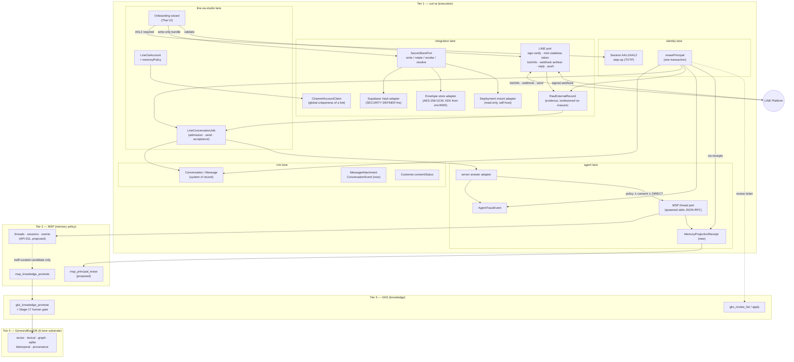
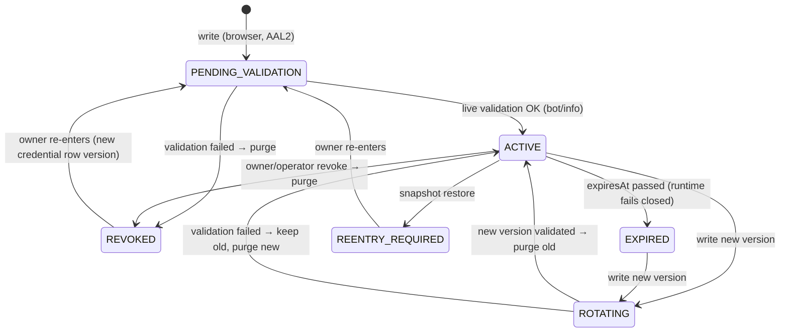
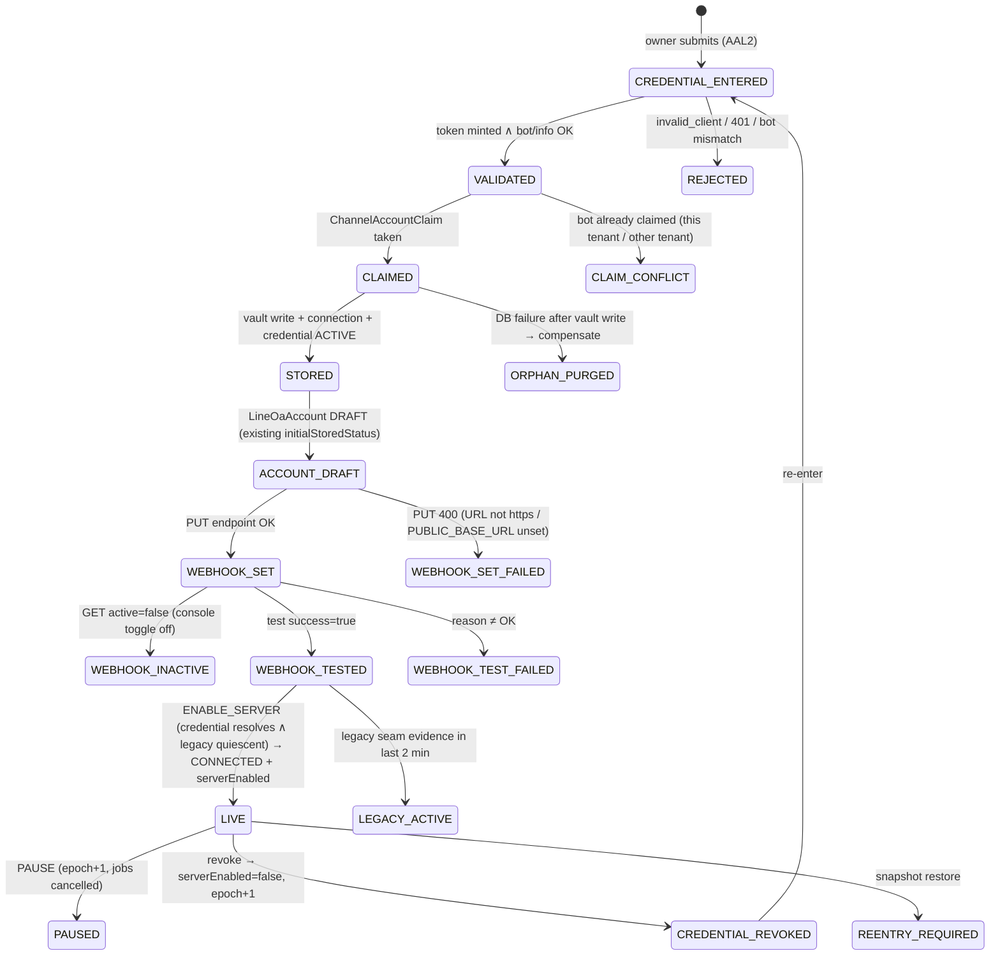
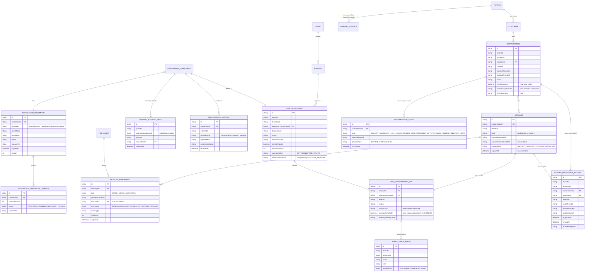
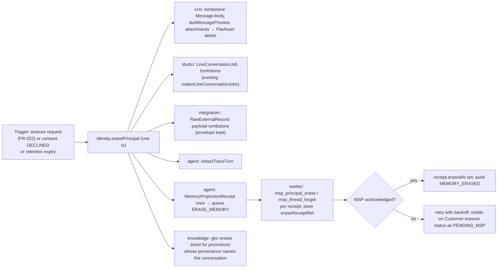

# Design — Integration credential vault, self-serve LINE OA onboarding, and chat-history tiers

> **Decided 2026-09-14.** The owner accepted every recommended default in §1.2. The binding
> statements are [ADR-089](../decisions/ADR-089-BROWSER-WRITE-ONLY-CREDENTIAL-VAULT-AND-SELF-SERVE-LINE-OA-ONBOARDING.md)
> (credentials and onboarding: FR-223..FR-228, SEC-030, SDD-097, SDD-098) and
> [ADR-091](../decisions/ADR-091-CHAT-RECORD-AND-AGENT-MEMORY-SPLIT-AND-THE-CONTEXT-COMPOSER.md)
> (chat record, memory tiers, retention, erasure, Context Composer: FR-229..FR-234, SEC-031, SDD-100).
> **Where this document and the ADRs differ, the ADRs win.** Three places differ on purpose:
> chat-derived knowledge follows the companion
> [LINE → GKS design](LINE-TO-GKS-GROUNDING-AND-CANDIDATE-PIPELINE-DESIGN.md) and ADR-090 (a Tier 1
> candidate through ADR-072 admission, not `msp_knowledge_promote`); the MSP session tier needs the
> account's memory policy but not customer consent (ADR-091 D4); and sealing `MfaFactor.secret` (Q11)
> is a separate lane already running (`ADR-088`, branch `fix/identity-mfa-secret-at-rest`). The `FR-NEW-*` placeholders in §8.1 are historical; ADR-089 and
> ADR-091 map them to real ids. Evidence below was read on the date shown and is not refreshed.

**Status:** design proposal for owner review · 2026-09-13 · no code, no migration, no id allocated (decided 2026-09-14, see the note above)
**Repository baseline read:** `origin/main` `e829b80e` (the primary checkout, monorepo; server app `apps/server`)
**External systems read:** `Memory-and-Soul-Passport` (MSP, main clone), `Genesis-Knowledge-System` (GKS, main clone), LINE Developers reference (fetched 2026-09-13)
**Evidence marks:** every claim in §2 is tagged **VERIFIED** (read in this session, with `file:line`) or **ASSUMED** (inferred or read from a summarised source). Paths are `apps/server/…` unless they start with `docs/`.

---

## 1. Summary and decisions requested from the owner

### 1.1 What this proposes, in six sentences

1. **One write-only credential vault in the Integration lane**, with two interchangeable stores behind one `SecretStorePort`: **Supabase Vault** (primary, for the hosted product) and an **app-level envelope-encryption store** (for generic Postgres / self-host). The existing deployment-secret mount stays as a third, read-only, operator-only adapter. Prisma keeps references and lifecycle metadata only; plaintext exists in the database only inside the Vault schema and leaves it only through a scoped `SECURITY DEFINER` resolver.
2. **A Business owner connects a LINE Official Account from the browser** in one wizard: MFA step-up (AAL2) → paste Channel ID + Channel secret (+ optional token) → the server mints a stateless token and calls `GET /v2/bot/info` to prove the pair and auto-fill destination/basicId/displayName → the secret is written to the vault → connection + account are created → the webhook is set and tested via the LINE API → the account is enabled for server transport. No operator, no host file.
3. **Channel access tokens are not stored for new accounts by default.** The Integration LINE port mints 15-minute stateless tokens from Channel ID + secret and caches them in-process; nothing long-lived that cannot be revoked sits in the vault. (Open question Q2 — the long-lived token remains accepted as an input for accounts that want it.)
4. **CRM `Conversation`/`Message` stays the system of record**, keyed by the account-scoped thread key already in force (ADR-061 D5). Two additive CRM models cover what the record cannot express today: non-text events and media attachments. Raw LINE evidence keeps its role as replayable evidence with PDPA tombstones.
5. **MSP receives a projection, not a copy, and only under policy**: per-account memory policy ∧ customer consent `GRANTED` ∧ DIRECT audience, decided at admission and recorded durably so that erasure can find every projection and tombstone it. **GKS never indexes customer chat**; only staff-curated, PII-stripped candidates enter through the existing MSP → GKS promotion gate with human review.
6. **Retention becomes a declared, enforced policy** (defaults proposed in Q9) with one erasure transaction that fans out CRM → Studio jobs → raw evidence → trace → MSP, and files a GKS review ticket for anything already promoted.

### 1.2 Decisions requested (numbered; each with the recommended default)

| # | Question | Recommended default | Why it needs the owner |
|---|---|---|---|
| **Q1** | Which secret store is primary, and do we build the envelope-encryption fallback in the same wave? | Supabase Vault primary; envelope store built in the same wave behind the same port, selected by `ZURI_SECRET_STORE=supabase-vault \| envelope`; mount stays operator-only | Self-host (ADR-058 `local-db` profile) has no Vault; without the fallback, self-host customers keep needing an operator |
| **Q2** | Store the long-lived channel access token, or mint stateless tokens from Channel ID + secret? | **Mint.** Store `{channelId, channelSecret}`; accept an optional long-lived token only as an override the owner pastes deliberately | Stateless tokens are 15 min, unlimited, cannot be revoked (so their blast radius is bounded by time); a stored long-lived token never expires and must be revoked in the LINE console on compromise |
| **Q3** | Is MFA (TOTP) mandatory for anyone who writes a credential? | Yes: `assertSessionAssurance(viewer,'AAL2')`; a Person with no ACTIVE TOTP factor is sent to enrol first | Today MFA is optional; making it a hard gate changes onboarding friction for owners |
| **Q4** | A bot (`destination`) already connected under **another Tenant**: refuse, or allow with operator takeover? | Refuse with a truthful message ("บัญชีนี้เชื่อมต่ออยู่กับพื้นที่ทำงานอื่นแล้ว") and an operator-mediated takeover flow in Phase 2 | Disclosing "already bound elsewhere" is acceptable only because the caller has just proven possession of the channel secret; the owner should confirm that stance |
| **Q5** | Set the LINE webhook URL automatically at connect time, or show it and let the owner paste it into the console? | Automatic `PUT /v2/bot/channel/webhook/endpoint` + `POST …/webhook/test`, with a visible fallback card when the API refuses | Automatic replacement silently un-routes any other consumer of that bot (the legacy edge path) — that is the point, but it is irreversible from LINE's side |
| **Q6** | Retire the "ยืนยันว่า transport เดิมหยุดรับ webhook แล้ว" checkbox in favour of a derived check? | Yes for vault-backed accounts: `legacyQuiesced` becomes *derived* (webhook endpoint at LINE equals our URL **and** no legacy-seam evidence for that destination in the last 2 min); keep the checkbox for mount-backed accounts | The checkbox is currently the only fence against two consumers of one webhook |
| **Q7** | Turn on MSP thread memory for LINE customers? | **Not yet.** Ship the policy/consent plumbing and the durable projection receipt now; enable projection only after MSP main ships its thread tools and a principal-erase tool (§2.4 finding F6) | Today's opt-in flag is deployment-wide and the tools it calls do not exist in MSP main |
| **Q8** | May customer chat ever become GKS knowledge? | Only as staff-curated, PII-stripped "approved answer" candidates through `msp_knowledge_promote` → `gks_knowledge_promote` with Stage-17 human review; never raw transcripts, never automatically | This is a product stance on customer data, not an engineering choice |
| **Q9** | Retention windows | Raw LINE payload text: 90 days then tombstone (envelope kept); `Message.body` and attachments: 24 months unless erased earlier; `AgentTraceEvent` payloads: 90 days; MSP event content: MSP default 90 days; all per-Tenant overridable downward only | PDPA sets no number; the owner sets the number |
| **Q10** | Store media (images/files) sent by customers? | Phase 3: fetch within LINE's retention window into `FileAsset` under the same retention policy; until then record the event without bytes | Storage cost and a second PII surface |
| **Q11** | Move `MfaFactor.secret` (stored in clear today) into the same vault? | Yes, Phase 4, same envelope store, no behaviour change | Scope creep vs. an obvious inconsistency once a vault exists |
| **Q12** | Amend ADR-061 D8 / ADR-060 D3 / ADR-041 D3 in place, or write a new ADR? | New ADR (`ADR-NEW`) that amends the three by pointer, the ADR-063/ADR-067 precedent | Three ADRs currently say "never accepts secret material" in slightly different words |

---

## 2. Current state, evidence-cited

### 2.1 Credentials and secret resolution

| # | Claim | Evidence | Mark |
|---|---|---|---|
| C1 | The only production adapter wired for the native LINE seam is the **deployment-secret mount**: `serverLinePorts()` composes `createServerLineSecretManagerFromEnv(env)` and nothing else | `src/modules/line-oa-studio/application/server-line-runtime.js:29-35`; adapter at `src/platform/integrations/providers/line/server-line-transport.js:63-104` | VERIFIED |
| C2 | The mount is a JSON file `{version:1, entries:[{secretRef, tenantId, businessId, accountId, connectionId, destination, version, expiresAt, channelSecret, channelAccessToken}]}`, re-read on **every** resolution, and every entry must match five scope fields exactly | `server-line-transport.js:28-40, 84-96` | VERIFIED |
| C3 | The mount is bound read-only into the container at `/run/secrets/zuri-line.json` by the `line-server` overlay; the file must live outside the checkout | `docker-compose.line-server.yml:10-17`; `server-line-transport.js:69-73` | VERIFIED |
| C4 | `ENABLE_SERVER` validates credentials by constructing the mount adapter **unconditionally** (`createServerLineSecretManagerFromEnv()`), unless a test injects `ports.validateServerCredentials` | `src/modules/line-oa-studio/application/line-oa-account-service.js:343-359` | VERIFIED |
| C5 | The browser form accepts only `destination` (`U`+32 hex) and `secretRef` matching `deployment-secret:[A-Za-z0-9_-]{1,100}`; the provisioning service enforces the same regex server-side | `src/modules/line-oa-studio/ui/LineStudioEdgeConnection.jsx:212-219, 564-572`; `src/modules/integration/application/line-server-provisioning-service.js:12-17` | VERIFIED |
| C6 | The generic Platform Integrations form accepts only `supabase-vault:<uuid>`; the raw value is entered in the Supabase Dashboard | `docs/decisions/ADR-032-INTEGRATION-SECRET-MANAGEMENT-UI.md` D2 table; `docs/domains/integration/CHARTER.md:97-103` | VERIFIED |
| C7 | The Supabase Vault adapter is **read-only**; it calls `zuri_core.resolve_phase1_line_secret(ref, tenant, business)` | `src/platform/integrations/core/secret-manager.js:10-13, 71-97` | VERIFIED |
| C8 | That resolver joins **`zuri_core.integration_credential`/`integration_connection`** (the Phase-1 runtime's own SQL tables) and requires `purpose = 'PHASE1_LINE_LLM'`, `role = 'PRIMARY'`; it therefore **cannot resolve a `LINE_OA` connection**, whose rows live in Prisma's `public."IntegrationConnection"` with `purpose = 'GENERAL'` | `supabase/migrations/20260818050000_phase1_line_supabase_vault_resolver.sql:71-82`; `supabase/migrations/20260818040000_phase1_line_runtime_connections.sql:36`; `supabase/migrations/20260818084011_application_schema.sql` (public tables); `line-server-provisioning-service.js:39-43` (creates the public row with default purpose) | VERIFIED |
| C9 | There is **no Vault write path** anywhere in the repository (no `vault.create_secret` / `vault.update_secret` in migrations or scripts) | `grep` over `supabase/migrations/`, `scripts/` returned nothing | VERIFIED |
| C10 | The file vault (`createFileCredentialVault`, AES-256-GCM + scrypt) is the only store with a `put`, and `PRODUCTION_LINE` refuses it (`PRODUCTION_LOCAL_VAULT_FORBIDDEN`) | `src/platform/integrations/core/credential-vault.js:33-118`; `secret-manager.js:115-117` | VERIFIED |
| C11 | `IntegrationCredential` holds `secretRef, status, expiresAt, accessTokenExpiresAt, refreshTokenExpiresAt, rotatedAt, version`; `upsertIntegrationCredentialMetadata` bumps `version` and `rotatedAt` on every update — there is no version history | `prisma/schema.prisma:2404-2418`; `src/platform/integrations/core/integration-registry.js:147-169` | VERIFIED |
| C12 | `IntegrationConnection` uniqueness is `(tenantId, providerId, externalAccountId)` — the **same bot destination may be connected by two Tenants** | `prisma/schema.prisma:2400` | VERIFIED |
| C13 | The resolved account exposes `channelSecret`/`channelAccessToken` as **non-enumerable** frozen properties; JSON, logs and audit cannot pick them up by enumeration; error `cause` is dropped on resolve failure | `server-line-transport.js:169-173, 150-153`; `secret-manager.js:48-52` | VERIFIED |
| C14 | The runtime port caches a resolution for at most 60 s (default 5 s), keyed by ref + scope + version, and exposes `invalidate(secretRef)` — the hook ADR-031 D3 says rotate/revoke must wire | `secret-manager.js:99-186` | VERIFIED |
| C15 | Connection health read model masks the ref as `supabase-vault:xxxxxxxx…xxxx` and reports `secretConfigured`, `secretStatus`, `credentialVersion`, `expiresAt`; a `deployment-secret:` ref masks to `null` | `src/modules/integration/application/integration-management-service.js:56-60, 99-103` | VERIFIED |
| C16 | `MfaFactor.secret` is written **in clear** (`generateTotpSecret()` → `create({ secret })`) and read back for verification | `prisma/schema.prisma:539-555`; `src/modules/identity/mfa-service.js:31-36, 74, 120` | VERIFIED |
| C17 | MFA step-up exists: `POST /api/auth/step-up` verifies a TOTP code and elevates the Session to `AAL2` for 900 s; `assertSessionAssurance(viewer, 'AAL2')` fails closed with 403 `ASSURANCE_LEVEL_INSUFFICIENT` | `src/app/api/auth/step-up/route.js`; `src/modules/identity/session-assurance.js:46-62, 74-113`; `prisma/schema.prisma:519-522` | VERIFIED |
| C18 | There is **no rate-limiting helper** in `src/lib` or the API helpers | `grep -i ratelimit\|429` over `src/lib`, `src/app/api/_helpers*` returned nothing | VERIFIED |
| C19 | Supabase Vault: `vault.create_secret(secret, name, description)` returns a UUID; `vault.update_secret(id, …)`; `vault.decrypted_secrets` decrypts at query time; the root key is per project and **never stored in the database**; backups and replication streams stay encrypted; Supabase tells you to protect the view with SQL privileges | supabase.com/docs/guides/database/vault (fetched 2026-09-13) | VERIFIED (external) |
| C20 | The app's public-schema tables carry one RLS policy `zuri_app_runtime_all` for `zuri_app_runtime, zuri_web_login`; the Phase-1 runtime uses `zuri_line_smartgift_login` and `set local role zuri_line_runtime` for the resolver | `supabase/migrations/20260906180000_line_conversation_job_rls_policy.sql:53`; `src/modules/agent/phase1-runtime.js:36-37` | VERIFIED |
| C21 | Backup export drops `sealedReplyToken`; restore sets `serverEnabled=false` and bumps `transportEpoch`; waiting jobs become `CANCELLED / RESTORED_REQUIRES_REVIEW`; `integrationCredential` rows (ref + metadata) are exported | `src/modules/project-manager/application/backup-service.js:153, 1019-1020, 1134-1158` | VERIFIED |

### 2.2 ADR positions on browser entry

| # | Claim | Evidence | Mark |
|---|---|---|---|
| A1 | ADR-061 D8 requires LINE material to be "a scoped Integration secret-manager reference, not a Studio field", authorises the read-only mount as "a distinct production SecretManagerPort adapter", and says "Raw channel keys never become API response fields or Prisma values". It says nothing about browser **entry** | `docs/decisions/ADR-061-SERVER-LINE-AND-OPTIONAL-EDGE.md:45` | VERIFIED |
| A2 | ADR-032 D2 puts raw entry in the Supabase Dashboard and explicitly reserves "a separate `SecretManagerProvisionPort`" for a future write path; D5 already lists `POST …/[id]/secret` as "write-only provision/replace … return version/expiry only" | `ADR-032:57-63, 96` | VERIFIED |
| A3 | ADR-053 (candidate) already designs a browser write-only path for FlowAccount Client ID/Secret through a provisioner into a Vault bundle, with compensating revoke if the DB transaction fails | `docs/decisions/ADR-053-…md:131, 223-245` | VERIFIED |
| A4 | ADR-060 D3 says "Connect account … never accepts secret material"; ADR-041 D3 says the cloud console "does not capture, store, or display sensitive edge credentials" (scoped to EDGE mode by ADR-060 0.2.0) | `ADR-060:225-227`; `ADR-041:47-54`; `ADR-060:56-61` | VERIFIED |
| A5 | The "no browser secret entry" rule that blocks SaaS onboarding is therefore an **implementation choice of FR-149** (C5) plus the ADR-060 D3 sentence, not a security invariant of ADR-061. The invariant is: *no Prisma value, no API response field, no log, no audit payload* | synthesis of A1–A4, C5 | VERIFIED |

### 2.3 Chat history and evidence

| # | Claim | Evidence | Mark |
|---|---|---|---|
| H1 | `Conversation` is unique on `(tenantId, channel, channelAccountId, externalThreadId)`; legacy rows carry `LEGACY:LINE`; `Message` has `direction, body, externalMessageId` only — **no attachments, no event kind, no sender ref** | `prisma/schema.prisma:1649-1694` | VERIFIED |
| H2 | Admission **skips every non-text event** (`event.type !== 'message' \|\| message.type !== 'text'`) after evidence capture; only text reaches CRM | `src/modules/line-oa-studio/application/line-conversation-jobs.js:85-91` | VERIFIED |
| H3 | Every event (text or not) is stored verbatim as `RawExternalRecord` with `replyToken` stripped; that write is what HTTP 200 acknowledges | `src/app/api/line-oa/accounts/[id]/webhook/route.js:64-93`; `src/platform/integrations/providers/line/line-oa-evidence.js:88-97` | VERIFIED |
| H4 | `LineConversationJob` is 1:1 with the inbound `Message` (`inboundMessageId @unique`), unique per `(accountId, eventId)`, cascades from `Message`, and holds the answer text, sealed reply token, send/acceptance state and memory-delivery state | `prisma/schema.prisma:2952-3000` | VERIFIED |
| H5 | The outbound CRM row is written by `appendOutbound` after provider acceptance, keyed `externalMessageId = reply:<inboundMessageId>`; the trace records `OUTBOUND_RECORDED` | `line-conversation-jobs.js:341-350`; `line-memory-delivery.js:252-254` | VERIFIED |
| H6 | `AgentTraceEvent` (agent lane) stores the exact input snapshot (`inputSnapshot: {role:'user', content: text}`) per turn, scoped by tenant/business, with a PDPA redaction path (`redactTraceTurn`) | `line-conversation-jobs.js:127-140`; `prisma/schema.prisma:1742-1758`; `line-job-erasure.js:61` | VERIFIED |
| H7 | Erasure is one transaction: revoke identities/sessions/channel identities → soft-delete Customer → delete analyses → tombstone LINE jobs (+ trace) → tombstone `Message.body` → tombstone raw payloads by provider subject and message ids. **Nothing calls MSP or GKS** | `src/modules/identity/erase-principal.js:43-156` | VERIFIED |
| H8 | Retention is an **open question** in the agent lane's ethics doc ("#3 Retention: how long are raw messages kept, and where? — open"); no retention job exists | `docs/domains/agent/ethics-governance.md:25, 52` | VERIFIED |
| H9 | PDPA consent lives on `Customer.consentStatus` (`PENDING` default, `GRANTED/DECLINED`, `GRANDFATHERED` backfill), written only by `recordCustomerConsent` (Business OWNER) | `prisma/schema.prisma:1516-1524`; `docs/domains/crm/CHARTER.md:75-80` | VERIFIED |

### 2.4 MSP / GKS reality (from the clones)

| # | Claim | Evidence | Mark |
|---|---|---|---|
| F1 | zuri-ai's MSP thread port calls six tools: `msp_thread_resolve`, `msp_thread_message_append`, `msp_thread_context`, `msp_thread_memory_record`, `msp_thread_injection_record`, `msp_thread_delivery_record`; it sends **full message text** both directions, keyed by `source_event_id = <channelAccountId>:<eventId>` and `<mspMessageId>:assistant` | `src/modules/agent/msp-thread-memory-port.js:216, 258, 303, 328, 352, 415`; `src/modules/agent/server-line-answer.js:186-199, 263-274` | VERIFIED |
| F2 | **None of those six tools exists in MSP main.** MSP main implements API-009 (`msp_memory_upsert/get/list/history/forget/search/…`), `msp_knowledge_promote`, `msp_memory_promote`, `msp_knowledge_evidence_export` and the `msp_pipeline_*` relay; the thread/session/episode surface (`msp_thread_*`, `msp_principal_erase`, `msp_retention_tick`, `retention_policies` with `event_content_ttl_days=90`, `episode_ttl_days=365`) is a **proposed** design (`docs/DESIGN-SESSION-EPISODIC-INSTANCE-MEMORY.md`) and in-progress worktrees (`API-011-THREAD-MEMORY-CONTRACT.md`) | subagent survey of the `Memory-and-Soul-Passport` main clone: `apps/msp-server/src`, `packages/msp-contracts/schemas/API-009.tools.json`, `docs/DESIGN-SESSION-EPISODIC-INSTANCE-MEMORY.md` | VERIFIED (via survey) |
| F3 | MSP stores structured facts in SQLite (`better-sqlite3`, migrations 0001–0007); `msp_memory_forget` is **soft-delete only** (`lifecycle_state: forgotten`); no tombstone/erasure/retention table exists in main | same survey | VERIFIED (via survey) |
| F4 | MSP wire protocol is NDJSON JSON-RPC 2.0 over stdio, spawned per call by zuri-ai (`ZURI_MSP_COMMAND/ARGS/CWD`) | `docs/decisions/ADR-068-…md` D1; MSP `README.md` | VERIFIED |
| F5 | GKS is passive, reached only through MSP; `ADR-GKS-BOUNDARY.md:77` says GKS must not own "conversational memory, agent-turn context assembly"; `gks_knowledge_promote` requires a `provenance_ref` beginning `msp:proof/`; GKS has no PDPA/retention document | subagent survey of the `Genesis-Knowledge-System` main clone: `docs/ADR-GKS-BOUNDARY.md`, `packages/gks-contracts/src/tool-definitions.mjs` | VERIFIED (via survey) |
| F6 | The memory opt-in is a **deployment flag captured per job at admission** (`memorySyncOptIn: env.ZURI_MSP_THREAD_MEMORY_ENABLED === 'true'`), not a per-account policy and not tied to `Customer.consentStatus`; the delivery scanner's own comment says production opt-in waits on "an MSP-side erasure fence" | `line-conversation-jobs.js:117-120`; `line-memory-delivery.js:435-438` | VERIFIED |
| F7 | GenesisBlockDB is the 6-lane substrate reached only via GKS (`query-ir.v1`); zuri-ai holds no client of it since ADR-063 | `docs/decisions/ADR-042`, `ADR-043` D2; `docs/domains/knowledge/CHARTER.md:62-74` | VERIFIED |

### 2.5 LINE platform facts (developers.line.biz, fetched 2026-09-13)

| # | Fact | Source | Mark |
|---|---|---|---|
| L1 | `GET https://api.line.me/v2/bot/info` (channel access token) returns `userId` (the bot's user id = webhook `destination`), `basicId`, `premiumId?`, `displayName`, `pictureUrl?`, `chatMode`, `markAsReadMode` | Messaging API reference, "Get bot info" | VERIFIED |
| L2 | `PUT https://api.line.me/v2/bot/channel/webhook/endpoint` body `{endpoint}`; HTTPS only; max 500 characters. `GET …/webhook/endpoint` returns `{endpoint, active}` | reference, "Set webhook endpoint URL" / "Get webhook endpoint information" | VERIFIED |
| L3 | `POST https://api.line.me/v2/bot/channel/webhook/test` body `{endpoint?}` returns `{success, timestamp, statusCode, reason, detail}`; `reason ∈ {OK, COULD_NOT_CONNECT, ERROR_STATUS_CODE, REQUEST_TIMEOUT, UNCLASSIFIED}` | reference, "Test webhook endpoint" (one fetch rendered the path as `/v2/bot/webhookTest`; the canonical path above is the documented one) | VERIFIED (path), ASSUMED (exact reason spellings) |
| L4 | Stateless channel access token: `POST https://api.line.me/oauth2/v3/token`, `application/x-www-form-urlencoded`, `grant_type=client_credentials&client_id=<channel id>&client_secret=<channel secret>` → `{access_token, token_type, expires_in}`; valid **15 minutes**; **cannot be revoked**; no issuance limit | reference, "Issue stateless channel access token"; docs/basics/channel-access-token | VERIFIED |
| L5 | Other token kinds: v2.1 (JWT assertion, ≤30 days, ≤30 valid at once, revocable), short-lived v2 (30 days, ≤30), long-lived (console only, no expiry, one per channel, reissue invalidates the old one) | docs/basics/channel-access-token | VERIFIED |
| L6 | Webhook: `x-line-signature` = base64(HMAC-SHA256(channel secret, raw body)); body carries `destination`, `events[].webhookEventId`, `events[].deliveryContext.isRedelivery`; non-2xx triggers redelivery (count/interval undisclosed); "Use webhook" and "Webhook redelivery" are console toggles | docs/messaging-api/receiving-messages | VERIFIED |
| L7 | The "Use webhook" toggle is reflected by `active` in L2; whether it can be **set** through the API is not stated on the pages fetched — treat as console-only | inference from L2/L6 | ASSUMED |
| L8 | Message content (image/video/audio/file) is fetched from `GET https://api-data.line.me/v2/bot/message/{messageId}/content`; LINE retains it for a limited period (the page fetched did not state the number) | reference, "Get content" | VERIFIED (endpoint), ASSUMED (retention length) |
| L9 | Reply tokens are single-use and short-lived (the code budgets 45 s from the event timestamp; ADR-061 says "about a minute") | `line-conversation-jobs.js:95-100, 122`; ADR-061 D4 | VERIFIED (code) |

---

## 3. Target architecture



Reading the picture: the browser talks to exactly two things about credentials — the identity lane (to prove who is typing) and the Integration lane's write-only port. The Studio never sees material in either direction, which keeps ADR-060 D5 true. Chat history has one owner (CRM) and three derived tiers (evidence, trace, memory), each with a tombstone path that the erasure transaction drives.

---

## 4. Credential vault (Integration lane owns it)

### 4.1 Key hierarchy and where encryption happens

```text
Supabase-hosted deployment                   Generic Postgres / self-host
──────────────────────────                   ────────────────────────────
Supabase project root key (outside DB)       KEK  = ZURI_SECRET_KEK (32 bytes, env or KMS-wrapped)
  └─ vault.secrets row (AEAD, libsodium)       └─ DEK per secret (random 32 bytes), wrapped by KEK (AES-256-KW-style: AES-GCM)
       └─ decrypted only via vault.decrypted_secrets       └─ ciphertext = AES-256-GCM(DEK, bundle JSON), AAD = tenantId‖businessId‖connectionId‖version
          inside a SECURITY DEFINER function                  stored in IntegrationSecretEnvelope; DEK never stored unwrapped
```

- Encryption happens **in the database** for Supabase Vault (the app hands plaintext to a definer function over TLS and never sees the key) and **in the app process** for the envelope store (the app holds the KEK; the database holds only ciphertext). Both are behind one `SecretStorePort`; the caller cannot tell them apart except by the `secretRef` prefix (`supabase-vault:<uuid>` vs `envelope:<uuid>`).
- The deployment mount keeps its `deployment-secret:<name>` prefix and its existing adapter (C2). It gains no write path.
- **Trade-off and recommendation (Q1).** Supabase Vault: no key in the app, backups stay encrypted (C19), rotation of the root key is Supabase's job; but it exists only on Supabase, and its access boundary is SQL privileges on one view (C19), so the definer functions and grants below are the whole security story. Envelope store: portable to any Postgres and to SQLite dev/test (so the same code path is exercised in `npm test`), but the KEK lives with the app — an app-host compromise exposes everything, and KEK rotation is a re-encrypt job we own. **Recommendation:** Supabase Vault primary for the hosted product; envelope store as the self-host fallback; never both on one installation (`ZURI_SECRET_STORE` selects one; a mismatch between a stored ref prefix and the configured store resolves as `Unavailable`, never as a silent cross-store read).

### 4.2 Data model (Prisma sketches, both providers)

Charter: **integration** owns all three new models and the changed one. Nothing below stores plaintext.

```prisma
// CHANGED — integration lane (existing model, additive columns only)
model IntegrationCredential {
  id                    String    @id @default(uuid())
  connectionId          String    @unique
  secretRef             String              // "supabase-vault:<uuid>" | "envelope:<uuid>" | "deployment-secret:<name>"
  secretStore           String    @default("DEPLOYMENT_MOUNT") // SUPABASE_VAULT | ENVELOPE | DEPLOYMENT_MOUNT
  secretKind            String    @default("LINE_CHANNEL")     // LINE_CHANNEL | OAUTH_CLIENT | API_KEY | MODEL_PROVIDER_KEY
  status                String    @default("ACTIVE")           // PENDING_VALIDATION | ACTIVE | ROTATING | EXPIRED | REVOKED | REENTRY_REQUIRED
  fingerprint           String?             // sha256(bundle canonical JSON) — detects "same secret re-entered", never reversible
  displayHint           String?             // last 4 of the non-secret identifier (Channel ID), for "••••1234"
  expiresAt             DateTime?
  accessTokenExpiresAt  DateTime?
  refreshTokenExpiresAt DateTime?
  lastValidatedAt       DateTime?
  lastValidationCode    String?             // LINE_OK | LINE_HTTP_401 | ...
  rotatedAt             DateTime?
  revokedAt             DateTime?
  revokeReason          String?
  createdAt             DateTime  @default(now())
  updatedAt             DateTime  @updatedAt
  version               Int       @default(1)

  connection IntegrationConnection         @relation(fields: [connectionId], references: [id], onDelete: Cascade)
  versions   IntegrationCredentialVersion[]
}

// NEW — integration lane: append-only history so rotate/revoke are auditable per version
model IntegrationCredentialVersion {
  id            String    @id @default(uuid())
  credentialId  String
  tenantId      String
  businessId    String?
  versionNumber Int
  secretRef     String              // the ref this version pointed at (kept after revoke; material is gone)
  secretStore   String
  status        String              // ACTIVE | SUPERSEDED | REVOKED | PURGED
  fingerprint   String?
  createdById   String?             // Person id (owner) or null for operator/CLI
  createdVia    String              // BROWSER_MFA | OPERATOR_CLI | RESTORE
  createdAt     DateTime  @default(now())
  supersededAt  DateTime?
  revokedAt     DateTime?
  purgedAt      DateTime?           // when the store row was deleted
  reason        String?

  credential IntegrationCredential @relation(fields: [credentialId], references: [id], onDelete: Cascade)
  @@unique([credentialId, versionNumber])
  @@index([tenantId, businessId, status])
}

// NEW — integration lane: the envelope store's ciphertext (used only when ZURI_SECRET_STORE=envelope)
model IntegrationSecretEnvelope {
  id           String   @id @default(uuid())   // the <uuid> in "envelope:<uuid>"
  tenantId     String
  businessId   String?
  connectionId String
  kekId        String                           // which KEK wrapped the DEK (rotation)
  wrappedDek   String                           // base64
  iv           String                           // base64, 12 bytes
  tag          String                           // base64, 16 bytes
  ciphertext   String                           // base64
  aadVersion   Int                              // the credential version bound into AAD
  expiresAt    DateTime?
  createdAt    DateTime @default(now())
  deletedAt    DateTime?                        // revoke = delete row; column exists only for the audit of "was purged"
  @@index([tenantId, businessId, connectionId])
}

// NEW — integration lane: one bot, one owner, across the whole installation (Q4)
model ChannelAccountClaim {
  id                  String   @id @default(uuid())
  provider            String                     // LINE_OA
  externalAccountHash String                     // sha256(destination) — never the raw id (BR-002)
  tenantId            String
  businessId          String
  connectionId        String   @unique
  claimedAt           DateTime @default(now())
  releasedAt          DateTime?
  @@unique([provider, externalAccountHash])       // partial-unique on releasedAt IS NULL enforced in the Postgres migration
}
```

Postgres-only additions (in `schema.postgres.prisma` these are identical; the partial unique index and the vault functions live in the migration): `CREATE UNIQUE INDEX … ON "ChannelAccountClaim"(provider, "externalAccountHash") WHERE "releasedAt" IS NULL`. SQLite dev/test gets a plain unique on the same pair, and the service releases a claim by deleting the row in dev (documented divergence, tested both ways).

`LineOaAccount` gains one column (Studio lane, §6.3): `memoryPolicy String @default("OFF")`.

### 4.3 Postgres SQL sketch — Vault write / resolve / rotate / revoke and grants

The existing `resolve_phase1_line_secret` (C8) stays for model-provider credentials. The channel functions below are new, join the **public** Prisma tables, and are the only code that touches `vault.*`.

```sql
-- roles: two NOLOGIN roles, both granted to the app login so the same container can
-- write (owner request) and resolve (worker); neither is grantable to Data API roles.
create role zuri_channel_vault_writer noinherit nobypassrls nologin;
create role zuri_channel_vault_reader noinherit nobypassrls nologin;
grant zuri_channel_vault_writer, zuri_channel_vault_reader to zuri_web_login;

-- WRITE (create a new version). The app has already proven: AAL2 session, Business OWNER,
-- domain grant, rate limit. The function re-proves scope from the rows, never from args alone.
create or replace function zuri_core.channel_secret_write(
  p_connection_id text, p_tenant_id text, p_business_id text,
  p_kind text, p_bundle jsonb, p_expires_at timestamptz, p_actor_person_id text, p_created_via text
) returns table (secret_ref text, version_number int)
language plpgsql security definer set search_path = pg_catalog, public, vault as $$
declare v_secret_id uuid; v_cred_id text; v_next int;
begin
  perform 1 from public."IntegrationConnection" c
   where c.id = p_connection_id and c."tenantId" = p_tenant_id and c."businessId" = p_business_id
     and c."authorizationType" = 'SECRET_MANAGER';
  if not found then raise exception 'CHANNEL_SECRET_SCOPE_MISMATCH'; end if;
  if p_kind = 'LINE_CHANNEL' and not (p_bundle ? 'channelId' and p_bundle ? 'channelSecret') then
    raise exception 'CHANNEL_SECRET_BUNDLE_INVALID'; end if;

  v_secret_id := vault.create_secret(p_bundle::text,
                   format('zuri:%s:%s:%s', p_kind, p_connection_id, gen_random_uuid()),
                   format('tenant=%s business=%s connection=%s', p_tenant_id, p_business_id, p_connection_id));

  select id into v_cred_id from public."IntegrationCredential" where "connectionId" = p_connection_id;
  if v_cred_id is null then
    insert into public."IntegrationCredential"(id,"connectionId","secretRef","secretStore","secretKind",status,"expiresAt","createdAt","updatedAt",version)
    values (gen_random_uuid()::text, p_connection_id, 'supabase-vault:'||v_secret_id, 'SUPABASE_VAULT', p_kind, 'PENDING_VALIDATION', p_expires_at, now(), now(), 1)
    returning id into v_cred_id; v_next := 1;
  else
    update public."IntegrationCredentialVersion" set status='SUPERSEDED', "supersededAt"=now()
      where "credentialId"=v_cred_id and status='ACTIVE';
    update public."IntegrationCredential"
       set "secretRef"='supabase-vault:'||v_secret_id, "secretStore"='SUPABASE_VAULT', status='ROTATING',
           "rotatedAt"=now(), "expiresAt"=p_expires_at, version=version+1, "updatedAt"=now()
     where id=v_cred_id returning version into v_next;
  end if;
  insert into public."IntegrationCredentialVersion"(id,"credentialId","tenantId","businessId","versionNumber","secretRef","secretStore",status,"createdById","createdVia","createdAt")
  values (gen_random_uuid()::text, v_cred_id, p_tenant_id, p_business_id, v_next, 'supabase-vault:'||v_secret_id, 'SUPABASE_VAULT', 'ACTIVE', p_actor_person_id, p_created_via, now());
  return query select 'supabase-vault:'||v_secret_id, v_next;
end $$;

-- RESOLVE. Same five-field scope the mount enforces today (C2), so the port contract does not change.
create or replace function zuri_core.channel_secret_resolve(
  p_secret_ref text, p_tenant_id text, p_business_id text, p_connection_id text, p_destination text
) returns table (secret_material text, version text, expires_at timestamptz)
language plpgsql security definer set search_path = pg_catalog, public, vault as $$
declare v_id uuid; v_ver int; v_exp timestamptz;
begin
  if p_secret_ref !~* '^supabase-vault:[0-9a-f-]{36}$' then return; end if;
  v_id := substring(p_secret_ref from 16)::uuid;
  select cr.version, cr."expiresAt" into v_ver, v_exp
    from public."IntegrationCredential" cr
    join public."IntegrationConnection" c on c.id = cr."connectionId"
    join public."IntegrationProvider" p on p.id = c."providerId"
   where cr."secretRef" = p_secret_ref and cr.status in ('ACTIVE','ROTATING')
     and (cr."expiresAt" is null or cr."expiresAt" > now())
     and c.id = p_connection_id and c."tenantId" = p_tenant_id and c."businessId" = p_business_id
     and c."externalAccountId" = p_destination and c.status = 'ACTIVE' and p.code = 'LINE_OA';
  if not found then return; end if;
  select decrypted_secret into secret_material from vault.decrypted_secrets where id = v_id;
  if secret_material is null then return; end if;
  version := format('credential-v%s', v_ver);
  expires_at := least(coalesce(v_exp, now() + interval '5 minutes'), now() + interval '5 minutes');
  return next;
end $$;

-- ACTIVATE (after live validation succeeded): PENDING_VALIDATION|ROTATING -> ACTIVE
create or replace function zuri_core.channel_secret_activate(p_connection_id text, p_tenant_id text, p_business_id text, p_expected_version int, p_validation_code text)
returns boolean language sql security definer set search_path = pg_catalog, public as $$
  update public."IntegrationCredential" cr set status='ACTIVE', "lastValidatedAt"=now(), "lastValidationCode"=p_validation_code, "updatedAt"=now()
   from public."IntegrationConnection" c
  where cr."connectionId"=c.id and c.id=p_connection_id and c."tenantId"=p_tenant_id and c."businessId"=p_business_id
    and cr.version=p_expected_version and cr.status in ('PENDING_VALIDATION','ROTATING')
  returning true;
$$;

-- REVOKE: metadata first (so the runtime stops selecting it), then purge the vault row.
create or replace function zuri_core.channel_secret_revoke(p_connection_id text, p_tenant_id text, p_business_id text, p_reason text, p_purge boolean)
returns int language plpgsql security definer set search_path = pg_catalog, public, vault as $$
declare v_id uuid; v_ref text; v_n int := 0;
begin
  update public."IntegrationCredential" cr set status='REVOKED', "revokedAt"=now(), "revokeReason"=left(p_reason,200), version=version+1, "updatedAt"=now()
    from public."IntegrationConnection" c
   where cr."connectionId"=c.id and c.id=p_connection_id and c."tenantId"=p_tenant_id and c."businessId"=p_business_id
     and cr.status <> 'REVOKED'
   returning cr."secretRef" into v_ref;
  if v_ref is null then return 0; end if;
  update public."IntegrationCredentialVersion" set status='REVOKED', "revokedAt"=now(), reason=left(p_reason,200)
   where "credentialId"=(select id from public."IntegrationCredential" where "connectionId"=p_connection_id) and status in ('ACTIVE','SUPERSEDED');
  if p_purge and v_ref like 'supabase-vault:%' then
    v_id := substring(v_ref from 16)::uuid;
    delete from vault.secrets where id = v_id; get diagnostics v_n = row_count;
    update public."IntegrationCredentialVersion" set status='PURGED', "purgedAt"=now() where "secretRef"=v_ref;
  end if;
  return v_n;
end $$;

-- ROTATE = write (new version, status ROTATING) + activate (after validation) + purge previous version's vault row.
-- Implemented as the three calls above from one app-level saga, not as a fourth function, so a failed
-- validation leaves the old version ACTIVE and the new one purgeable (the ADR-053 D3 compensating rule).

revoke all on function zuri_core.channel_secret_write(text,text,text,text,jsonb,timestamptz,text,text)      from public, anon, authenticated, service_role;
revoke all on function zuri_core.channel_secret_resolve(text,text,text,text,text)                          from public, anon, authenticated, service_role;
revoke all on function zuri_core.channel_secret_activate(text,text,text,int,text)                          from public, anon, authenticated, service_role;
revoke all on function zuri_core.channel_secret_revoke(text,text,text,text,boolean)                        from public, anon, authenticated, service_role;
grant execute on function zuri_core.channel_secret_write(text,text,text,text,jsonb,timestamptz,text,text)  to zuri_channel_vault_writer;
grant execute on function zuri_core.channel_secret_activate(text,text,text,int,text)                       to zuri_channel_vault_writer;
grant execute on function zuri_core.channel_secret_revoke(text,text,text,text,boolean)                     to zuri_channel_vault_writer;
grant execute on function zuri_core.channel_secret_resolve(text,text,text,text,text)                       to zuri_channel_vault_reader;
-- vault.decrypted_secrets / vault.secrets: no grant to any app role; only the definer (migration owner) reads them.
```

Notes on the sketch:

- The app calls the writer inside `set local role zuri_channel_vault_writer` and the reader inside `set local role zuri_channel_vault_reader` (the `phase1-runtime.js:36-37` pattern), so a stray query elsewhere in the same connection never has execute rights.
- Parameterised `$queryRaw` only; Prisma query logging must be off for this call path (the bundle is a parameter — with `log: ['query']` Prisma would print it). This is a deployment check in the ADR's activation gate, not a code comment.
- The function names are prefixed `channel_` because they are generic over `secretKind`; only the LINE bundle schema is validated in this wave (§4.8).

### 4.4 Lifecycle



Rules the state machine encodes:

- **Versioning.** Every write is a new `IntegrationCredentialVersion` row and a new Vault secret id; the `IntegrationCredential.version` CAS guards concurrent owners (two rotations → one 409). The previous Vault row is purged only after the new version is validated, so an account never has zero resolvable versions mid-rotation.
- **Expiry.** `expiresAt` is optional for LINE (channel secrets do not expire on LINE's side); the runtime port still caps every resolution at 5 minutes (C14, resolver `least(...)`). A stored long-lived token (Q2 override) gets `accessTokenExpiresAt = null` and a 180-day `expiresAt` reminder that the health tile surfaces as `EXPIRING` 14 days ahead; the owner re-enters to extend.
- **Rotation and running work.** Rotation calls `secretManager.invalidate(oldRef)` and `invalidate(newRef)` on the in-process port (C14) and bumps nothing else: it does **not** bump `transportEpoch`, so queued/READY jobs keep going and a SENDING job finishes with the token it already holds. Revocation *does* fence: `REVOKED` makes `resolveServerLineAccount` fail (`LINE_ACCOUNT_CREDENTIAL_UNAVAILABLE`, C13 path), the worker marks affected jobs `FAILED / LINE_ACCOUNT_UNAVAILABLE` (existing behaviour, `line-conversation-jobs.js:505-510`), and the account card shows "ต้องใส่ข้อมูลรับรองใหม่".
- **Tenant/Business scoping in the database.** Every function joins the credential to its connection and checks `tenantId` and `businessId` from the rows, so an app bug that passes a foreign connection id gets `CHANNEL_SECRET_SCOPE_MISMATCH` from the database, not a cross-tenant secret.

### 4.5 API contracts (write-only; nothing echoes a secret)

All routes: session required; `assertSessionAssurance(viewer,'AAL2')`; `ownsBusiness` ∧ `seesBusiness` ∧ `assertDomainVisible(viewer, businessId, 'line-oa')` (or `'platform'` for the generic route); 404-shaped refusals (FR-072). Request bodies are parsed with `safeParse` and a **generic** 400 (`CREDENTIAL_INPUT_INVALID`) so Zod never reflects a field value into the response.

**`POST /api/line-oa/connections`** (Studio-facing, replaces today's body; owned by the Integration lane as today)

```jsonc
// request
{
  "businessId": "b_…",
  "name": "SmartGift Main",
  "channelId": "1234567890",              // non-secret; validated ^[0-9]{6,20}$
  "channelSecret": "write-only",          // ^[0-9a-f]{32}$
  "channelAccessToken": "write-only?",    // optional override (Q2); ^[A-Za-z0-9+/=_-]{40,4096}$, no whitespace
  "transportMode": "CLOUD"                // optional; default CLOUD (ADR-061)
}
// response 201 — metadata only
{
  "connection": { "id": "ic_…", "businessId": "b_…", "name": "SmartGift Main", "destination": "Uxxxxxxxx…", "status": "ACTIVE" },
  "credential": { "status": "ACTIVE", "version": 1, "secretStore": "SUPABASE_VAULT", "displayHint": "7890", "lastValidatedAt": "…", "expiresAt": null },
  "bot": { "basicId": "@example-bot", "displayName": "Example Shop", "pictureUrl": "https://…", "chatMode": "bot", "markAsReadMode": "auto" },
  "claim": { "status": "CLAIMED" }
}
```

**`POST /api/line-oa/connections/{id}/credential`** — rotate (same body minus `businessId`/`name`); response = `credential` block only.
**`POST /api/line-oa/connections/{id}/credential/revoke`** — `{ "reason": "…", "confirmation": "REVOKE" }` → `{ "credential": { "status": "REVOKED", "version": n } }`; fences the account (`DISABLE_SERVER` semantics + epoch bump) in the same transaction.
**`POST /api/line-oa/connections/{id}/credential/validate`** — no body; re-runs the live check; returns `bot` + `credential`. Rate-limited like the write.
**`GET /api/line-oa/connections/{id}`** — metadata + masked status; there is **no** GET that returns material (ADR-032 D5 kept).
**`POST /api/platform/integrations/{id}/secret`** (generic, ADR-032 D5 row) — `{ "kind": "API_KEY", "bundle": { "…": "write-only" } }`; same semantics, no LINE-specific validation until a per-kind validator port exists (§4.8).

Masked display everywhere: `••••` + `displayHint` (last 4 of the **Channel ID**, never of the secret or token — the secret is never partially shown, because 4 hex characters of a 32-hex secret is still information). The `secretRefMasked` field (C15) is kept for the Platform page.

### 4.6 Security controls

| Control | Design |
|---|---|
| **MFA step-up** | Write/rotate/revoke/validate require `AAL2`; the wizard calls `POST /api/auth/step-up` first and repeats it when `ASSURANCE_LEVEL_INSUFFICIENT` comes back (900 s window, C17). A Person with no ACTIVE TOTP factor is routed to enrolment; `LINE_OA_PUBLISHER` role holders need the same step-up as owners. |
| **Rate limiting** (new, none exists — C18) | Per `(personId, businessId)`: 5 credential writes/validations per 15 min; per installation: 60 LINE validation calls per minute. Backed by a small `RateLimitBucket` table (SQLite/Postgres) rather than Redis (ADR-058 has none), with `retryAfterSeconds` in the 429 body. Each LINE 400/401 during validation counts double, because those are the guessable outcomes. |
| **Redaction** | Log lines on this path use an allow-list serializer (`correlationId, businessId, connectionId, code, status, latencyMs`), the existing DIAGNOSTIC pattern (`webhook/route.js:70-79`). Errors thrown across the port carry a stable `code` and never `cause` (C13). Audit payload: `{businessId, connectionId, credentialVersion, secretStore, displayHint, validationCode, actorId, via:'BROWSER_MFA'}` — no fingerprint (a hash of a low-entropy secret is an oracle), no ref beyond the masked label. |
| **Transport** | HTTPS only (ngrok/VPS, ADR-058); request body ≤ 16 KiB on these routes; `Cache-Control: no-store`; CSRF by the existing session cookie discipline; no query-string parameters carry material. |
| **Memory hygiene** | Material lives in local `const`s inside one request; the bundle is built with `Object.defineProperty(...enumerable:false)` (C13 pattern) before it crosses any function boundary; never assigned to React state as a string longer than the input's lifetime (the form field is `type=password`, cleared on submit). |
| **Database** | Functions are `SECURITY DEFINER` with pinned `search_path`; execute only for the two NOLOGIN roles; `vault.*` has no grant to any app role; `zuri_app_runtime_all` RLS policy applies to the new public tables exactly as to every other (`20260906180000…` block), plus `REVOKE ALL … FROM public, anon, authenticated, service_role`. |
| **Write-only semantics** | No route returns material; `IntegrationCredentialVersion.secretRef` is a pointer to a purged row after revoke; the fingerprint exists only to say "unchanged" on re-entry and is optional (Q-note: drop it if the owner prefers zero derived data). |
| **Compensation** | Vault write succeeded but the Prisma transaction failed → the saga calls `channel_secret_revoke(..., purge=true)` on the orphan and records `CREDENTIAL_ORPHAN_PURGED`; a purge that itself fails leaves an `IntegrationCredentialVersion` row in `REVOKED` (not `PURGED`) that a nightly reconciler retries (ADR-053 D3 rule, applied). |

### 4.7 Backup / restore

- Supabase Vault rows are outside the app snapshot and cannot be decrypted in another project (C19). The envelope store's ciphertext **is** in the snapshot but useless without the KEK, which is never exported.
- Export: `IntegrationCredential` and `IntegrationCredentialVersion` rows are exported as today (refs and metadata only); `IntegrationSecretEnvelope` rows are **excluded** by name (the `sealedReplyToken` precedent, C21).
- Restore: every restored `IntegrationCredential` becomes `REENTRY_REQUIRED`; the account is already restored with `serverEnabled=false` and a bumped epoch (C21). The account card shows "กู้คืนจากสำเนาสำรอง — ต้องใส่ Channel secret ใหม่ก่อนเปิดใช้งาน". Activation after restore therefore needs a fresh browser write, which is what ADR-061 already asks for in words ("activation requires fresh credential validation").

### 4.8 Generalisation beyond LINE, without widening scope

- `secretKind` selects a **bundle schema** and a **validator port**: `LINE_CHANNEL → {channelId, channelSecret, channelAccessToken?}` validated by `bot/info`; `OAUTH_CLIENT → {clientId, clientSecret}` (FlowAccount, ADR-053) validated by its token endpoint; `MODEL_PROVIDER_KEY → {apiKey}` validated by a model-list call; `API_KEY → {key}` with no validator. Only `LINE_CHANNEL` ships in this wave; the others are declared in the enum so the functions need no change later.
- The write function is already kind-agnostic; the resolver in §4.3 is LINE-shaped (joins on `LINE_OA`, checks `destination`). A second resolver per kind (or a kind parameter) lands with the kind that needs it. The existing `resolve_phase1_line_secret` for model keys is left untouched until the model-provider kind migrates.
- MFA secrets (Q11) would use the envelope store directly with `secretKind = MFA_TOTP` and no Vault (they are read on every login, and Vault round-trips per login are unnecessary).

### 4.9 Migration path from the deployment mount

1. Add `secretStore` (default `DEPLOYMENT_MOUNT`) and backfill every existing `IntegrationCredential` whose ref starts with `deployment-secret:`; nothing changes for them.
2. `serverLinePorts()` composes a **dispatching** secret manager: prefix `deployment-secret:` → mount adapter (if `ZURI_LINE_SECRET_FILE` is set), `supabase-vault:` → Vault adapter, `envelope:` → envelope adapter; any prefix without a configured adapter resolves `Unavailable`.
3. `ENABLE_SERVER` validates through the dispatching manager (fixes C4).
4. The account card offers "ย้ายข้อมูลรับรองเข้า Vault": the owner re-enters Channel ID + secret; the saga writes a new version in the vault, validates, and flips `secretStore`; the mount entry becomes dead weight the operator removes at leisure.
5. The `secretRef` form field (C5) is removed from the Studio; the mount remains documented as the self-host/operator path and is never the default in the UI.

---

## 5. LINE OA onboarding flow

### 5.1 Sequence

```mermaid
sequenceDiagram
  autonumber
  actor Owner as Business owner (browser)
  participant ID as identity lane
  participant WIZ as Studio wizard route
  participant INT as Integration lane (LINE port + SecretStorePort)
  participant DB as Postgres (public + vault fns)
  participant LINE as LINE Platform
  Owner->>ID: POST /api/auth/step-up {code}
  ID-->>Owner: AAL2 for 900 s
  Owner->>WIZ: POST /api/line-oa/connections {channelId, channelSecret, token?}
  WIZ->>ID: assertSessionAssurance AAL2 · ownsBusiness · domain grant · rate limit
  WIZ->>INT: validateLineChannel(bundle)
  INT->>LINE: POST /oauth2/v3/token (client_credentials)
  LINE-->>INT: access_token (15 min) | 400 invalid_client
  INT->>LINE: GET /v2/bot/info (Bearer)
  LINE-->>INT: userId(destination), basicId, displayName | 401
  INT->>DB: ChannelAccountClaim insert (sha256(destination))
  DB-->>INT: ok | unique violation (same tenant → 409 / other tenant → 409 CLAIMED_ELSEWHERE)
  INT->>DB: set local role writer; channel_secret_write(...)  [PENDING_VALIDATION]
  INT->>DB: createIntegrationConnection(externalAccountId=destination, status ACTIVE)
  INT->>DB: channel_secret_activate(version 1, 'LINE_OK')
  DB-->>WIZ: connection + credential metadata
  WIZ->>DB: connectLineOaAccount(code auto, displayName, basicId)  [DRAFT]
  WIZ-->>Owner: 201 {connection, credential(masked), bot}
  Owner->>WIZ: POST /api/line-oa/accounts/{id} {action: REGISTER_WEBHOOK}
  WIZ->>INT: setWebhook(account)  →  PUT /v2/bot/channel/webhook/endpoint {endpoint: PUBLIC_BASE_URL/api/line-oa/accounts/{id}/webhook}
  INT->>LINE: PUT endpoint
  LINE-->>INT: 200 | 400
  INT->>LINE: GET /v2/bot/channel/webhook/endpoint
  LINE-->>INT: {endpoint, active}
  INT->>LINE: POST /v2/bot/channel/webhook/test
  LINE-->>INT: {success, statusCode, reason, detail}
  WIZ-->>Owner: webhook state (SET · ACTIVE? · TEST reason)
  Owner->>WIZ: POST /api/line-oa/accounts/{id} {action: ENABLE_SERVER}
  WIZ->>INT: resolveServerLineAccount(requireEnabled=false) via dispatching secret manager
  WIZ->>INT: legacy quiescence check (endpoint == ours ∧ no legacy evidence ≥ 2 min)
  WIZ->>DB: serverEnabled=true, status CONNECTED, epoch+1 (existing CAS)
  WIZ-->>Owner: LIVE
```

Why the order is what it is: the claim is taken **before** the vault write so a duplicate never leaves an orphan secret; the credential is written `PENDING_VALIDATION` and activated only after the connection row exists, so a crash between the two leaves a purgeable orphan rather than an ACTIVE credential with no connection; webhook registration is a separate, idempotent action so a failed `PUT` can be retried without re-entering the secret; `ENABLE_SERVER` keeps its existing CAS and epoch fence (line-oa-account-service.js:343-393) and only changes *how* it validates (Q6).

### 5.2 State machine (account + onboarding overlay)



The overlay states before `ACCOUNT_DRAFT` are **not persisted** as a new model: each is the outcome of one idempotent request, and the wizard derives its step from `credential.status`, `account.status`, `account.webhook` (§5.5) and `account.serverEnabled`. That keeps the Studio's model list unchanged for the onboarding itself (it changes for `memoryPolicy`, §6).

### 5.3 Thai UI copy (user-facing steps)

| Step | Element | Thai copy |
|---|---|---|
| 0 | Wizard title | เชื่อมต่อ LINE Official Account |
| 0 | Intro | ใช้ข้อมูลจาก LINE Developers Console → Messaging API ของช่องที่ต้องการเชื่อมต่อ ระบบจะไม่แสดงค่าลับซ้ำอีกหลังบันทึก |
| 1 | Step-up prompt | ยืนยันตัวตนอีกครั้งด้วยรหัสจากแอปยืนยันตัวตน (TOTP) ก่อนบันทึกข้อมูลรับรอง |
| 1 | No factor | ยังไม่ได้ตั้งค่าการยืนยันตัวตนสองขั้นตอน — ตั้งค่าก่อนจึงจะเชื่อมต่อบัญชี LINE ได้ |
| 2 | Field: Channel ID | Channel ID (ตัวเลข ดูได้ที่แท็บ Basic settings) |
| 2 | Field: Channel secret | Channel secret (แท็บ Basic settings) — เก็บแบบเข้ารหัส ไม่แสดงซ้ำ |
| 2 | Field: token (collapsed) | Channel access token (ไม่จำเป็น) — โดยปกติระบบจะขอ token ชั่วคราวเองจาก Channel ID และ secret |
| 2 | Submit | ตรวจสอบกับ LINE และบันทึก |
| 2 | Busy | กำลังตรวจสอบกับ LINE… |
| 3 | Success card | เชื่อมต่อสำเร็จ: {displayName} ({basicId}) · Channel ID ••••{hint} · เก็บใน {SUPABASE_VAULT→"Vault"／ENVELOPE→"ที่เก็บเข้ารหัสของเซิร์ฟเวอร์"} |
| 3 | Field: account code | รหัสบัญชีในระบบ (สร้างให้จาก Basic ID; แก้ไขได้) |
| 4 | Webhook card | ตั้งค่า Webhook ให้อัตโนมัติ: {PUBLIC_BASE_URL}/api/line-oa/accounts/{id}/webhook |
| 4 | Button | ตั้งค่าและทดสอบ Webhook |
| 4 | Active=false | LINE ยังไม่เปิดใช้ Webhook — เปิดสวิตช์ "Use webhook" ในแท็บ Messaging API แล้วกดทดสอบอีกครั้ง |
| 4 | Test OK | LINE เรียก Webhook สำเร็จ (HTTP {statusCode}) |
| 5 | Enable card | เปิดให้ Zuri Server เป็นเจ้าของการรับ-ส่งข้อความ |
| 5 | Derived check OK | ตรวจแล้ว: Webhook ชี้มาที่ Zuri และไม่พบ transport เดิมรับข้อความในช่วง 2 นาทีที่ผ่านมา |
| 5 | Button | เปิด Server Transport (Live) |
| Card | Credential status | ข้อมูลรับรอง: ใช้งานได้ · เวอร์ชัน {n} · ตรวจสอบล่าสุด {time} |
| Card | Rotate | เปลี่ยน Channel secret |
| Card | Revoke | เพิกถอนข้อมูลรับรอง (บัญชีจะหยุดรับ-ส่งทันที) |
| Card | Reentry | กู้คืนจากสำเนาสำรอง — ต้องใส่ Channel secret ใหม่ก่อนเปิดใช้งาน |
| Card | Migrate | ย้ายข้อมูลรับรองจากไฟล์ของผู้ดูแลระบบเข้า Vault |

### 5.4 Error table

| Code (API) | When | Thai message | Next step in UI |
|---|---|---|---|
| `ASSURANCE_LEVEL_INSUFFICIENT` (403) | session AAL1 or elevation expired | ต้องยืนยันตัวตนสองขั้นตอนอีกครั้ง | open step-up modal, retry |
| `MFA_FACTOR_REQUIRED` (403) | no ACTIVE TOTP factor | ตั้งค่าการยืนยันตัวตนสองขั้นตอนก่อน | link to MFA enrolment |
| `CREDENTIAL_RATE_LIMITED` (429) | bucket exceeded | ลองมากเกินไป กรุณารอ {retryAfter} วินาที | disable submit until then |
| `LINE_CREDENTIALS_REJECTED` (422) | `/oauth2/v3/token` 400 `invalid_client` **or** `bot/info` 401 — both collapse to one code so a wrong secret and a wrong ID are indistinguishable | Channel ID หรือ Channel secret ไม่ถูกต้อง ตรวจสอบจาก LINE Developers Console | fields kept editable; nothing stored |
| `LINE_TOKEN_REJECTED` (422) | override token given and `bot/info` 401 with it, while ID+secret validated | Channel access token ไม่ถูกต้อง (Channel ID/secret ถูกต้องแล้ว) — ลบ token แล้วให้ระบบขอเอง หรือใส่ token ใหม่ | offer "ใช้ token ชั่วคราวแทน" |
| `LINE_UNAVAILABLE` (503) | LINE 5xx / timeout during validation | LINE ตอบไม่สำเร็จชั่วคราว ลองใหม่ภายหลัง | retry button; nothing stored |
| `LINE_CHANNEL_ALREADY_CONNECTED` (409) | claim exists in **this** tenant | บัญชี LINE นี้เชื่อมต่อกับธุรกิจ {name} ในพื้นที่ทำงานนี้แล้ว | link to that account |
| `LINE_CHANNEL_CLAIMED_ELSEWHERE` (409) | claim exists in **another** tenant (Q4) | บัญชี LINE นี้เชื่อมต่ออยู่กับพื้นที่ทำงานอื่นแล้ว หากคุณเป็นเจ้าของ กรุณาติดต่อผู้ดูแลระบบเพื่อโอนย้าย | "แจ้งผู้ดูแลระบบ" button (creates an operator ticket audit row) |
| `CHANNEL_SECRET_STORE_UNAVAILABLE` (503) | vault function error / store not configured | ระบบเก็บข้อมูลรับรองไม่พร้อม (ผู้ดูแลระบบได้รับแจ้งแล้ว) | nothing stored; operator alert |
| `CREDENTIAL_ORPHAN_PURGED` (500) | DB failed after vault write; compensation succeeded | บันทึกไม่สำเร็จ ระบบได้ลบข้อมูลที่บันทึกไปแล้ว กรุณาลองใหม่ | retry |
| `LINE_WEBHOOK_SET_FAILED` (422) | `PUT endpoint` 400 (not https / >500 chars / bad domain) | LINE ไม่ยอมรับ URL Webhook — {detail} | show URL + manual copy card |
| `PUBLIC_BASE_URL_NOT_CONFIGURED` (503) | no public origin (ADR-058 D5) | ระบบยังไม่ทราบ URL สาธารณะของเซิร์ฟเวอร์ ผู้ดูแลระบบต้องตั้งค่า PUBLIC_BASE_URL | operator |
| `LINE_WEBHOOK_INACTIVE` (409) | `GET endpoint` → `active=false` | LINE ยังไม่เปิดใช้ Webhook — เปิด "Use webhook" ในคอนโซล | re-check button |
| `LINE_WEBHOOK_TEST_FAILED:<reason>` (422) | test `success=false` | COULD_NOT_CONNECT: LINE เชื่อมต่อมาที่เซิร์ฟเวอร์ไม่ได้ (ตรวจ ngrok/โดเมน) · ERROR_STATUS_CODE: เซิร์ฟเวอร์ตอบ HTTP {statusCode} · REQUEST_TIMEOUT: เซิร์ฟเวอร์ตอบช้าเกินไป · UNCLASSIFIED: ไม่ทราบสาเหตุ | re-test |
| `LINE_WEBHOOK_SIGNATURE_INVALID` on the test call (401 seen by LINE) | the test hits our route with the account's real secret; a mismatch means the vault holds the wrong secret for this destination | ลายเซ็น Webhook ไม่ตรง — Channel secret ที่บันทึกไม่ใช่ของช่องนี้ | rotate |
| `LINE_LEGACY_TRANSPORT_ACTIVE` (409) | legacy seam recorded evidence for this destination in the last 2 min, or LINE's endpoint ≠ ours | ยังมี transport เดิมรับข้อความอยู่ (ล่าสุด {ago}) — หยุด Edge/CLI เดิมก่อน หรือกด "ตั้งค่า Webhook" อีกครั้ง | show last legacy receipt time |
| `LINE_OA_DELIVERY_RECONCILIATION_REQUIRED` (409, existing) | SENDING/UNKNOWN jobs exist | มีข้อความที่ยังส่งไม่จบ ต้องยืนยันสถานะก่อน | existing acknowledge flow |
| `LINE_OA_ACCOUNT_VERSION_CONFLICT` (409, existing) | concurrent publisher | มีคนแก้ไขบัญชีนี้พร้อมกัน โหลดใหม่แล้วลองอีกครั้ง | reload |
| `CREDENTIAL_REENTRY_REQUIRED` (409) | credential `REENTRY_REQUIRED` / `REVOKED` / `EXPIRED` on ENABLE_SERVER | ต้องใส่ข้อมูลรับรองใหม่ก่อนเปิดใช้งาน | open credential step |

### 5.5 Multi-account, duplicate destination, webhook registration

- **N accounts per Business** is unchanged (`IntegrationConnection` unique per `(tenant, provider, destination)`, `LineOaAccount.integrationConnectionId @unique`). Each account has its own webhook URL (`/api/line-oa/accounts/{id}/webhook`), so LINE routes by account without any lookup on `destination`; the route still refuses a destination mismatch (`server-line-transport.js:193`).
- **Same destination, same Tenant, another Business**: refused at the claim (`LINE_CHANNEL_ALREADY_CONNECTED`), not by the connection uniqueness, because the connection row is created after validation and the message must name the sibling Business the viewer may see (or say "another business in this workspace" when they may not).
- **Same destination, another Tenant** (Q4): refused by the global partial-unique on `ChannelAccountClaim`. Takeover is an operator action in Phase 2 (`releasedAt` set on the old claim after the old tenant's account is archived), audited on both sides.
- **Automatic webhook registration** (`REGISTER_WEBHOOK` action, publisher authority, idempotent): `PUT` → `GET` → `POST test`; results stored on the account as computed health fields (`webhook: {endpoint, active, lastTestAt, lastTestReason, lastTestStatusCode}`) — computed from a `LineOaAccount.webhookStateJson` column written only by this action (Studio-owned), because ADR-060 D3 says health is computed, and this is the one health input that LINE only tells us when we ask.
- **Verification** is two-sided: LINE's test proves reachability; our route receiving the test proves the **signature** (LINE signs the test request with the real channel secret; the route runs `verifyServerLineWebhook` before answering — a wrong secret in the vault is caught here and mapped to the rotate path).

### 5.6 What changes in `ENABLE_SERVER`, and legacy quiescence

Today (C4): `ENABLE_SERVER` constructs the mount adapter and requires `legacyQuiesced: true` typed by the person. Proposed:

1. Validate through the **dispatching** secret manager (§4.9 step 3) with `requireEnabled=false` — no code path is store-specific.
2. `legacyQuiesced` becomes a derived fact for vault-backed accounts (Q6): `webhook.endpoint === ourUrl` **and** no `RawExternalRecord` for this destination arrived through the legacy seam (`POST /api/agent/line-webhook`, recorded with `lane` = the legacy lane) in the last 120 s **and** no `line_channel_binding` is ACTIVE for this account's `bindingCode` unless the operator flagged it `LEGACY_QUIESCED`. The mount-backed path keeps the typed literal.
3. The epoch fence is unchanged (`transportEpoch + 1`, cancel QUEUED/CLAIMED/READY, refuse when SENDING/UNKNOWN exist — `line-oa-account-service.js:372-393`), which honours ADR-061 D7 verbatim: an in-flight external request is never recalled; cutover waits for it.
4. After enable, the legacy seam already refuses server-enabled accounts (`legacy-line-transport-ownership.js:19`), so a stale edge process that still forwards gets a refusal, and its evidence shows up as `LINE_LEGACY_TRANSPORT_ACTIVE` on the card until it stops.

---

## 6. Chat history

### 6.1 System of record and the thread key

CRM `Conversation`/`Message` is the record (H1). The thread key is `(tenantId, channel='LINE', channelAccountId, externalThreadId)` where `channelAccountId = account.bindingCode || account.id` (ADR-061 D5; `line-conversation-jobs.js:106`). Legacy rows keep `LEGACY:LINE`; no back-fill guesses an owner. Nothing in this design moves the record elsewhere: evidence, trace and memory are derived tiers with their own tombstones.

### 6.2 ER diagram (CRM · Studio · Integration · agent)



Ownership of what is new: `MessageAttachment`, `ConversationEvent`, the `Conversation`/`Message` columns → **crm**; `MemoryProjectionReceipt` → **agent** (it is a receipt of the agent lane's MSP port, the same reason `AgentTraceEvent` sits there); `ChannelAccountClaim`, `IntegrationCredentialVersion`, `IntegrationSecretEnvelope` → **integration**; `memoryPolicy`, `webhookStateJson` → **line-oa-studio**.

### 6.3 Inbound / outbound message tables, media and non-text events

- **Inbound text**: unchanged path (`ingestLineMessage` in the admission transaction, H4). Add `senderChannelIdentityId` (the resolved `ChannelIdentity` id, so a group thread can attribute speakers without a raw `lineUserId` in CRM) and `contentKind`.
- **Outbound**: unchanged (`appendOutbound`, `reply:<inboundId>` key, H5). Studio-initiated pushes (ADR-060 D7) write through the same CRM contract when conversational.
- **Non-text message types** (sticker, location, image, video, audio, file — L8): admission stops skipping them. A `Message` row is created with `contentKind` and, for media, a `MessageAttachment` in `fetchState=PENDING`; `body` holds a fixed placeholder (`[image]`, `[สติกเกอร์ packageId/stickerId]`, `[location lat,lng]`). No answer job is created for them (bounded text replies only, ADR-061 D8) unless a later FR adds media understanding. Bytes are fetched by a Studio worker tick through the Integration LINE port (`GET …/message/{id}/content`, Q10) into `FileAsset` before LINE's retention window closes; on failure `EXPIRED_AT_PROVIDER` is an honest terminal state.
- **Non-message events** (`follow`, `unfollow`, `join`, `leave`, `memberJoined`, `memberLeft`, `postback`, `unsend`): `ConversationEvent` rows. `unsend` matters for PDPA: it triggers a **message-level** tombstone of the referenced `Message.body` and attachment (the customer withdrew it), recorded as a `ConversationEvent(kind=UNSEND)`; the raw evidence row keeps its envelope and is tombstoned by the retention policy, not immediately (replay integrity, integration charter rule).
- **Raw evidence retention**: `RawExternalRecord.payloadJson` for LINE is replaced by the existing tombstone shape (`{"redacted":true,"reason":"RETENTION","erasedAt":…}`) after the retention window (Q9), by a nightly job that reuses `tombstoneRawRecordsForExternalIds`'s writer with a second reason code. Envelope columns survive forever (they are what proves an event arrived).

### 6.4 `LineConversationJob` and the trace

Unchanged in shape (H4). The job is the operational ledger of *one inbound text that deserved an answer*; the trace (`AgentTraceEvent`, `turnId = job.id`) is the execution journal of that answer. Two adjustments:

- `memorySyncOptIn` is computed at admission as `account.memoryPolicy !== 'OFF' ∧ customer.consentStatus === 'GRANTED' ∧ audienceKind === 'DIRECT'` and stays immutable per job (today's "captured at the boundary" rule, F6, with a real policy behind it).
- Trace `inputSnapshot` (`{role:'user', content: text}`, H6) is a second copy of the customer's words; it inherits the message's `expiresAt` for retention and the existing `redactTraceTurn` for erasure.

### 6.5 What is projected to MSP (memory) — the projection contract

**Precondition (Q7):** MSP main ships the thread surface zuri-ai already codes against (F1/F2) **and** an erasure verb (`msp_principal_erase` or `msp_thread_forget` with tombstones, as designed in MSP's `DESIGN-SESSION-EPISODIC-INSTANCE-MEMORY.md`). Until then `memoryPolicy` is settable but the projector refuses with `MSP_THREAD_CONTRACT_UNAVAILABLE` and the delivery scanner stays parked (it already parks when `ZURI_MSP_THREAD_SERVICE_KEY` is absent, `server-line-runtime.js:15-16`).

| Aspect | Contract |
|---|---|
| **When** | Inbound: inside the answer (`appendMessage INBOUND` before the model call, `server-line-answer.js:186-199`). Outbound: after provider acceptance and CRM recording, by the receipt scanner (`recordDelivery`, `line-memory-delivery.js:445-451`). Never before CRM has the row. |
| **What** | Route `{tenantId, businessId, channelAccountId, externalRoomRef=externalThreadId, audienceKind}`; speaker = internal principal id (never `lineUserId`); text (bounded, ≤ 5000); `messageId` = CRM `Message.id`; `sourceEventId` = `<channelAccountId>:<webhookEventId>` / `<mspInboundId>:assistant`; `policyRevision`. No reply token, no provider ids beyond the accepted-request id as `provider_ref`. |
| **Shape received back** | `{thread:{threadId}, session:{sessionId}, message:{messageId, exchangeId}}` — written to `MemoryProjectionReceipt` in the same local transaction that flips `memoryDeliveryState`, so erasure has a durable list of everything MSP holds for this conversation. |
| **Opt-in** | Account policy (`memoryPolicy`, publisher-set) ∧ customer consent (`GRANTED`, crm) ∧ `DIRECT` audience. GROUP/ROOM stay denied for private memory (existing fence, `server-line-answer.js:209-211`). A consent change to `DECLINED` triggers the erasure fan-out for that customer's projections (not a full principal erasure). |
| **Idempotency** | `source_event_id` is the dedupe key on MSP's side (MSP must treat a replay as `UNCHANGED`); locally the receipt row is unique on `(messageId, direction)`. The scanner's lease/backoff (`line-memory-delivery.js:182-220`) is unchanged. |
| **Context returned** | `msp_thread_context` → the bounded packet (`buildThreadContextPacket`, ≤ 24 000 bytes, `msp-thread-memory-port.js:83-166`); the injection receipt (`msp_thread_injection_record`) stays the proof that a given packet reached a given model call. |
| **Retention in MSP** | MSP's proposed `event_content_ttl_days=90` (F2) applies to the projection; zuri-ai's `MemoryProjectionReceipt` outlives it so a later erasure can still confirm "already expired" rather than "unknown". |

### 6.6 What GKS may index — knowledge policy

- **Raw customer chat: never.** ADR-043 D3 and the knowledge charter's "never automatically from conversation" hold; GKS's own boundary refuses conversational memory (F5).
- **Allowed path (Q8):** a staff member, in the CRM inbox, marks an exchange as a candidate "approved answer" → the crm lane emits a `KnowledgeCandidate` intent into the existing ADR-072 admission queue with **PII stripped** (no names, no identifiers, the customer's wording paraphrased by the staff member, source reference = opaque `Conversation.id`, never text) → MSP `msp_knowledge_promote` (`provenance_ref = msp:proof/…`) → `gks_knowledge_promote` → Stage-17 human gate → GenesisBlockDB. The GenesisRAG17 lineage records (knowledge charter) carry the run; the provenance lane in GenesisBlockDB holds the opaque conversation reference only.
- **Aggregates without PII** (intent counts, FAQ frequency) may be computed in CRM (`ConversationAnalysis`, FR-127) and are not knowledge; they stay in Tier 1.
- **Erasure and promoted knowledge:** promotion is keyed by `Conversation.id` in provenance; `erasePrincipal` files a GKS review item (`gks_review_list` family) for every promotion whose provenance names an erased conversation, so a human decides whether the paraphrase still contains the person. Automatic unpromotion is not designed here (GKS has no such verb, F5).

### 6.7 GenesisBlockDB lanes

| Lane | What it may hold from this design | What it must not |
|---|---|---|
| Vector / Lexical | embeddings and tokens of **promoted knowledge nodes** (approved answers, product facts) | message text, customer names, LINE ids |
| Graph | `Product —answers→ ApprovedAnswer`, `ApprovedAnswer —sourcedFrom→ ConversationRef(opaque id)` | `Customer` nodes derived from chat |
| SQLite projection | node properties of the above | consent state, PII |
| Bitemporal | validity of an approved answer over time | conversation timestamps |
| Provenance | run id, stage receipts, opaque `Conversation.id`, staff principal id who curated | anything erasure would need to rewrite |

### 6.8 PDPA consent, retention windows, and erasure propagation



- **Consent** (H9) gates memory projection and marketing dispatch (existing), never inbound recording — an inbound message is operational necessity for answering it (the legitimate-interest basis the crm charter already relies on); the owner can make `PENDING` customers' messages **retained shorter** via `retentionClass` if desired.
- **Retention windows** (Q9 defaults): `Message.expiresAt` / `MessageAttachment.expiresAt` = createdAt + 24 months; raw payload text 90 days; trace payload 90 days; MSP event content 90 days (their default). A nightly `retention-sweep` job (Studio-owned tick, same lease discipline as `LineOaSchedule`) tombstones by `expiresAt` and writes one audit row per sweep with counts. Windows are per-Tenant, overridable **downward** only (a Tenant cannot keep data longer than the installation default).
- **Erasure is transactional locally and asynchronous outward**: everything Tier 1 owns is tombstoned in one transaction (H7 already does this); MSP and GKS are external, so the transaction leaves durable work items and the Customer's erasure status reads `PENDING_MSP` until acknowledged. This closes the open item in the scanner comment (F6) from the zuri-ai side; the MSP side is Q7's precondition.

### 6.9 Search / read models for the inbox

- Add `Conversation.lastMessageAt`, `lastMessagePreview` (≤ 120 chars, redacted by the same erasure call — the crm charter already demands this), `unreadCount` (per Business, computed) and `retentionClass`.
- Full-text search on `Message.body`: Postgres `pg_trgm` GIN index (Thai has no word boundaries for `tsvector`; trigram works), scoped by the viewer's visible Business set and by `channelAccountId` filter for per-account inbox views (ADR-060 D9 truthfulness). SQLite dev uses `LIKE` behind the same read contract.
- The read module stays writer-free (`getConversationInbox`/`getConversationThread`, crm charter): search is a third reader, not a second write path.
- Per-account counts: `LineConversationJob` status counts (existing, `line-oa-account-service.js:153`) plus `ConversationEvent` counts for follows/unfollows per day, which is what the Studio dashboard needs before Insight pull exists (ADR-060 Phase 4).

---

## 7. Delta from today (kept / changed / deprecated)

| File / model | Kept | Changed | Deprecated |
|---|---|---|---|
| `platform/integrations/core/secret-manager.js` | port shape, cache, error taxonomy, Supabase adapter for model keys | add `createDispatchingSecretManager(prefix→adapter)`; add `invalidate` wiring for rotate/revoke | — |
| `platform/integrations/core/credential-vault.js` | dev/test file vault | — | remains dev/test only |
| **new** `platform/integrations/core/secret-store-port.js` | — | `write/activate/rotate/revoke/resolve` over Vault, envelope, mount | — |
| **new** `platform/integrations/core/envelope-secret-store.js` | — | AES-256-GCM + KEK-wrapped DEK, `IntegrationSecretEnvelope` | — |
| `platform/integrations/providers/line/server-line-transport.js` | signature verify, reply/push transports, mount adapter | `resolveServerLineAccount` accepts bundle `{channelId, channelSecret, channelAccessToken?}`; token minting (`/oauth2/v3/token`) with in-process 13-minute cache keyed by credential version; new `createServerLineChannelAdmin` port: `botInfo`, `setWebhook`, `getWebhook`, `testWebhook` | — |
| `modules/integration/application/line-server-provisioning-service.js` | owner authority, audit | body becomes `{channelId, channelSecret, channelAccessToken?}`; AAL2; rate limit; live validation; claim; vault saga | `secretRef` input |
| `modules/line-oa-studio/ui/LineStudioEdgeConnection.jsx` | account cards, edge pairing, job list | connect form → wizard (§5.3); credential card; webhook card; derived quiescence | `secretRef` + `destination` fields; "ยืนยันว่า transport เดิมหยุด…" checkbox for vault-backed accounts |
| `modules/line-oa-studio/application/line-oa-account-service.js` | all actions, CAS, epoch fence | `ENABLE_SERVER` validates via dispatching manager and derived quiescence; new actions `REGISTER_WEBHOOK`, `SET_MEMORY_POLICY` | hard-coded `createServerLineSecretManagerFromEnv()` |
| `modules/line-oa-studio/application/server-line-runtime.js` | ports composition | `secretManager` = dispatching; `threadMemory` gated by MSP contract probe | — |
| `modules/line-oa-studio/application/line-conversation-jobs.js` | admission, worker, send, reconcile | `memorySyncOptIn` from policy ∧ consent ∧ DIRECT; non-text admission creates `Message` + `MessageAttachment`/`ConversationEvent` without a job | env-wide `ZURI_MSP_THREAD_MEMORY_ENABLED` as the opt-in source (becomes a kill-switch only) |
| `modules/line-oa-studio/application/line-memory-delivery.js` | scanner, lease, backoff | writes `MemoryProjectionReceipt` on ack | — |
| `modules/agent/server-line-answer.js` | answer composition | writes `MemoryProjectionReceipt` for the inbound append | — |
| `modules/agent/msp-thread-memory-port.js` | six-tool contract | add `eraseThread`/`erasePrincipal` calls once MSP ships them | — |
| `modules/crm/line-ingest-service.js` | atomic ingest | `contentKind`, `senderChannelIdentityId`, attachments/events writers (narrow, same file family) | — |
| `modules/crm/conversation-redaction-service.js` | tombstone writer | also redacts `lastMessagePreview`, attachments | — |
| `modules/identity/erase-principal.js` | one transaction | enqueue MSP erase work; GKS review ticket | — |
| `modules/identity/session-assurance.js`, `mfa-service.js` | step-up | `assertSessionAssurance` used by credential routes; Phase 4 moves `MfaFactor.secret` to the envelope store | clear-text TOTP secret |
| `modules/project-manager/application/backup-service.js` | LINE job handling | exclude `IntegrationSecretEnvelope`; restore → `REENTRY_REQUIRED` | — |
| `supabase/migrations/20260818050000_…vault_resolver.sql` | as is (model keys) | — | not used for LINE_OA |
| `docker-compose.line-server.yml` | overlay | `ZURI_LINE_SECRET_FILE` becomes optional (`required: false` bind) | mount as the default |
| `prisma/schema.prisma` + `schema.postgres.prisma` | — | `IntegrationCredential` columns; new `IntegrationCredentialVersion`, `IntegrationSecretEnvelope`, `ChannelAccountClaim`, `MessageAttachment`, `ConversationEvent`, `MemoryProjectionReceipt`, `RateLimitBucket`; columns on `LineOaAccount`, `Conversation`, `Message` | — |
| ADR-061 D8 / ADR-060 D3 / ADR-041 D3 | invariants (no Prisma value, no response field, no log) | amended by pointer: browser **write-only** entry into the Integration vault is authorised under AAL2 | "never accepts secret material" wording |

---

## 8. Governance

### 8.1 Ids to declare (placeholders — allocate after rebasing, never from this document)

| Placeholder | Family | Statement (leading phrase pinned by the ledger) | Domain |
|---|---|---|---|
| FR-NEW-1 | FR | Integration credential vault: write-only provisioning, versioned rotation, revocation and scoped resolution of provider secrets through a `SecretStorePort` with Supabase Vault and envelope-encryption stores | integration |
| FR-NEW-2 | FR | Self-serve LINE OA connection: an AAL2 Business owner enters Channel ID and secret, the server validates them live with LINE and creates connection, credential and account without operator involvement | line-oa-studio (UI) / integration (service) |
| FR-NEW-3 | FR | Automatic LINE webhook registration and verification per account with truthful reason reporting | integration (port) / line-oa-studio (action) |
| FR-NEW-4 | FR | Channel account claim: one external bot is bound to at most one connection across the installation; conflicts are refused truthfully | integration |
| FR-NEW-5 | FR | Non-text LINE content: message attachments and conversation events are recorded as CRM rows with bounded fetch of media into FileAsset | crm |
| FR-NEW-6 | FR | Memory projection policy: per-account policy ∧ customer consent ∧ direct audience decide MSP projection at admission; every projection is receipted | line-oa-studio (policy) / agent (receipt) |
| FR-NEW-7 | FR | Erasure propagation to MSP and GKS review, with pending status visible until acknowledged | identity (trigger) / agent (worker) |
| FR-NEW-8 | FR | Retention windows per data class, per Tenant downward-overridable, enforced by a nightly sweep with audit | crm / integration / agent |
| FR-NEW-9 | FR | Inbox search and read-model columns (last message, preview, unread) scoped per Business and per account | crm |
| FR-NEW-10 | FR | Credential-write rate limiting and MFA step-up gate | identity |
| SEC-NEW-1 | SEC | Write-only secret semantics: no route, log, audit payload, error, snapshot or Prisma column carries secret material; display is masked to a non-secret hint | integration |
| SEC-NEW-2 | SEC | Retention and erasure propagate across every tier that holds a copy; external tiers are acknowledged, never assumed | crm / agent |
| SDD-NEW-1 | SDD | Secret store selection by ref prefix and `ZURI_SECRET_STORE`; cross-store resolution is refused | integration |
| SDD-NEW-2 | SDD | Stateless LINE token minting and cache; long-lived token as explicit override | integration |
| FEAT-NEW-1 | FEAT | "Connect LINE OA yourself" bundling FR-NEW-1..4, FR-NEW-10 | — |
| FEAT-NEW-2 | FEAT | "Chat history, memory and retention" bundling FR-NEW-5..9 | — |
| ADR-NEW | ADR | Browser write-only provisioning of channel credentials; amends ADR-061 D8, ADR-060 D3, ADR-041 D3 by pointer; supersedes the ADR-032 D2 "Dashboard entry" sentence | — |

Declare before code (`CLAUDE.md` "Adding a feature"); pin with `npm run docs:ids -- --write` by a human; reword any touched statement with `node scripts/id-ledger.mjs --review` (memory note: FR reword needs ledger review).

### 8.2 Migrations (Supabase, written with the change; applied by operator instruction, ADR-057)

1. `…_integration_credential_lifecycle.sql` — columns on `"IntegrationCredential"`, table `"IntegrationCredentialVersion"`, RLS block, backfill `secretStore` by prefix.
2. `…_channel_account_claim.sql` — table + partial unique index + backfill from existing `LINE_OA` connections (`sha256(externalAccountId)`).
3. `…_channel_secret_vault_functions.sql` — the two roles and four functions of §4.3, grants/revokes; precondition guard on `vault.decrypted_secrets` privilege (same shape as `20260818050000`).
4. `…_integration_secret_envelope.sql` — envelope table (created even on Supabase so the schema drift check stays green; unused there).
5. `…_crm_message_attachments_events.sql` — `MessageAttachment`, `ConversationEvent`, new `Conversation`/`Message` columns, `pg_trgm` index.
6. `…_memory_projection_receipt.sql` — agent lane table.
7. `…_line_oa_account_memory_policy_webhook_state.sql` — two columns.
8. `…_rate_limit_bucket.sql` — small table.
Every one is additive; `docs/.schema-migration-baseline.json` must not grow (preflight Check 18).

### 8.3 Charter ownership changes

| Charter | Change |
|---|---|
| integration | `owns_models` += `IntegrationCredentialVersion`, `IntegrationSecretEnvelope`, `ChannelAccountClaim`, `RateLimitBucket`?(→ identity, see below); boundary text: "Raw secret entry stays in the Supabase Dashboard" → "Raw secret entry is browser write-only under AAL2 through the SecretStorePort; the mount is the operator path" |
| identity | `owns_models` += `RateLimitBucket` (it guards authentication-adjacent writes); public contract += `assertSessionAssurance` as the step-up gate other lanes call |
| line-oa-studio | `LineOaAccount` gains `memoryPolicy`, `webhookStateJson`; new actions; "Holds no secret" stays true (the wizard posts to the Integration route) |
| crm | `owns_models` += `MessageAttachment`, `ConversationEvent`; erasure writer also redacts preview/attachments; retention sweep contract |
| agent | `owns_models` += `MemoryProjectionReceipt`; MSP port gains erase verbs; boundary: "conversation content never becomes canonical knowledge without governance" gets the §6.6 path as its one lawful route |
| knowledge | no model change; documents the staff-curated candidate path as the only chat-derived input |

### 8.4 ADR-061: amend or new?

**New ADR (Q12).** ADR-061 D8 is correct as written (A1) and needs no rollback; what changes is three sentences in three ADRs (A4, ADR-032 D2). The precedent for this repository is a new decision that amends by pointer (ADR-063, ADR-067 did exactly that). The new ADR's required-proof list: browser write with no material in response/log/audit/snapshot; cross-tenant claim refused; vault function scope mismatch refused from the database; rotate keeps sends flowing; revoke fences; restore forces re-entry; webhook test with wrong secret maps to rotate; erasure reaches MSP or shows `PENDING_MSP`.

---

## 9. Phased delivery plan and risks

### 9.1 Phases

| Phase | Delivers | Gate |
|---|---|---|
| **0 — Declare** (1–2 d) | ADR-NEW, FR/SEC/SDD/FEAT placeholders allocated, charter edits, `govern` green | owner accepts Q1–Q6, Q12 |
| **1 — Vault + LINE port** (4–6 d) | `SecretStorePort`, Vault functions + envelope store, dispatching manager, `IntegrationCredentialVersion`, `ChannelAccountClaim`, LINE channel-admin port (mint token, bot/info, webhook set/get/test), rate limit, AAL2 gate; migrations 1–4, 8 | unit + integration tests both providers; a real LINE channel validated end to end from the browser in a dev deployment; **no** production migration yet |
| **2 — Wizard + ENABLE_SERVER** (3–4 d) | Thai wizard, credential card, webhook card, derived quiescence, migration path from mount, backup `REENTRY_REQUIRED` | e2e journey; production migrations 1–4, 7, 8 applied by the operator; one production account migrated from the mount; ADR-061's "provider webhook replaced" evidence recorded |
| **3 — Chat record completeness** (4–5 d) | `MessageAttachment`, `ConversationEvent`, media fetch tick, inbox read-model columns, trigram search, retention sweep + Tenant overrides; migration 5 | non-text events visible in the inbox; sweep proven on fixtures; retention numbers (Q9) accepted |
| **4 — Memory policy + erasure fan-out** (3–4 d, blocked on MSP) | `memoryPolicy`, consent-gated admission, `MemoryProjectionReceipt`, erase worker, GKS review ticket, `PENDING_MSP` status; migrations 6, 7; TOTP secret into envelope store (Q11) | MSP main exposes thread + erase tools (Q7); live three-repo test (the ADR-068 pattern) proving append → erase → context no longer returns the text |
| **5 — Generalise** (later) | `OAUTH_CLIENT` (FlowAccount, ADR-053) and `MODEL_PROVIDER_KEY` kinds on the same port; retire `resolve_phase1_line_secret` | separate FRs |

### 9.2 Risks and mitigations

| Risk | Likelihood | Impact | Mitigation |
|---|---|---|---|
| A stray Prisma/pg log prints the bundle parameter | medium | critical | allow-list logger on the path; `log` config asserted at boot for production; a test that greps captured logs for the test secret |
| Owner without TOTP cannot onboard; support load | high at first | medium | enrolment inline in the wizard; the operator path remains for exceptional cases |
| Stateless-token minting hits LINE rate limits under a webhook storm | low | medium | 13-minute in-process cache per credential version; mint at most once per minute per account; fall back to the override token if present |
| Cross-tenant claim message leaks existence | low | low | disclosure only after proof-of-possession (validation succeeded); no tenant/business name is returned |
| Vault write succeeded, DB failed, purge failed | low | medium | `REVOKED`-not-`PURGED` version row + nightly reconciler; alert |
| Automatic `PUT webhook` silently un-routes a legacy edge consumer that was still answering | medium during migration | high | derived quiescence check *before* `ENABLE_SERVER`; the wizard shows the last legacy receipt time; the legacy seam already refuses server-enabled accounts |
| MSP thread tools land with a different wire shape than zuri-ai's port | high | medium | the port is the contract; the live chain test (ADR-068 pattern) is the gate; projection stays off until it passes |
| Retention sweep deletes something a running job needs | low | high | sweep skips rows referenced by non-terminal `LineConversationJob`; 24-month window is far outside any job TTL |
| Envelope KEK loss on self-host | low | critical (all credentials) | documented KEK backup procedure; `REENTRY_REQUIRED` recovery path means the product still works after re-entry |
| Thai trigram search quality | medium | low | acceptable for an inbox; a proper tokenizer is a later FR |
| Two registries (`zuri_core.integration_connection` vs `public."IntegrationConnection"`) confuse a future maintainer | high | medium | this document names it (C8); Phase 5 retires the `zuri_core` copy for model keys |

### 9.3 What this design deliberately does not do

- It does not put any secret on an Edge device or move EDGE-mode credentials to the cloud (ADR-041 D2 stays for EDGE accounts).
- It does not let the browser read a secret back, ever, in any store.
- It does not index chat in GKS, does not auto-promote anything, and does not turn on MSP projection before MSP can erase.
- It does not allocate ids, run `docs:ids`, or touch production.
