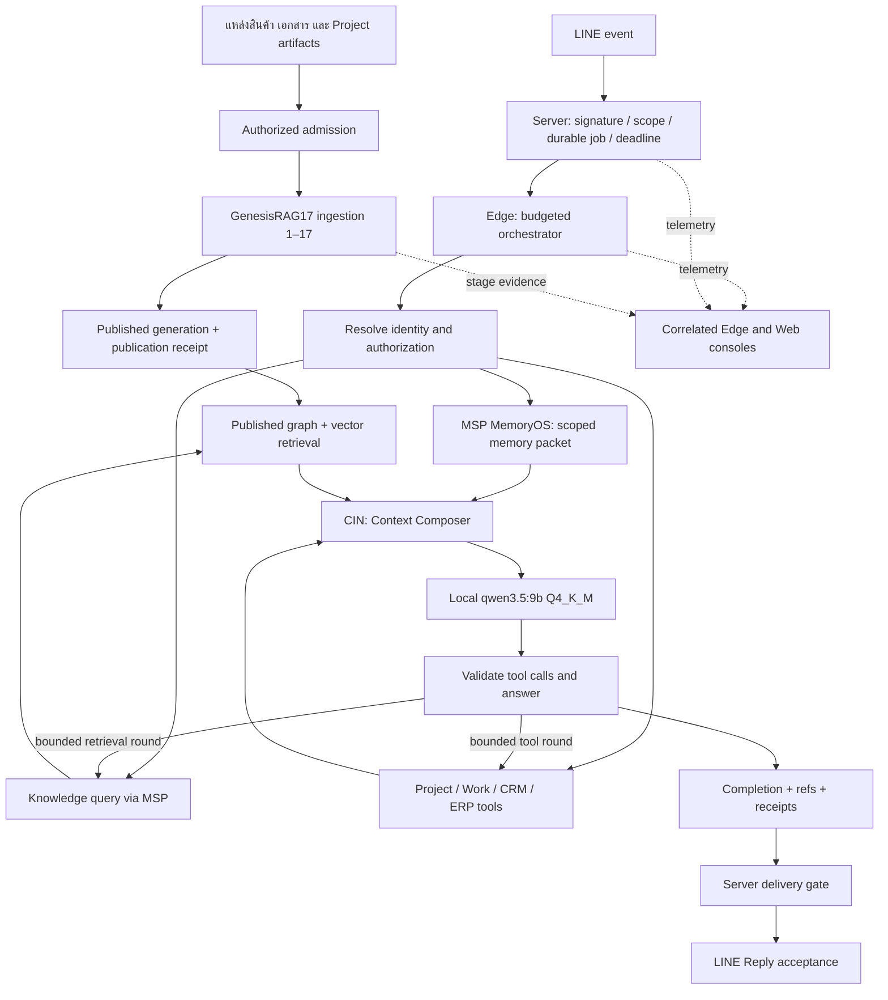

# LINE OA + Local LLM + MSP/CIN + GKS: ข้อเสนอการเชื่อมครบเส้นทาง

Owner approved v0.1.0b in this task on 2026-09-17. This canonical execution plan records that approval. Implementation and verification are tracked below; production activation remains separately gated.

**Complexity: C-3. Risk: HIGH** — เปลี่ยนสัญญาระหว่าง Server/Edge, ใช้ข้อมูลตามสิทธิ์, เชื่อม memory ข้ามระบบ และเพิ่มการสั่งงานผ่าน LINE

## 1. ขอบเขตที่ผู้ใช้ยืนยัน

1. ใช้ Local LLM `qwen3.5:9b`, quantization `Q4_K_M` และต้องตอบ LINE ก่อนหมดเวลาของ Reply Token
2. เชื่อม GKS, GenesisRAG17, Data Pipeline และ Project/Work
3. มี tool ค้นราคาและแนะนำสินค้าผ่าน graph และ vector โดยมีหลักฐานอ้างอิง
4. แสดง console log บน GUI ของ Edge Device และ Web UI
5. ลงทะเบียน/เชื่อม LINE OA ด้วยขั้นตอนที่ผู้ดูแลธุรกิจทำเองได้แบบ SaaS
6. MSP ทำหน้าที่ MemoryOS และมี CIN (Context Injection Node)
7. Project/Work: ค้นหา/ดูสถานะ และสร้างหรือแก้ไขโดยให้ผู้ใช้ยืนยันก่อนทุก mutation

[ASSUMPTIONS]

- CIN เป็นชื่อแสดงผลของ Context Composer ตาม FR-234/SDD-100 และจุดรวม context ก่อน model invocation; ไม่สร้าง memory store อีกชุด
- ใช้ Server เป็นเจ้าของ LINE transport และ Edge เป็นเจ้าของ local inference ตาม ADR-061/FR-150
- เครื่องที่มี Ollama `127.0.0.1:11434` เป็นเครื่อง benchmark เริ่มต้นเท่านั้น; ยังไม่ได้ยืนยันว่าเป็น Edge production ที่จับคู่กับ OA เป้าหมาย
- ค่า latency, concurrency และ token budget ด้านล่างเป็นค่าที่เสนอให้ทดสอบ ไม่ใช่ผล benchmark ที่ผ่านแล้ว

## 2. หลักฐานและการแก้ baseline

checkout หลักอยู่ที่ `099ebc8f`; remote-tracking `origin/main` ในเครื่องอยู่ที่ **`fb4b047a666e7a59c39937d7580a7ddabb574f7c`** ลงวันที่ 17 กันยายน 2026 จึงใช้ revision หลังเป็นฐานวิเคราะห์ รายการนี้ไม่ใช่การยืนยัน deployed SHA หรือ live GitHub HEAD

คำตอบก่อนหน้านี้ที่ระบุว่า wizard, Context Composer, GKS grounding และ staff reply ยังไม่ได้สร้าง อ้างจาก checkout เก่า ต้องแก้เป็น **มี implementation รวมเข้า origin/main แล้ว แต่ต้องตรวจการใช้งานจริงตามขอบเขต**

| ส่วน | หลักฐานที่ตรวจปัจจุบัน | ผลต่อแผน |
|---|---|---|
| Self-serve OA | FR-225 wizard และ FR-227/228 webhook/quiescence รวมแล้ว; TASK-ZAI-082..084 รายละเอียดเป็น done | ต่อ integration/acceptance ไม่สร้าง wizard ซ้ำ |
| CIN | `apps/server/src/modules/agent/context-composer.js`, FR-234 มีจริง; `server-line-answer.js` เรียกใช้ | ขยายการเชื่อมถึง Edge และทุก model/tool round |
| GKS grounding | FR-235 corpus reader รวมแล้ว; TASK-ZAI-094/095 acceptance/switch ยัง planned ใน baseline | ต้องพิสูจน์ published retrieval บนเส้นทางเป้าหมาย |
| Staff reply | FR-246 รวมใน PR #422 | ตรวจ reuse service และ receipt ไม่สร้าง sender ใหม่ |
| Local model | Ollama `/api/tags` พบ `qwen3.5:9b`, Q4_K_M, parameter metadata 9.7B | ตรงรุ่นที่ผู้ใช้ยืนยัน; ไม่ได้วัดความเร็ว |
| Reply budget | Server เก็บ `replyExpiresAt` แบบ conservative ที่ anchor +45s แต่ Edge wire v1 ส่งเพียง `leaseExpiresAt`; lease 300s | Edge ไม่ได้รับ deadline ของ Reply จึงต้องเพิ่มสัญญา budget |
| Edge inference | executor มี model budget floor 30s และจำกัดด้วย lease; worker ปกติ poll 5s | ปรับเป็น remaining-turn budget รวมทุกขั้น ไม่ขยายตาม lease |
| Product retrieval | Edge มี `search_products`, `quote_price`, `find_within_budget`; published adapter ยัง fallback `UNSUPPORTED_OPERATION` สำหรับ `priceForCode`/`searchWithConstraints` | ชื่อ tool มีแล้ว แต่ published typed graph/vector path ยังต้องปิดช่องว่าง |
| MSP | checkout MSP `4ca98c3` มี API-011, thread lifecycle/erasure และ PR #30; Zuri roadmap บางส่วนยังบอก blocked เพราะ tool ไม่อยู่ main | ไม่ถือ roadmap เก่าเป็นข้อพิสูจน์ว่า MSP ไม่มี tool; ต้องทำ real-process compatibility/activation proof |
| GenesisRAG17 | เอกสาร deployment ที่ baseline บันทึก G-3 Linux 35/35 และระบุยังไม่ deployed | ผล isolated ไม่เท่ากับ production chain ทำงานแล้ว |
| Logs | Edge มี `get_worker_log`; Web มี job trace/FR-171 | ต่อ timeline เดียวกัน ไม่อ้างว่า log ครบทั้งระบบจากการมี console |

ไฟล์อ้างอิงทั้งหมดในส่วน Zuri อ่านด้วย `git show fb4b047a:<path>`; ส่วน MSP อ่านจาก checkout ที่ revision ข้างต้น ไม่มีการแก้ checkout ใด

## 3. ข้อจำกัด LINE และเป้าหมายเวลาตอบ

LINE ระบุว่า Reply Token ใช้ได้ครั้งเดียว ต้องใช้ภายในหนึ่งนาทีหลังรับ webhook และควรใช้ให้เร็วที่สุด เพราะเวลาจริงอาจเปลี่ยนและได้รับผลจากเครือข่าย ไม่ออกแบบโดยรอครบหนึ่งนาที ([LINE Messaging API](https://developers.line.biz/en/reference/messaging-api/#send-reply-message), ตรวจ 17 กันยายน 2026)

HTTP 200 ของ webhook เป็นการรับ event; ไม่ใช่การตอบลูกค้า ส่วน loading animation เป็น UI ระหว่างรอและไม่ใช่สัญญาต่ออายุ Reply Token การออกแบบแยกสองอย่างนี้จาก provider acceptance ของข้อความ ([Webhook guidance](https://developers.line.biz/en/docs/messaging-api/receiving-messages/), [Loading API](https://developers.line.biz/en/reference/messaging-api/#display-a-loading-animation))

**SLO ที่เสนอ:** คำถามสินค้าภาษาไทยและการอ่านสถานะงานที่อยู่ในชุดยอมรับ ต้องได้คำตอบมีหลักฐานและ LINE ยอมรับ Reply ภายใน p95 ≤30s, p99 ≤40s จาก trusted ingress สำหรับเครื่อง/model/load profile ที่ผ่านการทดสอบ ตัวเลขนี้ยัง NOT_RUN

| งบรวมต่อ turn ที่เสนอ | เวลาสูงสุด |
|---|---:|
| ตรวจ signature, durable capture/admission และส่งงานถึง Edge | 3s |
| อ่าน MSP, published knowledge และ operational facts ตาม dependency | 5s |
| CIN + local inference รวม tool/model rounds ทั้งหมด | 24s |
| ตรวจคำตอบ ส่งกลับ Server และ LINE acceptance | 5s |
| สำรองภายในเป้าหมาย 40s | 3s |

- Server คง authority ของ deadline: ใช้ conservative `replyExpiresAt` เดิม และกำหนด send cutoff เผื่อ network; late webhook ลดงบจริง ไม่เริ่ม 40s ใหม่ตอน Edge claim
- Wire รุ่นใหม่ต้องส่ง `answerDeadlineAt`, `remainingBudgetMs`, `issuedAt` และ execution identity แบบ opaque โดยไม่ส่ง Reply Token ให้ Edge
- Edge ใช้ monotonic elapsed time หักเวลาตั้งแต่ส่ง claim รวม transit อย่าง conservative; clock skew ต้อง fail safely และ deadline ตรวจซ้ำที่ Server เสมอ
- ก่อนทุก tool/model call ใช้ค่าต่ำสุดระหว่างงบที่เหลือ, call cap และเวลา lease ที่เหลือ ห้ามเริ่ม round ที่ไม่มีเวลาพอให้ completion + send
- งบตั้งต้น: prompt ≤4,096 model tokens, output ≤512 tokens, tool rounds ≤2 พร้อม final answer; ต้องใช้ tokenizer/usage ของรุ่นจริงและปรับจาก benchmark
- เปิด model residency ตาม FR-244 ก่อนช่วงรับงาน; ตรวจ model digest, quantization, context settings และ warm state ไม่เลือก cloud model อัตโนมัติใน LOCAL_ONLY
- เริ่ม qualification ที่หนึ่ง active inference ต่อ GPU/เครื่อง ทดสอบ offered load 1/2/4 พร้อมวัด queue delay; ไม่ประกาศรองรับ concurrency ที่ยังไม่ผ่าน
- ถ้าคำตอบ LLM ไม่พร้อม ใช้ deterministic answer จาก facts ที่ตรวจแล้วถ้ามี; หากไม่มี แจ้งข้อจำกัดตามจริงก่อน cutoff กรณีนี้นับเป็น degraded/fallback ไม่ใช่ผ่าน SLO คำตอบจาก LLM
- Delayed Push เป็นทางสำรองเฉพาะเมื่อ account อนุญาตและ provider eligibility/quota ผ่าน; ต้องแสดงเป็น PUSH และไม่ถูกนับว่าตอบทัน Reply Token
- ผลส่งไม่ชัดเจนเป็น UNKNOWN; ห้ามส่ง Push ซ้ำเพราะเห็น timeout หลังเริ่มส่ง Reply ต้องใช้ state/CAS/reconciliation เดิม
- ห้ามใช้คำแจ้งรอเป็นหลักฐานว่า Local LLM ตอบสำเร็จทันเวลา และไม่รับประกันความสำเร็จของ provider เมื่อ LINE/เครือข่ายหยุดให้บริการ

## 4. สถาปัตยกรรมสองเส้นทาง

17 stages คือ ingestion/publication ไม่ต้องรันใหม่ทุกคำถาม: 1 Ingest → 2 Parse → 3 Provenance → 4 Normalize → 5 Classify → 6 Dedupe → 7 Chunk → 8 Entity Extract → 9 Entity Resolve → 10 Fact Extract → 11 Ontology Map → 12 Temporal Map → 13 Graph Build → 14 Enrich → 15 Embed → 16 Index → 17 Quality Gate + Publication

เก็บชื่อและ id `DPS-KI-*` เดิมจาก `docs/KNOWLEDGE-INGESTION-17-STAGE-FLOW.md` ไว้ ไม่เพิ่ม CIN เป็น Stage 18: CIN อยู่บน query/answer path หลังอ่าน published generation

GKS เป็นเจ้าของ canonical knowledge, ontology และ orchestration; GenesisBlockDB เป็น retrieval substrate ตามสัญญา `query-ir.v1` ภายใน Tier 4 เส้นทาง Zuri/Edge ปัจจุบันเข้าผ่าน `msp_pipeline_query` → authorized worker loopback ไม่เพิ่ม direct database access จาก model หรือ UI และไม่บังคับเรียก GKS process ซ้ำทุก query เมื่อ snapshot เผยแพร่แล้ว

## 5. MSP MemoryOS และ CIN

- CRM เก็บ business conversation record; MSP เก็บ session ledger, episodic/passport memory ตาม policy/consent และเป็น authority ของ memory lifecycle
- Reconcile TASK-MEMOS-002..006 กับ MSP API-011 ที่มีแล้ว ก่อนเปิด opt-in; ทดสอบ signed grants ผ่าน real process, participant relink/revoke, restart, retention และ erase receipt
- Agent lane เป็นเจ้าของ CIN ใช้ semantics ของ FR-234: authorization ก่อน, operational records > published knowledge > memory; memory ห้ามเปลี่ยนราคาหรือสถานะงานที่ record ระบุ
- ทุก model invocation รวม tool follow-up round ต้องผ่าน CIN พร้อม ContextReceipt หนึ่งใบต่อ invocation ซึ่งสะท้อนเฉพาะข้อมูลที่ส่งจริง; เก็บ refs/hash/budget/drop reasons ใน log ไม่เก็บ hidden reasoning
- Context ประกอบด้วย system/policy, scoped task, verified records, knowledge citations, permitted memory และผล tool; เอกสาร/ผลค้นเป็นข้อมูลที่ไม่เชื่อถือคำสั่งในเนื้อหา
- Denied scope ได้ empty context; GROUP/ROOM ไม่รับ private/passport memory; ใช้ thread/session/account/tenant identity ที่ Server resolve ไม่ยอมให้ LLM ตั้ง scope เอง
- หาก MSP timeout ให้ต่อได้เฉพาะ public/scoped facts ที่ไม่พึ่ง memory พร้อม `MEMORY_UNAVAILABLE`; ถ้าความปลอดภัย/identity ยังพิสูจน์ไม่ได้ต้องปฏิเสธ ไม่ตีความ dependency failure ว่าได้รับสิทธิ์
- ไม่คัดลอก transcript ลง local memory store ใหม่บน Edge; context packet มีอายุเท่า turn และล้างเมื่อจบ; durable telemetry ใช้ refs ตาม retention policy
- CIN ต้องมี node ใน Data Pipeline Map ที่ผูก FR-234 และ actual implementation surface; สถานะ DECLARED/CODE_TESTS/PRODUCTION แยกตามหลักฐาน

## 6. Product tools ผ่าน graph และ vector

Reuse ชื่อ tool ที่มีและเพิ่ม capability เท่าที่จำเป็น ไม่เพิ่มชื่อซ้ำหรือเปิด arbitrary SQL/Cypher ให้ model

| Tool/capability | ข้อมูลเข้าและผลที่ต้องได้ |
|---|---|
| `search_products` | query + bounded filters → vector candidates ที่ผ่าน scope, graph relations สำหรับ category/components/variants, citations และเหตุผลที่ตรงความต้องการ |
| `quote_price` | exact SKU/variant + quantity + pricing context → deterministic price tier, currency, unit, validity/as-of, tax/shipping basis และ source/version |
| `find_within_budget` | quantity + budget/currency + constraints → filtered offers ที่ราคาได้รับการตรวจ พร้อม alternatives ที่ระบุว่าเกินงบถ้ามี |
| recommendation orchestration | ประสาน search + graph constraints + pricing; คืนรายการที่มีจริงพร้อมเหตุผล/ข้อจำกัด ไม่สร้างสินค้าและไม่ให้ vector score เป็นราคาหรือ stock |

- One turn pins one published generation สำหรับ knowledge calls ทั้งหมด; stage-17 receipt resolver ผูก snapshot กับ publication evidence
- Graph expansion จำกัดชนิด edge, hop และจำนวนผล; ต้องพิสูจน์ physical graph/vector lane ถูกเรียกจริง ห้ามนับแค่ข้อความที่กล่าวถึง graph ว่าใช้ graph แล้ว
- ใช้ `ontology_v2` predicates ที่มีสัญญาแล้ว เช่น `PRICED_AT`, `HAS_COMPONENT`, `IN_CATEGORY`; predicate ใหม่ต้อง review ข้าม Zuri/MSP/GKS/GenesisBlock และ version contract ก่อน
- แก้ช่องว่าง published adapter ที่ `priceForCode`/`searchWithConstraints` ยัง unsupported โดยออก typed lookup/filter contract ร่วมกัน; existing `msp_pipeline_query` ไม่ได้พิสูจน์ว่ารับ arbitrary filters หรือ graph traversal อยู่แล้ว
- คืน price/provenance แบบ typed; ใช้ published price เมื่อยัง valid และ reconcile กับ authoritative operational/pricing record เมื่อจำเป็น; conflict/expired/missing price ต้องรายงานตามจริง ไม่มีค่า 0 ทดแทนราคาที่ไม่ทราบ
- Operational records มี version/time แยกจาก knowledge snapshot; trace ต้องระบุทั้งสองแหล่ง ไม่อ้างว่าเป็น transaction snapshot เดียวกัน
- Citation refs ขั้นต่ำ: sourceId/rawArtifactId/parsedArtifactId/chunkId/contentHash/snapshotId/generation; graph proof เพิ่ม entity/fact/path refs แบบมี scope
- Read-only tools อยู่ Gate E; ห้าม product query เปลี่ยน order, payment หรือ catalog

## 7. Project/Work: อ่านได้ เขียนหลังยืนยัน

เชื่อม existing project-manager services และ repositories: Portfolio → Tenant → Business → Workspace → Project → Workstream → WorkItem ใช้ execution mode และ progress strategy เดิม ไม่สร้าง task model ใน LINE/Edge

เสนอ tool surface `search_projects`, `get_project_status`, `search_work_items`, `prepare_work_change`, `confirm_work_change` เป็นชื่อ candidate ยังไม่ใช่ tool ที่ประกาศว่ามีแล้ว

1. Resolve LINE identity → principal → Membership และ scope; ลูกค้าทั่วไปไม่มีสิทธิ์งานภายในจากการเป็นเพื่อน OA
2. อ่านสถานะด้วย service เดิม ส่วน mutation สร้าง proposal ที่อ้าง Project/Workstream/WorkItem แน่นอน พร้อม before/after, assignee, due date และ effects
3. ส่งการ์ด/ข้อความให้ผู้ใช้ยืนยันหรือยกเลิก; generic “ใช่” ไม่ใช้ถ้ามีหลาย proposal หรือไม่ตรง context
4. Confirmation ผูกกับ actor/account/conversation/target, canonical argument hash, resource version, expiration และ idempotency key; ข้อเสนอเริ่มต้นหมดอายุ 5 นาที
5. การยืนยันเป็น LINE event ใหม่ มี deadline/token ของตัวเอง; ไม่เก็บ token เดิมรอผู้ใช้
6. ตรวจสิทธิ์และ version อีกครั้งก่อน commit ผ่าน application service transaction + AuditEvent; duplicate confirmation คืน receipt เดิม ไม่สร้างงานซ้ำ
7. Revoked authority, changed target หรือหมดอายุ → ปฏิเสธ/ขอ preview ใหม่; write status UNKNOWN ต้อง reconcile ก่อนทำซ้ำ
8. งานนำเข้าแผนใช้ PlanEnvelope validation → dry-run → conflict check → existing transactional importer ไม่เขียนผ่าน Prisma จาก model

ยังไม่รวม delete project, payment/order mutation หรือการ publish/deploy จาก LINE

## 8. Console บน native Edge และ Web

ต่อยอด Edge Tauri GUI `get_worker_log` และ Web job trace; แสดง timeline เดียวกันด้วย stable event identity ไม่ส่ง raw stdout ทุกอย่างขึ้นเว็บ

Event ขั้นต่ำ: `eventId`, `sequence`, `at`, `level`, `tenant/business/account` opaque refs, `jobId`, `executionId`, `thread/session` refs, `correlationId`, `phase`, `durationMs`, `remainingBudgetMs`, `modelId`, `toolName`, `status`, `errorCode`, `ContextReceipt` ref และ retrieval/publication refs ตามช่วงที่เกี่ยวข้อง

- Timeline: received → queued → claimed → context/memory/retrieval → model/tool → validated → sending → provider outcome; ingestion แสดง 17 stages ใน run ของตัวเองแล้ว link ด้วย published snapshot
- Edge แสดง local timings/model warm state/Ollama failure; Web รวม job/Edge/LINE/MSP/knowledge links ตามสิทธิ์ พร้อม filter OA/session/Project/Work/error
- Status ต้องแยก ANSWER_READY, PROVIDER_ACCEPTED, UNKNOWN, FAILED, DEADLINE_MISSED; provider HTTP 200 ไม่ใช่หลักฐานว่าผู้รับอ่านแล้ว
- ใช้ bounded durable buffer และ cursor resume; reconnect ไม่ทำ log ซ้ำ; sequence gap แสดงชัดเจน ไม่ใส่ event สำเร็จแทนรายการที่หาย
- Model prompt, customer message, credentials, Reply Token และ private memory ไม่อยู่ใน operational console โดย default; content inspection ใช้สิทธิ์/retention ของระบบเดิม
- Log delivery อยู่นอก Reply critical path ใช้ async flush; logging failure ต้องไม่ทำให้ LINE ส่งซ้ำหรือขยาย timeout

## 9. SaaS onboarding journey

Reuse FR-223..228 ที่มีแล้วและตรวจให้ flow ต่อกันจริง:

1. **เลือกธุรกิจ** — ตรวจ role, ownership และ AAL2 สำหรับ credential write
2. **เตรียม LINE OA** — อธิบาย OA/Messaging API, ลิงก์ไปตั้งค่าที่ LINE และ checklist ที่ใช้จริง; ไม่อ้างว่า Zuri สร้างบัญชี LINE ให้ผ่าน API ได้
3. **เชื่อม Channel** — Channel ID/secret ผ่าน write-only vault; optional token override ตาม ADR-089; live validate, bot identity, duplicate channel claim และ resumable error
4. **ตั้ง webhook** — แจ้งผลต่อระบบเดิมก่อนเปลี่ยน, register/readback/test, แสดง manual recovery และ derived quiescence; ไม่เขียนทับ transport เก่าโดยไม่มี action ของ owner
5. **เลือก runtime** — จับคู่ Edge, LOCAL_ONLY, exact `qwen3.5:9b` digest/quantization, business hours/model residency, readiness และ latency qualification
6. **เลือก knowledge/memory/tools** — published corpus ของ Business, scope/consent ของ MSP, product tools และ Project/Work permissions; dependency ที่ยังไม่พร้อมแสดง unavailable พร้อมวิธีแก้
7. **ทดสอบจาก LINE จริง** — owner ส่งข้อความเอง/ใช้ OA test ที่ระบุชัด; ตรวจ signed inbound, local execution, citations, completion และ provider acceptance ด้วย trace เดียว
8. **เปิดใช้และ health** — summary สิทธิ์/runtime/data sources, rollback, paused/offline behavior และ health card; ผ่าน provider probe อย่างเดียวไม่ติดป้ายว่าทุก flow พร้อม

ขั้นตอนต้องย้อนกลับ/กลับมาทำต่อได้, ไม่ทำ secret ซ้ำ, ไม่แสดง false success และมีข้อความภาษาไทยที่ระบุการแก้ได้จริง

## 10. Contract changes และลำดับทำงาน

Wire v1 เป็น strict schema จึงห้ามเติม field แล้วส่งให้ Edge เก่าเฉย ๆ เสนอ version 2 พร้อม capability negotiation: Server เก็บ v1 สำหรับบัญชีเดิม, reply-deadline mode ต้องใช้ Edge v2; mixed versions แสดง incompatible อย่างชัดเจน

v2 ต้อง review: immutable turn/execution identity, deadline/budget, scoped capability refs, ephemeral CIN inputs, permitted tool set, completion evidence/ContextReceipts และ bounded telemetry DTO ไม่มี LINE token/raw recipient id หรือ caller-supplied arbitrary endpoint

| Phase | งานและเจ้าของ | Exit evidence |
|---|---|---|
| P1: deadline + contract | LINE Studio/Integration/Agent/Edge; reuse FR-149/150/244 และเพิ่ม requirement delta หลังอนุมัติ | v1/v2 compatibility, server-authoritative clock/budget, abort/late result/duplicate-send tests |
| P2: published product tools | Knowledge + MSP/GKS/GenesisBlock; FR-173/188/189/235 | graph/vector/price typed contract, real published corpus, citations, negative scopes, measured latency |
| P3: MemoryOS + CIN | Agent + MSP; FR-231/232/234, TASK-MEMOS-* | real-process tools/grants, restart recall, revoke/relink/erasure, one receipt per invocation, Edge parity |
| P4: Project/Work tools | Project Manager + Agent + Identity | read/write authorization, preview-confirm transaction, stale/duplicate confirmation, audit links |
| P5: consoles + onboarding | Edge + Studio + CRM + Integration | both GUI timelines, resume/gap/redaction, owner self-serve test without operator filesystem work |
| P6: acceptance/release | integrator + owner | exact cross-repo pins, target-machine benchmark, real LINE canary, build/governance, rollback and approval of exact deploy SHA |

แต่ละ capability ใช้ canonical requirement เดียวร่วมข้าม domain และแตกเอกสาร phase `-P1/-P2` ตาม ownership หลังตรวจ registry/ledger ล่าสุด ไม่จอง FR ใหม่จากเลขใน checkout เก่า และไม่เปิด parallel governance writers บน tree เดียว

เมื่ออนุมัติ: ย้ายข้อเสนอสู่ isolated worktree ที่ pin ล่าสุด → reconcile ADR-061/089/090/091 + contracts/charters/FR ledger/roadmap/Data Pipeline Map → run `npm run govern` ใน composed tree → contract/test → implementation แยก slices; generated views ใช้ tooling เท่านั้น

## 11. Acceptance matrix

ตารางนี้คือเกณฑ์ที่อนุมัติไว้ ผล implementation และหลักฐานล่าสุดอยู่ใน implementation ledger ด้านล่าง; การผ่าน isolated test ไม่เปลี่ยนสถานะ production โดยอัตโนมัติ:

| Acceptance | หลักฐานต้องมี |
|---|---|
| Local Qwen ตอบทัน Reply | ชุดอย่างน้อย 100 representative turns ต่อ qualified warm-load profile, ชุด cold-start/overload แยก, p50/p95/p99/max, queue/tool/model/send timings, final-answer rate และ fallback rate; ไม่ใช้ TTFT เป็นเวลาตอบสำเร็จ |
| Reply safety | duplicate webhook, late admission, stale claim, clock skew, restart, expired token และ ambiguous send; ไม่ขยาย deadline ไม่ส่งซ้ำ |
| Local-only | ตรวจ egress ของ inference, exact model/digest, ไม่มี cloud fallback; LOCAL_ONLY ไม่ได้หมายความว่า LINE transport หรือ authorized remote MSP ไม่มี network |
| GKS + 17 stages | real authorized source → measured stages → publication receipt → query citations; candidate unpublished/withdrawn/other tenant อ่านไม่ได้ |
| Graph/vector/price | gold queries ไทย: exact SKU, semantic intent, category/components, quantity tiers, stale/missing price, budget; lane evidence และ authoritative amounts ตรง |
| MSP/CIN | same-user recall หลัง restart; different person/thread/agent ถูกปฏิเสธตาม policy; erase/revoke แล้วเรียกคืนไม่ได้; context budget และ receipts ตรง model inputs |
| Project/Work | read scope; no write before confirm; confirmation mismatch/expiry/version change/revoked permission/replay; successful write มี receipt และ AuditEvent |
| Edge/Web logs | trace เดียวกัน, cursor/reconnect, bounded buffer, no credentials/private content leak, failure/UNKNOWN ไม่แสดง success |
| Onboarding | valid/invalid creds, duplicate OA, provider outage, resume, webhook conflict, offline Edge, model not ready, actual test message |
| Recovery | stop Edge/MSP/worker, restore connectivity, bounded retries, published generation consistency, rollback without losing admitted data |

ผ่าน local tests/isolated harness ไม่ประกาศ production complete ต้องมี canary ของ OA ที่ owner ระบุและ receipt จริง รวมทั้งผ่าน migration/runtime activation gates เดิม

## 12. Evidence limits และประเด็นรอตรวจ

- มี local unit/integration/native/browser checks และ real Ollama/MSP synthetic benchmark แล้ว; ไม่มีการส่ง LINE จริงหรือเปิด production ในงานนี้
- โมเดลตรง `qwen3.5:9b` Q4_K_M, digest `1bdc07fcb6394b54a1174a466d2606c169c68b0fdb92c678dddf12cc533bbd66`, resident context 8192. ยังไม่ได้ยืนยัน OA/Edge production เป้าหมายหรือ capacity profile
- ใช้ isolated branch `codex/line-oa-local-cin-20260917` บน base `fb4b047a666e7a59c39937d7580a7ddabb574f7c` ที่ refresh origin/main ก่อนเริ่ม ไม่แก้ primary checkout
- MSP deployment pins/stdio environment/opt-in ยังต้อง activate ด้วย revision ที่ review แล้ว; local API proof ไม่ใช่ production activation
- Canonical registration และ generated Data Pipeline Map มี CIN/CH-23 แล้ว; governance evidence และขอบเขตการตรวจอยู่ใน Final composed verification
- Prompt budget ที่ implement เป็นขนาด UTF-8 bytes (32768), output 512 tokens และ 3 model rounds; ยังไม่ใช่หลักฐาน tokenizer ว่า prompt ทุกกรณีไม่เกินเป้าหมาย 4096 tokens

## 13. Source map

Zuri base `fb4b047a666e7a59c39937d7580a7ddabb574f7c`:

- `apps/server/src/modules/line-oa-studio/application/line-conversation-jobs.js` — deadline, claim DTO, delivery state
- `apps/server/contracts/line-conversation-execution.schema.json`; `apps/edge/src/conversation/{contract,client,executor,worker}.ts` — strict v1 and local runtime
- `apps/edge/src/rag/genesisrag17/published-rag.ts`; `apps/edge/src/mcp/pricing-server.ts` — published adapter limits and current tool names
- `apps/server/src/modules/agent/{context-composer,server-line-answer,tools,write-tools}.js` — CIN and action boundaries
- `apps/edge/public/desktop.js`; `apps/server/src/app/api/line-oa/jobs/[id]/trace/route.js` — existing console surfaces
- `docs/decisions/ADR-061-SERVER-LINE-AND-OPTIONAL-EDGE.md`; ADR-089, ADR-090, ADR-091 — accepted authority and scope
- `docs/KNOWLEDGE-INGESTION-17-STAGE-FLOW.md`; `docs/plans/GENESISRAG17-CONTRACT.md`; `docs/plans/GENESISRAG17-EDGE-DEPLOYMENT.md`
- `docs/DATA-PIPELINE-MAP.md`; `docs/domains/project-manager/CHARTER.md`; `docs/roadmap/ROADMAP-zuri-ai-24w-program.md`; `docs/roadmap/PLAN-MSP-MEMORY-OS-LINE-AGENT.md`

MSP local base `4ca98c3`: `packages/msp-contracts/schemas/API-011.tools.json`, `packages/msp-core/src/domain/thread-memory.mjs`, `docs/IMPLEMENTATION-PLAN-MEMORY-OS.md`; GKS checkout observed at `ecf1e4d` (no runtime proof claimed)

## Version diff

`ไม่มีเอกสารฉบับนี้ → v0.1.0b`: เพิ่มข้อกำหนดที่ผู้ใช้ยืนยัน, corrected baseline, architecture diagram, deadline budget, CIN/MemoryOS boundaries, graph/vector pricing tools, confirmed Project/Work actions, console/onboarding journeys, phase plan และ acceptance criteria ไม่มี code/schema/runtime diff

`v0.1.1b → v0.2.0b`: implementation ใน isolated cross-repo branches, negotiated deadline/abort/fresh send fences, published product tools, per-invocation CIN/MSP receipts, confirmed Work transactions, durable native console and onboarding readiness; add measured local evidence and explicit failed/unrun acceptance gates.

## CHANGELOG

| Version | Date | Status | Summary | Commit Hash | Agent |
|---|---|---|---|---|---|
| 0.1.0b | 2026-09-17 | candidate | Proposal for owner review; qwen3.5:9b Q4_K_M confirmed; no implementation or activation | external review artifact, base fb4b047a | RWANG |
| 0.1.1b | 2026-09-17 | beta | Owner approval recorded and canonical plan registered | isolated working tree | RWANG |
| 0.2.0b | 2026-09-17 | beta | Local implementation and measured evidence; production/reliability qualification incomplete | isolated working tree | RWANG |

## Implementation ledger (2026-09-17)

| Phase | Implemented / local evidence | Remaining acceptance |
|---|---|---|
| P1 | v1/v2 negotiation; persisted execution deadline, monotonic transit budget, bounded inference, cancellation through MSP child; fresh deadline checks during claim/complete and before LINE send. Durable Server job tests 46/46. Runtime structural JSON schema matches published v2 schema. | Real ingress-to-LINE acceptance under qualified target load; cold/overload profiles |
| P2 | Server-authorized published manifest; typed product graph/vector tools; deterministic snapshot pricing/provenance. Real MSP subprocess → worker HTTP → rebuilt native retrieval 5/5; worker regression 20/20 with pinned e5; Server helper/corpus 22/22. [P2 evidence](LINE-OA-LOCAL-LLM-CIN-P2-RETRIEVAL.md). | Real427-product relevance/gold queries and full source →17 stages→publication→query proof; downstream corpus manifest is not cryptographically signed |
| P3 | Actual MSP API-011 restart/identity/erase/receipt harness passed; immutable invocation deadline 7/7; per-invocation content-free receipts survive failed inference; CIN/CH-23 registered. [P3 evidence](LINE-OA-P3-MEMORYOS-CIN-EVIDENCE.md). | 100-turn synthetic run **99/100, reliability FAIL**; one MSP initialize timeout caused UNKNOWN. Full Server authorization/HTTP and GKS/LINE path excluded |
| P4 | Current reads only, deterministic preview, new human confirmation, scope/version/expiry/revocation checks and canonical transactional write+receipt; tests25/25 plus Edge60/60 including adjacent regressions. | Actual owner/customer onboarding and real LINE confirmation canary |
| P5 | Web trace summaries, eight-step evidence-based readiness, native bounded async durable console with cursor/gap/redaction; three OA/MFA browser tests passed without retry. | Physical native GUI and real OA self-serve/canary; readiness deliberately reports unqualified when proof is absent |
| P6 | Local cross-repo builds/tests and exact upstream pins collected; final composed verification below. | No deploy, merge, hosted CI, real LINE canary, production activation or target-machine SLO qualification |

### Measured model evidence

- Model-only three public synthetic prompts: before correction3/3 empty answers after7.9–8.1s; after exact Qwen OpenAI-compatible `reasoning_effort:none`,3/3 nonempty in207–728ms. This is not full-turn latency.
- Real MSP+local model+CIN synthetic run: concurrency1,100 turns,99 quality passes,1 fail-closed `MSP_INJECTION_RECEIPT_UNKNOWN` caused by `MSP_INITIALIZE_TIMEOUT`; combined elapsed p50=5565ms,p95=8406ms,p99=9882ms. Full raw sanitized timings: [100-turn artifact](../../.brain/line-memory-model-100-20260917.json).
- Revoked participant probe denied before model invocation (0 model calls). Process startup dominates this path:23 fresh MSP processes per recall and42 for a two-round tool answer. An earlier loaded run failed3/3 before inference; the later99/100 run does not erase that observation.
- The model benchmark does not exercise the complete Server builder's3-second aggregate race, identity/consent database, HTTP, real catalog or LINE send. No latency SLO is certified.

### Release composition and rollback boundary

- Zuri: isolated branch `codex/line-oa-local-cin-20260917`, base `fb4b047a666e7a59c39937d7580a7ddabb574f7c`.
- MSP implementation: `d7451b5d82e66ef45d0044325b4726be02b0eb31`, based on `4ca98c3008d43c6295e886a2c1382d49172d274f`. Memory/model benchmark used the base's unchanged API-011; new product relay has separate real-process proof.
- GenesisBlock implementation: `cd6441d7a02f655cb8ad9976d555d50f066d515c`, based on `7c9261c4a4d4193af4e2613db48896533eb28072`. No GKS code change; existing ontology_v2/parser2 facts remain authority.
- No schema migration or production config change. Before activation: qualify exact OA/Edge/model/corpus and deployed pins, run existing migration/runtime gates, review exact Zuri revision and obtain deployment approval.
- Rollback: pause new admission and quiesce sends with existing OA lifecycle actions; reconcile SENDING/UNKNOWN before changing transport; preserve durable jobs, MSP ledger and audit receipts. Restore the previously reviewed Server/Edge/MSP/worker release together. Never replay uncertain Reply/Push or delete additive evidence as rollback.

### Final composed verification

- Server full regression: 6032 passed, 32 skipped (723 files passed, 6 skipped). This run preceded the final model/tool telemetry delta; that delta passed 32 focused tests covering persisted deadlines, memory authorization, real-DB journaling and bounded asynchronous logging. Trace-summary/readiness tests passed 6/6 separately.
- Edge final full regression: 1041 passed, 3 skipped, 0 failed; TypeScript/build passed.
- Native library: 52 passed, 4 ignored, 0 failed. Ignored host/GUI checks remain outside this local evidence.
- OA/MFA browser flow: 3 passed without retry in the isolated application/database. Native console HTML preview checked at 1050x680 and 640x480 with synthetic events and zero page errors; this was not a physical native GUI launch.
- Final Server build passed after the telemetry changes. Generated governance passed with 0 critical, 2 pre-existing warnings and 24 info findings. Warnings concern fixture-only unknown requirement links and the existing DB appendix omissions (ErrorEvent, UsageEvent, UsageEventRollup); these checks do not establish production readiness.
- Reliability qualification remains **FAIL (99/100)**. Real catalog/17-stage/LINE/native-device acceptance remains **NOT_RUN**. No deployment or production activation occurred.

Local test success alone does not satisfy the remaining P6 gates above.
