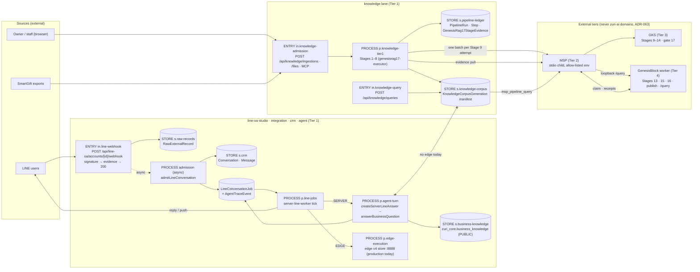
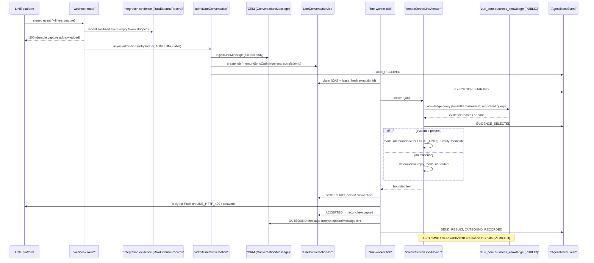
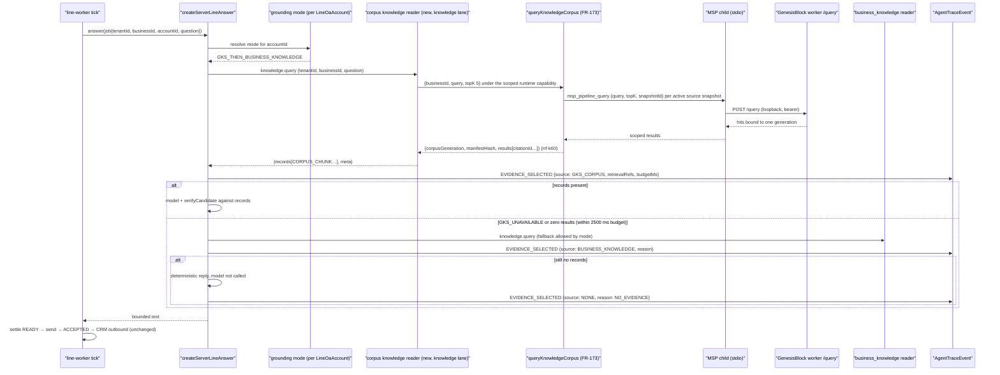
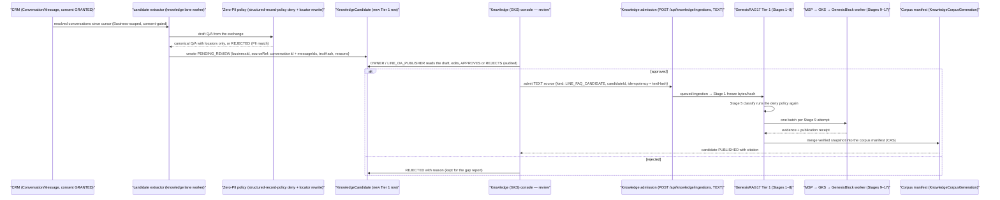

# LINE OA flow → GKS: pipeline analysis and integration design

> **Decided 2026-09-14.** The owner accepted every default in §1 (D-1..D-10). The binding statement is
> [ADR-090](../decisions/ADR-090-LINE-ANSWERS-GROUNDED-BY-THE-PUBLISHED-GKS-CORPUS-AND-REVIEWED-KNOWLEDGE-CANDIDATES.md)
> (FR-235..FR-238, SEC-032, SDD-099); the chat-record and memory questions marked
> **RECONCILE-WITH-CHAT-HISTORY-DOC** are settled by
> [ADR-091](../decisions/ADR-091-CHAT-RECORD-AND-AGENT-MEMORY-SPLIT-AND-THE-CONTEXT-COMPOSER.md), and the
> erasure receipt placeholder FR-NEW-5 is merged into FR-232 there. **Where this document and the ADRs
> differ, the ADRs win.** The §7 registry sketch is not applied as written: its new nodes land with their
> surfaces (ADR-085 Consequence 2); Phase 0 adds only the undeclared edges between nodes that already
> exist. The `FR-NEW-*` placeholders in §9 are historical. Evidence below was read on the date shown and
> is not refreshed.

**Status:** analysis + design proposal, read-only. Nothing here is implemented, no id is allocated, no registry row is committed (decided 2026-09-14, see the note above).
**Date:** 2026-09-13
**Basis:** a read-only `git archive` of `origin/main` at `6630c1df` (PR #383), exported to a
session-local snapshot directory. **The primary checkout was on `main` at
`e829b80e`, 89 commits behind `origin/main`**; it does not contain ADR-085, `docs/DATA-PIPELINE-MAP.md`
or the pipeline-map generator. Every `file:line` below is relative to the snapshot root unless it names a
sibling clone (`Genesis-Knowledge-System`, `Memory-and-Soul-Passport`, `GenesisBlock-ki17`). Each claim is
tagged **VERIFIED** (read in a file or ADR) or **ASSUMED** (inferred; not probed).
**Companion document (not duplicated here):** [the credential vault and chat-history design](LINE-OA-CREDENTIAL-VAULT-ONBOARDING-AND-CHAT-HISTORY-DESIGN.md)
owns the credential vault, onboarding UX and the chat-history system-of-record / MSP projection / retention
policy. Where this document touches chat-history policy it states a recommendation and marks it
**RECONCILE-WITH-CHAT-HISTORY-DOC**.

---

## 1. Summary

### Recommendation in one paragraph

Today no LINE-originated byte reaches GKS or GenesisBlockDB, and no LINE answer reads from them
(VERIFIED, §4). The server-owned LINE flow (ADR-061) answers from a separate PUBLIC-only table
`zuri_core.business_knowledge` through `createPostgresBusinessKnowledgeReader`, and the production
path (CH-01, edge execution) answers from the edge device's private Genesis RAG v4 store on `:8888`
built from a sibling checkout's file. The one lawful seam into GKS already exists and is
production-shaped: `queryKnowledgeCorpus` (FR-173, ADR-072) → `msp_pipeline_query` → the GenesisBlock
worker's loopback `/query` → one published generation → `citationId`. The design therefore attaches
the LINE **read side** by composing a second implementation of the existing `knowledge.query` port
(the port `answerBusinessQuestion` already consumes) that is backed by `queryKnowledgeCorpus`, selected
per LINE OA account, with `business_knowledge` as the explicit, traced fallback and a deterministic
"cannot answer now" reply when neither source returns evidence — never a model-only answer. The
**write side** is deliberately narrow: LINE conversations never enter GKS directly. The only LINE-derived
knowledge that may enter is a human-approved **FAQ/answer candidate** admitted as an immutable Text
source through the existing ADR-072 admission service (Stage 1 of the 17-stage pipeline), after
Zero-PII stripping at the candidate boundary and Stage 5 classify; Studio content (rich menu / LIFF /
bot profile descriptions) enters the same way as owner-published Text sources; product-question
"knowledge gaps" produce counts and locator keys only, never prose. Erasure is handled by construction
(no personal prose ever enters GKS) plus ADR-072 source withdrawal and a correction run as the
GKS-side tombstone, because GKS rows are never deleted (VERIFIED, §3).

### Numbered decisions for the owner (each with a default)

| # | Decision | Default |
|---|---|---|
| D-1 | **Read attachment point.** Compose a GKS-backed `knowledge.query` reader inside `createServerLineAnswer` (in-process call to `queryKnowledgeCorpus`, not an HTTP self-call), selected by a per-account grounding mode. | **Yes.** In-process; per-account mode `BUSINESS_KNOWLEDGE` (today's behaviour) / `GKS_CORPUS` / `GKS_THEN_BUSINESS_KNOWLEDGE`; default for existing accounts `BUSINESS_KNOWLEDGE` so nothing changes until an owner switches an account. |
| D-2 | **Fallback when GKS is unavailable or empty.** | GKS unavailable (503/timeout) → fall back to `business_knowledge` **only if the account mode allows it**, recorded in the trace as `EVIDENCE_SELECTED{source:'BUSINESS_KNOWLEDGE', reason:'GKS_UNAVAILABLE'}`; no evidence from either → the existing deterministic `no-evidence-no-generation` reply. The model is never called without evidence (already the rule in `grounded-business-answer.js:78-86`). |
| D-3 | **Retrieval budget inside the worker tick.** | 2 500 ms wall clock for the GKS hop (MSP spawn + worker loopback), `topK` 5, evidence packet ≤ 8 KiB; over budget = `GKS_UNAVAILABLE`, not a slower answer. Configurable, not hard-coded. |
| D-4 | **Which Business first.** | SmartGift, and only after ADR-075 Phase 3 has deployed MSP/GKS/worker beside the web container (`GENESISRAG17-EDGE-DEPLOYMENT.md`). The runtime accepts exactly one `ZURI_KNOWLEDGE_BINDINGS` entry (`knowledge-runtime.js:43`), so a second Business needs the routing decision that design lists as R-9. |
| D-5 | **Write side — FAQ candidates.** Conversation-derived candidates go CRM → (MSP thread summary when enabled) → candidate queue → **human approval** in the Knowledge (GKS) slot → ADR-072 Text admission → 17 stages. | **Yes, with mandatory human approval and Zero-PII (locators, not prose).** No auto-promotion; no `gks_knowledge_promote` from Tier 1. |
| D-6 | **Write side — Studio content.** Rich menu / LIFF / bot profile descriptions published as Text sources so the agent can answer "what can I do here". | **Yes, later phase**, owner/publisher action, same admission path; never the Flex/rich-menu JSON itself. |
| D-7 | **Write side — knowledge gaps.** Unanswered product questions. | Counts + product locators (`Product.code` / `flowAccountSku`) on a Business-scoped gap report; the question text stays in CRM. Nothing prose-shaped goes to GKS. |
| D-8 | **Erasure semantics for LINE-derived knowledge.** | Candidate rows carry `sourceRef = {conversationId, messageIds}` only; an erasure of the Person tombstones the candidate row (local), withdraws any admitted source (ADR-072 D5) and records an erasure receipt. MSP thread erasure (TASK-MEMOS-004) remains the gate for any MSP opt-in. |
| D-9 | **Registry.** Add the nodes, edges and two chains in §7 to `docs/DATA-PIPELINE-MAP.md` in the same change that lands each surface. | Yes. |
| D-10 | **Governance.** Declare the placeholders in §9 as real FRs before code, amend ADR-061 (answer contract widening) and ADR-072 (a new source kind), and add one ADR for "LINE grounding and candidate promotion". | Yes. |

---

## 2. The main data pipeline as it exists

### 2.1 Canonical map (ADR-085 / FEAT-033)

- VERIFIED: the registry is one JSON block in `docs/DATA-PIPELINE-MAP.md:133-529` between
  `data-pipeline-registry` markers; the generator is `apps/server/scripts/data-pipeline-map.mjs`
  (`@req FR-212`, lines 5-11), which validates node kinds `SOURCE/ENTRY/PROCESS/STORE/RECIPIENT`
  (`:15`), systems `external/zuri-ai/edge` (`:16`), surface types `WORKER/FILE/MCP/ENDPOINT/UI` (`:17`),
  build statuses `BLOCKED<DECLARED<PARTIAL<CODE_TESTS<PRODUCTION` (`:20`), production claims only with
  evidence (`:148-150`), external nodes carrying no status (`:156-157`), unwired edges as `DECLARED`
  (`:180-182`), chains `CH-\d{2}` running SOURCE→RECIPIENT with joined edges (`:186-233`), and the prose
  §5 chain table matching the registry (`:235-241`). Output is committed at
  `apps/server/runtime/data-pipeline-map.json` (ADR-085 D4) and rendered by
  `src/app/(pm)/knowledge/data-pipeline/page.jsx` behind the `knowledge` domain slot (ADR-085 D1).
- VERIFIED: 20 chains exist today (`docs/DATA-PIPELINE-MAP.md:479-525`). The LINE-relevant ones:
  CH-01 (edge answer, "the path in production today"), CH-02 (server answer), CH-03
  (business_knowledge → LINE), CH-14 (rich menu), CH-18 (conversation analysis, unwired), CH-20
  (customer backfill → agent context). The knowledge ones: CH-04 (17-stage → MSP), CH-05 (GKS
  evidence → ledger), CH-06 (knowledge query → citation).
- VERIFIED: the registry's own statement of the boundary: `r.msp` = "MSP (Tier 2) → GKS →
  GenesisBlockDB — stdio with an allow-listed env; zuri-ai never talks to GKS or GenesisBlockDB
  directly (ADR-063)" (`:353`, §4 line 90).
- VERIFIED: CH-02's knowledge edge is `e.knowledge-to-agent` from `s.business-knowledge`
  (`zuri_core.business_knowledge`, "registered queries only, PUBLIC sensitivity", `:321-323`), **not**
  from `s.knowledge-corpus`. The map already says what the code says: the server LINE answer does not
  read the GKS corpus.

### 2.2 Stages, owners, stores



Every arrow in the LINE subgraph is VERIFIED against `line-conversation-jobs.js:84-143` (admission),
`:157-179` (claim), `:436-478` (tick), `:490-589` (send), `server-line-answer.js:110-235` (answer),
`postgres-business-knowledge.js:36-56` (store). The missing edge `ANS → COR` is the finding of this
document. The knowledge subgraph is VERIFIED against `genesisrag17-executor.js:1109-1229` (Stages 1–8),
`:1276-1278` (batch to MSP), `knowledge-corpus-service.js:563-672` (query, `ranking: 'rrf-k60'`),
`docs/KNOWLEDGE-INGESTION-17-STAGE-FLOW.md:69-115` (cross-tier sequence).

### 2.3 Owners and contracts per hop (LINE side)

| Hop | Owner (charter) | Code | Store | Scope keys | Correlation |
|---|---|---|---|---|---|
| Signed webhook | line-oa-studio (route), integration (evidence) | `src/app/api/line-oa/accounts/[id]/webhook/route.js:31-93` (`@req FR-149`, `@spec ADR-061, SEC-001, FR-081`) | — | account id is a locator; `destination` must match the connection (ADR-061 D4) | `x-correlation-id` via `resolveCorrelationId` (`route.js:36`) |
| Evidence | integration | `src/platform/integrations/providers/line/line-oa-evidence.js:52-99` (`@req FR-081, FR-028, FR-052`; reply token stripped `:83`) | `RawExternalRecord` (`prisma/schema.prisma:2746`; `tenantId`, `businessId?`, `connectionId`, `payloadHash`, optional `artifactId` `:2769`) | tenant + connection | rawRecordId returned to the route (`route.js:37-38`) |
| Async admission | line-oa-studio | `admitCapturedLineEvents` `line-conversation-jobs.js:240-270`, `admitLineConversation` `:84-143` | `LineConversationJob` (`schema.prisma:3245`), one transaction with CRM | `tenantId, businessId, accountId, channelAccountId` | `correlationId` persisted on the job (`:123`), `memorySyncOptIn` captured from `ZURI_MSP_THREAD_MEMORY_ENABLED` at admission (`:120`) |
| CRM inbound | crm | `ingestLineMessage` `src/modules/crm/line-ingest-service.js:33-108` (`@req FR-023, FR-097, FR-148`) | `Person · Customer · Conversation · Message` (`schema.prisma:1900-1951`); **full text in `Message.body`** (`:91`) | `Conversation` unique on `tenantId + channel + channelAccountId + externalThreadId` (`:15-19`) | `externalMessageId` unique per conversation |
| Worker tick | line-oa-studio | `runLineConversationWorker` `:436-478`; route `src/app/api/line-oa/worker/route.js:60-65` (bearer `ZURI_LINE_WORKER_TOKEN` `:23`); script `scripts/server-line-worker.mjs` (Compose service `line-worker`, `docker-compose.yml:81-88`) | job CAS + lease | executionMode SERVER/EDGE | fresh `executionId` per claim (`:167`), `EXECUTION_STARTED` trace (`:171`) |
| Answer | agent | `createServerLineAnswer` `server-line-answer.js:110-235` (`@req FR-149, FR-150, FR-171`) wrapped by `withLineCatalogCommand` (`line-catalog-command.js:55`, FR-210) → `answerBusinessQuestion` `grounded-business-answer.js:72-112` (`@req FR-049`) | reads `zuri_core.business_knowledge` where `sensitivity='PUBLIC'` (`postgres-business-knowledge.js:52-56`) | zod `{tenantId, businessId}` (`:8-10`) | `EVIDENCE_SELECTED` via `tracedKnowledge` (`server-line-answer.js:219-223`) |
| Reply/Push | line-oa-studio (jobs) + integration (transport) | `sendReadyJob` `:490-589`; Reply→Push only on `LINE_HTTP_400` (ADR-061 D6) | `sendMethod`, `providerRequestId` | account epoch fence (`:511`) | `SEND_STARTED / SEND_RESULT` traces |
| CRM outbound receipt | crm | `reconcileAccepted` `:327-363` → `appendOutbound` (`crm/reply-record-service.js`, FR-093) | `Message{OUTBOUND}` keyed `reply:<inboundMessageId>` | derived from the inbound row, never from the request | `OUTBOUND_RECORDED` trace; `MEMORY_DELIVERY_PENDING` when opted in (`:351-356`) |

---

## 3. GKS / MSP / GenesisBlockDB: what they actually accept

Clones read: `Genesis-Knowledge-System` (`main` @ `ecf1e4d`), `Memory-and-Soul-Passport` (`main` @
`ad83bc0`), `GenesisBlock-ki17` (`codex/ki17-integration` @ `ce558a7`). The MSP GenesisRAG17 tool schema on
`main` was only found under `.claude/worktrees/agent-a2d9519b2d3bcd6bf/packages/msp-contracts/schemas/GENESISRAG17.tools.json`
(the same file the 17-stage flow doc links on `codex/ki17-integration`), so the wire shapes below are
VERIFIED against that copy and ASSUMED equal on the branch zuri-ai actually pins.

### 3.1 Ingest (write) contracts

| Contract | Direction | Shape | Scope | Notes |
|---|---|---|---|---|
| `msp_pipeline_submit` → `gks_pipeline_submit` | zuri-ai → MSP → GKS | one durable batch per Stage 9 attempt: inline content, chunks, mentions, hashes, offsets (`docs/KNOWLEDGE-INGESTION-SURFACES-AND-USER-FLOWS.md:184,196`) | six-field `{portfolioId, tenantId, businessId, workspaceId, agentId, visibility:'private'}` (GKS `docs/GKS-PORT-CONTRACT.md:110-111`; worker `validateScope` `genesisrag17-worker/src/worker.mjs:126-138` refuses anything but `visibility:'private'` and empty ids) | **the Stage 8→9 boundary, not a public upload**; the only sanctioned entry is before Stage 1 (ADR-075 D2, flow doc extension table row "Text/Markdown form or new source adapter \| Before Stage 1"). VERIFIED. |
| `gks_knowledge_promote` | MSP-authorized candidate → GKS | `govibe-knowledge-candidate/v1`, `idempotency_key`, `run_id`, `stage 1..12`, `source_snapshot_hash` (sha256), `provenance_ref` matching `^msp:proof/`, `candidate`, `scope` (`Genesis-Knowledge-System/packages/gks-contracts/src/tool-definitions.mjs:6-24`) | as above | this is ADR-043 D3's promotion gate. **No zuri-ai caller exists** (`grep gks_ src` → only the transport error string `msp-stdio-transport.js:130`; ADR-068 D4 says the forward handoff is not built). VERIFIED. |
| Push receiver (ADR-067) | GKS/GenesisBlock → zuri-ai | `POST /api/pipelines/knowledge/{run}/stages \| gate \| finish`, bearer `SotDataPlaneKey`, stage ids `DPS-KI-ENTITY-RESOLVE..DPS-KI-QUALITY-GATE` only (`pipeline-tracking-service.js:71-72,83-100`) | Tenant-bound key | evidence only; never facts. VERIFIED. |
| Pull chain (ADR-068 / ADR-073) | zuri-ai → MSP → GKS | `msp_pipeline_evidence {runId, afterCursor, limit≤100}` (schema above); legacy `msp_knowledge_evidence_export` via `POST /api/pipelines/knowledge/evidence/pull` (503 without `ZURI_MSP_COMMAND`, `route.js:19-20`) | per-scope cursor `KnowledgeEvidenceCursor` / `GenesisRag17EvidenceCursor` | cursor advances only past durable writes. VERIFIED. |

### 3.2 Query (read) contracts

| Contract | Shape | Scope | Notes |
|---|---|---|---|
| `POST /api/knowledge/queries` → `queryKnowledgeCorpus` | body `{businessId, projectId?, query, topK}` (`src/app/api/knowledge/queries/route.js:14`); `topK` 1..100 default 5 (`knowledge-corpus-service.js:493-498`); result `{corpusId, corpusGeneration, manifestHash, ranking:'rrf-k60', results[{…citationId, snapshotId…}]}` (`:640-672`) | viewer re-resolved after slow reads (`route.js:26`); citation binds corpus generation + source + ingestion + chunk (ADR-072 D10) | the one published-generation read path; the edge deployment design routes FR-189 edge queries through it too (`GENESISRAG17-EDGE-DEPLOYMENT.md` §13). VERIFIED. |
| `msp_pipeline_query` | `{query ≤16000 chars, topK ≤100, snapshotId}` + envelope scope | MSP credential/scope check; relays to worker loopback `POST /query` at `MSP_PIPELINE_WORKER_URL` (loopback only, C5/C6) | one query binds one generation; candidates outside published history are unreadable (flow doc §Durability 6). VERIFIED. |
| `gks_search / gks_entity_get / gks_relations_get` | `{query\|ref, scope}` (`tool-definitions.mjs:25-27`) | scope required | the legacy entity surface; not used by the 17-stage query path. VERIFIED. |

### 3.3 Deletion / tombstones

- VERIFIED: GKS's data model says mention, endpoint and bind rows "are never deleted"
  (`Genesis-Knowledge-System/docs/GKS-DATA-MODEL.md:243,310,334`); the tool list has no delete/tombstone
  verb (grep of `tool-definitions.mjs` for tombstone/retract/forget/delete: none).
- VERIFIED: the 17-stage contract and the admission contract have no erase verb; withdrawal is
  **serving denial** — `withdrawKnowledgeSource(sourceId,{expectedVersion})`
  (`docs/plans/KNOWLEDGE-ADMISSION-CONTRACT.md:33`), ADR-072 D5/D11 ("FileAsset metadata removal does not
  mutate historical snapshots… explicit withdrawal atomically removes membership and retains audit history").
  Published native snapshots are immutable; correction = a new source version through Stages 1–17
  (flow doc extension row "Correct a document").
- VERIFIED: MSP `main` exposes `msp_memory_forget {entity_id, reason}` on API-009
  (`Memory-and-Soul-Passport/docs/API-009-Persistent-Memory-Contract.md:57,247`), which is the
  persistent-memory surface, **not** thread memory. Thread memory (`msp_thread_*`, migrations 0008/0009)
  exists only on the unmerged branch `codex/msp-thread-memory` (`git ls-tree origin/codex/msp-thread-memory`
  shows `thread-handlers.mjs`, `0008_thread_memory.sql`); its erasure is TASK-MEMOS-004, "gate for any
  production opt-in" (`docs/roadmap/PLAN-MSP-MEMORY-OS-LINE-AGENT.md:79,97`).
- VERIFIED: GenesisBlockDB is bitemporal (`valid_at`, `tx_as_of`, `caused_by` on supersede,
  `GenesisBlock-ki17/README.md:419`), so a "retract" is a supersede with a new valid interval, not a
  row delete. The lanes named in ADR-042 D2 (vector · lexical · graph · sqlite · bitemporal · provenance)
  are those the worker's six-lane manifest reports (flow doc §Six lanes).

### 3.4 Which GenesisBlockDB writer is authoritative today

VERIFIED (ADR-075 Context table, `.brain/reviews/2026-09-10-architecture-review-four-flows.md` Flow 3):

| Writer | State | Authority |
|---|---|---|
| SmartGift 5-stage ETL (`business-01-smart-gift/pipeline/master_orchestrator.py`, Stage 5 `seed_genesisblock.mjs`) | writes `vaults/vlt-catalog-product/genesis-db` directly | **to be retired at ADR-075 Phase 5**; not the path zuri-ai governs |
| Edge Genesis RAG v4 (`apps/edge/src/rag/v4/*`, `npm run catalog:ingest-v4`) | private store `genesis_smartgift_store_v4` dated 2026-09-02, served on `:8888`; **this is what answers LINE customers today** | transitional; FR-189 Phase 4 shadow-then-cutover, 120-day fallback |
| 17-stage GenesisRAG17 (`genesisrag17.v1`, ADR-073) | the only architecture-authorized writer (Stage 13 by the GenesisBlock worker under a GKS decision and Stage 17 gate); isolated acceptance passed; **no production deployment** except the SmartGift structured-record profile once Phase 2 acceptance passes (ADR-073 Amendment) | **authoritative by decision, not yet by traffic** |

The convergence plan is ADR-075 D8 (phases 0–5, owner-approved 2026-09-11, Phase 3 deploy design in
`docs/plans/GENESISRAG17-EDGE-DEPLOYMENT.md`, "none of it has been executed"). ASSUMED: nothing since
2026-09-11 has moved Phase 3; the snapshot holds no execution report under `.brain/reports/` for it.

---

## 4. Current LINE data touchpoints

### 4.1 What exists, what it holds, where it stops

| Touchpoint | VERIFIED facts | Reaches MSP? | Reaches GKS / GenesisBlockDB? |
|---|---|---|---|
| `RawExternalRecord` (evidence) | full sanitized event JSON, reply token stripped (`line-oa-evidence.js:83`), `ADMITTING` label for async admission (ADR-061 D4); optional `artifactId` to a knowledge raw artifact (`schema.prisma:2769`) — **written by nothing on the LINE path** | no | no |
| `ingestLineMessage` (CRM) | Person/Customer/Conversation/Message atomically; **plain text body**; account-scoped thread key; erasure tombstone via `redactConversationContentForCustomers` (crm charter) | no | no |
| `LineConversationJob` + `AgentTraceEvent` | states QUEUED→CLAIMED→READY→SENDING→ACCEPTED→RECORDED / UNKNOWN / FAILED / CANCELLED; `executionId`, `correlationId`, `memorySyncOptIn`, `memoryDeliveryState`; trace kinds `TURN_RECEIVED … RETENTION_TOMBSTONE` (`FR-171` note) with `retrievalRefs` reserved for "opaque GKS retrieval/evidence references" and `privateContextDisposition: EXCLUDED_BY_POLICY` by default | no | no (`retrievalRefs` never populated on the LINE path — no GKS adapter, AC-171.17 pending) |
| `line-memory-delivery.js` (MSP thread port) | after ACCEPTED, opted-in jobs get `MEMORY_DELIVERY_PENDING` in the same transaction as the CRM outbound row; scanner CAS-claims and calls `threadMemory.recordDelivery({receiptId: outbound.id, text: outbound.body …})` (`:445-452`); erasure closes without calling MSP (`:247-257`). Gate: `ZURI_MSP_THREAD_MEMORY_ENABLED` (admission `line-conversation-jobs.js:120`), `ZURI_MSP_THREAD_SERVICE_KEY` (`server-line-runtime.js:15`), `ZURI_MSP_COMMAND` (`msp-stdio-transport.js:116`) | **written, inert**: flag unset, MSP `main` has no `msp_thread_*` tools, service key not on either allowlist (`PLAN-MSP-MEMORY-OS-LINE-AGENT.md:41-48`) | no |
| Business-answer contract | `answerBusinessQuestion({tenantId,businessId,question},{knowledge,model,trace,contextPacket})` → `knowledge.query` → `{records}`; no records ⇒ deterministic reply, model never called (`grounded-business-answer.js:76-86`); model output verified against evidence (`:30-47`) | context packet only when opted in | **no** — `LOCAL_ONLY` and `EXTERNAL_MODEL_ALLOWED` both read `postgres-business-knowledge` (`server-line-answer.js:149-166`); the shared context assembler's GKS `queryKnowledge` is explicitly overridden with `emptyMemoryKnowledge` (`:92,178`) |
| `#sku` catalogue command | deterministic, before the model (`line-catalog-command.js:19-31`); writes Inventory only | no | no |
| `line-job-erasure.js` | tombstones job fields, `errorCode:'PDPA_ERASURE'`, `redactTraceTurn` (`:42-61`); idempotent (`:17`); composed by `identity/erase-principal.js:124-125` with `redactConversationContentForCustomers` | **no MSP call** (comment `line-memory-delivery.js:434-438`: MSP-side fence "before production opt-in") | no |
| Backup/snapshot export | `conversation, message, lineConversationJob, agentTraceEvent` in `SNAPSHOT_MODELS` (`backup-service.js:296,318-319`); `sealedReplyToken` stripped (`:1044-1050`); `lineWorkerMemoryRecovery` manifest (`:81,96,846-897`) | n/a | n/a — the backup does not include MSP/GKS/native stores (ADR-072 D11) |
| Studio config (`LineOaAccount`, rich menu, LIFF, bot profile) | writers `line-oa-account-service.js`, `line-oa-rich-menu-service.js`, `line-oa-rich-menu-jobs.js`, `line-oa-liff-app-service.js`; no import of `@/modules/knowledge` anywhere in `src/modules/line-oa-studio` or `src/modules/crm` | no | no |

**Answer to the owner's factual question:** no LINE data reaches GKS or GenesisBlockDB (VERIFIED, table
above); the only outbound LINE→external-tier path in code is LINE→MSP thread memory, and it is
switched off and has no counterpart on MSP `main`.

### 4.2 Sequence today (server path, CH-02)



---

## 5. Integration options

### 5.1 Read side — how a LINE answer gets grounded knowledge from GKS

| Option | Mechanism | Pros | Cons | Verdict |
|---|---|---|---|---|
| **R1. HTTP self-call** `createServerLineAnswer` → `POST /api/knowledge/queries` with an API grant | reuses the public route unchanged; same path FR-189 edge will use | needs a machine API grant (`ZURI_KNOWLEDGE_API_GRANTS`, `knowledge-authorization.js:40`) inside the web container calling itself; adds an HTTP hop and a viewer resolution per turn; the worker already runs inside the same process as the corpus service | Rejected for the server path (keep for edge, §13 of the deployment design) |
| **R2. In-process reader** — a `createCorpusKnowledgeReader({queryKnowledgeCorpus, scope})` implementing the existing `knowledge.query` port and composed in `server-line-answer.js`, selected by a per-account grounding mode | zero new transport; the trace hook `tracedKnowledge` (`server-line-answer.js:219-223`) already wraps whatever `knowledge` is; `answerBusinessQuestion` unchanged; evidence packet stays bounded and verified | needs the runtime binding for the Business (`knowledge-runtime.js:43`: exactly one entry); needs a translation from corpus results (chunks + citations) to the `records` shape `verifyCandidate` inspects | **Recommended** |
| **R3. Replace `business_knowledge` entirely with GKS** | one knowledge source | today's production answers depend on `business_knowledge` (FR-047 Phase 1 active, `docs/DATA-PIPELINE-MAP.md:194`); GKS has no production SmartGift generation until ADR-075 Phase 3 | Rejected now; may become R2's default mode after Phase 4 evidence |
| **R4. Route LINE questions through the edge v4 store (`:8888`)** from the server | it is what answers production today | ADR-042 D4 / ADR-043 D2.1 forbid a Tier 1 → Tier 4 read; review D3.2 already flags this as a contradiction; v4 is transitional (FR-189) | Rejected |

Detail of R2:

- **Contract.** Input: `{tenantId, businessId, question, registeredQuery}` (what `answerBusinessQuestion`
  already passes). Reader calls `queryKnowledgeCorpus({businessId, query: question, topK: 5},
  {viewer: <server-owned scoped capability>, resolveCurrentViewer})`. The viewer is the same
  unforgeable in-process knowledge capability ADR-072 D5 already mints for the runtime — never a session,
  never a request-supplied actor. Output: `{records: [{kind:'CORPUS_CHUNK', text, citationId, sourceId,
  snapshotId, generation}], meta: {corpusGeneration, manifestHash, ranking}}`. `verifyCandidate` keeps
  working because it stringifies `evidence.records` (`grounded-business-answer.js:31`).
- **Tenant/business scoping.** Three layers, all existing: the job's server-derived `tenantId/businessId`
  (`server-line-answer.js` receives them from the claimed job, never from text); the corpus service's
  Business/Project authorization (ADR-072 D4); the six-field scope pinned in `ZURI_KNOWLEDGE_BINDINGS`
  and re-validated by the worker (`worker.mjs:126-138`). A LINE account belongs to exactly one Business
  (Studio charter rule 1), so the account → Business → binding lookup is total or fails closed.
- **Latency budget.** The tick runs up to `ZURI_LINE_WORKER_EXECUTION_CONCURRENCY` (default 4) answers in
  parallel under a 240 s supervisor (ADR-061 D6). The GKS hop is one MSP child spawn (default
  `ZURI_MSP_TIMEOUT_MS` 15 000 ms, `msp-stdio-transport.js:123`) plus the loopback query. Proposed
  budget: **2 500 ms** for the hop, `topK` 5, packet ≤ 8 KiB, configurable as
  `ZURI_LINE_KNOWLEDGE_BUDGET_MS`; a timeout is `GKS_UNAVAILABLE`, handled by D-2. ASSUMED: MSP spawn
  cost per call is sub-second on the edge device (the acceptance logs in `.brain/reports/` were not
  timed for this; measure in Phase 1).
- **Citations / provenance into the trace.** `EVIDENCE_SELECTED` payload gains
  `retrievalRefs: [{citationId, sourceId, snapshotId, generation, corpusGeneration, manifestHash}]` —
  exactly the field FR-171 reserves ("opaque GKS retrieval/evidence references… corpus/index version",
  FR-171 note table) and AC-171.17's "returns references through a port". The customer-visible reply
  carries no citation ids (Thai copy, bounded text); the console trace (`GET /api/line-oa/jobs/{id}/trace`)
  shows them.
- **Fallback (no silent model-only answers).** The order is fixed by account mode:
  `GKS_THEN_BUSINESS_KNOWLEDGE` → try corpus; on `GKS_UNAVAILABLE` or zero results try
  `business_knowledge`; on zero results deterministic reply. Each hop writes one `EVIDENCE_SELECTED`
  with `source` and `reason`; the model is invoked only when `records.length > 0`, which is today's
  invariant (`grounded-business-answer.js:78`). `GKS_CORPUS` mode never falls back to
  `business_knowledge` (for a Business that has retired the curated table).

### 5.2 Write side — what from LINE may flow into GKS

| Candidate | Path | MSP first? | Stage entered | Review gate | Zero-PII | Consent |
|---|---|---|---|---|---|---|
| **W1. FAQ / answer candidates** from resolved conversations (a question the agent could not ground, later answered by staff, or answered repeatedly the same way) | CRM (`ConversationAnalysis`, FR-127, consent-gated `conversation-analysis-service.js:82-93`) → candidate row `KnowledgeCandidate` (new, knowledge lane) → Knowledge (GKS) console review → ADR-072 Text admission (`POST /api/knowledge/ingestions`, format TEXT) → Stages 1–17 | **Optional, not required.** When MSP thread memory is enabled, MSP summaries (cited CANDIDATE summaries, TASK-MEMOS-002) may seed the candidate text; when not, the candidate is derived from CRM. Either way the candidate is a Tier 1 row, not an MSP promotion | Before Stage 1, as a Text source with `kind: 'LINE_FAQ_CANDIDATE'` and `sourceRef` locators | **Mandatory human approval** (Business OWNER or `LINE_OA_PUBLISHER`); the approver edits the canonical question/answer; the customer's wording is never admitted verbatim | Candidate text is generated as a **canonical Q/A pair**: product locators (`Product.code`, `flowAccountSku`), policy names, amounts; no names, no LINE ids, no free-text quotes. Enforced twice: at candidate creation (deny regex ported from `structured-record-policy.js`, FR-187) and at Stage 5 classify (ADR-075 D5) | Customer consent `GRANTED` required to *analyse* (FR-127); the approved Q/A is Business knowledge, not personal data, so it needs no per-customer consent once stripped. **RECONCILE-WITH-CHAT-HISTORY-DOC** for retention of the source conversation |
| **W2. Studio content** (rich menu labels + action descriptions, LIFF app purpose, bot profile / welcome copy) | Studio publish action → owner-authored Text source (`kind: 'LINE_STUDIO_DESCRIPTION'`) → same admission | no | Before Stage 1 | publisher authority already required to publish a rich menu (FR-152) | not applicable (no personal data) | n/a |
| **W3. Knowledge gaps** (product questions with no evidence) | `EVIDENCE_SELECTED{reason:'NO_EVIDENCE'}` traces → Business-scoped gap report in the Knowledge slot (counts, product locators, last-seen) | no | **never enters GKS** | n/a | locators only | n/a |
| **W4. Raw transcripts / MSP episodes → GKS** | — | — | — | — | — | **Rejected**: knowledge charter "never automatically from conversation", PHASE-04 "without promoting raw conversations into GKS", ADR-043 D3 requires a promotion review; ADR-072 has no source kind for it |

Comparison table:

| Option | Fits an existing contract | New authority created | Erasure story | Recommendation |
|---|---|---|---|---|
| W1 via ADR-072 Text admission | yes (FR-173 admission, FR-187 deny policy, FR-111 classify) | one new Tier 1 model (`KnowledgeCandidate`) + one source kind | source withdrawal + correction; candidate row tombstone | **Recommended** |
| W1 via `gks_knowledge_promote` from Tier 1 | no — no zuri-ai caller exists, ADR-068 D4 leaves the forward handoff to MSP (`msp_knowledge_promote`), and `provenance_ref` must be `msp:proof/…` | a Tier 1 promotion caller | GKS rows never deleted; no receipt back | Rejected |
| W1 via MSP promotion (`msp_knowledge_promote`) | design only (PLAN-PENDING-KNOWLEDGE MSP-01/02, FR-057 API-010 question open) | depends on MSP thread memory landing (TASK-MEMOS-001..006) | TASK-MEMOS-004 | Defer; revisit when MSP thread memory is on `main` |
| W2 via admission | yes | none | withdrawal on unpublish | Recommended, later phase |
| W3 as report | yes (trace read port) | none | none needed | Recommended |

---

## 6. Recommended target

### 6.1 A LINE question answered with GKS grounding (read side, R2)



What changes and what does not:

| Unchanged (VERIFIED as existing) | New |
|---|---|
| webhook, evidence, admission, CRM ingest, job ledger, send/receipt, erasure of jobs and traces | `LineOaAccount.knowledgeGrounding` (enum, default `BUSINESS_KNOWLEDGE`; Studio-owned column, additive migration, Studio writer only) |
| `answerBusinessQuestion` and `verifyCandidate` | `createCorpusKnowledgeReader` in `src/modules/knowledge/` (the knowledge lane owns the read port, agent consumes it — charter: "Serves grounded answers to the agent domain through the knowledge contract") |
| `tracedKnowledge` wrapper and `EVIDENCE_SELECTED` | `retrievalRefs` populated; a typed payload validator for GKS refs (FR-171 follow-on) |
| `withLineCatalogCommand` (`#sku` still answered before the model) | a `ZURI_LINE_KNOWLEDGE_BUDGET_MS` setting and the fallback order |

### 6.2 Knowledge-candidate write path with its review gate (W1)



Rules the sequence encodes: no auto-promotion; the candidate is admitted **only** by a human action
through the existing authorized admission surface (ADR-072 D1/D4); Stage 5 classify remains the enforced
PII boundary (ADR-075 D5); one candidate = one immutable source version, so a later edit is a correction
run (ADR-072 D8) and the old citation still resolves while authorized (D10).

**RECONCILE-WITH-CHAT-HISTORY-DOC:** which conversations are eligible ("resolved" definition), how long
the source `Message` rows must be retained for the citation's `sourceRef` to remain auditable, and
whether the MSP projection is the extractor's input when thread memory is enabled.

---

## 7. Pipeline map registry entries to add

Rows follow the real format (`data-pipeline-map.mjs:15-25,71-233`): ids `in.|p.|s.|r.` + kebab-case,
internal nodes need `domain` and at least one requirement the FR-124 snapshot knows, surfaces must exist
on disk, `wired:false` until the edge runs, chains `CH-NN` with a prose row in §5 of the document.
`FR-NEW-x` are placeholders (§9); the generator will refuse them until the ids are declared and pinned.

```json
{
  "nodes": [
    { "id": "p.line-grounding", "kind": "PROCESS", "system": "zuri-ai", "domain": "knowledge",
      "label": "LINE grounding reader (corpus → evidence packet)",
      "detail": "knowledge.query port backed by queryKnowledgeCorpus; per-account mode; budgeted; fallback traced",
      "requirements": ["FR-NEW-1"], "decisions": ["ADR-NEW-1"],
      "surfaces": [{ "type": "FILE", "ref": "apps/server/src/modules/knowledge/corpus-knowledge-reader.js" }] },
    { "id": "p.line-candidates", "kind": "PROCESS", "system": "zuri-ai", "domain": "knowledge",
      "label": "LINE FAQ candidate extraction + Zero-PII rewrite",
      "detail": "consent-gated; locators only; human review before admission",
      "requirements": ["FR-NEW-2"], "decisions": ["ADR-NEW-1"],
      "surfaces": [{ "type": "WORKER", "ref": "apps/server/src/modules/knowledge/line-candidate-extractor.js" }] },
    { "id": "s.knowledge-candidates", "kind": "STORE", "system": "zuri-ai", "domain": "knowledge",
      "label": "KnowledgeCandidate (PENDING_REVIEW · APPROVED · REJECTED · TOMBSTONED)",
      "requirements": ["FR-NEW-2"],
      "surfaces": [{ "type": "UI", "ref": "/knowledge/candidates" }, { "type": "ENDPOINT", "ref": "/api/knowledge/candidates" }] },
    { "id": "p.knowledge-gaps", "kind": "PROCESS", "system": "zuri-ai", "domain": "knowledge",
      "label": "Knowledge gap report (NO_EVIDENCE traces → counts + product locators)",
      "requirements": ["FR-NEW-3"],
      "surfaces": [{ "type": "UI", "ref": "/knowledge/gaps" }] }
  ],
  "edges": [
    { "id": "e.corpus-to-line-grounding", "from": "s.knowledge-corpus", "to": "p.line-grounding", "label": "published snapshots via msp_pipeline_query (topK 5, budget 2.5 s)", "wired": false },
    { "id": "e.line-grounding-to-agent", "from": "p.line-grounding", "to": "p.agent-turn", "label": "evidence packet + retrievalRefs (citationId · generation)", "wired": false },
    { "id": "e.bk-fallback-to-grounding", "from": "s.business-knowledge", "to": "p.line-grounding", "label": "fallback when GKS unavailable (mode-gated, traced)", "wired": false },
    { "id": "e.crm-to-candidates", "from": "s.crm", "to": "p.line-candidates", "label": "resolved conversations with consent GRANTED", "wired": false },
    { "id": "e.candidates-to-store", "from": "p.line-candidates", "to": "s.knowledge-candidates", "label": "canonical Q/A, locators only, PENDING_REVIEW", "wired": false },
    { "id": "e.staff-to-candidate-review", "from": "src.staff", "to": "s.knowledge-candidates", "label": "approve / edit / reject (OWNER · LINE_OA_PUBLISHER)", "wired": false },
    { "id": "e.candidates-to-admission", "from": "s.knowledge-candidates", "to": "in.knowledge-admission", "label": "approved candidate → TEXT source (kind LINE_FAQ_CANDIDATE)", "wired": false },
    { "id": "e.config-to-admission", "from": "s.line-oa-config", "to": "in.knowledge-admission", "label": "published Studio descriptions → TEXT source (kind LINE_STUDIO_DESCRIPTION)", "wired": false },
    { "id": "e.trace-to-gaps", "from": "s.agent-trace", "to": "p.knowledge-gaps", "label": "EVIDENCE_SELECTED NO_EVIDENCE (counts · locators)", "wired": false },
    { "id": "e.gaps-to-staff", "from": "p.knowledge-gaps", "to": "r.staff", "label": "gap report in the Knowledge (GKS) slot", "wired": false }
  ],
  "chains": [
    { "id": "CH-21", "name": "LINE turn — grounded by the published GKS corpus",
      "summary": "server answer reads the published generation before the model; business_knowledge is the traced fallback",
      "path": ["e.line-to-webhook", "e.webhook-to-jobs", "e.jobs-to-agent", "e.agent-to-jobs", "e.jobs-to-line"],
      "branches": ["e.corpus-to-line-grounding", "e.line-grounding-to-agent", "e.bk-fallback-to-grounding", "e.agent-to-trace", "e.agent-to-models", "e.jobs-to-crm"] },
    { "id": "CH-22", "name": "LINE FAQ candidate → review → 17 stages → corpus",
      "summary": "conversation-derived knowledge enters GKS only after Zero-PII rewrite and human approval",
      "path": ["e.line-to-webhook", "e.webhook-to-jobs", "e.jobs-to-crm", "e.crm-to-candidates", "e.candidates-to-store", "e.candidates-to-admission", "e.admission-to-tier1", "e.tier1-to-msp"],
      "branches": ["e.staff-to-candidate-review", "e.tier1-to-ledger", "e.tier1-to-corpus"] }
  ]
}
```

Prose rows for §5 of the document (required by the generator, `:235-241`):

| Chain | ชื่อ | รวมอะไรก่อนส่ง |
|---|---|---|
| CH-21 | LINE turn — grounded ด้วย corpus ที่ publish แล้ว | คำถาม + snapshot ที่ publish (citation) → evidence packet → model → คำตอบที่ตรวจแล้ว → LINE; business_knowledge เป็น fallback ที่บันทึกใน trace |
| CH-22 | FAQ candidate จาก LINE → review → 17 stage → corpus | บทสนทนาที่มี consent → Q/A แบบ locator-only → คนอนุมัติ → Text admission → Stage 1–17 → corpus manifest |

Also amend `p.agent-turn.detail` to name the grounding reader, and CH-02's summary to say
"business knowledge **or** published corpus (per account)". The `e.config-to-admission` edge belongs to
W2 and can be added in its own change.

---

## 8. Erasure and observability

### 8.1 Erasure / PDPA propagation: CRM → MSP → GKS → GenesisBlockDB

| Layer | Today (VERIFIED) | Target |
|---|---|---|
| CRM | `redactConversationContentForCustomers` replaces `Message.body` with a fixed tombstone; idempotent; called from `identity/erase-principal.js:125` | unchanged; add: tombstone `KnowledgeCandidate` rows whose `sourceRef` names the erased conversations, in the **same** erasure transaction (`erase-principal.js` composes lane writers already; the knowledge lane exports a fourth narrow writer) |
| LINE jobs / trace | `redactLineConversationJobs` (`line-job-erasure.js:11-65`) + `redactTraceTurn`; `MEMORY_DELIVERY_CLOSED` checkpoint, no MSP call | unchanged; `retrievalRefs` survive redaction as opaque ids (they are locators, not content) |
| MSP | no propagation; `msp_memory_forget {entity_id, reason}` exists on API-009 only; thread erasure = TASK-MEMOS-004 (unmerged) | the erasure transaction appends an `ERASURE_RECEIPT_PENDING` checkpoint (same pattern as memory delivery: CAS scanner, idempotent key `erasure:<personId>:<jobId>`) that calls the MSP thread erase tool **once it exists**; until then the checkpoint stays PENDING and is visible — never silently dropped. This is the release gate the memory plan already names |
| GKS | rows never deleted; withdrawal = serving denial (ADR-072 D5/D11) | **by construction nothing to erase**: admitted candidates carry no personal prose (Zero-PII). If a candidate is later found to contain personal data, the path is `withdrawKnowledgeSource` (membership removed atomically, late citations denied) + a correction run; record a `KnowledgeErasureReceipt {sourceId, withdrawnGeneration, reason}` on the candidate row |
| GenesisBlockDB | immutable published snapshots; bitemporal supersede | no direct action (ADR-043 D2.1); the withdrawn source's chunks stay in old generations that only authorized historical citations can resolve (ADR-072 D10). ASSUMED acceptable under PDPA because the content is Business knowledge with locators only; **RECONCILE-WITH-CHAT-HISTORY-DOC** if that document decides otherwise |

Idempotency keys: candidate tombstone `candidate:tombstone:<candidateId>`; withdrawal is already CAS on
`expectedVersion`; MSP erasure checkpoint keyed per person+job as above; every key lives in
`AgentTraceEvent` (unique on `tenantId, businessId, idempotencyKey`, `schema.prisma:2035-2050`) or the
candidate row, so a replayed erasure is `UNCHANGED`.

### 8.2 Observability per hop

| Hop | Correlation carried | Where recorded | Gap to close |
|---|---|---|---|
| Webhook → evidence → job | `x-correlation-id` (`lib/observability/correlation.js`) → `LineConversationJob.correlationId` (`:123`) | job row, log scopes `line-webhook-event-capture`, `line-admission-after-ack` | none |
| Claim → answer → send | `executionId` per claim; trace kinds `EXECUTION_STARTED`, `EVIDENCE_SELECTED`, `MODEL_COMPLETED/FAILED`, `SEND_STARTED/RESULT`, `OUTBOUND_RECORDED` | `AgentTraceEvent`, read by `GET /api/line-oa/jobs/{id}/trace` | add `retrievalRefs`, `source`, `reason`, `budgetMs` to `EVIDENCE_SELECTED`; add `RETRIEVAL_FAILED` kind (or reuse `TOOL_RESULT`) for `GKS_UNAVAILABLE` |
| GKS query | `corpusGeneration`, `manifestHash`, `snapshotId`, `citationId` (`knowledge-corpus-service.js:640-672`) | returned to the caller only | persist in `retrievalRefs`; forward the job `correlationId` as the MSP envelope's request id so MSP/worker logs join (ASSUMED the envelope has such a field; if not, log it on the zuri side only) |
| Candidate → admission → 17 stages | `KnowledgeIngestion.id` (admission id) and `executionRunId` (FR-071 run) named separately (ADR-072 public ops) | `PipelineRun / PipelineStep / GenesisRag17StageEvidence` via `pipeline-tracking-service.js` (`recordPipelineEvent`, idempotent receipts `:490`) | store `candidateId` on the `KnowledgeSource` row (`sourceRef`) so the Data Migration monitor can link a run back to the candidate |
| Map overlay | FR-215 declared only (`PRD-SDD-v1.0.md:516`) | — | when FR-215 lands, the LINE jobs and pipeline ledger are already among its four tables; `KnowledgeCandidate` counts would be a fifth read port |

Note: `pipeline-tracking-service.js` is the **knowledge/data-pipeline ledger** (`@req FR-071, FR-129,
FR-110, FR-173`, `:25-32`); it has no LINE reference today and should not gain one — LINE turns are
traced by `AgentTraceEvent`, and only the candidate's ingestion run appears on the FR-071 ledger.

---

## 9. Governance

### 9.1 New ids (placeholders — do not allocate, do not run `docs:ids`)

| Placeholder | Family | Statement (subject anchor in bold) | Lane |
|---|---|---|---|
| FR-NEW-1 | FR | **LINE answer grounding from the published knowledge corpus** — a server-owned LINE job whose account's grounding mode names the corpus reads the Business's published corpus generation through the knowledge query port within a configured budget, records the retrieval references on its trace, falls back only as the mode allows and never invokes a model without evidence | knowledge (reader), agent (composition), line-oa-studio (account column) |
| FR-NEW-2 | FR | **LINE FAQ candidate review and admission** — consent-gated conversations yield locator-only Q/A candidates that a Business OWNER or LINE_OA_PUBLISHER approves, edits or rejects, and an approved candidate is admitted as one immutable Text source through the existing knowledge admission service | knowledge |
| FR-NEW-3 | FR | **Knowledge gap report for LINE** — NO_EVIDENCE retrievals aggregated per Business as counts and product locators in the Knowledge (GKS) slot | knowledge |
| FR-NEW-4 | FR | **Studio descriptions as knowledge sources** — published rich menu, LIFF and bot-profile descriptions admitted as Text sources on a publisher action | line-oa-studio → knowledge |
| FR-NEW-5 | FR | **Erasure propagation receipts for LINE-derived memory and knowledge** — the principal erasure transaction tombstones candidates, withdraws admitted sources and records a pending receipt for external-tier erasure | identity (composition), knowledge, agent |
| FEAT-NEW-1 | FEAT | LINE ↔ GKS grounding and candidate promotion, bundling FR-NEW-1..5 | — |
| ADR-NEW-1 | ADR | "LINE answers are grounded by the published corpus and LINE-derived knowledge enters GKS only as reviewed candidates" | knowledge |

### 9.2 Charter ownership

- **knowledge** owns `corpus-knowledge-reader.js`, `line-candidate-extractor.js`, `KnowledgeCandidate`,
  `/knowledge/candidates`, `/knowledge/gaps`, `/api/knowledge/candidates` — consistent with "Serves
  grounded answers to the agent domain through the knowledge contract" and with ADR-085 D1 (the slot is
  zuri-ai's lane). Add the model to `owns_models` in the same change (preflight enforces it).
- **agent** composes the reader in `server-line-answer.js` and extends the `EVIDENCE_SELECTED` payload;
  it owns no new model.
- **line-oa-studio** owns `LineOaAccount.knowledgeGrounding` (writer `line-oa-account-service.js`) and
  the W2 publish hook; its charter row "Canonical business knowledge — a flow's CONNECTOR_ACTION may call a
  registered knowledge query; the Studio stores no knowledge" stays true.
- **crm** exposes a read projection for the extractor (consent-gated, like `getConversationAnalyses`);
  it gains no writer.
- **identity** composes the knowledge lane's tombstone writer in `erase-principal.js`.

### 9.3 ADR amendments

- **ADR-061** §Implementation validation: "Server grounded answers still use the existing dedicated
  business-knowledge reader… does not widen the SmartGift read policy" → amend by pointer to ADR-NEW-1
  (per-account mode; default unchanged).
- **ADR-072**: add source kinds `LINE_FAQ_CANDIDATE`, `LINE_STUDIO_DESCRIPTION` (D1 "no direct… fabricated
  stage report" still holds; the candidate is text).
- **ADR-043 D3** promotion chain "Customer Input ➔ Zuri Edge ➔ MSP ➔ Promotion Review ➔ GKS": record that
  the *Tier 1 review + admission* path is the built instantiation of "Promotion Review", and that
  `gks_knowledge_promote` remains MSP's verb (ADR-068 D4).
- **ADR-042 D4 / ADR-043 D2** contradiction with the live `:8888` edge store: already flagged by the
  2026-09-10 review R3.5; ADR-NEW-1 should not repeat the claim and should cite ADR-075 D7 for the edge
  side.
- **Data pipeline map**: registry rows of §7 in the same PR as each surface (ADR-085 Consequence 2).

---

## 10. Phased plan and risks

### 10.1 Phases (each gated on the previous and on owner approval, ADR-075 style)

| Phase | Content | Gate / proof |
|---|---|---|
| 0 | ADR-NEW-1, FR-NEW-1..5, FEAT-NEW-1 declared; registry rows added `wired:false`; `docs:ids --write` by a human | govern green; no code |
| 1 | `corpus-knowledge-reader.js` + `LineOaAccount.knowledgeGrounding` (default `BUSINESS_KNOWLEDGE`) + trace `retrievalRefs`; SQLite + Postgres migration; unit tests: mode switch, budget timeout → `GKS_UNAVAILABLE`, zero-result fallback, no model call without evidence, cross-Business refusal | `npm run verify`; contract test pinning `withLineCatalogCommand(createServerLineAnswer(...))` composition (the existing worker-route contract test) |
| 2 | Isolated acceptance: a real LINE job answered from a published generation in the four-process harness (`tests/acceptance/genesisrag17-e2e.test.js` corpus), citations visible on `GET /api/line-oa/jobs/{id}/trace` | cross-tenant leakage 0; deterministic reply when the worker is stopped (R2 of the deployment design) |
| 3 | Production for SmartGift **after** ADR-075 Phase 3 deploy and Phase 4 shadow evidence; switch one DIRECT LINE OA account to `GKS_THEN_BUSINESS_KNOWLEDGE`; shadow-compare answers against `business_knowledge` for one campaign window | owner-triggered operator step; rollback = flip the account mode back |
| 4 | W1 candidate extractor + review UI + admission hook; W3 gap report | consent-gated tests; Zero-PII deny tests with Thai PII fixtures; approval audit rows |
| 5 | W2 Studio descriptions; FR-NEW-5 erasure receipts (MSP call only when TASK-MEMOS-004 lands) | erasure test: candidate tombstoned + source withdrawn + late citation denied in one transaction |

### 10.2 Risks

| # | Risk | Mitigation |
|---|---|---|
| R-1 | The corpus service accepts exactly one runtime binding (`knowledge-runtime.js:43`); a second Business cannot be grounded | R-9 of the deployment design must be decided before Phase 3 for anyone but SmartGift |
| R-2 | MSP child spawn per query inside a 4-wide tick may exceed the budget under load | measure in Phase 2; if spawn dominates, the fix is an MSP daemon transport — a four-repo contract change, not a zuri-ai shortcut |
| R-3 | `ZURI_MSP_COMMAND` enables MSP for every caller (deployment design R-5), including the thread-memory scanner gated only by `ZURI_MSP_THREAD_SERVICE_KEY` | keep both thread variables unset until TASK-MEMOS-006; Phase 3 checklist repeats the check |
| R-4 | The LINE customer path in production is CH-01 (edge), not CH-02; grounding the server path first changes nothing customers see until an account runs SERVER execution or FR-189 cuts edge over | state it in the ADR; Phase 3 evidence must name which accounts run SERVER |
| R-5 | Candidate text leaks personal data despite the deny regex (Thai names, phone numbers) | two enforcement points + human edit; add Thai PII fixtures; W1 stays off by default per Business |
| R-6 | GKS cannot delete; a wrongly admitted candidate lives in old generations | withdrawal + correction is the only mechanism; the ADR must say so plainly; the chat-history document owns the retention policy |
| R-7 | Docs drift: the registry, `p.agent-turn.detail` and CH-02 must be updated in the same PR or `docs:check` fails | ADR-085 Consequence 3 |

### 10.3 Gaps and contradictions found (for the owner)

1. **Primary checkout stale.** The primary checkout on the design machine is at `e829b80e`, 89 commits behind
   `origin/main` `6630c1df`; it lacks ADR-085 and the pipeline map. Refresh only on a clean tree and only
   after asking the other sessions (CLAUDE.md).
2. **ZURI_MSP_* / ZURI_KNOWLEDGE_* are not in the shipped Compose files** (`docker-compose.yml`,
   `docker-compose.line-server.yml` pass only `ZURI_WEB_IMAGE`, `ZURI_TOOLS_IMAGE`, DB CA files,
   `ZURI_LINE_WORKER_URL/TOKEN`, `ZURI_LINE_SERVER_ENABLED`, seal key, secret file) — VERIFIED. That they
   are unset in the live containers is ASSUMED (consistent with memory notes and the deployment design's
   R-5); not probed.
3. **MSP thread memory is written on the zuri side and absent on MSP `main`**
   (`PLAN-MSP-MEMORY-OS-LINE-AGENT.md:41-48`); the branch `codex/msp-thread-memory` cannot merge as it
   stands (two CRITICAL findings). Any design that says "through the MSP thread port" is describing
   code that cannot run today.
4. **ADR-042 D4 / ADR-043 D2.1 vs. the live edge store**: production LINE answers are Tier 1 → `:8888`
   in one hop (review D3.1/D3.2); the index is dated 2026-09-02 and built from a FlowAccount xlsx of
   2026-06-21 (review §3.1). ADR-075 D7 is the plan; nothing has executed.
5. **PHASE-05-GKS-GENESIS-SEMANTIC-MEMORY.md (candidate, 2026-08-14)** says the phase ADR "must supersede
   the GKS-owned SQLite production decision", while ADR-073 and the deployment design keep GKS on SQLite
   (`GKS_DB_PATH`). The candidate plan predates ADR-073 and should be marked superseded-by-pointer.
6. **`PLAN-MSP-MEMORY-OS-LINE-AGENT.md` (created 2026-09-14)** is the newest statement of the MSP side
   and postdates the worker-composition amendment; any LINE→MSP claim should cite it rather than the
   2026-09-11 reports.
7. **`RawExternalRecord.artifactId`** links evidence to a knowledge raw artifact (AC-109.3) but no LINE
   path writes it; if W1 ever cites raw evidence, this column is the join, not a new table.
8. **FR-171 `retrievalRefs`** is declared and never populated on the LINE path (AC-171.17 pending);
   FR-NEW-1 closes that criterion for GKS.
9. **`pipeline-tracking-service.js`** is the FR-071 ledger writer, not a LINE tracker; the brief's
   assumption that LINE hops are traced there is not true — they are traced in `AgentTraceEvent`.
10. **Erasure has no external-tier hop today** (no MSP/GKS call in `erase-principal.js` or
    `line-job-erasure.js`); the memory delivery scanner closes locally and the comment at
    `line-memory-delivery.js:434-438` names the missing MSP fence.
11. **Registry `production` evidence for `in.line-webhook`, `in.edge-conversation`, `p.line-jobs`,
    `p.edge-execution`** cites the 2026-09-12 RCA verification and the 2026-09-13 deploy of
    `release-eb1fcfa8`; the knowledge nodes carry none, which matches ADR-073's "no production deployment".
