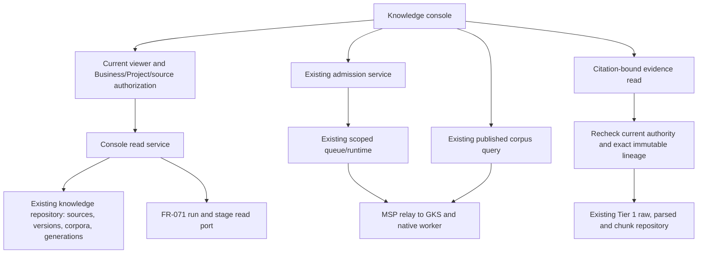

# TASK-ZAI-047 — Knowledge base console

## 1. Authority and approval boundary

Boss instructed this task to proceed on 2026-09-17 after observing an empty SmartGift Files page. The approved programme supplies the objective and acceptance criteria in [TC-TASK-ZAI-047](../roadmap/ROADMAP-zuri-ai-24w-program.md#tc-task-zai-047). This document makes the proposed routes, permissions, display states and verification concrete. Boss approved specification 0.1.0b in this task on 2026-09-17. It is now the approved implementation specification; this approval is not an implementation or production receipt.

FR-254 declares this console under FEAT-013. Current main and every enumerated worktree registry were checked before allocation: other lanes use numbers through FR-252. The approved requirement statement is:

> Knowledge base console: an authorized Business viewer can browse authorized source versions, all matching FR-071 runs and their stage evidence, and corpus generations; admit a supported source through the existing service; query one published generation; and open the exact cited chunk, parsed artifact and raw source under current source authorization. Pagination, empty data, unavailable runtime and read failures are explicit. Unauthorized source existence and content are never disclosed.

Primary ownership remains DOM-KNOWLEDGE. FR-254, its FEAT-013 binding, API appendix and task links were declared together before implementation. The architecture-only Data Pipeline Map remains a separate feature.

## 2. Parent and peer evidence

| Evidence at base 099ebc8f | Consequence |
|---|---|
| [Knowledge charter](../domains/knowledge/CHARTER.md), ADR-072 and ADR-085 | Use the existing knowledge slot; Tier 1 owns source lineage and corpus membership, while GKS owns canonical knowledge/quality through MSP. |
| `ManagedFilesPanel.jsx`, `listManagedFileAssets` | Files reads FileAsset only. File upload and knowledge admission are separate operations. An empty Files page does not establish an empty pipeline. |
| `knowledge-admission-service.js`: `listKnowledgeIngestions` | Existing list selects one Business or Project corpus and caps rows; it is insufficient for a complete, paged Business console across authorized Project corpora. |
| `knowledge-repository.js`: source, ingestion, generation and lineage methods | The authoritative data already lives in Tier 1. Add bounded read methods to the existing repository interface rather than another store. |
| `pipeline-tracking-service.js`: `listPipelineRuns`, `getPipelineMonitor` | FR-071 owns run/stage evidence; current run listing is capped. Use its service/read port and add bounded traversal without copying the ledger. |
| `knowledge-corpus-service.js`: `resolveKnowledgeCitation` | Existing citation checks immutable identity and current ACL, but returns chunk text and artifact references, not the raw/parsed content viewer required by this task. |
| [Data Pipeline Map](../DATA-PIPELINE-MAP.md) | Generated architecture status is not live pipeline telemetry and cannot supply console counts. |
| Live browser observation in SmartGift on 2026-09-17 | Files showed No managed files; Knowledge described its source console as planned. No live database totals or successful processing run were established. |

GKS owner task `01a0ab85-48d9-7380-91a5-7dd7539f6427` answered on 2026-09-17: its enumerated public registry has scoped search and run/cursor evidence export, but no general source/document listing. It recommends Tier 1 aggregation for sources already admitted by zuri. This is a reported static contract inspection, not new GKS runtime validation. No GKS CR is required for this slice. Discovering sources admitted elsewhere, unknown to zuri by source/run identity, would require a separately reviewed read contract through MSP.

## 3. User-facing scope

Add `/knowledge/console` to the existing Knowledge navigation, with four tabs. Keep `/knowledge` and `/knowledge/data-pipeline` as their existing dashboard/map surfaces. Add a link from Files to the console for the current Business; do not make FileAsset a synthetic copy of every pipeline record.

```text
Knowledge / คลังความรู้     Business: [current]   Project: [all authorized / selected]
[ต้นทาง] [งานประมวลผล] [รุ่นที่เผยแพร่] [ค้นความรู้]

ต้นทาง: [เพิ่มข้อความ] [เลือกไฟล์ที่ลงทะเบียนแล้ว] [ค้นชื่อ] [สถานะ]
ชื่อ | ประเภทต้นทาง | โปรเจกต์ | รุ่นล่าสุด | สถานะ admission | วันที่
เปิดรายการ → ประวัติรุ่น → งานของรุ่นนั้น → หลักฐาน
[โหลดเพิ่ม] / แสดงครบแล้ว

งานประมวลผล: งานทั้งหมดในขอบเขตที่มีสิทธิ์ รวมงานที่ไม่มี admission link
เปิดงาน → ขั้นตอนและ attempts → terminal evidence / failure / receipt

รุ่นที่เผยแพร่: Corpus → ประวัติ generations → Published / Historical

ค้นความรู้: [คำถาม] → ผลค้นพร้อม generation → [เปิดหลักฐาน]
หลักฐาน: [ข้อความที่อ้าง] [เอกสารที่แปลงแล้ว] [ต้นฉบับรุ่นนี้]
```

- Sources includes supported KnowledgeSource kinds, including text and registered-file sources and other kinds the existing admission contract accepts. It does not equate a KnowledgeSource with one file or one product record. Source versions come from immutable ingestion history, not FileAsset.version alone.
- A Business view aggregates its Business corpus and only its authorized Project corpora for browsing. Selecting a Project narrows to that Project. Query selects one explicit Business or Project corpus; it never silently federates multiple corpora or native stores.
- Runs includes every authorized FR-071 ledger run in the selected scope, including legacy/unlinked runs. Distinguish pipeline definitions and do not draw seventeen knowledge stages for another pipeline. A Project filter includes only runs with a verified Project association; do not guess associations from names.
- Display durable admission id separately from executionRunId, and sourceVersion separately from corpus generation and native snapshot generation. Runs awaiting execution binding stay queued/unbound, not failed or published by inference.
- Generations reads KnowledgeCorpusGeneration with the current published pointer from KnowledgeCorpus and verified stored manifest identity. A historical document snapshot remains distinct from a corpus generation containing multiple snapshots. Counts describe authorized entries only.
- Search reuses queryKnowledgeCorpus. Render its evidence results and citations as results, not a newly invented LLM-written answer. No additional model call belongs in this task.
- Source admission reuses admitKnowledge. File selection uses existing supported FileAsset/content capability; unavailable local content is an explicit capability state. Do not imply hosted Linux can read a user's Windows path. New binary parsing remains TASK-ZAI-048.
- No automatic import of folders, RawExternalRecord staging, catalogs or external GKS sources. No retroactive publication, worker activation or bulk admission from opening the console.

## 4. Architecture and read contracts



The initial route plan is additive. Preserve existing callers and response shapes; console DTOs have explicit allowlists. Proposed GETs do not enqueue, create a corpus, publish, pull remote evidence or acknowledge a gate.

| Route / operation | Proposed behavior |
|---|---|
| GET `/api/knowledge/sources` (new) | Authorized, cursor-paged source metadata across the selected Business/Project scope. |
| GET `/api/knowledge/sources/{sourceId}` (add beside existing DELETE) | Source metadata and cursor-paged immutable versions with admission/run references. No source body in the list. |
| GET `/api/knowledge/console/runs` (new) | Cursor-paged authorized FR-071 runs with optional verified source/admission association. Reuse the owning service; do not infer a run from an admission status. |
| GET `/api/knowledge/console/runs/{executionRunId}` (new) | Redacted stage/attempt/gate/publication projection through existing FR-071/knowledge services after knowledge and applicable source authorization. |
| GET `/api/knowledge/corpora` (new) | Authorized corpora and current publication metadata. |
| GET `/api/knowledge/corpora/{corpusId}/generations` (new) | Cursor-paged generation summaries and authorized member references; current pointer marks published. |
| GET `/api/knowledge/citations/{citationId}/artifact?kind=chunk\|parsed\|raw` (new) | Resolve the citation first, then open only its exact immutable Tier 1 artifact. No arbitrary artifact id or filesystem path input. |
| POST `/api/knowledge/ingestions`, POST `/api/knowledge/queries`, GET `/api/knowledge/citations/{citationId}` (existing) | Existing authorized admission, query and citation contracts. Reuse rather than duplicate their mutation/query behavior. |

List query contract: required businessId where the target is not already identity-bound; optional projectId/source/status filters where applicable; opaque cursor; limit default 25, maximum 100. Validate filters strictly. Cursor binds scope, normalized filters and stable `(createdAt,id)` ordering. Reject cursor reuse under another scope. Return `items`, `nextCursor`, `hasMore`; a loaded-page count is never labelled a database total. Bound database batches while traversing authorization-filtered data; an internal continuation must not expose inaccessible IDs or counts. Verify more than 100 matching rows are all reachable.

## 5. Authorization, evidence and error behavior

1. Resolve the current trusted session/API viewer and existing knowledge scope policy. No new role or implied write permission. Business visibility alone does not substitute for source/Project/FileAsset access.
2. Apply source checks before returning metadata, titles, versions, passages, links, errors or counts. Never send restricted rows to the browser for client-side filtering. Direct unauthorized identities return the same not-found response as nonexistent ones.
3. A generation view exposes only authorized references. Do not return a raw manifest, total membership, or a hidden-source count that reveals restricted existence. An exact cited generation remains identity-bound; citation rendering still performs its independent current authorization checks.
4. Show revoked history only where existing policy explicitly authorizes its metadata; never restore access to the content for audit convenience. Recheck changed grants/deleted FileAsset/deleted Project after slow content reads before response disclosure.
5. The artifact viewer follows citation → stored corpus generation → source/version → ingestion → snapshot → chunk/parsed/raw identity. Verify scope and hashes. Never substitute the current file path or latest uploaded bytes for a historical citation. Missing retained bytes are unavailable, not evidence reconstructed from a newer file.
6. Render text/JSON safely; raw downloads use a sanitized filename and attachment content disposition with nosniff. Do not render uploaded HTML, run content, expose server paths, credentials or raw internal error payloads. Bounded content loading must visibly indicate truncation/ranges and preserve a byte-exact authorized download where supported.
7. Preserve all terminal attempts and distinguish queued/running/failed/review-required from verified publication. Missing stage evidence is unavailable/not reported; a green wrapper response or stage-count heuristic is not publication proof.
8. Each tab has distinct loading, verified empty, error-with-retry, forbidden and unavailable-runtime states. Knowledge list failure must be visible in Files as well as the console; it cannot collapse into an empty library. Scope changes clear prior rows, query results and evidence panes immediately; ignore late responses from the old scope.
9. Read-only history remains usable when execution/query capability is unavailable. Admission/query controls state the missing capability; the console never changes configuration to enable them.

## 6. Acceptance, implementation order and verification

| Step | Deliverable | Required evidence |
|---|---|---|
| 0 — Documentation approval | This specification; allocate/declare new FR and reconcile feature/task/API bindings before code | Parent/peer review and governance; no repurposed IDs |
| 1 — Authorized read model | Repository pagination, source/version/run/corpus projections | Real local Prisma integration cases with >100 rows, two Businesses and two Projects, unlinked runs, deterministic pagination and hidden-source non-disclosure |
| 2 — Citation evidence | Citation-bound raw/parsed/chunk reads | Immutable-version and hash mismatch cases; deleted/revoked source, changed grants during read, scope mismatch, unsafe content and missing historical artifact |
| 3 — Console | Four tabs, admission/query controls, Files link/error state | Keyboard/narrow view and scope-switch/late-response browser checks; no snapshot counts inferred from architecture metadata |
| 4 — Complete browser flow | Admit → observe real run → verified publication → query → open each evidence layer | Isolated real native pipeline browser acceptance with exact run/snapshot/receipt identities; service mocks do not satisfy this exit gate |
| 5 — Integration | Traceability, programme status/evidence and phase report | Full applicable Server suite/build/e2e and `npm run govern`; preserve failures/skips and separate hosted CI from local evidence |

Use tests/factories/viewer.js. A browser fixture may prove UI rendering/auth denial, but label it as fixture evidence. Native acceptance must use the real scoped runtime, not reporter APIs or direct database updates that fabricate completion. Reuse the existing knowledge-admission harness and its real native prerequisites; create only isolated test content. Do not submit production files or invoke paid/new providers to make the gate pass without the corresponding authorization.

Every criterion from TC-TASK-ZAI-047 remains required: sources with versions/admission state; every authorized matching ledger run and terminal stage evidence; published corpus pointer; query pinned to one generation; exact chunk/parsed/raw navigation; unauthorized content and existence withheld; browser admission-to-citation flow. Do not mark the task done if the native gate cannot run. Report implemented-local versus NOT_RUN separately.

## 7. Boundaries and outstanding decisions

- No schema migration is proposed initially: required entities exist. If immutable raw/parsed retention cannot satisfy the historical-artifact criterion, record the exact dependency on TASK-ZAI-049 before widening storage scope; do not replace missing bytes or weaken the criterion.
- No GKS/MSP contract change is proposed. A need to discover external sources unknown to Tier 1 is a separate candidate CR, not an implicit part of this UI task.
- TASK-ZAI-048 binary parsing, TASK-ZAI-049 production storage, TASK-ZAI-050 production activation, TASK-ZAI-051 concurrency and TASK-ZAI-063 live map overlay remain separately owned work.
- This task may expose existing source management actions only under their current contracts. It adds no manual publish-success control or stage bypass.
- No production deployment, live import or data backfill is authorized by this design document. A local console build is not proof of live pipeline activation.

## 8. Version diff and current evidence

`absent → 0.1.0b candidate → 0.2.0b approved → 0.2.1b evidence update`: the owner approved the design, FR-254 was declared without changing existing IDs, and the isolated implementation now provides the specified Console and read boundaries. This patch links evidence; it does not expand the approved scope.

The [phase report](../../.brain/reports/2026-09-17-task-zai-047-knowledge-console.md) records exact full-suite, browser, native and build results and remaining gates. Earlier failed attempts remain in that evidence trail. Production deployment and activation are separate and NOT_RUN.

## CHANGELOG

| Version | Date | Status | Summary | Commit Hash | Agent |
|---|---|---|---|---|---|
| 0.1.0b | 2026-09-17 | candidate | TASK-ZAI-047 console design and contract/test plan based on current Tier 1 evidence and GKS coordination | uncommitted; base 099ebc8f | RWANG |
| 0.2.0b | 2026-09-17 | approved | Boss approved 0.1.0b; bind FR-254 and FEAT-013 before implementation | uncommitted | RWANG |
| 0.2.1b | 2026-09-17 | approved | Link implementation evidence and preserve the production boundary; no scope change | uncommitted | RWANG |
