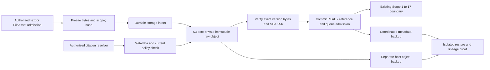

# TASK-ZAI-049 — Durable knowledge storage on self-hosted S3

**Approved implementation specification; isolated implementation verified, production acceptance NOT_RUN.**
Complexity **C-3**, risk **HIGH**, operator access **H4**. The owner requested this
specification after discussing local/self-hosted MinIO and approved the isolated
implementation. Production installation, migration, retention changes and runtime
activation still require their own evidence and release approval.

## 1. Objective and authority

For a production-admitted raw artifact, recover the exact original bytes and SHA-256
after a year or a backup restore, subject to an explicitly approved erasure policy.
Removing its FileAsset must not physically delete the knowledge copy. Storage
placement, retention, erasure and recovery must obey the artifact's processing policy.

Parent authority: [roadmap task and acceptance criteria](../roadmap/ROADMAP-zuri-ai-24w-program.md#tc-task-zai-049),
[17-stage specification](../KNOWLEDGE-INGESTION-17-STAGE-SPEC.md),
[ADR-072](../decisions/ADR-072-KNOWLEDGE-ADMISSION-AND-CORPUS-PUBLICATION.md),
[admission contract](KNOWLEDGE-ADMISSION-CONTRACT.md).
Peer constraints: [managed files](../domains/project-manager/features/FR-045-managed-local-file-workspace.md),
[sensitivity lattice](../domains/knowledge/features/FR-111-knowledge-sensitivity-lattice.md),
[asset evidence](../domains/asset-management/features/FR-137-asset-evidence-intake-execution.md).
This is a plan-layer contract using existing requirement identities; it does not
allocate or change FR subjects, declare new canonical GKS models, or change task ownership.

## 2. Evidence and scope

At base `0c7fd884`, KnowledgeIngestion.content and KnowledgeRawArtifact.content hold
text in the database. The lineage repository is scope-bound and append-only. The
admission backup integration test restores Tier 1 rows; it does not restore Tier 4
snapshots. Managed FileAssets also use local mounts. The existing Supabase object
port belongs to asset evidence and has put/get/remove operations; it has no verified
knowledge version-pinning or recovery contract. Do not repoint that port or its buckets.

In scope: durable raw bytes, an S3 adapter, authoritative storage bindings, exact
version reads, backup inventory, restore proof, controlled retention/erasure and an
operator rollout receipt. Existing supported Text/Markdown inputs remain supported.
The storage port accepts bytes; that does not add a parser or binary admission UI.

Out of scope: TASK-ZAI-048 binary parsing, TASK-ZAI-050 production pipeline activation,
TASK-ZAI-051 scheduling, migration of all File Manager files, public file sharing,
multi-node HA, and direct writes to MSP/GKS/GenesisBlockDB stores. A Linux container
cannot read a user's Windows path unless an approved mount/transfer makes it available.

## 3. Candidate architecture decisions

1. Use a provider-neutral **S3-compatible object port** for knowledge raw artifacts.
   Select **MinIO AIStor Free, single-node**, as the initial candidate deployment;
   the same contract can be tested against another provider without changing source
   identities, lineage or citation IDs. Do not add unneeded provider implementations.
2. Persist data on an explicitly named host data volume outside the container writable
   layer. Local development uses a separate disposable endpoint/bucket and credentials.
   Production has a separate private endpoint and persistent volume; a container
   recreation must not change that volume. Do not expose the admin console through ngrok.
3. Use a second physical host/storage failure domain for backups. A second bucket,
   directory, or disk on the same host is not the disaster-recovery copy. Single-node
   operation accepts downtime; neither versioning nor backup is an HA claim.
4. Keep identity, ownership, policy, hashes, references and recovery journals in Tier 1
   metadata; raw bytes live in object storage. Keep parsed/chunk content in its current
   Tier 1 representation and include it in backup until a separate change moves it.
5. Preserve current API/MCP authorization and ADR-072 revocation behavior. Retained
   bytes do not create a new download entitlement after source/FileAsset/Project deletion.
6. Use a private bucket per storage-policy binding, with opaque Tenant/Business/artifact
   UUID prefixes. Prefixes identify objects; they are not sufficient authorization.
   Application checks and least-privilege storage credentials must both enforce scope.

Provider evidence checked 2026-09-17: the [MinIO Community repository](https://github.com/minio/minio)
is archived and declares no maintenance; it is not the proposed new production binary.
[AIStor container documentation](https://docs.min.io/aistor/installation/container/install/)
and [Free agreement](https://www.min.io/legal/aistor-free-agreement) describe the licensed
single-node option without distributed clustering/HA. Before deployment record the
actual license, pinned image digest, supported host layout, update path and successful
capability probes. Free licensing is not a claim of open-source distribution or support.

## 4. Configuration and security contract

The server resolves a storage binding from trusted scope and policy. Requests may not
provide endpoints, buckets, object keys, credentials, physical paths or placement labels.
Each binding records a stable ID/revision, exact scope, endpoint secret reference,
bucket, region, addressing mode, placement identity, encryption/key reference,
retention policy and backup destination identity. No secret value enters a source
manifest, citation, browser response, audit log or committed document.

Require TLS for production network access and encryption at rest with a documented
key recovery method. Test-only loopback plaintext is an explicit local profile.
The chosen deployment must prove its encryption capability and license support;
otherwise production readiness fails. Credentials for application writes/reads,
backup, and operator erasure are distinct; applications cannot change bucket policy,
disable versioning, bypass retention or remove object versions.

Placement applies to primary objects, database payload copies, backups, temporary
files and processing. `cloud_processing_allowed=false` does not mean any self-hosted
VPS is allowed: the binding must name the permitted local boundary. Missing or
unimplemented sensitivity/grant/location enforcement denies admission and serving.
The current private execution profile does not prove full FR-111 enforcement. Do not
admit CONFIDENTIAL/RESTRICTED data until the coordinated MSP/GKS/worker/query policy
tests pass. No new sensitivity levels or implicit PUBLIC defaults are introduced.

## 5. Object and persistence contract

Store the original byte sequence without newline, Unicode, MIME or encoding conversion.
For TEXT, encode the submitted string once as UTF-8 according to the existing admission
contract. For FILE, preserve the exact read bytes. Compute application SHA-256 and
byte length; never interpret an S3 ETag as a SHA-256 or content-integrity proof.

Candidate additive persistence consists of a scoped storage-intent/reference record
and a recovery/erasure journal. Final Prisma names and matching SQLite/Postgres
migrations are implementation deliverables; these are proposed fields, not existing models:

| Record | Required contract fields |
|---|---|
| Artifact storage | UUID, complete existing lineage scope, admission/source identity, nullable rawArtifactId until Stage 1, binding ID/revision, bucket/key/versionId, sha256, byteLength, contentType, policy revision, retention deadline, state, timestamps, version |
| Operation journal | UUID, scope, idempotency identity, operation kind, artifact/reference identity, status, attempt/lease, actor, reason, evidence hashes, createdAt/updatedAt/version |
| Recovery manifest | backup ID/schema version, source commit, DB checkpoint/hash, exact artifact inventory, native snapshot/receipt inventory, key references, erasure-journal watermark, verification result |

Proposed storage states are `PENDING`, `READY`, `QUARANTINED`, `ERASURE_PENDING`,
`ERASED`; they do not replace existing KnowledgeIngestion job statuses. Enforce one
logical storage intent per scoped admission identity. An artifact's original reference
is immutable once READY. No cross-Business deduplication, filenames or personal data
in keys. A key is opaque and collision-safe even for identical bytes from two sources.

The internal port provides `putImmutable`, `readExact`, `statExact` and an independently
authorized `eraseExactVersions`. Reads require a trusted binding and exact version;
there is no fallback to an object's latest version or caller-supplied URL. Provider
capabilities include versioning, retention behavior, immutable-write conflicts,
checksums/readback, version enumeration and deletion; probe the pinned release rather
than assuming every S3-compatible provider behaves identically.

## 6. Admission, retry and crash boundaries

1. Authorize source access, freeze bytes/hash and validate policy/binding/readiness.
   Persist a PENDING intent with scoped idempotency key and request hash. Retain the
   frozen input durably during recovery; do not depend on reading a mutable file again.
2. Write a unique immutable object. Reuse the logical intent on retry. A mismatching
   existing hash/version is a conflict, never an overwrite. If the response is lost,
   reconcile that intent's key and exact bytes before writing or attaching a version.
3. Read back the pinned version and verify byte length/SHA-256, then atomically commit
   the READY reference and the existing durable admission queue transition. Return
   accepted only after that commit. Storage and SQL are not one distributed transaction.
4. Stage 1 attaches rawArtifactId to the reference with the existing scoped run identity.
   Downstream execution requires READY evidence. A timeout remains retryable; it never
   fabricates completed stages or publishes a corpus without a verified native receipt.
5. Reconcile interrupted PENDING intents after restart. Unattached versions are audited
   orphans; cleanup requires a grace period and proof that no intent, live reference,
   backup-in-progress or retention hold owns them. Do not delete by age alone.

Hash mismatch quarantines the reference and fails the read. Storage outage fails
admission/retrieval explicitly; no empty success, alternate source-version fallback,
or secret-bearing provider error reaches the UI. Existing input-size limits remain.

## 7. Retention, deletion and citations

Proposed ordinary raw retention is **at least 365 days from admission**, extended while
an active corpus or approved hold requires it. This is a candidate operational value;
the approved per-object policy governs exceptions and explicit erasure. No automatic
bucket expiry may independently remove a referenced raw version.

| Action | Required result |
|---|---|
| Delete FileAsset or withdraw source | Preserve physical knowledge copy and audit identity; current authorization/revocation still denies prohibited content reads |
| Correct source | New bytes/version/reference; old authorized citation pins the prior version |
| Retention deadline reached | Evaluate references, holds and policy; schedule audited erasure only if eligible |
| Approved erasure | Revoke affected retrieval first, enumerate all payload copies and derivations, remove allowed versions, record receipts and a content-free tombstone |
| Locked/held version | Record blocked or pending erasure with reason/deadline; do not report erased or bypass a hold |

Do not enable blanket compliance-mode Object Lock by default: irreversible retention
can conflict with erasure. Enable a lock only under a named approved retention/hold
policy and test both the allowed and denied operations on the selected release.

Erasure includes original objects, staging/multipart/orphan copies, inline content in
KnowledgeIngestion/KnowledgeRawArtifact/RawExternalRecord, parsed/chunk derivatives,
caches and backups. GKS/MSP/Tier 4 removal is requested through owner-approved service
contracts and receipt evidence; zuri never edits those stores directly. If any required
owner contract or copy inventory is unavailable, full erasure remains BLOCKED.

The existing append-only lineage contract must gain a narrowly authorized payload-purge
exception before erasure implementation: preserve identity, hashes, provenance and audit,
but remove content under the approved operation. This is a **proposed** ADR-072/admission
contract amendment, not permission to rewrite immutable source identities silently.
Authorized resolvability checks distinguish retained, policy-withheld, erased and damaged
evidence internally. An erased citation retains a verifiable tombstone, never fabricated
text; unauthorized clients receive the existing non-disclosing response. Exact-byte
recovery applies to retained data, not intentionally erased data.

Backup erasure receipts distinguish immediate accessible-copy deletion from copies
pending approved backup expiry. Keep a current erasure ledger outside older snapshots;
restore must apply it before any reader/worker starts so an old backup cannot resurrect
erased content. Do not claim complete erasure until all required copies are gone.

## 8. Backup and restore contract

Candidate service targets: **RPO <= 24 hours; RTO <= 4 hours**, measured for the admitted
production dataset and recorded on the receipt. Proposed daily backup and 30-day rolling
backup retention are distinct from the 365-day live raw retention. Policy/hold overrides
apply; measurements and backup capacity must validate these targets before activation.

For the first production profile, use an operator maintenance window: pause new
admissions, drain or durably checkpoint in-flight work, and establish a coordinated
Tier 1 DB checkpoint plus owner-issued native snapshot checkpoints. Copy every referenced
object version and record hashes. Verify completeness before marking the backup complete
and resuming work. A partial backup never becomes the latest successful recovery point.

The manifest includes corpus/source/job/generation, raw/parsed/chunk and pipeline lineage,
storage intents/references, policies and erasure journals. Native GKS/Tier 4 artifacts,
publication receipts and their owner restore instructions remain separately required.
A zuri database export plus a raw bucket is not proof of a restorable whole pipeline.
Keys are recoverable through a separate access-controlled process, not plaintext in backups.

Restore into a clean isolated database and bucket with runtime disabled. Verify manifest,
database integrity, all required copies/keys and scope before replay. A destination may
assign different S3 version IDs: record an audited old-reference-to-restored-version mapping
after full byte/hash verification; never rewrite citation/source identities or use latest.
Apply current erasure decisions, then test exact bytes and Fact -> chunk -> parsed -> raw
lineage through the owning services. Missing native prerequisites make the full proof
BLOCKED, while independently completed storage checks retain their narrower result.

## 9. Migration, release and rollback

After spec approval, prepare additive schema/contract changes and scoped backfill tools
with dry-run inventories. Preserve existing IDs, content hashes and receipts. Existing
inline text can be exported only when its exact encoding/hash contract is verified;
unrecoverable original file bytes are reported, never reconstructed from parsed text.

Use one explicitly approved Business canary. Backfill and verify every object before
switching its reference to READY. Keep old inline representation during a bounded,
documented compatibility window; it remains subject to placement and erasure policy.
No automatic admission enablement, bulk file migration or removal of original content.

Rollback stops new object-backed admissions/workers and preserves all objects and
additive metadata. Only roll back to a revision proven to read every admitted record;
an older binary without object-reference support is not a safe rollback after cutover.
Do not drop buckets, volumes or schema as part of image rollback. Record image digest,
schema state, binding revision, backup checkpoint and recovery results in the release receipt.

## 10. Acceptance and evidence matrix

All rows are **PLANNED / NOT_RUN**. Unit, isolated integration, actual storage, production
canary and full native recovery evidence must be labeled separately.

| Check | Required observable evidence |
|---|---|
| Exact-byte storage | UTF-8/multibyte/newline fixtures and arbitrary port-level bytes round-trip with SHA-256; arbitrary bytes do not imply binary parser support |
| Identity and isolation | Cross-Tenant/Business/Project access, caller key/URL injection and scope mismatch denied without existence/content disclosure |
| Policy placement | Missing policy fails closed; disallowed primary/temp/DB/backup locations denied; restricted profile withheld until all owners enforce it |
| Crash recovery | Fail before upload, after upload, after readback and after SQL commit; restart/retry yields one logical admission and no overwritten version |
| Corruption and outage | Missing/wrong version, wrong hash, timeout and disk-full fail explicitly; current corpus cannot silently substitute data |
| File deletion | Delete FileAsset; retained object still verifies through operator recovery, while ordinary citation content respects revocation |
| Retention and erasure | Simulated one-year clock, held object, active reference, all-version deletion, inline/derived/backup inventory and tombstone behavior tested |
| Container restart | Recreate pinned storage/application containers against the named volume; exact bytes remain accessible |
| Separate-host recovery | Restore coordinated backup into clean DB/storage; verify inventory/hash completeness and unchanged scoped citation identities |
| Native lineage | Owner-supplied Fact-to-raw chain, receipt and snapshot restoration pass; no direct foreign-store writes |
| Erasure after restore | Restore an older backup; current erasure ledger prevents content resurrection before serving |
| Migration and rollback | Dry-run counts/hash parity, no lost legacy references, compatible rollback revision and resumed intents verified |
| Production receipt | Commit, image/provider version, date, storage/backup location IDs, dataset size, measured RPO/RTO and failures recorded without credentials |

Run relevant admission/lineage/backup/authorization regression suites, storage-contract
tests against the pinned provider, build and governance. Full production TASK-ZAI-049
completion requires its clean-restore/lineage exit criterion; a simulated one-year test
is policy evidence, not a claim that the deployment has operated for a year.

## 11. Implementation sequence and deployment prerequisites

1. Review this candidate, then align the affected ADR-072/admission contract and migration
   design before code. Keep authoritative registry subjects and task identities unchanged.
2. Implement the scoped port, additive metadata/journal and crash-safe admission contract;
   validate in an isolated storage profile with synthetic data.
3. Implement and prove backup, restore, retention/erasure and compatible rollback; obtain
   external owner contracts/receipts where required without importing their stores.
4. Prepare the exact production canary and release receipt for operator approval. Only
   then provision/cut over storage. TASK-ZAI-050 separately authorizes runtime activation.

Deployment values still to be supplied: primary host/volume and capacity; separate-host
backup location; exact Business and permitted processing boundary; license/image digest;
credential/key custody; retention/hold exceptions; measured recovery capacity. These
unknowns do not block review of this spec, but none may be guessed during deployment.

## Version diff

`0.1.0b` candidate -> approved `0.1.0` beta: owner approval authorizes the isolated
implementation; production acceptance remains NOT_RUN. Adds the S3/AIStor decision,
diagram, scoped storage contract, crash boundaries, erasure compatibility proposal,
backup/restore proof and operator gates. Runtime code, database and production unchanged.

`0.1.0` -> `0.1.1` beta: isolated acceptance hardening now rejects provider version
mismatches and backup references that do not resolve to scoped raw lineage or storage
parents; production acceptance remains NOT_RUN.

## CHANGELOG

| Version | Date | Status | Summary | Commit Hash | Agent |
|---|---|---|---|---|---|
| 0.1.0b | 2026-09-17 | candidate | Initial self-hosted S3 raw durability, retention and coordinated recovery specification | base 0c7fd884 | RWANG |
| 0.1.0 | 2026-09-17 | beta | Owner-approved isolated implementation: provider port, scoped references, operation journal, backup inventory and Stage 1 readback proof; production acceptance remains NOT_RUN | 335cf917 | RWANG |
| 0.1.1 | 2026-09-17 | beta | Isolated acceptance hardening: provider version mismatch checks and scoped backup lineage validation; production acceptance remains NOT_RUN | 87e69c2f | RWANG |
