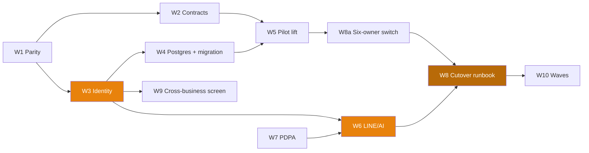

# Implementation Plan — PHASE-V2-REPLACE

| Field | Value |
|-------|-------|
| **Version** | 1.0.0 |
| **Status** | Draft — awaiting owner sign-off on §4 (capacity) and §6 (first cutover) |
| **Generated** | 2026-08-12 by RWANG implementation-plan |
| **Source docs** | [ADR-003](../ADR-003-V2-REPLACES-V1-BY-REUSE.md) · [ADR-004](../ADR-004-DOCUMENTATION-ARCHITECTURE.md) · [ADR-005](../ADR-005-V1-DOCUMENTATION-CORPUS.md) · [PRODUCT-V2](../PRODUCT-V2.md) · `zuri-v2-lab/docs/PRD-SDD-v1.0.md` · `ROADMAP-zuri-v2-lab.md` |
| **Preflight** | PASS — 0 critical, 0 warnings (`zuri-v2-lab/docs/.preflight-report.json`) |
| **Note** | Filed here, not at `docs/IMPLEMENTATION-PLAN.md` — that file is the original MVP plan and stays untouched (ADR-004 layering) |

> **Sequencing refined by [ADR-007](../ADR-007-LINE-AI-STACK-SEQUENCING.md) (2026-08-12).**
> The LINE/AI stack has a strict dependency order — **extract MSP → Zuri backend slice
> (impact-scan first) → Identity → Persistence → Knowledge → Agent → E2E**, behind six
> production gates (A–F), with a read-only agent (Gate E) shipping before a writing
> agent (Gate F). W3/W4/W6/W7 below are the same work; ADR-007 fixes their order and
> inserts MSP extraction ahead of them. Memory must be keyed by **principal, not
> channel** — do not connect MSP to Zuri before Identity.

## 1. Scope

### 1.1 By the numbers

| Metric | V2 today | To absorb from V1 |
|---|---|---|
| Prisma models | 20 | 94 (255 `tenantId` refs, 0 `businessId`) |
| API routes | 32 | 209 |
| Dashboard pages | 24 | 68 (71/74 files `'use client'`) |
| `fetch('/api…')` call sites | — | 192 |
| Files coupled to `useTenant` | — | 21 |
| Tests | 129 Vitest + 28 Playwright | ~300 files (V1's own) |
| Requirements | FR-001…FR-020 ✅ done | FR-021+ to be declared |
| Source velocity | — | ~213 commits / 90 days |

**Complexity points** (skill formula: scope + risk + dependencies + AI):

| Work item | Scope | Risk | Deps | AI | **Points** |
|---|---|---|---|---|---|
| W1 Parity inventory | 5 | 0 | 0 | 0 | **5** |
| W2 Contract-test harness | 5 | 2 | 1 | 0 | **8** |
| W3 Identity rebuild (Person/Membership + LINE login) | 8 | 5 | 1 | 0 | **14** |
| W4 Postgres move + migration tooling | 5 | 5 | 1 | 0 | **11** |
| **W4b Shell lift + scope wrapper (ADR-006)** | 5 | 2 | 1 | 0 | **8** |
| W5 Pilot module lift (1 low-risk module) | 5 | 2 | 3 | 0 | **10** |
| W6 LINE/AI intent surface | 8 | 5 | 3 | 5 | **21** |
| W7 PDPA/consent model | 5 | 5 | 1 | 2 | **13** |
| **W8a Side-effect ownership switch — all **nine** owners + per-tenant worker scoping** | 5 | 5 | 3 | 0 | **13** |
| W8 Cutover runbook + rollback | 5 | 5 | 3 | 0 | **13** |
| W9 Cross-business screen (proof V2 ≠ V1) | 2 | 0 | 1 | 0 | **3** |
| W10 Remaining module lifts (per module × N) | 5 ea | 2 ea | 3 ea | 0 | **10 × N** |
| | | | | **Subtotal (W1–W9)** | **119** (was 98 — +8 shell lift, +13 ownership switch, from the parity scan) |

N (modules actually lifted) is unknown until W1 completes. The "drop" column of the
parity inventory is the single biggest lever on total cost — features nobody uses
are not lifted at all.

### 1.2 Explicitly out of scope

- Rewriting V1's UI (ADR-003 — it is lifted, not rebuilt)
- Any modification to `G:\zuri` (AGENTS.md §1 — reuse is one-directional)
- Model fine-tuning (`docs/ai-system/model-lifecycle.md` — prompt + schema validation first)
- Two-way sync between V1 and V2 (there is never a period where both own a tenant)
- New PM features — FR-001…FR-020 are done and frozen for this phase

## 2. Phases

| Phase | Cycles | Focus | Exit gate |
|---|---|---|---|
| **R0 Discovery** | C1 | Parity inventory, contract-test harness | Every V1 module classified keep/later/drop; fixtures recorded for the pilot module |
| **R1 Foundations** | C2–C4 | Identity, **shell lift (ADR-006)**, Postgres, migration tooling | A V1 tenant's data is in V2 with UUIDs preserved and reconciles; one person logs in across two businesses; V1's shell renders inside V2's scope with FR-020's tests still green |
| **R2 Pilot** | C5–C6 | Lift one low-risk module end to end | Pilot module served from V2 against migrated data, contract tests green, real cost per module measured |
| **R3 AI surface** | C6–C8 | LINE intent pipeline + PDPA | A LINE message creates a record through dry-run → confirm → commit → audit, with consent recorded |
| **R4 Cutover waves** | C9+ | Lift remaining must-have modules, cut tenants over in waves | Each wave: single-writer flip, watched hour, rollback unused |
| **R5 V1 off** | last | Final tenant, V1 read-only then off | `TASK-V2-LASTDATE` date met |

### Critical path

Longest chain: **W1 → W3 → W4 → W5 → W8 → W10**. Identity (W3) is on it and is the
highest-risk single item — it is scheduled first for that reason, not last.

## 3. Cycle detail (first 30% — the rest stays at phase level, deliberately)

### C1 — Know the real size

**Goal**: stop estimating, start counting.

| Task | Task id | Points | Output |
|---|---|---|---|
| Parity inventory: module × route × page × model × worker × usage → keep / later / drop | `TASK-V2-PARITY` | 5 | `PARITY-INVENTORY.md` filled |
| Pick the pilot module (self-contained, no LINE, no money) | — | 1 | One named module + why |
| Record V1 endpoint fixtures for the pilot module only | `TASK-V2-CONTRACTS` | 3 | `CONTRACT-TESTS.md` rows + fixture files |

**Done when**: every V1 module has a verdict, and the pilot module's endpoints have
recorded request/response pairs including the empty and error cases.
**Risk**: low — read-only work against `G:\zuri`.

### C2–C3 — Identity (the thing everything waits on)

**Goal**: one person, many businesses, one login.

| Task | Task id | Points | Output |
|---|---|---|---|
| `Person` / `Membership` model + role resolution across businesses | `TASK-V2-IDENTITY` | 8 | Schema + service + tests |
| LINE login (identity, not intake) | `TASK-V2-IDENTITY` | 4 | Auth path with LINE as an identity provider |
| Map V1 `Employee` → `Person` + `Membership` (UUIDs preserved) | `TASK-V2-IDENTITY` | 2 | Migration function + reconciliation test |

**Done when**: an owner with two seeded businesses logs in once and sees both, and a
V1 employee row migrates to a `Person` keeping its id.
**Risk**: **high** — this is the piece V1 cannot express. New requirement ids needed
(proposed FR-021 identity, FR-022 LINE login — must be declared in the registry
before any code cites them, or preflight fails CRITICAL).

### C4 — Postgres + migration tooling

| Task | Points | Output |
|---|---|---|
| Provider swap + `Json` column upgrade (`DB-MIGRATION-NOTES.md`) | 4 | V2 running on Postgres, tests unchanged |
| Per-tenant export → migrate → import with UUID preservation | 5 | Tooling + reconciliation report per tenant |
| Reconciliation checks: row counts, printed-doc ids, LINE bindings resolve | 2 | Automated check, run per tenant |

**Done when**: one real tenant's data lives in V2 Postgres, and the reconciliation
report is clean. **Risk**: high — this is the irreversible-looking step; it is not,
because V1 is untouched and still authoritative until the flip.

### C5–C6 — Pilot module (the measurement)

| Task | Task id | Points | Output |
|---|---|---|---|
| Lift the pilot module's pages + `useTenant` shim | `TASK-V2-PILOT` | 4 | Pages rendering in V2 shell |
| Reimplement its endpoints on V2 models, same contract | `TASK-V2-PILOT` | 5 | Contract tests green |
| Measure: hours per module, surprises, shim leakage | — | 1 | A number that makes W10 estimable |

**Done when**: the pilot module in V2 is indistinguishable from V1 to a user, and we
know what a module actually costs. **This is the go/no-go for the whole approach** —
if a lifted module needs a rewrite anyway, ADR-003's economics were wrong for that
class of page and the ADR gets revisited (its own review trigger).

## 4. Capacity — stated honestly

The skill's team formula assumes FTEs. This project has **one owner plus AI agents**,
so it is stated in cycles instead:

| Resource | Reality |
|---|---|
| Owen | decisions, domain truth, cutover authority, customer contact |
| Claude (agent sessions) | implementation, tests, docs, migrations |
| Effective throughput | ~15–20 points per 2-week cycle, based on the intake phase (FR-017…FR-020 ≈ 40 points in ~2 cycles) |

119 points for W1–W9 → **≈7 cycles ≈ 14 weeks** before the first cutover wave, plus
10 points per lifted module. **With the mandated 25% risk buffer: ≈18 weeks to the
first tenant cutover** (was 15 — the parity scan added the shell lift and the
six-owner ownership switch). W10 depends entirely on N from the parity inventory.

> This assumes the owner is available for the decisions listed in §7. Every one of
> those is a blocking dependency, not a nicety.

## 5. Milestones

| ID | Milestone | Phase | Gate criteria (not dates) |
|---|---|---|---|
| M1 | Real size known | R0 | Parity verdicts for 100% of V1 modules; pilot chosen |
| M2 | One identity, many businesses | R1 | Owner logs in once, sees two businesses; V1 employee migrates keeping its UUID |
| M3 | Data lives in V2 | R1 | One tenant migrated to Postgres; reconciliation clean; V1 still authoritative |
| M4 | A module is indistinguishable | R2 | Pilot module served from V2, contract tests green, measured cost per module |
| M5 | AI writes nothing unconfirmed | R3 | LINE message → envelope → dry run → confirm in chat → commit → audit; consent recorded |
| M6 | First tenant on V2 | R4 | Single-writer flip done; watched hour clean; rollback unused |
| M7 | V1 off | R5 | Last tenant cut over; V1 read-only, then off |

## 6. Risk register

| ID | Risk | P | I | Score | Mitigation | Owner |
|---|---|---|---|---|---|---|
| R1 | **Half-migration** — V1 stays live, V2 gestates, two products forever | 4 | 5 | **20** | Per-tenant cutover is the unit of done (§D1); `TASK-V2-LASTDATE` has a date; M6 before adding scope | Owen |
| R2 | **LINE OA double-ownership** — both systems process one tenant's messages | 3 | 5 | **15** | Single-writer flip (OA + workers + writes atomically, §D8); pre-flip checklist | Owen |
| R3 | **Silent contract drift** — untyped JS, reimplemented internals, broken pages in a live shop | 4 | 4 | **16** | Fixtures recorded *before* internals are touched (§D6); no module lifts without them | Claude |
| R4 | **Stale copy** — module copied in C5, cut over in C12, missing months of V1 fixes | 4 | 3 | **12** | Lift per module *at* cutover (§D3); re-sync `docs:import-v1` + code before each wave | Claude |
| R5 | **PDPA exposure** — customer messages leave the machine before consent exists | 3 | 5 | **15** | `ethics-governance.md` decisions block W6; SEC-005 raised to P0 | Owen |
| R6 | **Identity migration corrupts access** — someone loses or gains the wrong business | 2 | 5 | **10** | Reconciliation test per tenant; membership diff reviewed before flip | Claude |
| R7 | **One-shop mental model wins** — cross-business value never ships | 3 | 4 | **12** | W9 scheduled in R1, not "later"; shim time-boxed (§D9) | Owen |
| R8 | **Owner-decision bottleneck** — §7 answers arrive late, cycles idle | 4 | 3 | **12** | Decisions listed with the cycle that blocks on them | Owen |
| R9 | **Pilot proves lifting does not work** for a class of pages | 2 | 4 | 8 | M4 is an explicit go/no-go; ADR-003 has a review trigger for exactly this | Owen |
| R11 | **Per-tenant cutover impossible for some tenants** — `line-bot`/`line-monitor` have no per-tenant routing; `webhook-processor` misattributes tenants today; `Tenant.isActive` is already a worker-loop predicate so it cannot be the switch | 5 | 4 | **20** | ADR-003 §7: first tenants must not use those channels; build the switch in V2 (W8a), never in V1 | Claude |
| R12 | **Legacy 30-day JWTs without a `jti`** keep writing to V1 after a flip — current tokens are revocable via `jti` + `ActiveSession`, pre-FC-13 ones are not | 2 | 3 | 6 | Revoke current tokens at cutover; age out legacy ones; included in the nine-owner flip list | Claude |
| R10 | **Scope creep from V1's backlog** — inherited docs list unbuilt features | 3 | 3 | 9 | The corpus is evidence, not a backlog (ADR-005); only parity "must-have" ships | Owen |

**Risk buffer: 25%**, applied in §4. R11 was discovered by the parity scan *after* this plan was first written — it is the highest-scoring risk in the register and it invalidates the naive reading of ADR-003 §D8.

## 7. Owner decisions that block cycles

| # | Decision | Blocks | Ask by |
|---|---|---|---|
| 1 | Which module is the pilot? | W5 | C1 |
| 2 | How many live tenants exist, and which cuts over first? **Constraint from the parity scan: the first tenant must use none of `line-bot`, `line-monitor`, Instagram or WhatsApp** — those have no per-tenant flip and fixing them would mean changing V1 | W8 | C1 |
| 3 | AI provider + what may leave the machine (PDPA) | W6, W7 | C5 |
| 4 | Postgres hosting (managed or self-hosted) | W4 | C3 |
| 5 | Freeze policy: does V1 accept feature work during the port? | all | C1 |
| 6 | The date for the last cutover | R5 | C2 |

## 8. Feature flags

| Flag | Controls | Default | Removed after |
|---|---|---|---|
| `FF_TENANT_ON_V2` | per-tenant single-writer switch: OA + workers + writes | OFF | M7 |
| `FF_LINE_INTENT` | AI intake on LINE | OFF | M5 verified |
| `FF_CROSSBIZ_VIEWS` | cross-business screens | OFF | M4 |
| `FF_TENANT_SHIM` | `useTenant()` → active Business compatibility shim | ON | when the last lifted page is migrated off it (§D9) |

`FF_TENANT_ON_V2` is the cutover mechanism itself, not a toggle for testing — it must
flip all three side-effect owners together or it is not implemented correctly.

## 9. Requirement mapping

| Req | Title | Cycle | Status |
|---|---|---|---|
| FR-001…FR-020 | Project Manager module | done | ✅ shipped |
| **FR-021** *(proposed)* | Identity across businesses: `Person` + `Membership` | C2 | to declare |
| **FR-022** *(proposed)* | LINE as identity provider | C3 | to declare |
| **FR-023** *(proposed)* | LINE/AI intent intake — the fifth surface | C6–C8 | to declare |
| **FR-024** *(proposed)* | Per-tenant cutover switch (single-writer) | C8 | to declare |
| **FR-025** *(proposed)* | Cross-business views | C4 | to declare |
| SEC-005 | PDPA consent per business | C6 | raised to P0 |
| SEC-006 | Enterprise API token auth per tenant | C4 | required before external exposure |
| SEC-004 | "No customer PII" | C6 | **must be rewritten** — false once LINE lands |
| NFR-006 | Postgres move without semantic change | C4 | tooling exists, unexercised |

New ids continue the sequence (§18: never renumber, never recycle). **They must be
declared in the registry before any code cites them** — a `@req FR-021` with no
registry row is a preflight CRITICAL, by design.

## 10. Validation of this plan

- ✅ Every work item traces to a roadmap task and an ADR decision
- ✅ Dependencies respected — identity before pilot, contracts before reimplementation, PDPA before LINE
- ✅ Critical path highlighted, highest-risk item (identity) front-loaded
- ✅ 10 risks with mitigations and owners
- ✅ Milestones have gate criteria, not dates
- ✅ Feature flags listed, including the cutover switch itself
- ✅ 25% risk buffer applied
- ✅ Cycle-level detail for the first ~30%, phase level beyond — N is unknown until M1
- ⚠️ Calendar dates deliberately absent: the start date and owner availability are §7 decisions
