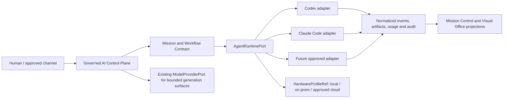
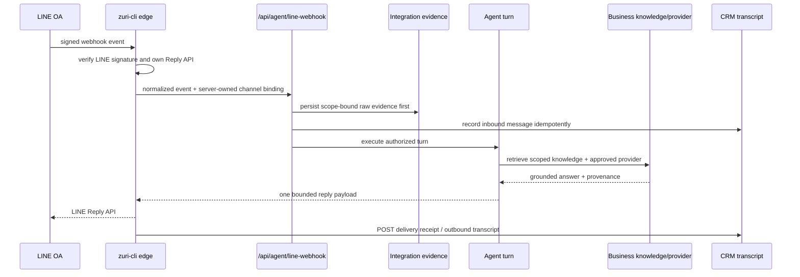
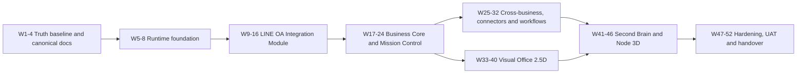

# Implementation Plan — Business 01 Visual AI Office + LINE OA Integration (Runtime-neutral)

เอกสารนี้แปลงขอบเขตจากเอกสารประมาณการเบื้องต้นที่ผู้ใช้แนบมาให้เป็นแผนงานของ
Zuri โดย **เปลี่ยนเฉพาะ Hermes Runtime Integration** เป็น runtime contract ที่สลับ
adapter, model provider และ hardware profile ได้ เช่น Codex หรือ Claude Code ตาม
policy ของแต่ละ execution surface และกำหนดให้ **P2 เป็น LINE OA Integration
Module** ที่ทำให้ Agent ตอบแชต LINE OA ผ่านข้อมูลและสิทธิ์ของ LINE/Business จริง

เอกสารนี้เป็น `candidate` เพื่อขออนุมัติเท่านั้น ยังไม่มีการสร้าง Project,
PlanEnvelope, Workstream, database row, credential, runtime adapter หรือ deployment
ใด ๆ

## 1. Decision summary

| Field | Candidate value | Rule |
|---|---|---|
| Portfolio | `PF-001` | Enumerated from `contracts/seed-data.json` |
| Tenant | `TNT-001` | “Tenant 1” in the demo/candidate scope |
| Business | `BUS-001` | “Business 1” under `TNT-001` |
| Workspace | `WS-B01-MIG` | Existing Business-scoped Workspace; no new Workspace is proposed |
| Proposed Project | `PRJ-B01-VISUAL-AI-OFFICE` — Visual AI Office | New Project; do not overwrite `PRJ-B01-TRANSFORM` |
| Proposed Execution Plan | `WST-B01-VISUAL-AI-OFFICE` | `planId` will be the server UUID of this Workstream after commit |
| Execution mode | `EXM-PRODUCT-LAUNCH` / `PRODUCT_LAUNCH` | One of the seven canonical modes |
| Progress strategy | `MILESTONE_READINESS` | No universal task-count percentage |
| Domain binding | primary `DOM-DEVELOPMENT`; supporting `DOM-OPERATIONS`; technical owner `TD-PROJECT-MANAGER` | Business Home is not an owning domain |
| Manpower | Dev 1 คน + AI agent 1 ตัว (เครื่องมือ ไม่ใช่ FTE แยก) | ทำงาน primary implementation lane เดียว; ไม่มี specialist ทำขนาน |
| Cost code | USD 200 hard cap | สมมติว่าเป็นค่า AI/provider/tool usage ทั้งโครงการ; ไม่รวมค่าแรง Dev และค่าบริการเดิม |
| Timeline | 52 weeks / 26 two-week sprints | Full scope baseline; LINE OA usable candidate at end W16 |
| Schedule reserve | 25% embedded capacity | รวมอยู่ในแต่ละ phase; reserve ไม่เพิ่ม scope |
| Import state | `NOT_CREATED` / `NOT_DRY_RUN` / `NOT_COMMITTED` | Owner approval is required first |

### Identity boundary

`TNT-001/BUS-001` is the seed/demo identity explicitly named by this request. It
is not the reconciled customer production scope `TNT-EtohGroup/BUS-SMARTGIFT`,
even though older roadmap prose also calls SmartGift “Business-01”. UUIDs must be
resolved server-side during dry-run; no UUID will be copied from prose.

The source proposal requires two cross-integrated Businesses, but the seed
hierarchy has one Business per Tenant. The second Business therefore remains
`TBD` until an owner selects it and supplies explicit cross-tenant authorization.
No default cross-tenant access is allowed.

## 2. Source and governance status

| Source | Use in this plan |
|---|---|
| User-provided preliminary estimate screenshots | Scope, 10 deliverables, 24-week estimate and 8 original acceptance criteria; timeline is re-estimated for one Dev |
| [PRODUCT.md](../PRODUCT.md) | zuri-ai remains standalone; LINE is the primary AI surface and web is back-office |
| [PRD-SDD-v1.0.md](../PRD-SDD-v1.0.md) | Existing FR/SDD/SEC boundaries, including provider and import controls |
| [ADR-026](../decisions/ADR-026-AGENT-TOPOLOGY-FOR-THE-VISUAL-OFFICE.md) | Domain desks, transient role hats, two-layer scheduling and honest Visual Office projection |
| [ADR-028](../decisions/ADR-028-HUMAN-VISIBLE-EXECUTION-ROADMAP.md) | Human and Agent plans converge on validation, preview, authorized commit and AuditEvent |
| [ADR-029](../decisions/ADR-029-STABLE-IDENTITY-BINDINGS-FOR-EXECUTION-PLANS.md) | Stable execution/domain/trace identity proposal; no label is used as a key |
| [ADR-031](../decisions/ADR-031-PHASE1-LINE-RUNTIME-CONNECTION-CUTOVER.md) | Provider-neutral secret resolution and public LINE fail-closed boundary |
| [EXECUTION-MODES.md](../EXECUTION-MODES.md) | `PRODUCT_LAUNCH` vocabulary and `MILESTONE_READINESS` evidence |
| [PlanEnvelope schema](../../contracts/plan-envelope.schema.json) | Future machine-readable import boundary; imported plans are data, never executable code |
| [Preflight report](../.preflight-report.json) | 2026-08-20 live run: PASS, 0 critical, 0 warning |

The current requirement registry does not yet declare the new Visual Office
2.5D, Interactive Node View 3D, governed business-role workforce, generic
agent-runtime adapter, exact L1-L4 ladder, or the unspecified connector/workflow
behaviors in this proposal. The `CAND-*` labels below are draft planning handles
only, not canonical requirement IDs. If this plan is approved, P0 must register
permanent FR/FEAT/SDD/SEC IDs before code or schema work starts.

### 2.1 Truth-status vocabulary

| Status | Meaning in this plan |
|---|---|
| `VERIFIED-LOCAL` | มี canonical document, code และ relevant automated test ที่รันผ่านใน audit นี้; ไม่เท่ากับ deployed/live |
| `DOC+CODE / EXTERNAL-GATE` | มี document และ code; local proof มีบางส่วน แต่ต้องใช้ระบบ/credential/provider/LINE จริงก่อนปิด gate |
| `DOC-BOUNDARY` | มี architecture/ownership boundary แต่ยังไม่มี feature contract ที่ implement ได้ครบ |
| `OK — PLACEHOLDER` | ยอมรับไว้เป็นหัวข้อใน candidate scope เท่านั้น; ยังไม่มี canonical feature document, implementation หรือ test — **OK ไม่ได้แปลว่าเสร็จ** |

### 2.2 Current feature evidence matrix — audit 2026-08-20

| Capability | Document | Code | Test evidence in this audit | Plan status |
|---|---|---|---|---|
| Business-scoped LINE binding and fail-closed scope | FR-052 | `line-connection`, agent webhook scope resolver | Focused local suite passed | `DOC+CODE / EXTERNAL-GATE` — production binding and signed canary remain open |
| LINE raw ingress/evidence | FR-081 | LINE OA normalizer, verifier and `line-oa-evidence` | Focused local suite passed | `VERIFIED-LOCAL`; scheduler/pull/replay are not part of this proof |
| Business knowledge → provider → grounded answer | FR-047–FR-050 | knowledge, provider and agent-turn services | Focused local suite passed | `DOC+CODE / EXTERNAL-GATE` — real corpus/provider acceptance remains open |
| Integration management UI and secret boundary | FR-080 | `/platform/integrations`, API, service and Vault adapter | Focused local suite passed | `DOC+CODE / EXTERNAL-GATE` — live Supabase/secret activation remains open |
| CRM Inbox for LINE conversation | FR-091 | inbox read model/UI contracts | 29 focused unit/integration tests passed | `VERIFIED-LOCAL`; registry still marks the wider feature partial |
| LINE delivery receipt and outbound transcript | FR-093 | delivery route and reply-record service | Focused local suite passed | `VERIFIED-LOCAL`; registry still marks the wider feature partial |
| zuri-cli signature verification and LINE Reply API round trip | ADR-031/BR-011 boundary | opt-in cross-repo contract suite exists | 5 tests skipped because `ZURI_CLI_DIST` was not supplied | `EXTERNAL-GATE`; no live signed canary is claimed |
| Generic `AgentRuntimePort` | This candidate only | None claimed | None | `OK — PLACEHOLDER` |
| Visual Office 2.5D | ADR-026 topology boundary only | Exact feature not claimed | None | `OK — PLACEHOLDER` pending canonical feature document |
| GoVibe-compatible Mission Control view | Historical/read-only compatibility boundaries only | Exact feature not claimed | None | `OK — PLACEHOLDER`; GoVibe is not a runtime dependency |
| Interactive Node View 3D | Knowledge/GKS ownership boundary only | Exact feature not claimed | None | `OK — PLACEHOLDER` |
| Second Brain user experience | ADR-022/ADR-023 boundaries | Existing memory primitives are not claimed as this full deliverable | None for this exact feature | `DOC-BOUNDARY`; feature contract still required |
| Five business-role profiles | None for the exact five | None claimed | None | `OK — PLACEHOLDER` |
| Two-Business analytics | Isolation rules exist; second Business is unnamed | Exact feature not claimed | None | `OK — PLACEHOLDER` plus owner/authority gate |
| Five automation workflows | No five workflows are selected | None claimed | None | `OK — PLACEHOLDER` |
| Connector 1 — LINE OA | FR-052/FR-080/FR-081/FR-091/FR-093 | Local vertical-slice components exist | Local focused proof passes; external round trip skipped | `DOC+CODE / EXTERNAL-GATE` |
| Connectors 2–3 | Not selected | None claimed | None | `OK — PLACEHOLDER` |
| Approval Gateway L1-L4 exact ladder | Generic authorization/action gates exist | Exact ladder not claimed | None | `OK — PLACEHOLDER`; new canonical contract required |

Focused evidence is not a full release verification: 205 local tests passed across
the two focused runs; 5 opt-in cross-repo tests were skipped. `npm run verify`,
live LINE OA signed canary, real-provider evaluation and production activation
have not been run or claimed for this candidate revision.

## 3. Runtime-only design delta

### 3.1 What changes from the preliminary estimate

| Preliminary wording | Candidate wording | Effect |
|---|---|---|
| Hermes Runtime Integration | Pluggable `AgentRuntimePort` and governed runtime-adapter registry | Removes the Hermes dependency without changing Business, Visual Office, agent-role, workflow, connector or acceptance scope |
| Runtime implied as one product | Runtime adapter, model provider and hardware profile are separate identities | Codex/Claude Code/provider/hardware can change independently when their capability and policy gates pass |
| Runtime-specific activity | Normalized run, event, artifact, usage and audit envelopes | Mission Control and Visual Office do not need provider-specific rendering |

Hermes is not a baseline adapter in this plan. Adding it later would require the
same adapter contract, tests, authorization and owner approval as any other
runtime; no Hermes source or runtime is modified here.

### 3.2 Runtime, provider and hardware are different axes

- **Runtime adapter** owns execution lifecycle: submit, status, event stream,
  cancel, heartbeat, artifact receipt and normalized failure.
- **Model provider** owns model invocation and credential mode. A runtime may use
  a provider internally, but the control plane records only an approved reference,
  never raw credentials.
- **Hardware profile** describes where and with what capabilities a run executes.
  It is scheduling metadata, not a Tenant or Business authority grant.
- “Any provider / any hardware” means no provider or hardware is hard-coded into
  the business plan. Every concrete adapter still requires an allow-list,
  health/capability proof, security policy and approval.

### 3.3 Minimum `AgentRuntimePort` contract

| Operation | Required behavior |
|---|---|
| `capabilities()` | Declares supported tools, streaming, cancellation, artifact types, context limits and hardware needs |
| `health()` | Returns bounded readiness and dependency state without secrets |
| `submitRun(envelope)` | Requires trusted Tenant/Business/Project/Plan scope, permission envelope, idempotency key, deadline and resource constraints |
| `getRun(runId)` | Returns normalized state only within the authorized scope |
| `streamEvents(runId)` | Emits ordered, resumable and redacted run events |
| `cancelRun(runId)` | Idempotent cancellation with actor, reason and AuditEvent |
| `collectArtifacts(runId)` | Returns provenance-bearing artifact references, hashes and verification state |

Every run must preserve at least `tenantId`, `businessId`, `projectId`, `planId`,
`executionRunId`, `executionStepId`, `attemptId`, adapter ID/version,
provider/model reference when applicable, hardware profile reference, input hash,
policy decision, usage, artifact hashes and `auditEventId`.

### 3.4 Surface policy

| Surface | Runtime allowance |
|---|---|
| Local/back-office owner-approved execution | Codex, Claude Code or another approved adapter may use its officially supported local auth mode; credential material stays outside plans, events and artifacts |
| Unattended automation | Requires server-owned service identity, bounded tool policy, retry/idempotency, budget and kill switch |
| Public LINE traffic | Existing FR-048/FR-079 rules remain: consumer-plan CLI credentials are denied; only approved server-side/API provider paths may run |
| Cross-business analytics | Read-only by default; explicit authorization evidence for both Businesses; no portfolio-shared bypass |

## 4. Scope

### 4.1 Business and Visual layer

- Login, Identity, Organization/Tenant, Business, Workspace and Role surfaces.
- Zuri Business Core and Visual Office 2.5D.
- GoVibe Mission Control-compatible mission view through an explicit adapter/read
  contract; GoVibe is not a required runtime or authority for zuri-ai.
- Interactive Node View 3D with an accessible list/table alternative.
- Two explicitly authorized cross-integrated Businesses.
- Approval, alert, agent status, mission tracking and business artifact views.

### 4.2 AI control and runtime

- Governed AI Control Plane.
- Mission, Workflow, Context, Memory, Verification and Audit.
- Approval Gateway L1-L4.
- Dynamic sub-agent support within policy and the accepted two-layer topology.
- Agent Factory / Standard Business Blueprint after objective intake; no first-step
  template picker.
- Cross-business analytics and governed data access.
- Runtime-neutral adapters, provider references and hardware profiles defined in
  section 3.

### 4.3 Core business-role workforce

The five requested profiles are Executive / Chief of Staff, Operations, Finance
Analyst, Research and Marketing. They are policy-bound role profiles or transient
“hats”, not permanent Visual Office desks and not independent authorization
principals. Permanent desks remain domain-based under ADR-026.

Each profile includes Role, allowed Tools, Policy, Memory scope and Workflow
contract. Specialized agents beyond these five are out of scope unless separately
approved.

### 4.4 Automation and integration

- Up to 5 end-to-end automation workflows.
- Up to 3 standard connectors.
- Connector 1 is fixed as **LINE OA**. It is not a new greenfield module: P2
  closes and integrates the existing FR-052/FR-080/FR-081/FR-091/FR-093 slices
  through the boundary owned by `zuri-cli`.
- Retry, idempotency, verification, human approval, failure disclosure and
  rollback/compensation where the connector supports mutation.

#### P2 LINE OA Agent Chat vertical slice

Integration owns provider/connection metadata and immutable raw evidence; it does
not take ownership of CRM `Conversation`/`Message` truth. `zuri-cli` continues to
own LINE signature verification and the LINE Reply API. zuri-ai resolves
Tenant/Business scope server-side, retrieves authorized Business knowledge,
creates the answer, records audit/provenance and ingests the delivery receipt.

P2 does not pass merely because a webhook returns HTTP 200. It must prove:

1. invalid signature/scope is rejected before an Agent turn;
2. raw LINE evidence is stored before the turn and deduplicated on replay;
3. inbound and outbound CRM transcript records remain Business-scoped;
4. only approved server-side providers can answer public LINE traffic;
5. exactly one reply is returned and its delivery receipt is idempotent;
6. provider refusal, timeout, missing knowledge and transport failure are visible;
7. opt-in cross-repo round trip and one signed live canary have separate receipts.

### 4.5 Out of scope

- Any write to the legacy `G:\zuri` repository or its database.
- Modifying, migrating or wrapping Hermes code/runtime.
- More than 5 core role profiles, 5 full workflows or 3 standard connectors.
- Arbitrary code execution from a PlanEnvelope or business artifact.
- Provider credentials, raw secrets or consumer CLI tokens in Zuri data.
- Automatic cross-provider fallback without an explicit approved policy.
- Default cross-Tenant or portfolio-shared access.
- Selecting the second Business, connector vendors, provider, model, hardware
  purchase, production environment or start date before approval.
- Network sync as an MVP storage assumption; repository interfaces and immutable
  AuditEvents remain required.

## 5. Deliverables

| # | Deliverable | Acceptance evidence |
|---|---|---|
| D1 | Visual Office 2.5D | Authoritative queue/run projection, accessibility alternative and no invented state |
| D2 | LINE OA Integration Module plus GoVibe-compatible Mission Control/runtime-neutral control-plane seam | Signed ingress → scoped evidence → grounded Agent reply → LINE delivery receipt; runtime swap remains a separate candidate proof |
| D3 | Interactive Node View 3D | Authorized graph traversal, relation recovery and accessible table/list |
| D4 | Second Brain / Governed Memory | Business/Role/Permission-scoped retrieval with provenance and refusal paths |
| D5 | Five core business-role profiles | Role/Tool/Policy/Memory/Workflow contract and end-to-end proof per profile |
| D6 | Two cross-integrated Businesses | Named scopes, authorization evidence, isolation and policy-controlled analytics |
| D7 | Up to five full automation workflows | Trigger-to-outcome UAT including retry, verification, approval and failure paths |
| D8 | Up to three standard connectors; Connector 1 = LINE OA, Connectors 2–3 TBD | LINE OA external round-trip/canary receipt; remaining connectors require approved contracts before implementation |
| D9 | Approval L1-L4, audit, verification and notification | Immutable decision/event chain and deny-by-default tests |
| D10 | Deployment, data/security checklist, UAT, training and technical documentation | Signed handover pack, rollback runbook and open-gate ledger |

## 6. Complexity and dependency analysis

### 6.1 Assessment

- **Execution class:** `C-3 — Architecture-driven implementation`
- **Change risk:** `HIGH`
- **Reason:** cross-domain UI, agent runtime, identity/security, memory, external
  connectors, cross-business authorization and 2.5D/3D performance all meet at
  one delivery boundary.

| Component | Scope | Risk | Dependency | AI factor | Points |
|---|---:|---:|---:|---:|---:|
| Identity, data, security and memory foundation | 5 | 5 | 1 | 0 | 11 |
| Runtime-neutral adapter/control contract | 5 | 5 | 3 | 0 | 13 |
| LINE OA Integration Module closure | 5 | 5 | 3 | 0 | 13 |
| Business Core and Mission Control | 5 | 2 | 1 | 0 | 8 |
| Five role profiles and governance | 5 | 5 | 1 | 0 | 11 |
| Cross-business analytics and access | 8 | 5 | 3 | 0 | 16 |
| Visual Office 2.5D and Node View 3D | 8 | 5 | 1 | 0 | 14 |
| Second Brain / governed memory | 5 | 5 | 1 | 0 | 11 |
| Five workflows and three connectors | 8 | 5 | 3 | 0 | 16 |
| Hardening, UAT, deployment and handover | 5 | 5 | 3 | 0 | 13 |
| **Total** |  |  |  |  | **126** |

Points are relative architecture complexity, not billable days. Existing local
LINE code reduces implementation work but does not reduce external activation,
authorization and operational proof. No model fine-tuning or training is assumed;
approved model/provider use is integration, not an AI training deliverable.

### 6.2 Critical path

The signed LINE round trip, second-Business authorization, runtime adapter
contract and authoritative run/event read model are critical-path gates. With one
Dev there is no assumed parallel implementation lane. A later phase may prepare
fixtures while an external gate is pending, but it cannot claim the blocked gate
as complete.

## 7. Roadmap — 52 weeks for one Dev + one AI agent

The original 24-week estimate assumed several specialties could move in parallel.
This revision has one Dev and therefore schedules one primary implementation lane.
The AI agent helps with bounded drafting, test generation and review but is not an
independent accountable engineer and cannot close owner, security, provider or
production gates.

Each phase includes 25% reserve for integration, verification, external-system
variance and rework. Finishing a phase early may pull the next approved phase
forward; the reserve never authorizes an extra feature.

| Phase | Weeks | Primary work | Key deliverable | Exit gate |
|---|---|---|---|---|
| P0 — Truth baseline and canonical docs | 1-4 | Freeze identity; register missing feature/requirement IDs; approve `OK — PLACEHOLDER` ledger, budget and acceptance boundaries | Implementable approved backlog with no invented completion | Documentation + architecture review; `govern` PASS |
| P1 — Runtime and security foundation | 5-8 | Generic runtime contract, fake adapter, provider/hardware/secret/budget policy and conformance harness | Provider/hardware-neutral contract without external credential | Fake lifecycle, authorization, redaction and budget tests pass |
| **P2 — LINE OA Integration Module** | **9-16** | Close existing LINE binding, raw evidence, CRM transcript, knowledge/provider answer, edge reply and delivery receipt into one vertical slice | **LINE user receives one grounded Business-scoped Agent reply** | Local proof + opt-in `zuri-cli` round trip + signed live canary have separate evidence; no consumer CLI credential |
| P3 — Business Core and Mission Control | 17-24 | Objective/plan/mission lifecycle, truthful run read model, five role profiles, exact approval ladder contract | One governed `BUS-001` mission from objective to verified artifact | New role/profile docs approved; role labels grant no authority |
| P4 — Cross-business, connectors and automation | 25-32 | Select/authorize second Business; connectors 2–3; governed analytics; define and implement up to five workflows | Named two-scope integration and selected workflow proofs | Dual authority, isolation, reconciliation, retry/idempotency/rollback UAT |
| P5 — Visual Office 2.5D | 33-40 | Register exact feature contract; domain desks; queue/run/approval/failure projection; accessible alternative | Honest Visual Office over authoritative state | No invented state; accessibility and performance budgets pass |
| P6 — Second Brain and Node View 3D | 41-46 | Register exact feature contracts; governed retrieval; graph view plus table/list | Provenance-bearing contextual and relationship views | Permission/refusal/provenance/relation-recovery tests pass |
| P7 — Hardening and handover | 47-52 | Full verification, load/security/failure tests, UAT, deployment, training, rollback and handover | Release candidate and signed operational handover | Required gates closed or explicitly carried by named owner |

### Sprint detail — first 16 weeks (through LINE OA candidate)

| Sprint | Weeks | Primary work | Mandatory proof |
|---|---|---|---|
| S1 | 1-2 | Reconcile identity, evidence matrix and exact scope; preserve `OK — PLACEHOLDER` items as non-implemented | Owner agrees target, status vocabulary and out-of-scope list |
| S2 | 3-4 | Register/approve missing runtime and LINE integration deltas; freeze cost ledger and acceptance tests | Canonical IDs, threat model and `govern` PASS |
| S3 | 5-6 | Define `AgentRuntimePort`, deterministic fake adapter and normalized events | submit/status/stream/cancel/artifact/failure contract tests |
| S4 | 7-8 | Secret, surface, provider, hardware, budget and kill-switch boundaries | Fail-closed/no-secret tests; paid-provider calls remain disabled |
| S5 | 9-10 | Reconcile FR-052/FR-080 connection and binding; active LINE connection health | Wrong/missing scope denied; redacted integration status visible |
| S6 | 11-12 | FR-081 raw evidence + inbound CRM transcript before Agent turn | Signature/scope/replay/idempotency/failure tests |
| S7 | 13-14 | FR-047–FR-050 scoped retrieval/provider/grounded answer + bounded edge reply | Local golden/failure/trace suite and single-reply contract pass |
| S8 | 15-16 | FR-093 delivery receipt, FR-091 Inbox, opt-in cross-repo round trip and signed canary | Separate receipts for local, cross-repo and live LINE proof; rollback rehearsal |

### Sprints 9-26 — phase-level allocation

| Sprints | Weeks | Planned outcome | Mandatory gate |
|---|---|---|---|
| S9-S12 | 17-24 | Business Core/Mission Control, five documented role profiles and exact approval ladder | Objective-to-artifact trace plus authorization/refusal proof |
| S13-S16 | 25-32 | Named second Business, connectors 2–3 and selected workflows | Dual-scope authority, isolation and workflow UAT |
| S17-S20 | 33-40 | Visual Office 2.5D | Truthful read model, accessible alternative and performance proof |
| S21-S23 | 41-46 | Second Brain and Node View 3D | Provenance, permission, refusal and graph recovery proof |
| S24-S26 | 47-52 | Full hardening, UAT, deployment, training and handover | `npm run verify`, security/load review, rollback and signed handover |

### USD 200 cost-code envelope

This is a planning assumption for owner approval: USD 200 covers incremental AI
agent, paid model/provider and tooling usage for the whole plan. Dev labor,
pre-existing subscriptions and existing LINE/Supabase service fees are excluded.
If that interpretation is wrong, the budget must be corrected before import.

| Phase | Cap (USD) | Paid usage rule |
|---|---:|---|
| P0 | 15 | Documentation diff/review only; no paid runtime validation |
| P1 | 20 | Contract/test assistance; fake/local adapter is default |
| P2 | 40 | Bounded golden evaluation and live canary only; deterministic fixtures for regression |
| P3 | 25 | Targeted implementation/test review; no autonomous long-running runs |
| P4 | 25 | Connector/workflow test calls only after contract approval |
| P5 | 20 | UI review/test generation; no paid model in routine UI tests |
| P6 | 20 | Small retrieval/evaluation sets with provenance |
| P7 | 15 | Final bounded UAT/release evidence |
| Owner reserve | 20 | Locked until explicit release for an external failure/retest |
| **Total** | **200** | Hard stop; reaching USD 180 pauses paid calls until owner releases reserve |

Every sprint records provider, model, purpose and cost. CI uses fake adapters and
fixtures. There is no automatic paid-provider fallback, multi-agent fan-out or
unbounded retry. A budget pause may extend the schedule; it never weakens the
acceptance gate.

## 8. Team structure

| Actor | Capacity | Responsibility / boundary |
|---|---:|---|
| Dev / Technical Owner | 1.0 FTE | Architecture, docs, backend, frontend, tests, deployment and evidence; one primary lane at a time |
| AI agent | Tool under USD 200 cap | Bounded drafting, implementation assistance, test generation and review; cannot approve, hold credentials, perform unsupervised production mutation or count as an FTE |
| Boss / Business-Security approvers | Gate participation, not delivery FTE | Scope, second-Business authority, provider/LINE canary, budget reserve, UAT and production promotion |

The timeline assumes no additional specialist. If a specialist is later added,
the owner may re-baseline after measuring the dependency lane; the document does
not silently compress the schedule.

## 9. Milestones and gates

| ID | Milestone | Target | Gate criteria |
|---|---|---|---|
| M0 | Truth baseline and documentation approved | End W4 | New IDs, status ledger, cost assumption, runtime delta and acceptance approved |
| M1 | Runtime contract proven | End W8 | Fake adapter passes conformance/security/budget suite; no live credential required |
| M2 | LINE OA Integration candidate | End W16 | Local, cross-repo and signed live-canary evidence are distinguishable and accepted |
| M3 | One governed Business mission | End W24 | Mission/read model, five documented profiles, approval contract and audit work in `BUS-001` |
| M4 | Two-Business automation candidate | End W32 | Second Business named; connector/workflow isolation, authorization and reconciliation pass |
| M5 | Visual Office candidate | End W40 | 2.5D surface truthfully reflects authoritative state with accessible alternative |
| M6 | Governed memory/graph candidate | End W46 | Second Brain and Node 3D permission/provenance/recovery proof passes |
| M7 | Release candidate / handover | End W52 | Full verification, security/load/UAT/deployment/training/handover gates pass |

## 10. Risk register

Score = Probability (1-5) × Impact (1-5).

| ID | Risk | P | I | Score | Mitigation | Owner |
|---|---|---:|---:|---:|---|---|
| R1 | Runtime, model provider and hardware are conflated | 4 | 5 | 20 HIGH | Separate IDs/contracts; conformance suite; normalized events | Dev |
| R2 | Consumer CLI credential reaches public/unattended traffic | 4 | 5 | 20 HIGH | Surface policy; server-owned identity; secret refs only; fail closed | Dev / Owner |
| R3 | Cross-Tenant data exposure while satisfying two-Business scope | 3 | 5 | 15 HIGH | Named second Business, dual approval, tenant-leading queries and deny tests | Owner / Data authority |
| R4 | Provider/hardware differences break repeatability | 4 | 4 | 16 HIGH | Capability manifest, golden traces, pinned adapter versions and hardware profiles | Dev |
| R5 | Visual Office shows state the source does not know | 3 | 4 | 12 MEDIUM | Projection-only UI; authoritative queue/run read model; fixture/live distinction | Dev |
| R6 | Runaway token/GPU/automation cost | 3 | 5 | 15 HIGH | Budget, deadline, max attempts, kill switch and usage reconciliation | Dev / Owner |
| R7 | Provider API/auth changes | 3 | 3 | 9 MEDIUM | Adapter isolation, contract tests, supported auth modes and version monitoring | Dev |
| R8 | Business-role profile is mistaken for authority | 3 | 5 | 15 HIGH | Roles are hats; trusted subject/permission envelope; refusal tests | Dev / Owner |
| R9 | 2.5D/3D performance or accessibility fails | 3 | 4 | 12 MEDIUM | Early performance budget; reduced-motion and list/table alternative | Dev |
| R10 | Full scope exceeds one-Dev delivery capacity | 4 | 4 | 16 HIGH | 52-week serialized baseline, 25% embedded reserve, fixed ceilings and explicit re-baseline | Dev / Owner |
| R11 | Data/privacy/regulatory boundary is unclear | 2 | 5 | 10 MEDIUM | Data classification, provenance, retention and explicit owner/security gates | Owner / Data authority |
| R12 | Data migration becomes implicit scope | 2 | 4 | 8 MEDIUM | No migration in baseline; connector reads/writes require separate contracts and rollback | Owner / Data authority |
| R13 | Existing local LINE components are mistaken for a live end-to-end module | 4 | 5 | 20 HIGH | Separate local, cross-repo, signed canary and production receipts; never promote a skipped test | Dev / Operator |
| R14 | USD 200 cap is consumed by routine development calls | 4 | 4 | 16 HIGH | Fake/fixture-first tests, phase caps, USD 180 stop and owner-locked USD 20 reserve | Dev / Owner |

## 11. Acceptance, success and exit criteria

### 11.1 Acceptance criteria

The Full System is accepted only when:

1. Visual Office 2.5D displays Business, domain desk, Agent role hat, Mission and
   Approval from authoritative state within the approved scope.
2. Node View 3D displays and retrieves the agreed Node relationships and has an
   equivalent accessible list/table.
3. Second Brain retrieves context by Business, Role and Permission with source
   provenance; unauthorized or insufficient evidence is refused.
4. Exactly two named Businesses are isolated and analyzed under explicit policy;
   a cross-Tenant request without authority returns no data.
5. The five core role profiles complete their defined workflows while inheriting
   authority from trusted assignments rather than the role label.
6. Up to five automation workflows pass retry, idempotency, verification,
   approval, failure-disclosure and UAT scenarios.
7. Up to three connectors satisfy their contracts and cannot read/write data
   outside their authorized scope.
8. Deployment, technical documentation, data/security checklist, training,
   rollback and handover are complete.
9. The approved runtime can be replaced by another conforming adapter (for
   example Codex ↔ Claude Code) without changing the Business plan, Mission
   contract or Mission Control/Visual Office read model.
10. Provider and hardware changes are recorded as approved execution metadata;
    credentials never appear in plan, event, artifact or audit payloads.
11. Public LINE and unattended execution reject consumer-plan CLI credentials
    and any provider/runtime combination not approved for that surface.
12. LINE OA Agent Chat proves the complete signed path: edge signature validation,
    server-resolved Tenant/Business binding, raw evidence before turn, scoped
    knowledge/provider answer, exactly one LINE reply, idempotent delivery receipt,
    CRM transcript and audit/provenance. Local, cross-repo, signed-canary and
    production status must be reported separately.

### 11.2 Success criteria

- 100% of required milestone/gate evidence is present or an authorized owner has
  recorded explicit carry-over; no inferred completion.
- 100% of runtime adapters used in UAT pass the same conformance suite.
- 0 cross-Tenant/Business rows are exposed in deny-path tests.
- 0 secret values appear in client payloads, logs, events, artifacts or audit.
- All five role profiles and all selected workflows have at least one happy-path
  and one refusal/failure UAT result.
- Visual Office, Mission Control and accessible alternatives agree on run status,
  owner, blocker, approval and artifact counts.
- A LINE replay creates neither a duplicate Agent turn nor duplicate inbound/
  outbound transcript; denied, failed and timed-out replies remain operator-visible.
- Total paid AI/provider/tool usage does not exceed USD 200 under the approved
  accounting assumption.

### 11.3 Exit criteria / Definition of Done

- Approved FR/FEAT/SDD/SEC IDs trace every implemented behavior.
- Relevant unit, contract, integration, authorization, E2E, performance and
  accessibility tests pass with zero skipped-by-filter or flaky pass.
- `npm run verify` passes on the delivery branch.
- Security/load review has no unresolved HIGH finding.
- UAT, deployment, rollback rehearsal, training and handover evidence is signed.
- Documentation and generated governance artifacts are current.
- Implemented, configured, deployed, provider-accepted and production-activated
  states are reported separately.

## 12. Deployment and rollback strategy

| Environment | Runtime rule | Promotion gate |
|---|---|---|
| Local test | Fake adapter required; optional loopback/local adapter | Contract and security tests |
| Integration | Approved adapter with non-production credentials and synthetic/scoped data | Golden trace, isolation and failure tests |
| LINE cross-repo | Built `zuri-cli` distribution plus non-production/scoped binding | Opt-in round-trip test executes; zero skipped tests in the selected suite |
| UAT | Owner-selected provider/hardware profile, signed LINE canary and named Business scopes | Signed UAT, cost receipt, security and rollback rehearsal |
| Production | Server-owned service identity; public-surface policy; no consumer CLI credential | Manual owner/operator activation with request, execution and receipt evidence |

Rollback disables new run admission first, preserves immutable audit/evidence,
cancels or safely drains active runs, returns workflow ownership to the approved
Human/manual path, revokes/rotates affected credentials and restores the last
accepted adapter configuration. It must not delete unrelated Tenant/Business data.

### Proposed feature flags

These names are planning candidates, not implemented configuration. W0 must
reconcile them with the repository's actual flag mechanism before code work.

| Flag | Protects | Default | Removal gate |
|---|---|---|---|
| `FF_AGENT_RUNTIME_EXTERNAL` | A non-fake runtime adapter | `OFF` | M1 conformance/security accepted plus owner approval |
| `FF_LINE_OA_AGENT_CHAT` | Public LINE webhook-to-Agent reply path | `OFF` | M2 cross-repo + signed-canary + rollback evidence accepted |
| `FF_CROSS_BUSINESS_ANALYTICS` | Reads involving the second Business | `OFF` | M4 dual-scope authorization accepted |
| `FF_VISUAL_OFFICE_2D` | Visual Office 2.5D surface | `OFF` | M5 truth/accessibility UAT accepted |
| `FF_NODE_VIEW_3D` | Interactive Node View 3D | `OFF` | M6 graph/accessibility UAT accepted |
| `FF_AUTOMATION_WRITES` | Any connector workflow with mutation | `OFF` | M4 action/rollback UAT plus owner approval |

## 13. Requirement-to-work mapping

| Work | Existing authority | New ID required after approval |
|---|---|---|
| Scope hierarchy and Business target | FR-001, FR-065, ADR-029 | No |
| Project/Workstream/roadmap intake | FR-003, FR-012, FR-068, FR-069, FR-070 | No |
| Model-provider and production connection boundaries | FR-048, FR-079, FR-080 | New runtime-adapter requirement must not redefine these IDs |
| LINE OA ingress, evidence, answer, transcript and receipt | FR-047–FR-052, FR-080, FR-081, FR-091, FR-093; ADR-031/BR-011 edge boundary | Only a cross-module acceptance feature/trace is required; do not reassign domain ownership |
| Authorized agent context and actions | FR-057, FR-072 | Yes, for five business-role profile behavior |
| Visual Office topology | ADR-026 | Yes, for 2.5D surface and queue/run projection behavior |
| Mission Control compatibility/read model | ADR-028 | Yes |
| Runtime-neutral agent execution | No existing canonical behavior owns the generic adapter lifecycle | Yes |
| Second Brain / governed memory experience | ADR-022, ADR-023 boundaries | Yes |
| Interactive Node View 3D | Knowledge/GKS remains the owner of graph facts | Yes |
| Five workflows / three connectors | Existing Integration boundaries only | Yes per committed behavior |
| Cross-business analytics | Tenant/Business isolation rules | Yes after second Business is selected |

## 14. Approval and import sequence

1. Owner reviews this `0.2.0b` candidate and confirms the target is
   `TNT-001/BUS-001`, not production SmartGift.
2. Owner confirms or corrects the USD 200 accounting assumption and the 52-week
   one-Dev baseline.
3. Owner chooses the first runtime adapter (`Codex`, `Claude Code`, or another
   named approved adapter) and confirms whether a second adapter is required for
   launch or only for conformance evidence.
4. Owner approves Connector 1 as LINE OA and authorizes only the future P2
   cross-repo/canary gates; this approval does not itself activate production.
5. Owner names the second Business and authorization owners, or removes the
   two-Business deliverable.
6. Documentation phase registers the missing canonical IDs and architecture
   contract, then stops at its approval gate.
7. Generate PlanEnvelope `1.2` for `PRJ-B01-VISUAL-AI-OFFICE` using
   `EXM-PRODUCT-LAUNCH`, eight `LAUNCH_PHASE` containers and the approved
   `DELIVERABLE` items.
8. Resolve server UUIDs, authorization and conflicts through dry-run; present the
   Human-visible preview.
9. Only after explicit commit approval, transactionally create/update the plan
   and append its AuditEvent.

## Version diff

| From | To | Status | Change |
|---|---|---|---|
| — | `0.1.0b` | candidate | Initial Business 01 Visual AI Office implementation plan; preserves the supplied scope and 24-week roadmap while replacing Hermes with a provider/hardware-neutral runtime contract |
| `0.1.0b` | `0.2.0b` | candidate | Adds P2 LINE OA Agent Chat integration, evidence-status ledger, one-Dev 52-week serialized timeline and USD 200 hard-cap budget; 24-week estimate is superseded for this staffing model |

## CHANGELOG

| Version | Date | Status | Summary | Commit Hash | Agent |
|---|---|---|---|---|---|
| `0.1.0b` | 2026-08-20 | candidate | Initial owner-review plan; no PlanEnvelope import or runtime/database change | `627b99c` (base) | ATHER |
| `0.2.0b` | 2026-08-20 | candidate | LINE OA P2 + truthful evidence matrix + Dev 1/AI agent USD 200/52-week re-baseline; still no import or production activation | `627b99c` (base) | ATHER |

Please review and approve this documentation. I will generate the PlanEnvelope and code only after approval.
