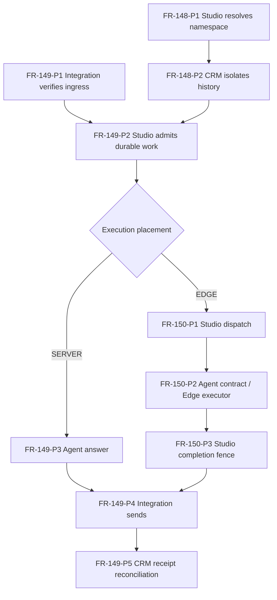

# FEAT-019 — Domain-owned execution phases

## Current identity and ownership

FR-148 is account-scoped CRM conversations, FR-149 is server-owned LINE transport, and FR-150 is optional Edge execution. All belong to FEAT-019 (primary domain: line-oa-studio). FR-148 has its canonical note in CRM because CRM owns conversation history; the bundle primary domain does not transfer model ownership.

The unmerged branch `docs/server-line-phased-requirements` at `412addd` used FR-148 for the whole flow. That proposal predates the published FR-148..150 subjects and must not be merged wholesale. These notes reconcile the intended phase documentation against the current immutable IDs. They neither recycle FR-148 nor add global FR IDs.

## Runtime handoff map

The namespace and CRM operation participate in admission, not a separate uncoordinated commit. The Studio job service coordinates transactions and delivery state throughout; phase ownership names the capability boundary, not a transfer of database ownership. Retry/recovery may revisit a phase; P1/P2 is not a claim of exactly-once network delivery.

| Phase | Domain | Capability |
|---|---|---|
| [FR-148-P1](../domains/line-oa-studio/features/PHASE-FR-148-P1-account-scoped-conversations.md) | line-oa-studio | Resolve the trusted account namespace |
| [FR-148-P2](../domains/crm/features/PHASE-FR-148-P2-account-scoped-conversations.md) | crm | Persist isolated history and preserve legacy rows |
| [FR-149-P1](../domains/integration/features/PHASE-FR-149-P1-server-line-transport.md) | integration | Verify native ingress and channel identity |
| [FR-149-P2](../domains/line-oa-studio/features/PHASE-FR-149-P2-server-line-transport.md) | line-oa-studio | Atomically admit CRM inbound and durable work |
| [FR-149-P3](../domains/agent/features/PHASE-FR-149-P3-server-line-transport.md) | agent | Compute the scoped server answer |
| [FR-149-P4](../domains/integration/features/PHASE-FR-149-P4-server-line-transport.md) | integration | Send through the authorized LINE port |
| [FR-149-P5](../domains/crm/features/PHASE-FR-149-P5-server-line-transport.md) | crm | Record accepted output and reconcile receipts |
| [FR-150-P1](../domains/line-oa-studio/features/PHASE-FR-150-P1-optional-edge-execution.md) | line-oa-studio | Dispatch minimized leased computation |
| [FR-150-P2](../domains/agent/features/PHASE-FR-150-P2-optional-edge-execution.md) | agent | Apply the executor contract on the optional device |
| [FR-150-P3](../domains/line-oa-studio/features/PHASE-FR-150-P3-optional-edge-execution.md) | line-oa-studio | Fence completion and return to server delivery |

## Evidence and release gates

- Server `main` at `4c0cbe3` includes ADR-061 and FR-148..150; PR #243 hosted verify/E2E passed. This is repository evidence, not production activation.
- Edge `origin/master` at `9609551` does not contain the optional conversation worker. Implementation exists on `feat/server-line-optional-edge` at `4a6e7ca`, [PR #22](https://github.com/Freshair129/zuri-edge-device/pull/22), still OPEN at this review. Do not describe installed Edge/master as upgraded.
- Review/merge the Edge change and record its released artifact and compatibility evidence before optional-device cutover. A shared branch test is not installed-version compatibility.
- Apply and verify server migrations with the intended database roles; provision scoped server credential references; verify knowledge-reader scope separately.
- Stop/quiesce the old sender, resolve SENDING/UNKNOWN/unconfirmed Push, authorize ownership handoff, change provider webhook, and record a real account/device canary and rollback boundary. Merging these documents performs none of those actions.
- Monorepo is an independent candidate decision under [[ZAI:ADR-062]]; LINE rollout need not wait for repository relocation.

## Document authority

ADR-061 defines behavior; the global PRD and FEATURES registries pin subjects and bundles; canonical FR notes plus these phase notes expose domain handoffs. The roadmap retains implementation/production distinctions. Phase metadata is navigation; current tooling validates links but does not execute or automatically validate phase order.

## CHANGELOG

| Version | Date | Status | Summary | Commit Hash | Agent |
|---|---|---|---|---|---|
| 0.1.0b | 2026-09-06 | candidate | Documented current requirement ownership and phase handoffs; release gates remain separate | base 4c0cbe3 | RWANG |
