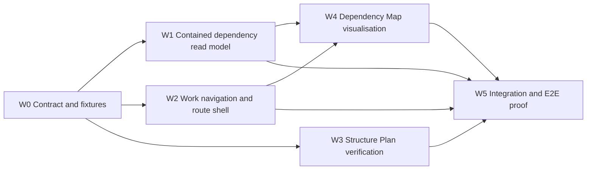

# Implementation Plan — FR-040 Project Work Views

| Field | Value |
|---|---|
| **Status** | Implemented; G5 release gate passed |
| **Risk** | Medium, cross-route UI/read-model work; no persistence migration |
| **Source** | FR-040, SDD-019, ADR-012, NFR-008 |
| **Target** | Project-local Structure Plan and Dependency Map |
| **Excluded** | Requirements, Risks, Resources, graph editing, cross-project graph traversal |

## 1. Verified starting point

- `WbsCanvas` already renders the canonical tree from `/api/projects/{id}/tree`.
- `Dependency` already supports typed endpoints and rejects self/cycle mutations.
- `listDependencies({ projectId })` currently filters a list when either endpoint belongs to a
  project. FR-040 needs a separate project-contained read model where **both** endpoints belong.
- `WorkViewTabs` already owns Structure Plan, Board, and Schedule. `ProjectTabs` already owns
  the parent Work tab.

## 2. Implementation slices and estimates

| ID | Slice | Req IDs | Scope | Risk | Dependency | Points |
|---|---|---|---|---|---|---|
| W0 | Contract and fixtures | FR-040, SDD-019 | Define graph node/edge DTO, ownership fixtures, acceptance-test cases | Medium | existing FR-005/007 | 3 |
| W1 | Project-contained dependency read model | FR-040, FR-007 | Service/API projection; both-endpoint filter; deterministic ordering | Medium | W0 | 5 |
| W2 | Work navigation and route shell | FR-040 | Add Dependency Map Work sub-view and route boundary | Low | W0 | 2 |
| W3 | Structure Plan verification and responsive polish | FR-040, NFR-008 | Preserve existing WBS semantics, controls and accessible states | Low | W0 | 3 |
| W4 | Dependency Map visualisation | FR-040, NFR-008 | Render nodes/edges plus accessible list fallback and state handling | Medium | W1, W2 | 5 |
| W5 | End-to-end proof and documentation closure | FR-040 | Integration, Playwright, build, graph/preflight, visual evidence | Medium | W1, W2, W3, W4 | 3 |

**Total: 21 points.** With one developer, use two short implementation iterations plus a 25%
risk buffer. No AI/ML, external service, or data-migration work is planned.

## 3. Change DAG and parallel work lanes

### Sub-agent ownership and merge order

| Lane | Can run after | Exclusive files | Deliverable | Merge after |
|---|---|---|---|---|
| A, W1 | W0 | `dependency-service.js`, dependency read-route tests | contained graph DTO + tests | W0 |
| B, W2 | W0 | `WorkViewTabs.jsx`, new dependency-map page shell, route test | tab/route only | W0 |
| C, W3 | W0 | `WbsCanvas.jsx`, `wbs.module.css`, WBS visual tests | verified responsive WBS | W0 |
| D, W4 | W1 + W2 | new `DependencyMap.jsx` and its CSS/tests | graph renderer, no service edits | W1, W2 |
| E, W5 | W1 + W2 + W3 + W4 | e2e/integration tests, docs only | final proof and generated docs | all lanes |

Do not give more than one agent ownership of `dependency-service.js`, `WorkViewTabs.jsx`, or
the generated documentation files. Each lane works in a separate worktree and stages only its
listed files.

## 4. Acceptance mapping

| Acceptance | Delivered by | Proof |
|---|---|---|
| AC-040-01 | W2 | route/tab unit test + Playwright |
| AC-040-02 | W3 | WBS unit/visual test |
| AC-040-03 | W1, W4 | graph projection unit + Playwright |
| AC-040-04 | W1 | integration fixture with cross-project edge |
| AC-040-05 | W3, W4 | component state/a11y tests |
| AC-040-06 | W3, W4 | Playwright 1280px and 390px screenshots |
| AC-040-07 | W5 | schema diff is empty; targeted review |
| AC-040-08 | W5 | repository-wide 48-file / 278-test suite, 2-test Playwright spec, build, graph/check/preflight |

## 5. Exit gates

| Gate | Entry condition | Exit evidence | Owner |
|---|---|---|---|
| G0 Documentation approval | ADR-012, FR-040, SDD-019 and this plan reviewed | Owner explicitly approves the proposed docs | Owner |
| G1 Read-model correctness | W0/W1 complete | both-endpoint filter, deterministic graph DTO, cross-project exclusion tests green | Lane A |
| G2 Navigation and WBS integrity | W2/W3 complete | no new Development sidebar entry; Structure Plan stays project-local and responsive | Lanes B/C |
| G3 Dependency Map usability | W4 complete | graph, textual fallback, empty/loading/error/focus/reduced-motion states verified | Lane D |
| G4 Integration and safety | W5 complete | scoped API test, no schema/migration diff, existing cycle guard regression passes | Lane E |
| G5 Release-ready slice | G1-G4 complete | `npm test` (48 files / 278 tests), `npm run build`, `npm run docs:graph`, `npm run docs:check`, `npm run docs:preflight`, and browser proof all pass | Integrator |

## 6. Risks and controls

| ID | Risk | Score | Control |
|---|---|---:|---|
| R1 | Local map leaks an edge to another Project | 12 | both-endpoint containment, fixture and integration test |
| R2 | Canvas is unreadable or inaccessible on narrow screens | 12 | semantic list fallback, keyboard order, 390px visual check |
| R3 | Agents overlap in shared navigation/service files | 9 | explicit file ownership and merge order above |
| R4 | Diagram creates a second dependency-edit path | 8 | read-only map; mutations remain existing workflow |
| R5 | WBS visual polish changes progress/domain semantics | 6 | reuse canonical tree API; no model/service writes in W3 |

## 7. Handoff checklist for each lane

- Include `@req FR-040`, `@spec SDD-019, ADR-012`, and an accurate `@tested` annotation in
  every non-trivial new/changed implementation file.
- Run the lane's focused tests and report exact command/output.
- Do not touch Prisma schema, migrations, shell context, or Development sidebar configuration.
- Stop at the lane exit gate and report unmerged conflicts rather than resolving another lane's
  files opportunistically.
