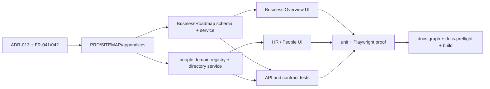

# Implementation plan

## Goal

Make Business the only operational shell scope, add a Business-level Roadmap
and 2/3-horizon Goals read model, and expose HR / People as a peer domain without
changing tenant isolation or project hierarchy.

## DAG and work order

| Work item | Scope | Depends on | Exit evidence |
|---|---|---|---|
| W0 | Authority docs and traceability | owner approval | ADR/PRD/FR/SITEMAP/plan updated |
| W1 | Strategy schema/read service and route | W0 | isolated service + API tests |
| W2 | Business-first `/overview` shell and roadmap cards | W0, W1 | no group grid; Business projects only |
| W3 | HR / People domain and directory route | W0 | domain registry, viewer gate, API/UI tests |
| W4 | Verification and generated docs | W1-W3 | tests, build, graph, preflight, targeted browser proof |

## Acceptance criteria

- **AC-041.1:** `/overview` never renders a portfolio/group card grid or a
  count of all businesses as its operational content.
- **AC-041.2:** With a selected Business, project KPIs and project list are
  filtered to that Business's workspaces; group-level shared projects are not
  silently attributed to a Business.
- **AC-041.3:** Business Overview renders Roadmap and exactly two or three ordered
  horizons when strategy data exists, with goal status/progress per horizon.
- **AC-041.4:** Without a selected Business, Overview presents a Business-required
  empty state and a Home action.
- **AC-042.1:** `HR / People` is a top-level domain peer of `Development`; its
  route key is `people` and it is not in the Development sidebar or command palette.
- **AC-042.2:** People Directory lists only viewer-visible Business memberships
  and never crosses tenant/business isolation.
- **AC-042.3:** Project Team and People Directory remain distinct labels and routes.
- **AC-042.4:** Existing Development project routes and portfolio progress API do
  not regress.

## Exit gate

The slice is complete only when all of the following are green:

1. FR-041/042 unit and API contract tests pass.
2. Targeted Playwright proof covers Business Overview, roadmap horizons, and
   HR / People navigation.
3. `npm test -- --run`, `npm run build`, `npm run docs:graph`, and
   `npm run docs:preflight` pass; `npm run docs:check` is clean afterward.
4. `git diff --check` is clean and no unrelated files are changed by this slice.
5. The generated graph contains FR-041, FR-042, SDD-020, ADR-013 and all new
   route/model annotations.

## Explicit non-goals

- No Organization/tenant migration or UUID changes.
- No attendance, leave, payroll, performance, or HR mutation workflow.
- No group roll-up removal from the reporting API.
- No Project-as-shell-parent or new Project hierarchy.
