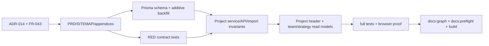

# Implementation plan

## Goal

Make Business the direct owner of a Project while retaining schema Workspace as
the Development-only Space context, with a safe compatibility path for explicit
cross-business projects.

## DAG and work order

| Work item | Scope | Depends on | Exit evidence |
|---|---|---|---|
| W0 | Authority docs and traceability | owner approval | ADR/FR/PRD/SITEMAP/plan updated |
| W1 | Add nullable direct owner, backfill, and Postgres parity | W0 | schema validates; backfill checks pass |
| W2 | Enforce create/update/import invariants and direct Business filters | W1, RED tests | focused service/API/import tests green |
| W3 | Render Business owner + Space secondary context | W2 | Project header and team context tests/browser proof |
| W4 | Full verification and generated docs | W1-W3 | test, build, graph, preflight, diff gates green |

## Explicit non-goals

- No Organization model or tenant-isolation change.
- No UUID migration or removal of Workspace/Space APIs.
- No new shared-project aggregate; null owner is an explicit compatibility case.
