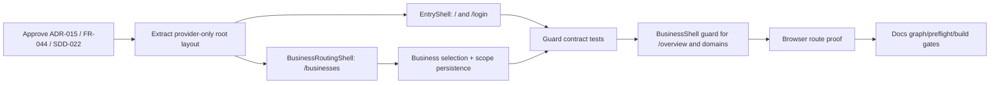

# Implementation Plan — FR-044 Entry → Business Routing → BusinessShell

**Version**: 0.2.0

| Field | Value |
|---|---|
| **Status** | Complete — owner-approved; exit gates verified |
| **Requirement** | FR-044 |
| **Design** | ADR-015, SDD-022 |
| **Scope** | Route/layout composition and demo routing only |
| **Risk** | MEDIUM — changes root routing and shell mount boundary; no schema/API write change |

## Goal

Prove the entry boundary without implementing authentication or redesigning the visual
system:

```text
Landing → Login stub → Business Routing → selected Business → BusinessShell
```

## Work DAG



### Parallelization

- **W2** and **W3** can proceed in parallel after W1 because they are separate entry
  surfaces and share only the existing token/UI primitives.
- **W4** depends on W3 and the current `ScopeContext`/viewer contract.
- **W6** depends on the route-state tests in W5 and must not be implemented as a
  client-only visual fallback.
- **W7/W8** are final gates and cannot be parallelized with route edits.

## Work packages

### W0 — Documentation approval

Approve ADR-015, FR-044, SDD-022, this plan, and the inventory decisions:

- `/` is minimal Landing;
- `/login` is a demo stub;
- `/businesses` is Business Routing;
- `/overview` mounts BusinessShell only after Business selection;
- Overview is outside Development's sub-domain list;
- existing tokens remain unchanged.

### W1 — Root/layout boundary

Refactor the App Router composition so the provider/root layout does not mount
BusinessShell globally. Add logical EntryShell, BusinessRoutingShell, and guarded
BusinessShell boundaries while preserving ProjectResourceShell.

Required annotations:

```js
// @req FR-044
// @spec ADR-015, SDD-022
// @tested tests/unit/entry-routing.test.js, tests/e2e/fr044-entry-routing.spec.js
```

### W2 — Landing and Login stubs

- `/`: one CTA to `/login`.
- `/login`: one demo CTA to `/businesses`.
- no auth provider, credentials, token, session persistence, or new token styles.
- retain existing Zuri primitives/tokens.

### W3 — Business Routing

- `/businesses` loads `/api/viewer` and `/api/scope`.
- filter visible Business IDs from the viewer result.
- show Portfolio/Organization only as grouping context.
- make Business the only selectable operating node.
- keep the routing page visible for one Business in this slice.

### W4 — Selection transition

Use existing `ScopeContext.select({ portfolioId, businessId })`, clear descendants,
persist the ambient selection, and navigate to `/overview` only after a valid Business
selection. Do not introduce a second selection store.

### W5 — Guard and contract tests (RED → GREEN)

Add tests for:

- landing/login navigation;
- demo-login has no auth call;
- viewer-visible filtering;
- one-Business routing page remains visible;
- missing Business → `/businesses`;
- missing viewer → `/login`;
- unauthorized Business/domain → `FORBIDDEN` path/state;
- Project routes remain nested under BusinessShell.

### W6 — BusinessShell guard

Guard `/overview` and every Business domain route before rendering the shell. Remove
the in-shell Business picker/Business-required fallback from the final shell. Keep
Project Business/Space ownership behavior unchanged.

### W7 — Browser proof

With `run.bat`:

1. open `/` and verify no final shell chrome;
2. click Login and verify `/login`;
3. click demo login and verify `/businesses`;
4. verify Business cards and ancestry labels;
5. select Business and verify `/overview` has BusinessShell chrome;
6. deep-link `/overview` with cleared selection and verify redirect to `/businesses`.

### W8 — Exit gates

- focused tests green;
- full `npm test` green;
- `npm run build` clean;
- Prisma schemas unchanged/valid;
- `npm run docs:graph`, `npm run docs:preflight`, and `npm run docs:check` pass;
- visual check confirms no token redesign;
- no production-auth claim is made.

## Rollback

Revert only the route/layout composition and entry pages. Do not alter the schema,
Project ownership migration, or existing viewer/business service contracts.
