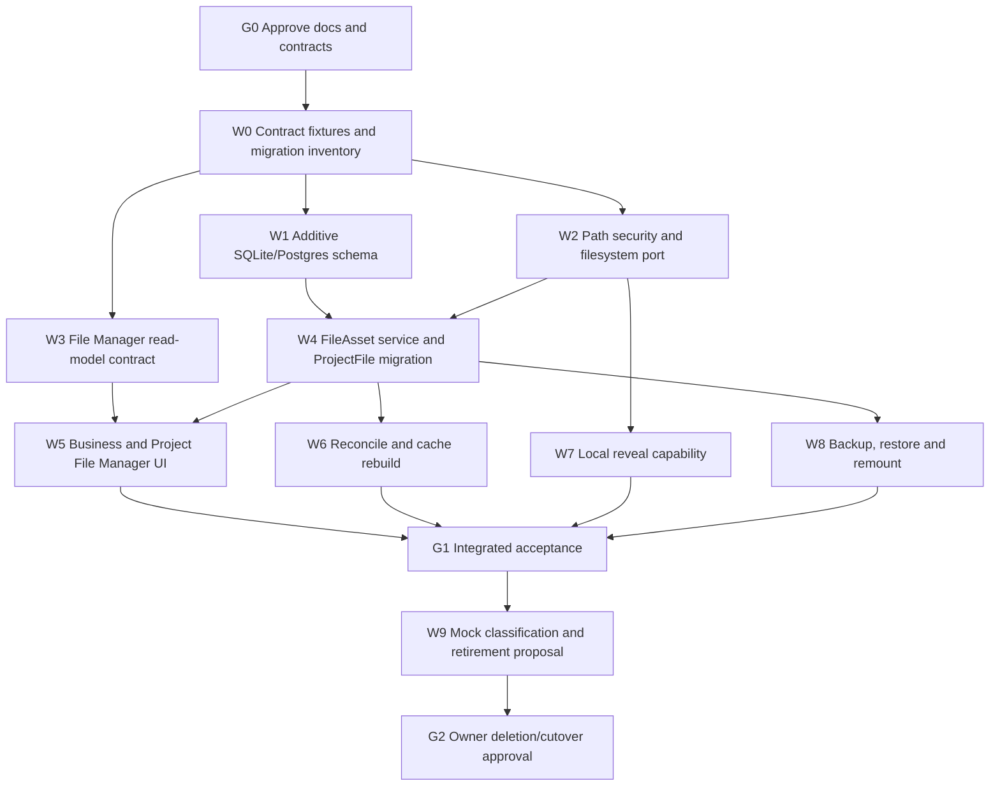

# Implementation Plan — FR-045 Managed Local File Workspace

Implementation starts only after ADR-016, FR-045 and ZV2-CR-001 are approved.

## DAG

## Parallel work packages

| WP | Scope boundary | Depends on | Verification / exit |
|---|---|---|---|
| W0 | freeze legacy/new API fixtures; exact ProjectFile count; external mock hash inventory | G0 | reviewed fixtures and dry-run inventory |
| W1 | additive Prisma SQLite + generated Postgres models only | W0 | schema validation; migration up/down rehearsal; no legacy removal |
| W2 | relative-path normalization, root containment, atomic file port | W0 | Windows junction/reparse + traversal security tests |
| W3 | pure Business/Project File Manager DTO and state contract | W0 | fixture tests; no route/UI mutation |
| W4 | FileAsset/FileLink service, audit, legacy adapter, dry-run/commit migration | W1,W2 | zero silent loss; rollback snapshot; parity tests |
| W5 | Business aggregate and Project File Manager UI/API | W3,W4 | isolation + E2E + accessibility states |
| W6 | reconcile, missing/relink and disposable cache | W4 | direct-query/cache equality; delete-cache rebuild |
| W7 | local runtime reveal bridge only | W2 | hosted deny; local origin/auth/containment tests |
| W8 | snapshot manifest, optional binary export and remount | W4 | preview/confirm; second-root restore test |
| W9 | classify generated mock vs user files; propose exact archive/delete list | G1 | path/hash/disposition manifest; no mutation |

W1, W2 and W3 can run in parallel after W0. W6, W7 and W8 can run in parallel
after their listed dependencies. Each work package owns disjoint files; schema and
shared contract files remain single-owner integration seams.

## Execution ledger — 2026-08-14

| WP | Status | Evidence |
|---|---|---|
| W0 | complete | frozen legacy fixture; ProjectFile count 0; external mock 39 files/15,077 bytes; 6/6 tests |
| W1 | complete | additive SQLite/Postgres models and migration; 5/5 tests; both schemas valid |
| W2 | complete | Windows path containment + atomic same-volume port; security fix re-reviewed ALL PASS; 21/21 tests |
| W3 | complete | pure Business/Project read model; isolation/dedupe/state; 6/6 tests |
| W4 | complete | FileAsset service, lossless dry-run/confirm adapter, managed ingest/content/relink/delete; focused tests |
| W5 | complete | Business and Project File Manager API/UI, Files sidebar and compatibility route retained |
| W6 | complete | explicit reconcile/relink and revisioned cache with direct-read-model equality proof |
| W7 | complete | hosted deny-by-default; loopback same-origin explicit reveal capability and containment tests |
| W8 | complete | FileAsset/FileLink snapshot, optional content, gap preview, remount and confirmed restore |
| W9/G2 | complete without mutation | all 39 external mock files retained as reference; destructive gate not invoked |

## Gate definitions

### G0 — documentation approval

- ADR-016, FR-045 and ZV2-CR-001 approved together.
- PRD registry and appendices contain proposed contracts.
- docs graph/check/preflight pass.

### G1 — integrated acceptance

- AC-045-01..12 pass.
- Full tests/build pass with no known regression.
- Existing FR-037 fixtures and routes remain compatible.
- Backup and rollback rehearsals are recorded.

### G2 — destructive cutover

- Owner reviews exact deletion/archive manifest.
- Unknown and human-authored files are retained.
- Legacy model removal, if still desired, is a separate approved commit with
  verified rollback.

## Definition of done

Code is not complete merely because new files appear on disk. Completion requires
canonical query parity, security containment, migration/rollback evidence, UI
states, backup/remount proof, documentation traceability and clean release gates.

## CHANGELOG

| Version | Date | Status | Summary | Commit Hash | Agent |
|---|---|---|---|---|---|
| 0.1.0b | 2026-08-14 | candidate | Initial dependency DAG and exit gates | — | ATHER |
| 0.2.0b | 2026-08-14 | in-progress | Added W0-W3 execution evidence; W4-W9 remain gated | — | ATHER |
| 0.3.0b | 2026-08-14 | complete | W4-W9 and G1 complete; external mock retained, so no destructive G2 action | pending | ATHER |
