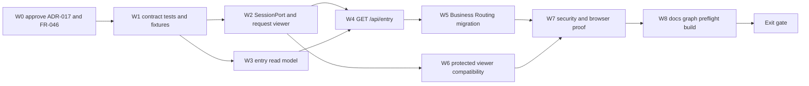

# Implementation Plan — FR-046 Production Viewer Entry Contract

| Field | Value |
|---|---|
| **Version** | 0.2.0b |
| **Status** | Complete — beta verification |
| **Date** | 2026-08-14 |
| **Risk** | HIGH |
| **Complexity** | C-3; 25 points including 25% risk buffer |
| **Inputs** | ADR-017, FR-046, SDD-024, SEC-008, ZV2-CR-002 |

## Scope and success

Implement a provider-neutral trusted session port and an atomic viewer-scoped entry
read model. Success means Business Routing cannot receive or infer a Business outside
the resolved viewer grant, while FR-044 route behavior remains intact.

No credential provider or session database model is included without a separate
owner decision.

## Work DAG

Critical path: `W0 -> W1 -> W2/W3 -> W4 -> W5 -> W7 -> W8`.

After W1, W2 (session seam) and W3 (read model) may run in parallel. W6 may run in
parallel with W5 after W2. Integration begins only after both W2 and W3 pass focused
tests.

## Work packages

| WP | Deliverable | Points | Dependencies | Proof |
|---|---|---:|---|---|
| W0 | Approved docs and frozen DTO/error fixtures | 2 | none | owner approval + docs gates |
| W1 | RED contract tests for OWNER/MEMBER/DEV/empty/forged/cross-tenant/503 | 3 | W0 | failing focused suite for intended reason |
| W2 | provider-neutral `SessionPort` + `resolveRequestViewer(request)` | 4 | W1 | unit tests; no client identity input |
| W3 | minimal entry read model and ancestry query | 4 | W1 | isolation and response-minimization tests |
| W4 | additive `GET /api/entry` route with 200/401/503 contract | 3 | W2, W3 | route/contract integration tests |
| W5 | `/businesses` one-fetch migration | 2 | W4 | component test + network assertion |
| W6 | `/api/viewer` compatibility hardening | 2 | W2 | compatibility and production fail-closed tests |
| W7 | security/E2E matrix and rollback rehearsal | 3 | W5, W6 | Playwright + forged/cross-tenant proof |
| W8 | full tests, build, doc graph/preflight/check, report | 2 | W7 | all exit gates green |

Base: 20 points. Risk buffer: 25%. Planned total: 25 points.

## Contract fixtures

| Case | Expected result |
|---|---|
| OWNER with Business memberships | only those Businesses and their ancestry |
| tenant-wide OWNER/MEMBER | only Businesses in that Tenant |
| MEMBER with domain grants | Business list plus only granted domain keys |
| platform DEV | all Businesses only when trusted session has platform grant |
| empty membership | `200`, empty list |
| absent/expired/revoked session | `401 AUTH_REQUIRED` |
| session adapter unavailable | `503 SESSION_UNAVAILABLE`, no data |
| forged principal/platform/body/header | ignored or rejected; result unchanged |
| cross-tenant requested ID | no disclosure; protected resource remains denied |

## Acceptance and exit gates

- all AC-046-01..12 pass;
- no `/businesses` source/test reference to `/api/scope` or `/api/viewer` remains;
- no production path calls `resolveViewer()` without trusted request identity;
- no identity/role/platform grant is accepted from client-controlled input;
- `/api/entry` returns no Workspace, Project, Membership, Branch, LegalEntity, hidden
  Business, or unrelated ancestry rows;
- focused tests pass before integration; full Vitest, Playwright, production build,
  `docs:graph`, `docs:preflight`, `docs:check`, and `git diff --check` pass;
- implementation report records rollback rehearsal and any remaining provider decision.

## Risks

| ID | Risk | P | I | Score | Mitigation |
|---|---|---:|---:|---:|---|
| R46-01 | hidden ancestry leaks through an over-broad include | 3 | 5 | 15 | query from allowed Business IDs outward; response schema deny-extra |
| R46-02 | client promotes itself to DEV | 2 | 5 | 10 | platform grant only from SessionPort; forged-input tests |
| R46-03 | demo fallback reaches production | 3 | 5 | 15 | environment + explicit capability double gate; production test |
| R46-04 | two-fetch race creates inconsistent viewer/scope | 3 | 4 | 12 | one atomic entry response |
| R46-05 | compatibility breaks protected APIs | 2 | 4 | 8 | keep pure `resolveViewer`; migrate route callers incrementally |
| R46-06 | provider choice forces premature persistence | 3 | 3 | 9 | provider-neutral port; schema requires separate approval |

## Owner decision still required after this contract

Choose the concrete web login/session provider: LINE Login, OIDC, passwordless local,
or another approved mechanism. FR-046 implementation may build the consuming seam and
explicit local-demo adapter, but it must not invent that provider decision.

## CHANGELOG

| Version | Date | Status | Summary | Commit Hash | Agent |
|---|---|---|---|---|---|
| 0.1.0b | 2026-08-14 | candidate | Initial DAG, work packages, AC and exit gates | pending | ATHER |
| 0.2.0b | 2026-08-14 | complete | W0-W8 implemented; full tests, browser, build and governance gates recorded | pending | ATHER |
