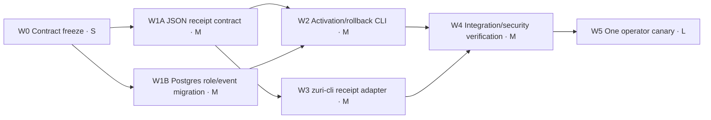

# Implementation plan — FR-055 controlled LINE activation

## DAG

W1A and W1B may run in parallel after approval. W5 is external and serial; it cannot start with any
predecessor or Phase 1 hard gate in `BLOCKED`, `FAIL`, `NOT_RUN`, `STALE` or `UNKNOWN`.

Local status: W0-W4 complete. W5 remains externally gated and was not executed.

## Work packages

| Work | Size | Deliverable | Exit |
|---|---:|---|---|
| W0 | S | ADR/FR/NFR/BR/SDD/SEC plus exact redaction/idempotency contract | owner approval |
| W1A | M | strict activation, rollback and receipt-event JSON schemas and validators | malformed/secret-bearing artifacts denied |
| W1B | M | additive Supabase migration for operator grants and append-only events | local Postgres grants/RLS/advisor tests pass |
| W2 | M | dry-run-default operator CLI with execute/disable modes and CAS transaction | zero mutation on every mismatch; atomic success |
| W3 | M | redacted `zuri-cli` transport artifact adapter | one reply owner; no raw token/content/PII |
| W4 | M | TDD, PostgreSQL integration, secret scan, rollback rehearsal and docs gates | all AC-055-01..09 pass |
| W5 | L | exact binding re-read, one signed canary and truthful receipt | AC-055-10 plus owner acceptance |

## Stop conditions

- exact destination, binding identity/version, provider/model or approval window is absent;
- A1/A2 evidence is missing, stale or hash-mismatched;
- physical recovery approval/rehearsal is absent;
- raw secret or customer content would enter argv, artifact, log or Git;
- binding is not `PENDING` and hash-free before activation; or
- `zuri-cli` transport ownership/version cannot be pinned.

## CHANGELOG

| Version | Date | Status | Summary | Commit Hash | Agent |
|---|---|---|---|---|---|
| 0.1.0b | 2026-08-14 | candidate | Proposed S/M parallel build and serial L canary gate | working-tree | ATHER |
| 0.2.0b | 2026-08-14 | beta | Owner-approved W0; W1A/W1B opened in parallel | working-tree | ATHER |
| 0.3.0b | 2026-08-14 | beta | W0-W4 pass locally; W5 remains blocked by external hard gates | working-tree | ATHER |
