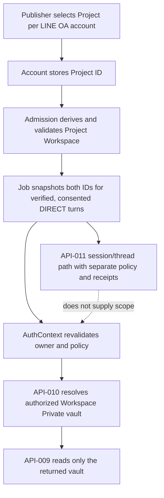

# Implementation plan — FR-057 authorized agent context

## Complexity and risk

Architecture/security change, C-3, HIGH risk. Implementation is limited to the
Zuri-side authorization seam and an MSP adapter contract. No production activation,
MSP schema migration, or Supabase privilege change is included.

## Verified integration gap — 2026-10-04

At Zuri `origin/main` `a6e295a5`, `serverLinePorts()` composes the API-011 thread
memory port, while `createAgentPorts()` composes the API-010 resolver with the
API-009 memory port. A source call-site search found no production caller of
`createAgentPorts()`. The API-011 session path therefore does not close FR-057's
API-010 → API-009 caller gap. The current Zuri worktree wires and tests that
caller, but has not yet been pushed or reviewed.

At that baseline, admission opt-in was captured from
`ZURI_MSP_THREAD_MEMORY_ENABLED`; `LineOaAccount.memoryPolicy` was absent from
Prisma. The deployment flag did not prove per-account policy or consent.

MSP `origin/main` remains `4928e71d42687b4eb72de060091d031ea22b5b91`; its
API-010 contract does not require the signed `legacy_access` grant. The required
contract and implementation are on the pushed branch
`origin/codex/rsk-memos-12-vault-resolve-fail-closed` at
`fd6c24b0d6d6f2e51b67cd39c775d962057eba0c`, which has no PR yet. Production
activation requires reviewed support for that contract on MSP main.

## Boundary for the next implementation slice

The API-010 → API-009 caller is for private episodic memory only. It must consume
server-derived scope and policy, deny when owner or consent is missing, require
`consentStatus = GRANTED` and `audienceKind = DIRECT` for episodic/passport or
cross-thread access, and use only the authorized Workspace Private vault returned
by API-010. API-011 remains the distinct session/thread path under ADR-091.

Before any production activation, the signed API-010 contract must be present on
MSP main; Zuri must have a trusted per-turn policy/consent source and verified
API-010/API-009 composition tests; and erasure, receipts, rollback and deployment
acceptance must be recorded. Until then the path remains off. This plan amendment
does not certify deployment readiness.

## Policy hardening slice — 2026-10-04

This patch implements the OFF-by-default account policy and API-011 session
kill switch while keeping episodic access separate. It does not wire the missing
FR-057 API-010 → API-009 caller:

- `LineOaAccount.memoryPolicy` is publisher-set `OFF | ON`, defaults to `OFF`,
  and is changed through the existing versioned publisher action. Existing rows
  remain `OFF` after the additive migration, and the immutable `memorySyncOptIn`
  job snapshot records that account policy at admission.
- `ZURI_MSP_THREAD_MEMORY_ENABLED` is a runtime kill switch, not an admission
  grant. The Server checks it before session-memory operations and the delivery
  scanner does not call MSP while it is off. Turning it off leaves pending
  receipts parked; turning it on can resume only jobs whose account-policy
  snapshot was already `ON`.
- `episodicMemoryOptIn` remains false because LINE has no approved trusted
  workspace/project mapping. Do not mint defaults or accept either value from
  LINE input. `resolveAgentAuthorization()` separately requires the persisted
  episodic snapshot, current `Customer.consentStatus = GRANTED`, DIRECT audience,
  and a resolved workspace/project before it allows the API-009 memory port.
- The API-010 resolver and API-009 port reject a context without episodic
  authorization before transport. They remain unconnected to the production LINE
  composition, which still uses API-011. No API-010 call or episodic retrieval is
  claimed by these changes.
- No production activation, MSP migration, data write, or branch merge is part
  of this slice. MSP main must first accept the signed grant contract and
  trusted scope mapping, caller receipts/erasure, rollback, and deployment gates
  must be independently satisfied.

At baseline, there was no production LINE API-010→API-009 caller and no trusted
workspace/project owner tuple. The earlier policy-only change reduced accidental
access but did not close FR-057. The current working-tree candidate below adds
the owner mapping and production composition, subject to MSP and release gates.

## Owner-selected mapping and remaining FR-231/FR-232 gates — 2026-10-04

The owner selected a Publisher-controlled Development Project association per
LINE OA account. The server derives the Workspace from that Project and checks
both records against the account's Tenant and Business. Only the Project ID is
stored on the account; the job snapshots the Project and derived Workspace at
admission. The caller revalidates that mapping before any API-010/API-009 call.
The LINE payload and model remain untrusted for scope.

The current candidate stores that mapping, derives the Workspace, and wires the
opted-in LINE context through API-010 before API-009. The adapter requires the
signed `legacy_access` contract, verified transport/identity, and a matching
private-vault grant. `ZURI_MSP_EPISODIC_MEMORY_ENABLED` remains an independent
default-off kill switch.

Every acknowledged API-011 message now has a durable `MemoryProjectionReceipt`.
Inbound and outbound append receipts are persisted immediately after MSP
acknowledges them; the outbound CRM message ID and delivery acknowledgement are
attached in the same transaction that settles the local delivery state. The
tenant/principal erasure worker marks receipts `PENDING_MSP`, requests API-009
vault erasure when episodic receipts exist, then records MSP's erasure receipt
and marks the affected rows erased after acknowledgement.

Erasure request granularity follows the owner's 2026-09-28 option A decision in
CONVERSATION-RUNTIME-HANDOFF.md v0.3.18b, delivered in merged PR #614: exactly
one tenant-wide MSP erase per `(tenant, principal, erasure request)`, including
DIRECT-only memory. The worker's one acknowledged request settling the affected
projection receipts matches that contract; it does not need one MSP request per
receipt. This does not close FR-232's separate consent-decline or GKS
withdrawal/correction work.

Release remains blocked: the signed API-010 contract is still absent from MSP
main. A local Zuri-resolver-to-MSP-handler contract run passed; hosted CI,
rollback acceptance and deployment evidence have not been recorded. FR-232 also remains open for
consent-decline Tier-1 tombstoning and GKS source withdrawal/correction. The
existing principal-erasure receipt worker does not implement those separate
paths.

### Version history

| Version | Change |
|---|---|
| 0.4.3b | Owner-selected Project mapping and derived Workspace are recorded; mapping, caller, receipt and erasure work remained open. |
| 0.4.4b | Records the implemented API-010/API-009 LINE caller, durable API-011 projection receipts, and vault-aware principal erasure; preserves MSP-main, CI, rollback, consent-decline, GKS and deployment gates. |
| 0.4.5b | Adds the architecture boundary diagram for Project-derived API-010 scope and the separate API-011 session path; records verification defects fixed and release blockers. |
| 0.4.7b | Reconciles the FR-232/ADR-091 erasure note to the owner's tenant-wide per-principal erasure decision; preserves consent-decline and GKS gates. |
| 0.4.6b | Refreshes verified Zuri/MSP main and branch refs; records that the signed API-010 contract is pushed but unreviewed and production remains gated. |

## Work order

| Work | Deliverable | Proof |
|---|---|---|
| W0 | Register FR-057, ADR-022, NFR-014, BR-015, SEC-013, SDD-030 | docs graph/preflight |
| W0.5 | Add OFF-by-default account policy and immutable session/episodic admission decisions | migration, account-action and admission tests |
| W1 | AuthContext and deterministic policy resolver | unit tests for deny-by-default and revocation |
| W2 | Server-owned scope plus GoVibe API-010 `msp_vault_resolve` adapter | API-010 contract tests; no raw vault injection |
| W3 | Bind identity, thread, session and policy to the agent turn | integration tests for group participants |
| W4 | Preserve legacy API-009 adapter behind explicit compatibility mode | migration and fail-closed tests |
| W5 | Consume API-010 resolved IDs/permissions in canonical API-009 memory operations | resolver and conformance tests |
| W6 | Review Supabase/RLS boundary and run full gates | `npm test`, build, docs checks |

## Exit gates

- no private memory retrieval occurs before an allow decision;
- no model or client value changes tenant, business, agent, workspace, project, or vault;
- canonical memory calls API-010 on every turn and use only its returned Workspace
  Private ID for private API-009 operations;
- same multi-principal group fixture proves private isolation;
- identity/membership revocation denies on the next turn;
- all existing FR-021..029 and MSP adapter tests remain green;
- documentation graph and preflight are regenerated and clean;
- production LINE binding and MSP rollout remain disabled.

## Rollback

Disable the structured private-memory path and use bounded current-turn context or
the reviewed compatibility adapter. Preserve audit receipts and do not delete legacy
MSP data during rollback.

## CHANGELOG

| Version | Date | Status | Summary | Commit Hash | Agent |
|---|---|---|---|---|---|
| 0.4.7b | 2026-10-04 | beta | Reconciles erasure request granularity with the owner decision while retaining consent-decline, GKS and release blockers | working-tree | Codex |
| 0.4.6b | 2026-10-04 | beta | Refreshes remote head evidence; records the pushed MSP contract branch, absent PR, and current production blockers | working-tree | Codex |
| 0.4.5b | 2026-10-04 | beta | Adds the scope and runtime boundary diagram; records the implemented caller, receipts, principal erasure and remaining release gates | working-tree | Codex |
| 0.4.4b | 2026-10-04 | beta | Records the implemented API-010/API-009 LINE caller and keeps MSP-main, CI, rollback, consent-decline, GKS and deployment gates open | working-tree | Codex |
| 0.4.3b | 2026-10-04 | beta | Separates account-policy admission from the runtime kill switch and records that episodic mapping/caller remain blocked | working-tree | Codex |
| 0.4.2b | 2026-10-04 | beta | Requires trusted workspace/project mapping for episodic eligibility | working-tree | Codex |
| 0.4.1b | 2026-10-04 | beta | Clarifies the runtime kill switch and fail-closed workspace/project mapping gate alongside the account policy and consent snapshots | working-tree | Codex |
| 0.4.0b | 2026-10-04 | beta | Specifies the OFF-by-default publisher policy, admission snapshots, current-consent API-010 gate, and read-only episodic caller boundary | working-tree | Codex |
| 0.3.0b | 2026-10-04 | beta | Records the absent production API-010 caller, separates API-011 session context, and lists contract/policy/erasure activation gates | working-tree | Codex |
| 0.2.0b | 2026-08-15 | beta | Approved API-010 canonical resolver implementation plan | working-tree | ATHER |
